import ProgressState from '@tdev-components/documents/ProgressState';
import Restricted from '@tdev-components/documents/Restricted';

# Exponentialfunktion

## Aufgabe 14

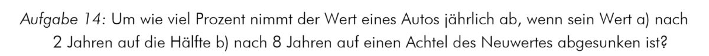

<ProgressState id="75fb4e43-0fef-469a-b991-800f94f190ce" confirm keepPreviousStepsOpen preventTogglingFutureSteps float="right">

1. 
2. 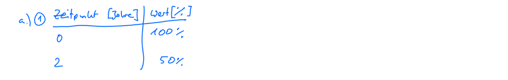
3. 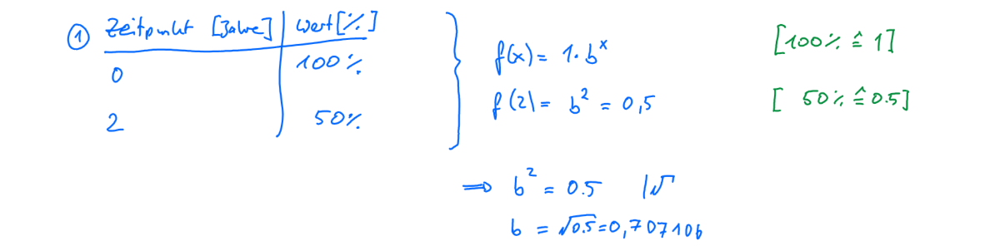
4. 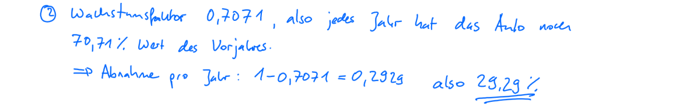
5. 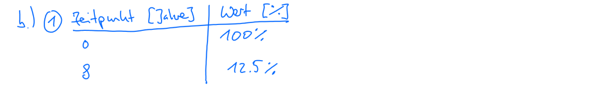
6. 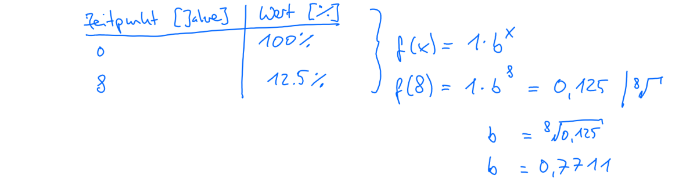
7. 

</ProgressState>

## Aufgabe 28

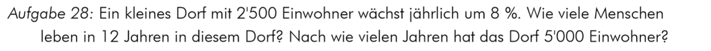
<ProgressState id="552492ea-2f3e-49be-93fe-a90ef1830cab" confirm keepPreviousStepsOpen preventTogglingFutureSteps float="right">
    1.   
        

        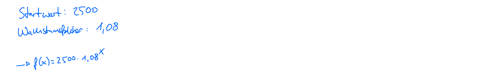
        :::details[Herleitung]
            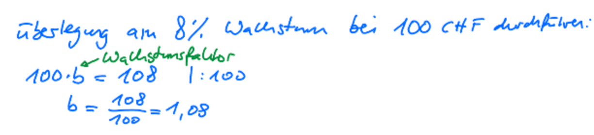
        :::
        

    2. 
    3. 
    4. 
</ProgressState>

## Aufgabe 29

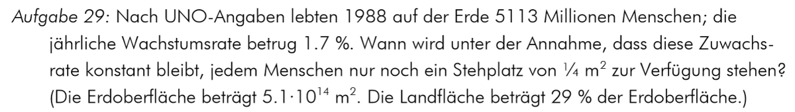
<ProgressState id="5c6d78ec-c5e7-44d7-bced-7e8ff8b7996e" confirm keepPreviousStepsOpen preventTogglingFutureSteps float="right">
    1. 
    2. 
    3. 
    4. 
    5. 
    6. 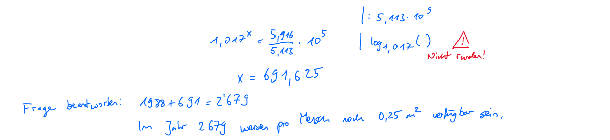
</ProgressState>

## Aufgabe 30

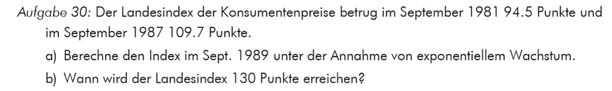
<ProgressState id="f3ebacef-9f54-40ff-b4e3-6b19409298d9" confirm keepPreviousStepsOpen preventTogglingFutureSteps float="right">
    1. 
    2. 
    3. 
    4. 
    5. 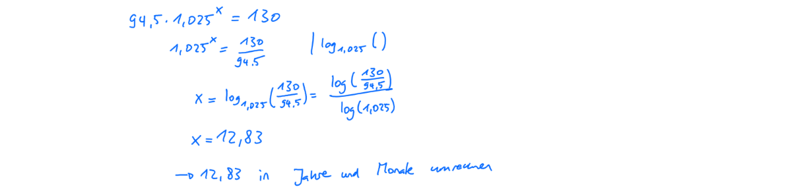
    6. 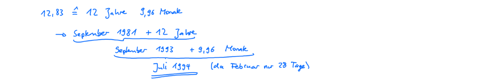
</ProgressState>

## Aufgabe 31

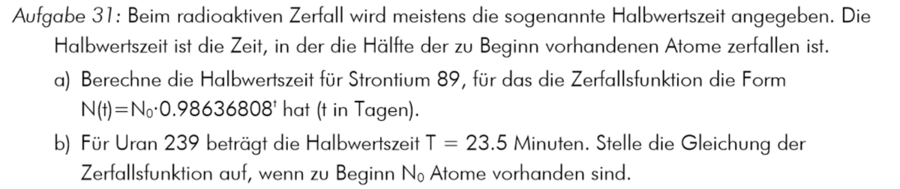
<ProgressState id="f7e0e18b-0e58-437e-bd4a-db8eeac33899" confirm keepPreviousStepsOpen preventTogglingFutureSteps float="right">
    1. 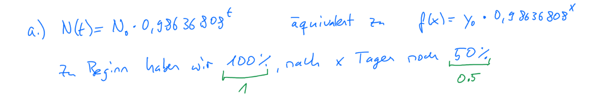
    2. 
    3. 
    4. 
    5. 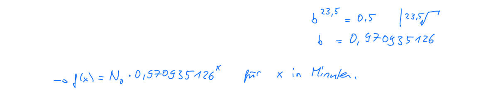
</ProgressState>

