import ProgressState from '@tdev-components/documents/ProgressState';

# Quadratische Funktionen

## Aufgabe 20c

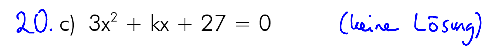

<ProgressState id="083760ec-eb32-4b60-8242-716e9de690e7" confirm preventTogglingFutureSteps float='right'>
1. 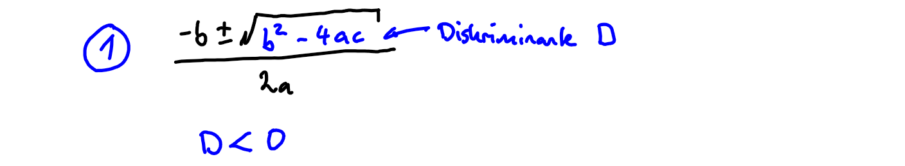
2. 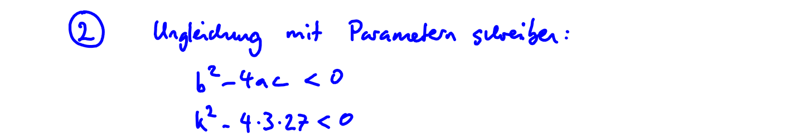
3. 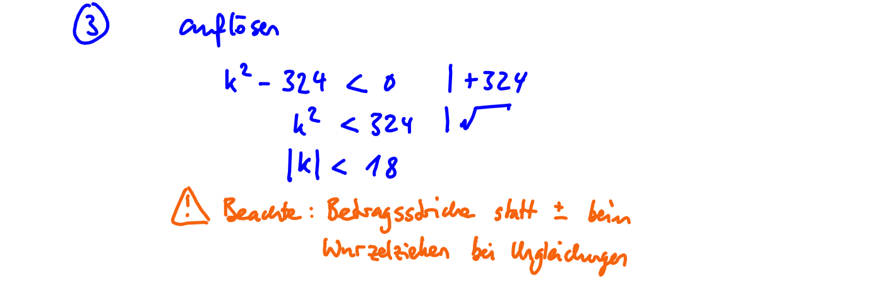
4. 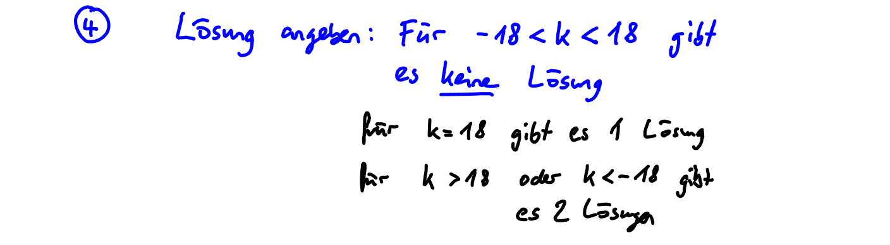
</ProgressState>
    
## Aufgabe 21b

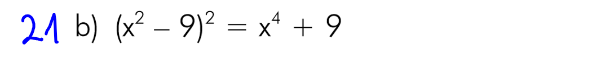

<ProgressState id="75fe6f0b-12e9-4dff-b551-9838931432e0" confirm preventTogglingFutureSteps float='right'>
1. 
2. 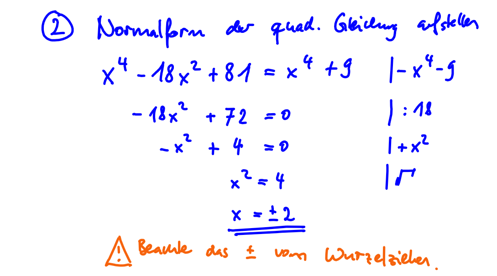
</ProgressState>

## Aufgabe 23a

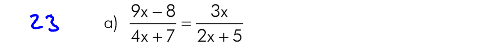
<ProgressState id="661975db-1ae1-4efe-a996-cb487e01a0a2" confirm preventTogglingFutureSteps float='right'>
1. 
2. 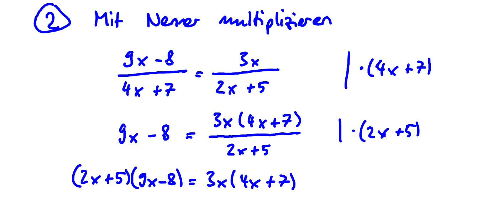
3. 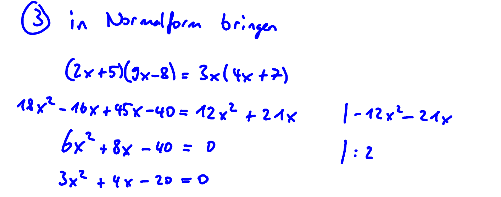
4. 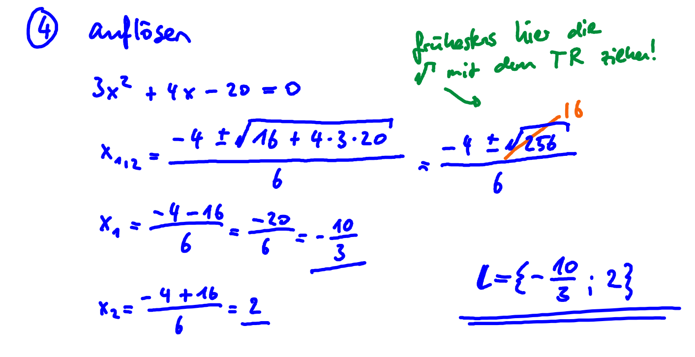
</ProgressState>

## Aufgabe 23b

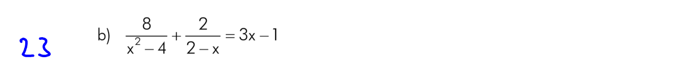
<ProgressState id="4fdfa21f-213e-4048-9067-d621637a169b" confirm preventTogglingFutureSteps float='right'>
1. 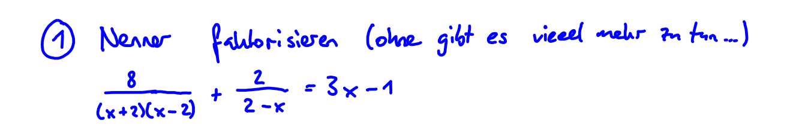
2. 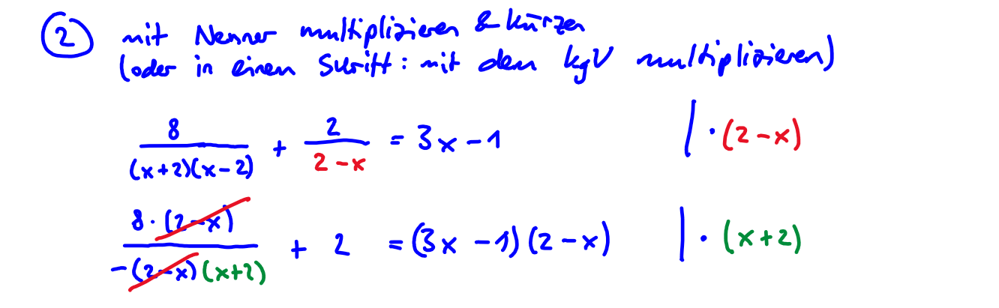
3. 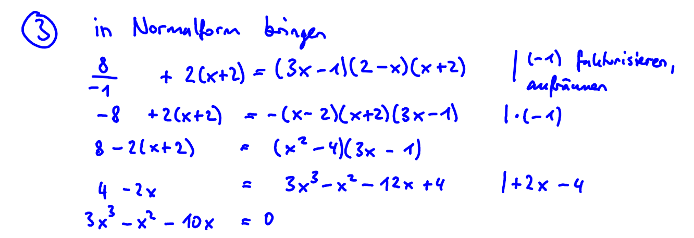
4. 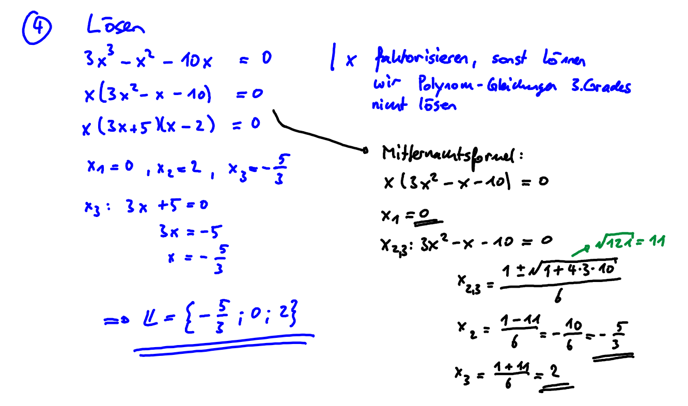
</ProgressState>

## Aufgabe 25c

<ProgressState id="611f43fe-dc35-4c82-bcec-1f8c616e678f" confirm preventTogglingFutureSteps float='right'>
1. 
2. 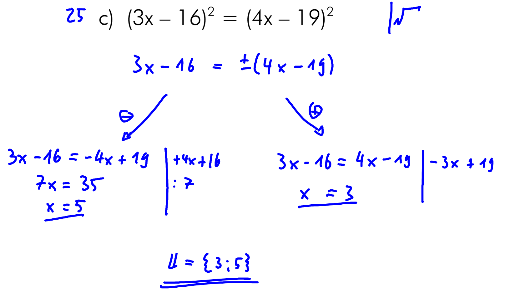
</ProgressState>

## Aufgabe 26b

<ProgressState id="9252ec1e-06ee-46c4-8bf3-cfa05ac42c87" confirm preventTogglingFutureSteps float='right'>
1. 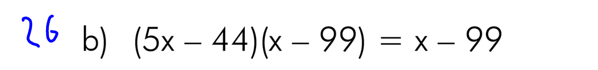
2. 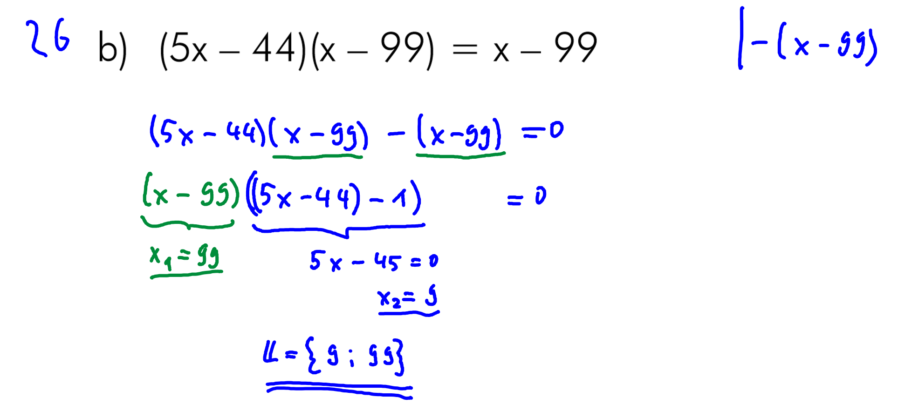
</ProgressState>

## Aufgabe 41

<ProgressState id="0b522f74-4c14-4204-94bc-df622590a555" confirm preventTogglingFutureSteps float='right' keepPreviousStepsOpen>
1. 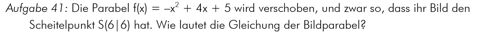
2. 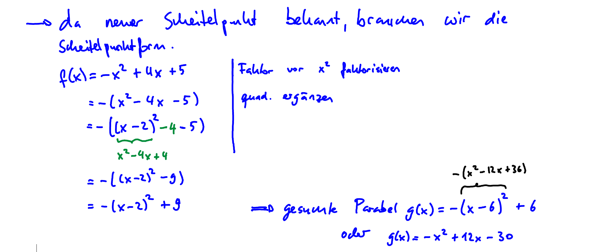
</ProgressState>

## Aufgabe 42

<ProgressState id="0e111ac9-2cdb-437c-bff9-f2c8b1e14dc0" confirm preventTogglingFutureSteps float='right' keepPreviousStepsOpen>
1. 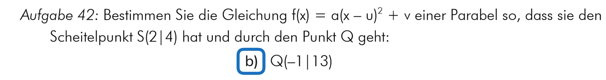
2. 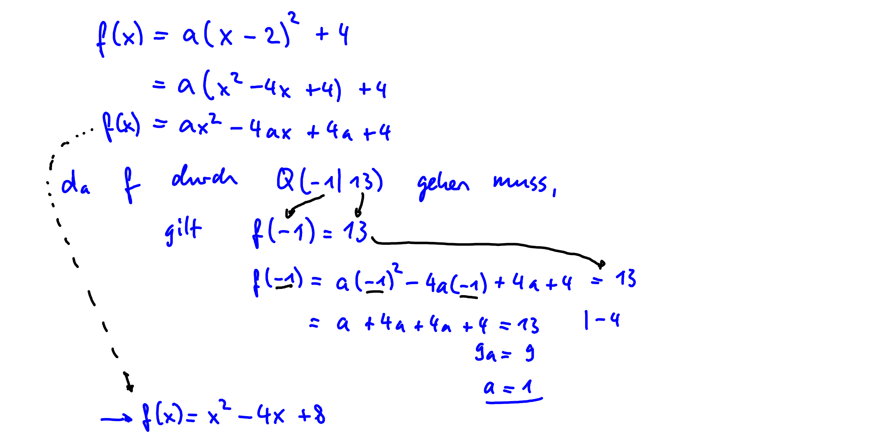
</ProgressState>

## Aufgabe 43

<ProgressState id="ac753b58-8675-41fb-95f9-e7d85f15abc6" confirm preventTogglingFutureSteps float='right' keepPreviousStepsOpen>
1. 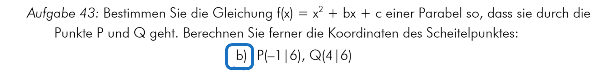
2. 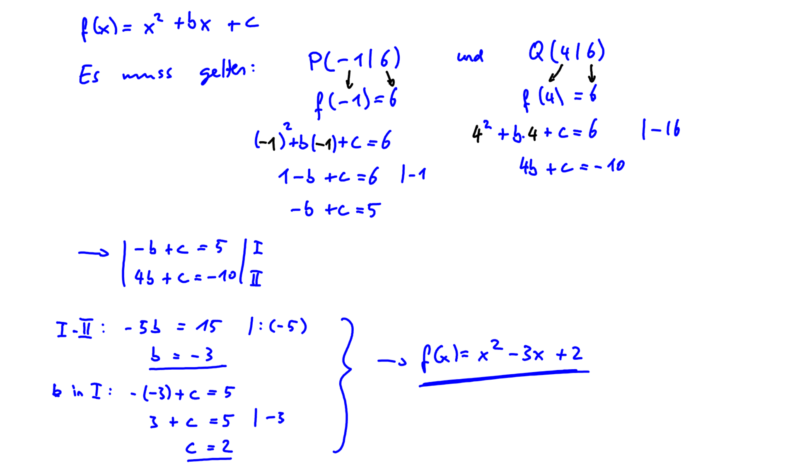
</ProgressState>

## Aufgabe 44

<ProgressState id="ad50831d-ef93-4285-8ec4-f37725a5da82" confirm preventTogglingFutureSteps float='right'>
1. 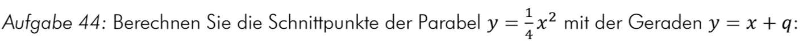
2. 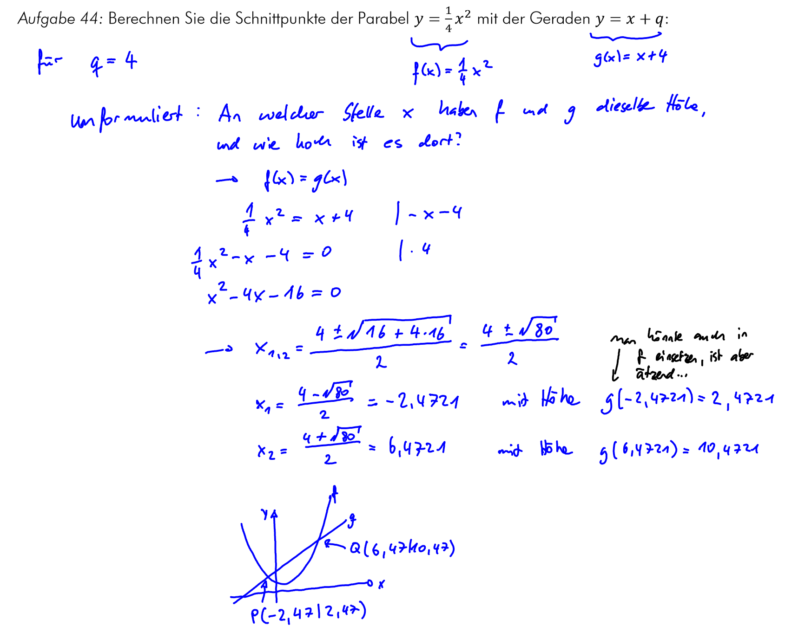
    :::danger[Korrektur 15.11.25]
    Die Koordinaten des ersten Schnittpunkts an der Stelle $x_1=-2.4721$ wurde korrigiert auf $(-2.4721|1.5279)$. 
    :::
</ProgressState>