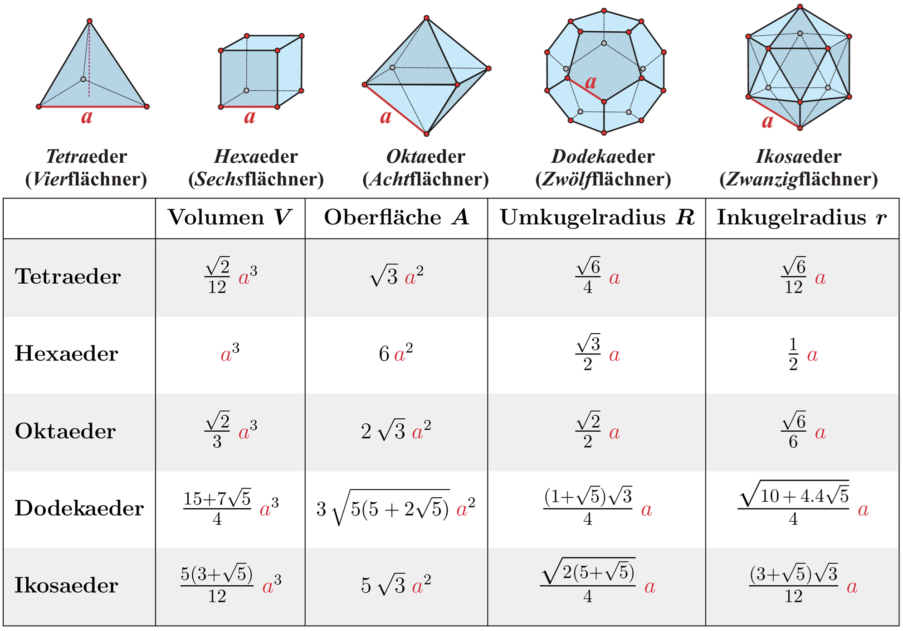
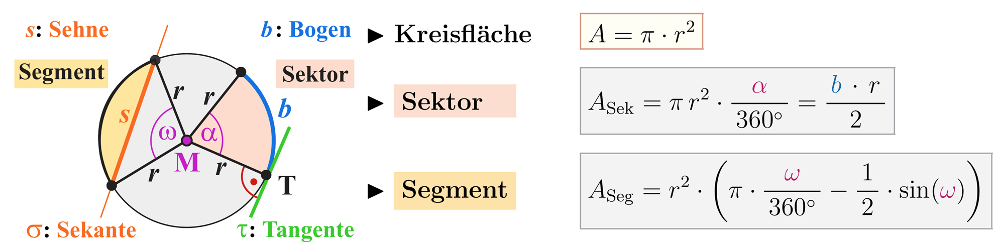

import { toFixedNum, sanitizeNumber } from '@tdev-components/documents/String/sanitizers'

# Taschenrechner

An der Matur am Gymnasium Biel-Seeland erlaubte Taschenrechnermodelle:

:::cards


::br


:::

:::info[Hinweis]
Falls Sie an der Oberstufe einen anderen Taschenrechner verwendet haben, lohnt sich eine frühzeitige Umstellung, damit Sie sich an den neuen Taschenrechner gewöhnen können.
:::

## Übungen

### Grundlegendes

1. Aufgabe
   $$
   \frac{17.38 \cdot 3}{9}
   $$
   <Answer type="string" id="faa44261-c494-4021-8240-9feeb4acaa51" solution={toFixedNum(17.38*3/9, 3)} sanitizer={sanitizeNumber()} />
   :::details[Vorgehen und Tipps]
   <Tabs groupId="tr">
     <TabItem label="TI-30X IIS" value="30x">
       ```
       17.38*3/9
       ```
     </TabItem>

     <TabItem label="TI-30 Eco" value="30eco">
       [[17.38]] [[\*]] [[3]] [[÷]] [[9]] [[=]]
     </TabItem>
   </Tabs>
   :::
2. Aufgabe
   $$
   \frac{1 + 2 + (-3)^2}{3}
   $$
   <Answer type="string" id="e5b5cb40-2717-4da4-b9ca-d30710e3d6d5" solution={toFixedNum((1 + 2 + 9)/3, 3)} sanitizer={sanitizeNumber()} />
   ::::details[Vorgehen und Tipps]
   <Tabs groupId="tr">
     <TabItem label="TI-30X IIS" value="30x">
       ```
       (1 + 2 + 3²)/3
       ```
     </TabItem>

     <TabItem label="TI-30 Eco" value="30eco">
       [[(]] [[1]] [[+]] [[2]] [[+]] [[3]] [[x²]] [[)]] [[÷]] [[3]] [[=]]
     </TabItem>
   </Tabs>

   :::tip[:mdi[speedometer] Rechenregeln]
   - $(-3)^2 = -3 \cdot -3$, da "Minus mal Minus" Plus ergibt, kann der Ausdruck direkt als `3²` eingegeben werden.
   - Soll dennoch das `-3` explizit eingegeben werden, **muss es in Klammern stehen** `(1 + 2 + (-3)²)/3`.
   :::
   ::::
3. Aufgabe
   $$
   \frac{2}{3}\cdot\frac{2.2}{7.3}\cdot \frac{8.1}{2.7} \cdot 4
   $$
   <Answer type="string" id="e12dc67c-6ef4-4e52-ada6-63cbd71cfb89" solution={toFixedNum(2*2.2*8.1*4/3/7.3/2.7, 3)} sanitizer={sanitizeNumber()} />
   ::::details[Vorgehen und Tipps]
   <Tabs groupId="tr">
     <TabItem label="TI-30X IIS" value="30x">
       ```
       2 / 3 * 2.2 / 7.3 * 8.1 / 2.7 * 4
       ```
     </TabItem>

     <TabItem label="TI-30 Eco" value="30eco">
       [[2]] [[÷]] [[3]] [[\*]] [[2.2]] [[÷]] [[7.3]] [[\*]] [[8.1]] [[÷]] [[2.7]] [[\*]] [[4]] [[=]]
     </TabItem>
   </Tabs>

   :::tip[:mdi[speedometer] Rechenregeln]
   - Es kann auch `2 * 2.2 * 8.1 * 4 / 3 / 7.3 / 2.7` eingegeben werden, da reine Punktoperationen kommutativ sind.
   :::
   ::::
4. Aufgabe
   $$
   \frac{7-\sqrt{7^2-4\cdot 2 \cdot (-4)}}{2\cdot 2}
   $$
   <Answer type="string" id="85d81a08-b1c7-4f5c-849d-aee849873ab7" solution={toFixedNum((7-Math.sqrt(7*7+4*2*4))/4, 3)} sanitizer={sanitizeNumber()} />
   ::::details[Vorgehen und Tipps]
   <Tabs groupId="tr">
     <TabItem label="TI-30X IIS" value="30x">
       ```
       (7 - √(7² + 4*2*4))/4
       ```
     </TabItem>

     <TabItem label="TI-30 Eco" value="30eco">
       [[(]] [[7]] [[-]] [[(]] [[7]] [[x²]] [[+]] [[4]] [[\*]] [[2]] [[\*]] [[4]] [[)]] [[√x]] [[)]] [[÷]] [[4]] [[=]]
     </TabItem>
   </Tabs>

   :::tip[:mdi[speedometer] Vereinfachungen]
   - Simple Dinge wie $2\cdot 2$  (oder eigentlich auch $7^2$) können im Kopf berechnet und direkt eingegeben werden.
   - Im Radikand wird $+4\cdot 2\cdot 4$ anstatt $-4 \cdot 2 \cdot (-4)$ eingegeben, da ein Produkt mit einer geraden Anzahl negativer Terme immer positiv wird.
   - Den Taschenrechner brauchen wird, damit wir **schneller** sind - solche Vereinfachungen helfen, weniger Tasten einzugeben und weniger Fehler zu machen.
   :::
   ::::
5. Aufgabe
   $$
   \frac{-(-8)-\sqrt{(-8)^2-4\cdot 2.378 \cdot 4}}{2\cdot 2.378}
   $$
   <Answer type="string" id="1db10395-0923-4fbc-b6c9-b14601d05f20" solution={toFixedNum((8-Math.sqrt(8*8-4*2.378*4))/2/2.378, 3)} sanitizer={sanitizeNumber()} />
   ::::details[Vorgehen und Tipps]
   <Tabs groupId="tr">
     <TabItem label="TI-30X IIS" value="30x">
       ```
       (8 - √(8² - 4 * 2.378 * 4)) / 2 / 2.378
       ```

       oder alternativ

       ```
       (8 - √(8² - 4 * 2.378 * 4)) / (2 * 2.378)
       ```
     </TabItem>

     <TabItem label="TI-30 Eco" value="30eco">
       [[(]] [[8]] [[-]] [[(]] [[8]] [[x²]] [[-]] [[4]] [[\*]] [[2.378]] [[\*]] [[4]] [[)]] [[√x]] [[)]] [[÷]] [[2]] [[÷]] [[2.378]] [[=]]

       oder alternativ

       [[(]] [[8]] [[-]] [[(]] [[8]] [[x²]] [[-]] [[4]] [[\*]] [[2.378]] [[\*]] [[4]] [[)]] [[√x]] [[)]] [[÷]] [[(]] [[2]] [[\*]] [[2.378]] [[)]] [[=]]
     </TabItem>
   </Tabs>

   :::tip[:mdi[speedometer] Vereinfachungen]
   - Ein Produkt im Nenner kann auch als mehrmaliges Teilen eingegeben werden: $\frac{6}{2\cdot 3}=6\cdot \frac{1}{2} \cdot \frac{1}{3} = 6 ÷ 2 ÷ 3 = 1$.
   :::
   ::::

### Platonische Körper

Es gibt genau $5$ platonische Körper, sog. reguläre Polyeder.



1. Berechnen Sie die Oberfläche eines Dodekaeders mit der angegebenen Kantenlänge und runden Sie das Ergebnis auf 3 Nachkommastellen genau.
   <Answer label="Oberfläche Dodekaeder mit 25 cm" type="string" id="e68063d0-13fb-40a0-816f-606a1edbc5f2" solution={toFixedNum(3*Math.sqrt(5*(5+2*Math.sqrt(5)))*Math.pow(25, 2), 3)} sanitizer={sanitizeNumber(['^2'])} />
   ::::details[Vorgehen und Tipps]
   <Tabs groupId="tr">
     <TabItem label="TI-30X IIS" value="30x">
       ```
       3√(5*(5+2√(5)))*25²
       ```

       :::tip[:mdi[speedometer] Optimierung]
       Zwischen Faktoren und Wurzeln muss nicht zwingend ein `*` stehen.
       :::
     </TabItem>

     <TabItem label="TI-30 Eco" value="30eco">
       Von Innen- nach Aussen die Klammern berechnen.

       [[3]] [[\*]] [[(]] [[5]] [[\*]] [[(]] [[5]] [[+]] [[2]] [[\*]] [[5]] [[√x]] [[)]] [[)]] [[√x]] [[\*]] [[25]] [[x²]] [[=]]

       Alternativ ohne Klammern (hier möglich, da Zwischenresultate als Faktoren verwendet werden):
       [[5]] [[√x]] [[+]] [[5]] [[=]] [[\*]] [[5]] [[=]] [[√x]] [[\*]] [[3]] [[\*]] [[25]] [[x²]] [[=]]

       :::tip[Gleich-Taste]
       Die Gleich-Taste [[=]] berechnet das Resultat - sie soll nur dann verwendet werden, wenn

       - eine Rechnung abegschlossen ist
       - das gesamte bisher Eingegeben als Faktor verwendet werden soll
       :::
     </TabItem>
   </Tabs>
   ::::
   <Answer label="Oberfläche Dodekaeder mit 75 cm" type="string" id="497037d7-dbce-4acd-bf07-669f99f07624" solution={toFixedNum(3*Math.sqrt(5*(5+2*Math.sqrt(5)))*Math.pow(75, 2), 3)} sanitizer={sanitizeNumber(['^2'])} />
   ::::details[Vorgehen und Tipps]
   <Tabs groupId="tr">
     <TabItem label="TI-30X IIS" value="30x">
       Wurde bereits das Resultat für $25\, cm$ berechnet, kann mit der [[:mdi[arrow-up-drop-circle-outline]]] Taste die letzte Eingabe abgerufen und die Kantenlänge auf $75\, cm$ geändert werden.

       :::tip[:mdi[speedometer] Optimierung]
       Steht das Resultat bereits auf dem Display, kann auch mit [[:mdi[arrow-left-drop-circle-outline]]] direkt ans Ende der letzten Rechnung gesprungen werden.
       :::
     </TabItem>

     <TabItem label="TI-30 Eco" value="30eco">
       Nochmals alles eingeben...

       [[3]] [[\*]] [[(]] [[5]] [[\*]] [[(]] [[5]] [[+]] [[2]] [[\*]] [[5]] [[√x]] [[)]] [[)]] [[√x]] [[\*]] [[75]] [[x²]] [[=]]
     </TabItem>
   </Tabs>
   ::::
2. Berechnen Sie das Volumen eines Ikosaeders auf 3 Nachkommastellen genau:
   <Answer label="Volumen Ikosaeder mit 17 cm" type="string" id="0161d2d7-73e7-45e8-9c3f-6a9f34e6b806" solution={toFixedNum(5*(3+Math.sqrt(5))/12*Math.pow(17, 3), 3)} sanitizer={sanitizeNumber(['^3'])} />
   :::details[Vorgehen und Tipps]
   <Tabs groupId="tr">
     <TabItem label="TI-30X IIS" value="30x">
       ```
       5*(3+√5)/12*17^3
       ```
     </TabItem>

     <TabItem label="TI-30 Eco" value="30eco">
       [[5]] [[\*]] [[(]] [[3]] [[+]] [[5]] [[√x]] [[)]] [[÷]] [[12]] [[\*]] [[17]] [[yˣ]] [[3]] [[=]]
     </TabItem>
   </Tabs>
   :::
   <Answer label="Volumen Ikosaeder mit 37 cm" type="string" id="e57bbc99-b989-40ce-9715-328f3cdb467f" solution="110509.396" sanitizer={sanitizeNumber(['^3'])} />

## Dezimalzahlen zu Brüchen

::::warning[Umwandeln von Dezimalzahlen in Brüche]
Dezimalzahlen können von Taschenrechnern zu ganzzahligen Brüchen umgeformt werden.

$$
0.333\overline{3} = \frac{1}{3}
$$

#### Beispiel

$\frac{215}{1505}$ soll gekürzt und als Bruch dargestellt werden.

Wobei die Taste wie folgt einzugeben ist:

<Tabs groupId="tr">
    <TabItem label="TI-30X IIS" value="30x">
        [[215]] [[÷]] [[1505]] [[F ◀▶ D]]

        Wobei [[F ◀▶ D]] = [[2nd]] [[PRB]]
    </TabItem>
    <TabItem label="TI-30 Eco" value="30eco">
        [[215]] [[÷]] [[1505]] [[F ◀▶ D]]

        Wobei [[F ◀▶ D]] = [[2nd]] [[:mdi[arrow-left-thin]]]
    </TabItem>
</Tabs>
:::info[Abkürzung __F ◀▶ D__]
Die Abkürzung __F ◀▶ D__ steht für die Umwandlung von einem Bruch in eine Dezimalzahl und bei erneuter Anwednung umgekehrt.

F
: Fraction \[Bruch]
D
: Decimal \[Dezimalzahl]
:::

:::danger[Gemeine Brüche (falls Zähler > Nenner)]
Gemeine Brüche (auch unechte Brüche) können vom TR nicht dargestellt werden. Sie werden als ganze Zahl + Stammbruch dargestellt:

$$
\frac{8}{3} = 2\frac{2}{3}
$$

<Tabs groupId="tr">
  <TabItem label="TI-30X IIS" value="30x">
    ```
    2 ⊔ 2/3
    ```
  </TabItem>

  <TabItem label="TI-30 Eco" value="30eco">
    ```
    2_2⯾3
    ```
  </TabItem>
</Tabs>

Der Bruch muss also händisch erweitert werden.
:::
::::

Schreiben Sie als **gemeinen Bruch**. Eingabe als `Zähler/Nenner`, bspw. $\frac{8}{3}$ als `8/3`.

1. Aufgabe
   <Answer label="0.4375" labelWidth="6em" solution="7/16" sanitizer={(s) => s.replaceAll(' ', '')} type="string" id="67d989a2-51a6-449a-a513-075abec35f32" />
2. Aufgabe
    $$
    \frac{708}{3^2\cdot 4 \cdot 7}
    $$
    <Answer solution="59/21" type="string" id="afbc7ea1-b6f7-4d0c-a56a-abf40c399a5a" />
    :::details[Vorgehen und Tipps]
        ```
        708 / (9 * 4 * 7) F ◀▶ D
        ```
        ergibt `2 ⊔ 17/21`.
        Zähler: `2 * 21 + 17 = 59`
        Nenner: `21`
    :::

## Trigonometrische Funktionen


1. Aufgabe: Wie gross ist der gesuchte Winkel, wenn im rechtwinkligen Dreieck die Ankathete $a=3$ und die Gegenkathete $b=7$ beträgt?
    <Answer type="string" id="d87e1f03-8e82-461f-87d1-6917042ffd13" solution="66.801" sanitizer={sanitizeNumber()} />
2. Aufgabe: Schreiben Sie die Lösung als Bruch. (Winkel in Radiant)
    <Answer type="string" id="9061d982-9887-4264-9e7f-a6a3e2cc1a94" solution="pi/6" checker={(s) => s === 'pi/6' || s === '1/6*pi'} sanitizer={(s) => s.replaceAll(' ', '')}>

    $$
    sin(\overgroup{\alpha}) = 0.5 \qquad \overgroup{\alpha}=?
    $$

    </Answer>
    ::::details[Vorgehen und Tipps]
    Den Taschenrechner auf __RAD__ stellen.

    $$
    sin^{-1}(0.5) = 0.523598776
    $$

    Dies ist nicht wirklich eine anschauliche Zahl. Weil wir aber mit `RAD` rechnen und dort eine $360^{\circ}$ Drehung $2\pi$ entsprechen, können wir versuchen, die Zahl als Vielfaches oder als Bruch von $\pi$ darzustellen. Am einfachsten Teilt man die Zahl durch $\pi$ und entscheidet, ob die entstehende Zahl als Bruch geschrieben werden kann.

    $$
    \begin{align*}
        \frac{0.523598776}{\pi} &= 0.1666\overline{6} = \frac{1}{6} \qquad \qquad | \cdot \pi \\
        \rightarrow \qquad \frac{1}{6} \cdot \pi &= 0.523598776
    \end{align*}
    $$

    und somit $\frac{\pi}{6}$ (in die Lösung eingeben als `pi / 6`).
    ::::
3. Aufgabe: Schreiben Sie die Lösung als Bruch. (Winkel in Radiant)
    <Answer type="string" id="5953c24c-946f-4988-bac1-7a8b1c47e5a9" solution="pi/4" checker={(s) => s === 'pi/4' || s === '1/4*pi'} sanitizer={(s) => s.replaceAll(' ', '')}>

    $$
    sin(\overgroup{\alpha}) = \sqrt{0.5} \qquad \overgroup{\alpha}=?
    $$

    </Answer>

## Zwischenresultate abspeichern


Auf dem Taschenrechner können Zwischenresultate abgespeichert werden. Dies ist besonders nützlich, wenn ein Resultat mehrmals verwendet wird, oder (nur für den *TI-30X*) falls eine Formel für mehrere Parameter berechnet werden soll.

:::cards

#### Abspeichern
[[STO ▶]] [[A|B|C|D|E]] [[=]]

#### Abrufen
[[MEMVAR]] [[A|B|C|D|E]] [[=]]
::br

#### Abspeichern
[[STO]] [[Taste 1|2|3]] (oben links steht dann **M1**, **M2** oder **M3**)

#### Abrufen
[[RCL]] [[Taste 1|2|3]]
:::

:::info[Ungerundete Zwischenresultate]
Zwischenresultate dürfen nicht gerundet werden, da sich der Rundungsfehler sonst im Verlauf der weiteren Rechnung signifikant auf das Endresultat auswirken kann. Zwischenresultate können aber gespeichert werden und damit weitergerechnet werden.
:::

### Übung: Schiefer Wurf
Um herauszufinden, wie weit ein Ball maximal fliegt (ohne Beachtung des Luftwiederstands und ohne Miteinbezug der Abwurfhöhe), kann folgende Formel benutzt werden:

$$
\textbf{Weite} w = \frac{v^2 \cdot sin(2\alpha)}{g}
$$

Wobei $g=9.81$ die Erdanziehungskraft und $v$ die Abwurfgeschwindigkeit des Balles in $\frac{m}{s}$ ist.

Wie weit fliegt ein Ball, der im $30^{\circ}$ Winkel mit einer Geschwindigkeit von $50\frac{km}{h}$ geworfen wird? (Zwischenresultat im TR abspeichern).

<Answer type="string" id="5ea8563d-5008-4224-b876-307feef590c9" label="Abwurfgeschwindigkeit in m/s" solution="13.889" sanitizer={sanitizeNumber()}/>

<Answer type="string" id="25d38fe4-7836-4cbc-8d27-71e7bb6dda11" label="Maximale Wurfweite?" solution="17.029" sanitizer={sanitizeNumber()}/>

### Übung: Kreissegment

Im Formelbuch findet man folgende Formel für Flächenberechnungen im Kreis:



Berechnen Sie für einen Kreis mit Radius $23\,cm$ die Fläche des Kreissegmentes, wenn der Winkel:

1. $30^{\circ}$ beträgt.
    <Answer type="string" labelWidth="7em" label="Für 30 °" id="8392365d-e916-44c5-b6fd-395ffca2c4df" solution="6.242" sanitizer={sanitizeNumber(['cm^2'])}/>
    ::::details[Vorgehen und Tipps]
    <Tabs groupId="tr">
        <TabItem label="TI-30X IIS" value="30x">
            ```
            23² * (π * 30 / 360 - sin(30) / 2)
            ```
        </TabItem>
        <TabItem label="TI-30 Eco" value="30eco">
        [[23]] [[²]] [[\*]] [[\(]] [[π]] [[\*]] [[30]] [[÷]] [[360]] [[-]] [[30]] [[sin]] [[÷]] [[2]] [[\)]] [[=]]
        </TabItem>
    </Tabs>
    ::::
2. $35^{\circ}$ beträgt.
    <Answer type="string" label="Für 35 °" labelWidth="7em" id="afeae21f-ed0c-49d6-8880-f0ad867f4c14" solution="9.863" sanitizer={sanitizeNumber(['cm^2'])}/>
    ::::details[⚠️ Vorgehen und Tipps]
    <Tabs groupId="tr">
        <TabItem label="TI-30X IIS" value="30x">
            1. Mit [[35]] [[STO ▶]] [[=]] die $35^{\circ}$ als `A` abspeichern.
            2. Mit 2x[[▲]] die Formel aus der ersten Aufgabe hervorholen und alle $30$  mit `A` ersetzen (löschen kann man mit [[DEL]]).:

              ```
              23² * (π * A / 360 - sin(A) / 2)
              ```
            3. jetzt sind alle weiteren Aufgaben leicht: die gesuchte Winkelangabe als `A` abspeichern und die Formel ausführen.

        </TabItem>
        <TabItem label="TI-30 Eco" value="30eco">
            Leider gibts keine entsprechende Vereinfachung wie beim TI-30X. Die Formel muss also jedes Mal neu eingegeben werden.
        </TabItem>
    </Tabs>
    ::::
3. $40.2^{\circ}$ beträgt.
    <Answer type="string" label="Für 40.2 °" labelWidth="7em" id="65b94fae-b851-45b4-8b78-83bdf0538a65" solution="14.856" sanitizer={sanitizeNumber(['cm^2'])}/>
4. $45.1234^{\circ}$ beträgt.
    <Answer type="string" label="Für 45.1234 °" id="5fd62dae-a447-47a0-b752-c27fc87f9026" solution="20.875" sanitizer={sanitizeNumber(['cm^2'])}/>
    :::details[Vorgehen und Tipps]
    <Tabs groupId="tr">
        <TabItem label="TI-30X IIS" value="30x">
          So weiter wie bisher - Tipp von Aufgabe 2 beachten.
        </TabItem>
        <TabItem label="TI-30 Eco" value="30eco">
            Damit die Zahl $45.1234$ nicht mehrfach eingegeben werden muss, kann sie auch abgespeichert werden und dann mit [[RCL]] wieder abgerufen werden.

            [[45.1234]] [[STO]] [[1]] (Zahl speichern)

            [[23]] [[²]] [[\*]] [[\(]] [[π]] [[\*]] [[RCL]] [[1]] [[÷]] [[360]] [[-]] [[RCL]] [[1]] [[sin]] [[÷]] [[2]] [[\)]] [[=]]

        </TabItem>
    </Tabs>
    :::
5. $55.122333444455555^{\circ}$ beträgt.
    <Answer type="string" label="Für 55.122333444455555 °" id="9cefc455-414f-4747-bbe8-88e4068a09e8" solution="37.477" sanitizer={sanitizeNumber(['cm^2'])}/>

