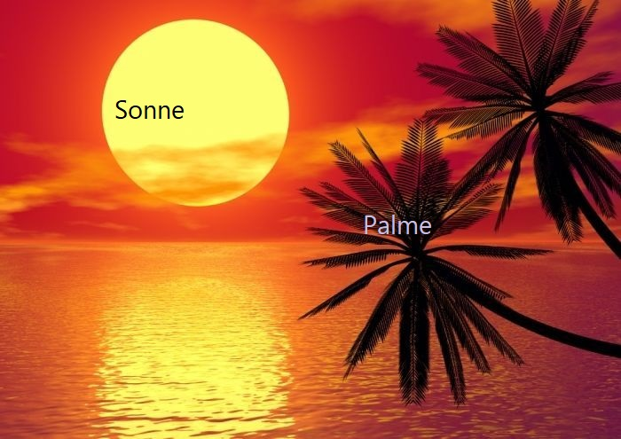

import OsTabs from '@tdev-components/OsTabs'
import Scenario from './components/Scenario'
import Page from './components/Page'

# Praktische Szenarien [print]

<div className="noComment">
<Page nr={1}>
<Scenario >
### Szenario 1

- Im Ordner `BYOD_Übung` einen neuen Unterordner namens `Flattermaus` erstellen
- Die Datei `orcas.txt` in den Ordner `Flattermaus` verschieben
- **Achtung:** «Verschieben» $\ne$ «kopieren + und am alten Ort löschen»!

</Scenario>


<Scenario >
### Szenario 2

- Zeigen Sie, wo man das Anzeigen der Dateinamenserweiterungen ein- und ausschalten kann
- Stellen Sie sicher, dass die Dateinamenserweiterungen angezeigt werden

</Scenario>

<Scenario >
### Szenario 3

- Löschen Sie die Datei `orcas.txt`
- Öffnen Sie den Papierkorb und stellen Sie die Datei `orcas.txt` wieder her
- Stellen Sie sicher, dass die Datei wieder im Ordner `BYOD_Übung` liegt
</Scenario>

<Scenario >
### Szenario 4

- Öffnen Sie Microsoft Word
- Öffnen Sie aus Word heraus die Datei `sonnenuntergang.docx` im Ordner `BYOD_Übung`, ohne dabei «Abkürzungen» wie «Schnellzugriff» oder «Zuletzt verwendet» zu verwenden
</Scenario>

<Scenario >
### Szenario 5

- Erstellen Sie ein neues Word-Dokument
- Speichern Sie das Dokument unter dem Namen `byod_übung_1.docx` (oder 2, 3, …) **lokal** auf Ihrem Computer ab: also in einem Ordner, der **nicht** mit OneDrive synchronisiert wird
</Scenario>

<Scenario isWin >
### Szenario 6
- Ein Bildschirmfoto vom Programmfenster «Datei-Explorer» erstellen
- Das Bildschirmfoto unter dem Namen `01_explorer` im Ordner `BYOD_Übung` abspeichern (oder es dahin verschieben und ggf. umbenennen)

</Scenario>
<Scenario isOsx>
### Szenario 6
- Ein Bildschirmfoto vom Programmfenster von «Finder» erstellen
- Das Bildschirmfoto unter dem Namen `01_finder` im Ordner `BYOD_Übung` abspeichern (oder es dahin verschieben und ggf. umbenennen)

</Scenario>


<Scenario >
### Szenario 7

- `Downloads`-Ordner öffnen
- Sortieren nach Änderungsdatum, so dass
  - die zuletzt heruntergeladenen Dokumente zuoberst angezeigt werden, danach
  - die grössten Dateien zuoberst angezeigt werden
</Scenario>
</Page>

<Page nr={2}>
<Scenario >
### Szenario 8

- Installieren Sie das Programm [Visual Studio Code](https://code.visualstudio.com/) (kurz: «VSCode») auf Ihrem Laptop
- Deinstallieren Sie das Programm wieder

:::info[Infos]
- Falls Sie VSCode bereits installiert haben, können Sie die beiden Schritte auch vertauschen: Zuerst deinstallieren, dann installieren.
- Falls Sie VSCode aktiv verwenden und es deshalb nicht deinstallieren möchten, dann können Sie stattdessen das Programm [Thonny](https://thonny.org/) installieren und deinstallieren.
:::
</Scenario>
<Scenario >
### Szenario 9

- Öffnen Sie das Bild "sonnenuntergang.jpg" und fügen Sie die Beschriftungen "Palme" und "Sonne" hinzu.

:::cards{maxWidth="300px"}

::br

:::

:::danger[Schrift]
Beschriftung von Hand (z.B. mit dem Stift) zählt nicht. Die Schriftfarbe und -grösse kann frei gewählt werden, muss aber lesbar sein.
:::
</Scenario>

<Scenario >
### Szenario 10

- `sonnenuntergang.docx` öffnen
- **(ab jetzt nur mit der Tastatur und ohne Maus / Touchpad / Touchscreen!)**
- "ipsum dolor sit amet" auswählen und löschen
- Den ganzen zweiten Absatz auswählen und löschen
- Dokument speichern

</Scenario>


<Scenario >
### Szenario 11

- Datei-Explorer und das Mail-Programm öffnen
- Mit Tasten-Shortcuts zwischen diesen Programmen hin- und herwechseln

</Scenario>

<Scenario >
### Szenario 12

- Teams öffnen und eine Nachricht mit einer kurzen Begrüssung, dem Text «Ich übe die BYOD-Szenarien.» und einem kurzen Gruss an Herrn Hofer schicken.

</Scenario>

<Scenario >
### Szenario 13

- Den Ordner `programme` komprimieren
- Die komprimierte Datei zu `programme_byod.zip` umbenennen
- Die komprimierte Datei per Mail an Herrn Hofer schicken (dabei einen passenden Betreff, eine Begrüssung und einen kurzen Gruss nicht vergessen!)

</Scenario>

<Scenario >
### Szenario 14

- In der globalen Suche nach «fledermaus.docx» suchen und dieses Dokument öffnen
- Den Wikipedia Link öffnen
- Die Einleitung kopieren und im Word Dokument einfügen
- Das Word-Dokument speichern

</Scenario>

<Scenario >
### Szenario 15
- Das Programm `hello_world.py` im Text Editor öffnen
- **(ab jetzt nur noch mit der Tastatur ohne Maus / Touchpad / Touchscreen!)**
- den ganzen Text auswählen und löschen
- speichern, das Dokument **nicht** schliessen
- Änderung rückgängig machen und wieder speichern

</Scenario>

</Page>


<Page nr={3}>
<Scenario >
### Szenario 16
- Das Programm `hello_world.py` im Text Editor öffnen
- **(ab jetzt nur noch mit der Tastatur ohne Maus!)**
- Den Text "It's a beautiful Day." auswählen, ausschneiden und vor "Hello World" einfügen.  
  (Resultat: `print("It's a beautiful Day. Hello World!")`)
- speichern
</Scenario>
<Scenario >
### Szenario 17
- Das Programm `create_mesh.py` im Text Editor öffnen
- Mit der Suchfunktion nach der Zahl `3` suchen

</Scenario>

<Scenario >
### Szenario 18
- Im Textfeld unten **genau** den folgenden Code **eintippen** (**nicht** kopieren und einfügen):  
  ```py
  print("Klammern: (), [], {}")
  ```

  <String solution='print("Klammern: (), [], {}")' inputWidth='20em' />


</Scenario>
<Scenario >
### Szenario 19
- Im Textfeld unten **genau** den folgenden Code **eintippen** (**nicht** kopieren und einfügen):  
  ```py
  print("Sonderzeichen: #, &, <, >")
  ```

  <String solution='print("Sonderzeichen: #, &, <, >")' inputWidth='20em' />
</Scenario>

<Scenario >
### Szenario 20
- Erstellen Sie eine neue Powerpoint-Datei (der Inhalt ist egal)
- Speichern Sie die Datei unter dem Namen `test_vorname_nachname` im Ordner `BYOD_Übung` ab (vorname/nachname ersetzen Sie durch Ihren eigenen Vor-/Nachnamen, also z.B. `test_max_muster`)
- **Wichtig:** Sie sollten die Datei nicht zuerst an einem «falschen» Ort oder unter einem falschen Namen abspeichern und dann verschieben / umbenennen, sondern direkt korrekt benannt im Ordner `BYOD_Übung` abspeichern.

</Scenario>

<Scenario >
### Szenario 21
- Kürzen Sie das Video `yogi_bear.mp4` so, dass es (möglichst genau) bei `00:10:00` beginnt und bei `1:15:00` endet
- Speichern Sie das zugeschnittene Video im Ordner `BYOD_Übung` unter dem Namen `yogi_bear_gekürzt.mp4` ab. Das Originalvideo bleibt unverändert.

</Scenario>

<Scenario >
### Szenario 22
- Öffnen Sie Teams und starten Sie eine Video-Konferenz mit Herrn Hofer
- Geben Sie Ihren gesamten Bildschirm frei

</Scenario>

<Scenario >
### Szenario 23
- Erstellen Sie für den Ordner `programme` einen Link, mit dem «Personen in EDUBERN» den Ordner bearbeiten können
- Senden Sie den Link per Teams an Herrn Hofer

</Scenario>

</Page>

<Page nr={4}>

<Scenario >
### Szenario 24
- Öffnen Sie die GBSL-Webseite (die Adresse lautet `gbsl.ch`), ohne dabei eine Suchmaschine (z.B. Google, Bing, Ecosia, …) zu verwenden

</Scenario>

<Scenario >
### Szenario 25
- Laden Sie <a href="/files/byod-basics-29/rezept_omeletten.txt" download="rezept_omeletten.txt">👉 diese Datei</a> herunter
- Verschieben Sie die heruntergeladene Datei in den Ordner `BYOD_Übung`
- **Achtung:** «Verschieben» $\ne$ «kopieren + und am alten Ort löschen»!

</Scenario>

<Scenario isWin>
### Szenario 26
Öffnen Sie das Programm «Microsoft Word» über das **Startmenu**.
</Scenario>

<Scenario isOsx>
### Szenario 26
Öffnen Sie das Programm «Microsoft Word» über die **Spotlight-Suche**.

</Scenario>

<Scenario >
### Szenario 27
- Das Programm `create_mesh.py` im Texteditor öffnen
- Nach der Zahl `3` suchen und diese mit der Zahl 7 ersetzen.


</Scenario>

<Scenario >
### Szenario 28
- Mail-Programm öffnen
- Signatur-Einstellungen öffnen und eine Signatur erstellen (oder wenn vorhanden ändern)

</Scenario>

<Scenario >
### Szenario 29
- Das Programm `create_mesh.py` öffnen und den ganzen Code kopieren
- Teams öffnen und als formatierten Python-Codeblock an Herrn Hofer senden (die Begrüssung und Grossformel darf ausnahmsweise weggelassen werden).

</Scenario>

<Scenario >
### Szenario 30
- Das untenstehende Programm `create_mesh.py` ausführen und ein Bildschirm-Video von der Ausgabe erstellen.
- Bildschirmaufnahme im Ordner "material_byod" abspeichern/dorthin verschieben.

```py title=create__mesh.py
from turtle import *
from math import sqrt
import random

SQRT3 = sqrt(3)
```
</Scenario>
</Page>
</div>