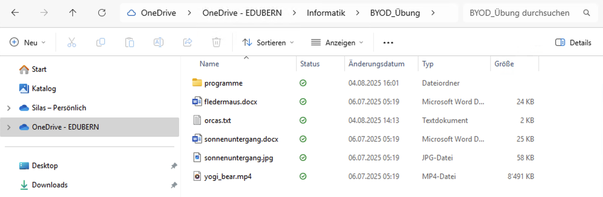
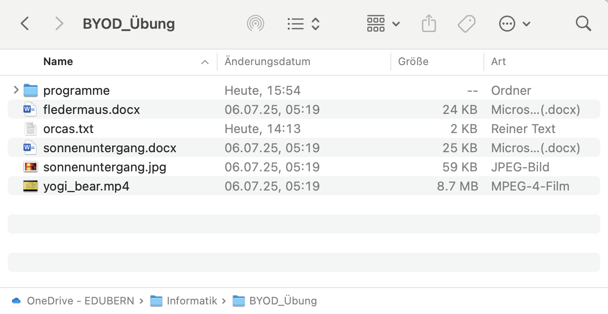

import OsTabs from '@tdev-components/OsTabs'
import Video from '@tdev-components/Video'
import useBaseUrl from '@docusaurus/useBaseUrl';
import Steps from '@tdev-components/Steps';
import ProgressState from '@tdev-components/documents/ProgressState';

# Praktische Szenarien
## Vorbereitung
Für den unten stehenden Auftrag und für jeden Übungs-Durchgang bereiten Sie Ihren Laptop wie folgt vor:

<Steps>
1. Laden Sie <a href="/files/byod-basics-29/material_byod.zip" download="material_byod.zip">👉 hier</a> das benötigte Material herunter und entpacken Sie die ZIP-Datei. Am besten belassen Sie den entpackten `material_byod`-Ordner gleich im Downloads-Ordner, damit Sie die Dateien vor jedem neuen Übungs-Durchgang wieder verwenden können. Die ZIP-Datei können Sie löschen.
2. Erstellen Sie in Ihrer Schul-OneDrive in einem sinnvollen Unterordner (z.B. `Informatik`) einen neuen Ordner namens `BYOD_Übung`. Falls der Ordner bereits existiert, löschen Sie alle Dateien darin, damit Sie die Szenarien in jedem Durchgang neu üben können.
3. Kopieren Sie alle Dateien aus dem `material_byod`-Ordner (siehe Schritt 1) in den Ordner `BYOD_Übung`. **Achtung:** Kopieren, nicht verschieben! Sonst müssen Sie den Material-Ordner jedes Mal neu herunterladen.
</Steps>

Am Schluss sollten Sie einen Ordner haben, der so aussieht:
<OsTabs>
  <TabItem value="win">
    
  </TabItem>
  <TabItem value="mac">
    
  </TabItem>
</OsTabs>

:::details[Notenskala]
| Punkte | Note |
| :----- | :--- |
| 10     | 6    |
| 9.5    | 6    |
| 9      | 5.7  |
| 8.5    | 5.5  |
| 8      | 5.2  |
| 7.5    | 4.9  |
| 7      | 4.7  |
| 6.5    | 4.4  |
| 6      | 4.2  |
| 5.5    | 3.9  |
| 5      | 3.6  |
| 4.5    | 3.4  |
| 4      | 3.1  |
| 3.5    | 2.8  |
| 3      | 2.6  |
| 2.5    | 2.3  |
| 2      | 2.1  |
| 1.5    | 1.8  |
| 1      | 1.5  |
| 0.5    | 1.3  |
| 0      | 1    |
:::
---

## Szenarien
:::warning[Beim Üben bitte beachten]
Wenn bei einem Szenario z.B. steht «an Herrn Hofer senden», dann senden Sie es beim Üben bitte **an eine Kolleg:in** oder an sich selber. Erst bei der Probe müssen Sie es an Herrn Hofer senden.
:::

### Szenario 1
- Im Ordner `BYOD_Übung` einen neuen Unterordner namens `Flattermaus` erstellen
- Die Datei `orcas.txt` in den Ordner `Flattermaus` verschieben
- **Achtung:** «Verschieben» $\ne$ «kopieren + und am alten Ort löschen»!

### Szenario 2
- Zeigen Sie, wo man das Anzeigen der Dateinamenserweiterungen ein- und ausschalten kann
- Stellen Sie sicher, dass die Dateinamenserweiterungen angezeigt werden

### Szenario 3
- Löschen Sie die Datei `orcas.txt`
- Öffnen Sie den Papierkorb und stellen Sie die Datei `orcas.txt` wieder her
- Stellen Sie sicher, dass die Datei wieder im Ordner `BYOD_Übung` liegt

### Szenario 4
- Öffnen Sie Microsoft Word
- Öffnen Sie aus Word heraus die Datei `sonnenuntergang.docx` im Ordner `BYOD_Übung`, ohne dabei «Abkürzungen» wie «Schnellzugriff» oder «Zuletzt verwendet» zu verwenden

### Szenario 5
- Erstellen Sie ein neues Word-Dokument
- Speichern Sie das Dokument unter dem Namen `byod_übung_1.docx` (oder 2, 3, …) **lokal** auf Ihrem Computer ab: also in einem Ordner, der **nicht** mit OneDrive synchronisiert wird


#### Szenario 6

<OsTabs>
  <TabItem value="win">
    - Ein Bildschirmfoto vom Programmfenster «Datei-Explorer» erstellen
    - Das Bildschirmfoto unter dem Namen `01_explorer` im Ordner `BYOD_Übung` abspeichern (oder es dahin verschieben und ggf. umbenennen)
  </TabItem>
  <TabItem value="mac">
    - Ein Bildschirmfoto vom Programmfenster von «Finder» erstellen
    - Das Bildschirmfoto unter dem Namen `01_finder` im Ordner `BYOD_Übung` abspeichern (oder es dahin verschieben und ggf. umbenennen)
  </TabItem>
</OsTabs>


### Szenario 7
- `Downloads`-Ordner öffnen
- Sortieren nach Änderungsdatum, so dass
  - die zuletzt heruntergeladenen Dokumente zuoberst angezeigt werden, danach
  - die grössten Dateien zuoberst angezeigt werden

### Szenario 8
- Installieren Sie das Programm [Visual Studio Code](https://code.visualstudio.com/) (kurz: «VSCode») auf Ihrem Laptop
- Deinstallieren Sie das Programm wieder

:::info[Infos]
- Falls Sie VSCode bereits installiert haben, können Sie die beiden Schritte auch vertauschen: Zuerst deinstallieren, dann installieren.
- Falls Sie VSCode aktiv verwenden und es deshalb nicht deinstallieren möchten, dann können Sie stattdessen das Programm [Thonny](https://thonny.org/) installieren und deinstallieren.
:::

### Szenario 9
- Öffnen Sie das Bild "sonnenuntergang.jpg" und fügen Sie die Beschriftungen "Palme" und "Sonne" hinzu.

:::cards{minWidth="300px"}

::br

:::

:::danger[Schrift]
Beschriftung von Hand (z.B. mit dem Stift) zählt nicht. Die Schriftfarbe und -grösse kann frei gewählt werden, muss aber lesbar sein.
:::

### Szenario 10
- `sonnenuntergang.docx` öffnen
- **(ab jetzt nur mit der Tastatur und ohne Maus / Touchpad / Touchscreen!)**
- "ipsum dolor sit amet" auswählen und löschen
- Den ganzen zweiten Absatz auswählen und löschen
- Dokument speichern

### Szenario 11
- Datei-Explorer und das Mail-Programm öffnen
- Mit Tasten-Shortcuts zwischen diesen Programmen hin- und herwechseln

### Szenario 12
- Teams öffnen und eine Nachricht mit einer kurzen Begrüssung, dem Text «Ich übe die BYOD-Szenarien.» und einem kurzen Gruss an Herrn Hofer schicken.

### Szenario 13
- Den Ordner `programme` komprimieren
- Die komprimierte Datei zu `programme_byod.zip` umbenennen
- Die komprimierte Datei per Mail an Herrn Hofer schicken (dabei einen passenden Betreff, eine Begrüssung und einen kurzen Gruss nicht vergessen!)

### Szenario 14
- In der globalen Suche nach «fledermaus.docx» suchen und dieses Dokument öffnen
- Den Wikipedia Link öffnen
- Die Einleitung kopieren und im Word Dokument einfügen
- Das Word-Dokument speichern

### Szenario 15
- Das Programm `hello_world.py` im Text Editor öffnen
- **(ab jetzt nur noch mit der Tastatur ohne Maus / Touchpad / Touchscreen!)**
- den ganzen Text auswählen und löschen
- speichern, das Dokument **nicht** schliessen
- Änderung rückgängig machen und wieder speichern

### Szenario 16
- Das Programm `hello_world.py` im Text Editor öffnen
- **(ab jetzt nur noch mit der Tastatur ohne Maus!)**
- Den Text "It's a beautiful Day." auswählen, ausschneiden und vor "Hello World" einfügen. (Resultat: `print("It's a beautiful Day. Hello World!")`)
- speichern

### Szenario 17
- Das Programm `create_mesh.py` im Text Editor öffnen
- Mit der Suchfunktion nach der Zahl `3` suchen

### Szenario 18
- Im Textfeld unten **genau** den folgenden Code **eintippen** (**nicht** kopieren und einfügen): `print("Klammern: (), [], {}")`

<String solution='print("Klammern: (), [], {}")' inputWidth='20em' />

:::info[Antwort überprüfen]
Mit einem Klick auf den __:mdi[help-circle-outline]{.black}__-Knopf können Sie Ihre Antwort überprüfen (alternativ mit [[Ctrl]] + [[:mdi[keyboard-return]]]).

Das :mdi[flash-triangle]{.orange}-Symbol bedeutet, dass das Textfeld zurückgesetzt wird, wenn Sie die Seite neu laden.
:::

### Szenario 19
- Im Textfeld unten **genau** den folgenden Code **eintippen** (**nicht** kopieren und einfügen): `print("Sonderzeichen: #, &, <, >")`

<String solution='print("Sonderzeichen: #, &, <, >")' inputWidth='20em' />

:::info[Antwort überprüfen]
Mit einem Klick auf den __:mdi[help-circle-outline]{.black}__-Knopf können Sie Ihre Antwort überprüfen (alternativ mit [[Ctrl]] + [[:mdi[keyboard-return]]]).

Das :mdi[flash-triangle]{.orange}-Symbol bedeutet, dass das Textfeld zurückgesetzt wird, wenn Sie die Seite neu laden.
:::

### Szenario 20
- Erstellen Sie eine neue Powerpoint-Datei (der Inhalt ist egal)
- Speichern Sie die Datei unter dem Namen `test_vorname_nachname` im Ordner `BYOD_Übung` ab (vorname/nachname ersetzen Sie durch Ihren eigenen Vor-/Nachnamen, also z.B. `test_max_muster`)
- **Wichtig:** Sie sollten die Datei nicht zuerst an einem «falschen» Ort oder unter einem falschen Namen abspeichern und dann verschieben / umbenennen, sondern direkt korrekt benannt im Ordner `BYOD_Übung` abspeichern.

### Szenario 21
- Kürzen Sie das Video `yogi_bear.mp4` so, dass es (möglichst genau) bei `00:10:00` beginnt und bei `1:15:00` endet
- Speichern Sie das zugeschnittene Video im Ordner `BYOD_Übung` unter dem Namen `yogi_bear_gekürzt.mp4` ab. Das Originalvideo bleibt unverändert.

### Szenario 22
- Öffnen Sie Teams und starten Sie eine Video-Konferenz mit Herrn Hofer
- Geben Sie Ihren gesamten Bildschirm frei

### Szenario 23
- Erstellen Sie für den Ordner `programme` einen Link, mit dem «Personen in EDUBERN» den Ordner bearbeiten können
- Senden Sie den Link per Teams an Herrn Hofer

### Szenario 24
- Öffnen Sie die GBSL-Webseite (die Adresse lautet `gbsl.ch`), ohne dabei eine Suchmaschine (z.B. Google, Bing, Ecosia, …) zu verwenden

### Szenario 25
- Laden Sie <a href="/files/byod-basics-29/rezept_omeletten.txt" download="rezept_omeletten.txt">👉 diese Datei</a> herunter
- Verschieben Sie die heruntergeladene Datei in den Ordner `BYOD_Übung`
- **Achtung:** «Verschieben» $\ne$ «kopieren + und am alten Ort löschen»!

### Szenario 26
<OsTabs>
  <TabItem value="win">
    Öffnen Sie das Programm «Microsoft Word» über das **Startmenu**.
  </TabItem>
  <TabItem value="mac">
    Öffnen Sie das Programm «Microsoft Word» über die **Spotlight-Suche**.
  </TabItem>
</OsTabs>


### Szenario 27
- Das Programm `create_mesh.py` im Texteditor öffnen
- Nach der Zahl `3` suchen und diese mit der Zahl 7 ersetzen.


### Szenario 28
- Mail-Programm öffnen
- Signatur-Einstellungen öffnen und eine Signatur erstellen (oder wenn vorhanden ändern)

### Szenario 29
- Das Programm `create_mesh.py` öffnen und den ganzen Code kopieren
- Teams öffnen und als formatierten Python-Codeblock an Herrn Hofer senden (die Begrüssung und Grossformel darf ausnahmsweise weggelassen werden).

### Szenario 30
- Das untenstehende Programm `create_mesh.py` ausführen und ein Bildschirm-Video von der Ausgabe erstellen.
- Bildschirmaufnahme im Ordner "material_byod" abspeichern/dorthin verschieben.

```py live_py title=create__mesh.py id=fbcb116a-7d0c-4643-a160-728823d19262
from turtle import *
from math import sqrt
import random

SQRT3 = sqrt(3)
COLORS = ['red', 'blue', 'orange', 'green', 'purple', 'brown']
speed(20)

for index_x in range(5):
    for index_y in range(5):
        x = index_x * 30
        if index_y % 2 == 1:
            x = x - 15
        y = index_y * 15 * SQRT3
        penup()
        goto(x, y)
        pendown()
        for i in range(3):
            color(random.choice(COLORS))
            forward(30)
            left(360 / 3)

```
---