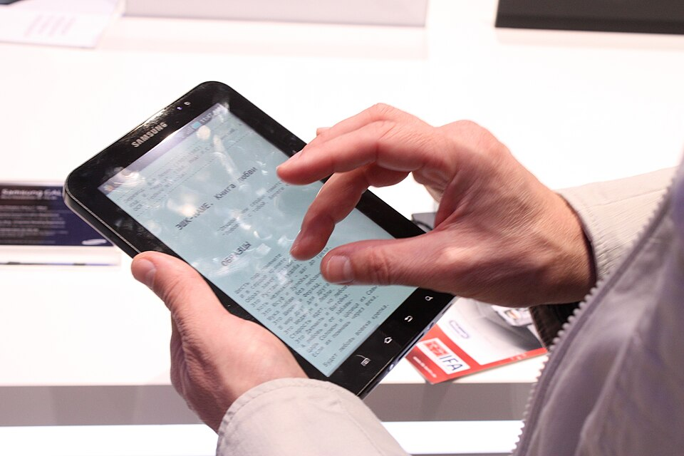
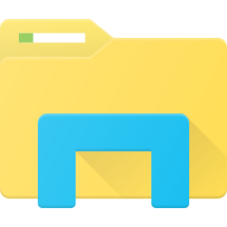
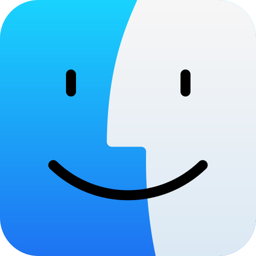

import TabItem from "@theme/TabItem";
import OsTabs from '@tdev-components/OsTabs';
import TextBoxPlayground from "@tdev-components/TextBoxPlayground";
import ProgressState from '@tdev-components/documents/ProgressState';
import useBaseUrl from '@docusaurus/useBaseUrl';
import Video from '@tdev-components/Video';
import ClickTest from '@brr/click-test';

# Modul 1: Grundlegende Bedienung
:::info[Lernziele]
1. Sie können die wichtigsten **Grundbegriffe** rund um Ihr Gerät erläutern, korrekt anwenden und ggf. mit ähnlichen Begriffen / Konzepten vergleichen (z.B. Touchpad vs. Maus vs. Touchscreen, iPad vs. Laptop, etc.).
2. Auf Ihrer Tastatur können Sie alle wichtigen **Tasten benennen**.
3. Sie können die Pfeiltasten und die wichtigsten **Tastenkombinationen** («Keyboard Shortcuts») verwenden, um einfache Abläufe nur mit der Tastatur und ohne Maus / Touchpad / Touchscreen umzusetzen.
4. Sie können auf der Tastatur alle wichtigen **Sonderzeichen** eingeben.
:::

## Grundbegriffe
Die Welt der Informatik ist bekannt für ihre vielen Fachbegriffe. Damit wir möglichst präzise und verständlich kommunizieren können, ist es wichtig, dass wir die **wichtigsten Begriffe** kennen und korrekt anwenden.

Fangen wir mit den zentralsten Begriffen an:

Computer
: Elektronisches Gerät, das Informationen verarbeiten, speichern und darstellen kann.
: Besteht aus Hardware (Tastatur, Touchpad, Bildschirm, evtl. Touchscreen, Prozessor, Speicher, etc.) und Software (Programme).
Laptop
: Tragbarer Computer mit eingebautem Bildschirm, Tastatur, Akku und allen wichtigen Komponenten in einem Gerät. 
: Verwendet ein **vollständiges Betriebssystem** wie _Windows_ oder _macOS_ (siehe unten).
Mobilgerät
: Kleiner, tragbarer Computer, der leicht in der Hand gehalten werden kann und meist über einen Touchscreen bedient wird.
: Dazu zählen Smartphones und Tablets.
: Verwendet ein **mobiles Betriebssystem** wie Android, iOS oder iPadOS (siehe unten).
Betriebssystem
: Wichtigste Software eines Geräts, die dafür sorgt, dass alle Teile des Computers zusammenarbeiten und Programme oder Apps gestartet werden können. 
: Beispiele für **vollständige Betriebssysteme** sind _Windows_ :mdi[microsoft]{.blue}, _macOS_ :mdi[apple] und _Linux_ :mdi[linux]{.green} (an unserer Schule nicht unterstützt).
: Beispiele für **mobile Betriebssysteme** sind _Android_ :mdi[android]{.green}, _iOS_ und _iPadOS_.

### Laptop vs. Mobilgerät
Für den Schulunterricht wird ein **vollwertiger Laptop benötigt**. Darunter versteht man einen tragbaren Computer mit einem **vollständigen Betriebssystem wie _Windows_ oder _macOS_**. Solche Geräte können alle Programme ausführen, die im Unterricht gebraucht werden, zum Beispiel Textverarbeitungen, Tabellenkalkulationen, Präsentationssoftware, Programmier-Umgebungen oder spezielle Lernprogramme.

**Mobilgeräte wie Tablets oder Smartphones** verwenden Betriebssysteme wie _Android_ (z.B. Samsung-Smartphones), _iOS_ (iPhone) oder _iPadOS_ (iPad). Diese Geräte sind zwar handlich und praktisch für unterwegs, haben aber oft **Einschränkungen**:
- Viele Programme existieren nur in einer limitierten Version oder gar nicht.
- Mehrere Anwendungen gleichzeitig zu nutzen ist oft umständlich.
- Bei Laptops werden alle Dateien zentral im Dateisystem gespeichert und von allen Programmen gemeinsam genutzt, was für eine organisierte Dateiverwaltung sorgt. Auf Mobilgeräten hat jede App ihren eigenen, isolierten Speicherbereich.

:::insight[Programme vs. Apps]
Software, die auf vollständigen Betriebssystemen wie Windows oder macOS läuft, wird meist als **«Programm»** bezeichnet. Auf Mobilgeräten hingegen spricht man meist von **«Apps»** (kurz für «Applikationen»).

Apps sind oft speziell für Touchscreens optimiert und bieten eine vereinfachte Benutzeroberfläche. Dadurch haben sie in der Regel aber auch einen limitierten Funktionsumfang.
:::

::::insight[Umgang mit Daten]
Ein zentraler Unterschied zwischen Laptops und Mobilgeräten ist der Umgang mit Daten. 

:::cards{flexBasis="200px"}

Auf einem Mobilgerät (z.B. Smartphone, iPad) hat jede _App_ ihren eigenen, **isolierten Speicherbereich**. Das bedeutet, dass die Daten einer App nicht direkt von anderen Apps oder dem Betriebssystem eingesehen oder bearbeitet werden können.  
Der Austausch von Daten erfolgt deshalb meistens über das :mdi[share]{.blue} **Teilen**: z.B. _teilt_ die Foto-App ein Bild mit WhatsApp[^1], damit man es in einem Chat versenden kann, wobei eine Kopie dieser Datei erstellt wird. Diese Isolierung erhöht die Sicherheit, da Apps nicht direkt auf die Daten anderer Apps zugreifen können.
::br

Bei vollständigen Betriebssystemen (Windows, macOS) funktioniert das anders: Hier gibt es ein **zentrales Dateisystem**, in welchem alle Dateien und Ordner gespeichert werden. Alle _Programme_ können auf dieses Dateisystem zugreifen, um Dateien zu lesen, zu bearbeiten oder zu speichern. Dadurch ist der Austausch von Daten zwischen Programmen viel einfacher und flexibler. Es bedeutet aber auch, dass ein bösartiges Programm (Virus, «Malware») ebenfalls auf alle Dateien zugreifen kann, was ein gewisses Sicherheitsrisiko darstellt.
:::

Mehr dazu im [Modul «Dateimanagement»](./02-Dateimanagement/index.mdx).
::::

Hier die wichtigsten Unterschiede im Überblick:
| Gerätetyp        | Betriebssystem         | Stärken im Schulkontext                               | Einschränkungen im Schulkontext                         |
|------------------|------------------------|-------------------------------------------------------|---------------------------------------------------------|
| **Vollwertiger Laptop** | Windows, macOS, _Linux (an unserer Schule nicht unterstützt)_ | Kann alle benötigten Programme installieren und nutzen, zentrales Dateimanagement, gute Leistung, viele Anschlüsse, komfortables Arbeiten mit Tastatur und Maus / Touchpad | Meist schwerer und teurer als Mobilgeräte, geringerer Schutz gegenüber gewissen Sicherheitsrisiken |
| **Mobilgerät**       | iOS, iPadOS, Android        | Leicht, mobil, guter Touchscreen für kreative Aufgaben, oft gute Kamera | Eingeschränkte Programmvielfalt («Apps»), oft keine vollwertige Office- oder Spezialsoftware, isolierte Speicherbereiche, wenige Anschlüsse, meist kleiner Bildschirm |

:::details[Chromebooks :mdi[google-chrome]]
Chromebooks sind eine spezielle Art von Laptops, die mit dem Betriebssystem _Chrome OS_ laufen. Sie sind in der Regel günstiger und haben eine lange Akkulaufzeit. Allerdings sind sie stark auf das Internet und Google-Dienste ausgerichtet.

An vielen Schulen der Volksschulstufe werden Chromebooks eingesetzt, da sie für viele schulische Aufgaben ausreichend sind. Allerdings können sie nicht alle Programme ausführen, die in der Sekundarstufe II benötigt werden. Deshalb sind sie für die Berufsschule oder das Gymnasium nicht geeignet.

Chromebooks werden wir in diesem Themenbereich nicht weiter behandeln.
:::

:::aufgabe[Testen Sie Ihr Wissen]
<TaskState id="cd3e34ea-20a9-4d57-8f94-6c71d362966c" />

Mit diesem Quiz können Sie Ihr Wissen zu den unterschiedlichen Gerätetypen testen.

::learningapps[https://learningapps.org/pt4m72wvc25]

**Achtung:** Wenn Sie die Seite neu laden, wird bei solchen Quizzes Ihre Lösung jeweils zurückgesetzt. Dafür können Sie das Quiz jederzeit wiederholen, um Ihr Wissen zu festigen. Denken Sie trotzdem daran, die **Aufgabe als erledigt zu markieren**, sobald Sie das Quiz fehlerfrei gelöst haben!

:::

### Eingabegeräte
Eingabegeräte sind Hardware-Komponenten, mit denen Informationen und Befehle an einen Computer übermittelt werden. Sie dienen dazu, den Computer zu steuern oder Daten einzugeben – zum Beispiel durch Tippen, Klicken, Wischen oder Ziehen. Wir unterscheiden dabei zwischen **Zeigegeräten** (z. B. Touchscreen, Touchpad, Maus), mit denen der Mauszeiger oder Objekte gesteuert werden, und **Texteingabegeräten** (konkret: Tastatur), mit denen Buchstaben, Zahlen und Symbole eingegeben werden. 

| Eingabegerät | Gerätetyp | Typische Verwendung | Bild | 
|--------------|---------------------|--------------|---|
| **Touchscreen** | Zeigegerät         | Navigation, Zeichnen, Tippen über Bildschirmtastatur |  |
| **Touchpad**    | Zeigegerät         | Steuerung des Mauszeigers, Gestensteuerung |  |
| **Maus**        | Zeigegerät         | Präzises Steuern des Mauszeigers, z. B. bei grafischen Arbeiten |  |
| **Tastatur**    | Texteingabegerät   | Schreiben von Texten, Ausführen von Befehlen über Tastenkombinationen |  |

:::insight[Maus vs. Tastatur]
Wenn wir von der **Maus** sprechen, meinen wir damit oft einfach das _Zeigegerät_, mit dem man klicken und ggf. den Mauszeiger steuern kann. Dabei ist es oft egal, ob es sich um eine echte Maus, ein Touchpad oder einen Touchscreen handelt.

Grundsätzlich sollten wir versuchen, möglichst viel nur mit der **Tastatur** zu machen – also ohne Maus, Touchpad oder Touchscreen. Das ist effizienter und schneller. Deshalb lernen Sie in diesem Modul auch die [wichtigsten Tastenkombinationen](#die-wichtigsten-tastenkombinationen) kennen, mit denen Sie Ihr Gerät noch effizienter bedienen können.
:::

### Arten von Klicks
Beim Arbeiten mit einer Maus, einem Touchpad oder einem Touchscreen gibt es verschiedene Klickarten. Sie lösen je nach Art unterschiedliche Aktionen aus. Die wichtigsten sind **Linksklick**, **Doppelklick** und **Rechtsklick**.

| Klickart       | Beschreibung |
|----------------|--------------------------------------------------|
| **Klick** _(auch: Linksklick, einfacher Klick, Standard-Klick, Einzelklick)_ | Wird am meisten gebraucht. Zum Beispiel Buttons anklicken, Elemente markieren, etc. |
| **Doppelklick**| Zwei Klicks schnell nacheinander. Wird oft gebraucht, um Dateien und Programme zu öffnen (in der Taskleiste / dem Dock braucht es allerdings nur einen _Einzelklick_)  |
| **Rechtsklick**| Wird z.B. gebraucht, um das Kontextmenü mit zusätzlichen Optionen zu öffnen. Ausführung: je nach Gerät (meistens mit zwei Fingern) |

:::aufgabe[Rechtsklick einrichten unter macOS]
<TaskState id="7d9f7d2c-21bf-4b24-bc5a-95c8af0f9bb6" />
Wenn Sie **kein** MacBook verwenden, können Sie diese Aufgabe direkt als erledigt markieren – in dem Fall gibt es für Sie nichts zu tun.

**Wenn Sie ein MacBook verwenden,** dann müssen Sie in den Einstellungen den Rechtsklick (auch «Sekundärklick» genannt) aktivieren, falls Sie das nicht bereits gemacht haben. Klappen Sie dazu die untenstehende Box auf und folgen Sie den Anweisungen.

    
Rechtsklick einstellen unter macOS

    

    Das :mdi[apple]-Symbol ganz oben links anklicken → __Systemeinstellungen__ → __Trackpad__ → __Sekundäklick: Mit zwei Fingern klicken oder tippen__.

    
    

:::

:::aufgabe[Alle Klicks ausprobieren]
<TaskState id="7c45a564-8b22-4f2a-b04f-9905955fe642" />
Probieren Sie alle drei Klick-Arten aus! Sobald alle Häkchen grün :mdi[checkbox-marked-outline]{.green} sind, markieren Sie die Aufgabe als erledigt.

<ClickTest />
:::

::::aufgabe[Klicks auf dem Gerät verwenden]
<TaskState id="912c4bba-df52-4ba0-894c-08d7f1c74e0f" />

Nun sollen Sie die verschiedenen Klick-Arten auf Ihrem Gerät verwenden. Öffnen Sie dazu zuerst Ihren Dateiexplorer (Windows: «Explorer»; macOS: «Finder»):

:::cards

::br

:::

#### Vorbereitung
<ProgressState id="ee07b541-cc17-42e2-ac68-1bb783819c42">
1. Öffnen Sie den Dateiexplorer und navigieren zum `Downloads`-Ordner.
2. Laden Sie das Bild <a href={require('/img/social-card.png').default} download="inf-webseite.png">inf-webseite.png</a> herunter.
3. Verifizieren Sie, dass die Datei __inf-webseite.png__ nun im `Downloads`-Ordner vorhanden ist.
</ProgressState >

#### Aufgabe
1. Was passiert, wenn man einen Einzelklick auf __inf-webseite.png__ macht?
2. Was passiert, wenn man einen Doppelklick auf __inf-webseite.png__ macht?
3. Was passiert, wenn man einen Rechtsklick auf __inf-webseite.png__ macht?

Halten Sie Ihre Erkenntnisse hier fest:

<QuillV2 id="adac48d1-bc07-4713-ab89-59b0858c86a3" />

<Solution id="398e9a61-403d-47fd-9bad-62f347f291be">
1. Bei einem **Einzelklick** wird die Datei markiert, aber nicht geöffnet. Das ist nützlich, um mehrere Dateien auszuwählen oder um eine Datei zu kopieren oder zu verschieben.
2. Bei einem **Doppelklick** wird die Datei geöffnet. Das ist die Standardaktion, um eine Datei zu bearbeiten oder anzusehen.
3. Bei einem **Rechtsklick** öffnet sich ein **Kontextmenü** mit zusätzlichen Optionen, wie z.B. «Kopieren», «Löschen», «Umbenennen» oder «Eigenschaften anzeigen».
</Solution>
::::

:::aufgabe[Klick oder Doppelklick?]
<TaskState id="f047875d-b041-492a-84c2-15fc4f978fde" />

Dateien werden teilweise auch an anderen Orten (Desktop, Startmenü, Dateiexplorer, im Apple Dock) angezeigt. Nicht überall braucht es dieselbe Klick-Art, um eine Datei zu öffnen oder eine Aktion auszuführen. Manchmal reicht ein einfacher Klick, manchmal braucht es einen Doppelklick.

Finden Sie heraus, wo welche Klick-Art verwendet wird?

<QuillV2 id="582ed485-814f-4805-9e12-eefd59606b0a" />

<Solution id="4def824d-d267-49be-abad-d1878856b3ce">
Ob ein einfacher oder ein Doppelklick nötig ist, hängt vom Kontext und der Benutzeroberfläche ab.

In Dateimanagern (Explorer, Finder) braucht es einen Doppelklick, um eine Datei oder einen Ordner zu öffnen, während ein einfacher Klick sie nur markiert. In Menüs (z.B. Startmenu), Symbolleisten, Navigationsleisten (z.B. am linken Rand im Explorer / Finder) oder auf Webseiten genügt in der Regel ein einfacher Klick, um eine Aktion auszulösen.

Je mehr Sie Ihr Gerät verwenden, desto mehr entwickeln Sie eine Intuition dafür, wann ein Klick oder ein Doppelklick nötig ist.
</Solution>
:::

### Link öffnen
Ab und zu braucht es zusätzlich zum Klick noch eine Taste – nämlich beim Öffnen von Links.
<OsTabs>
  <TabItem value="win">
    Link öffnen (z.B. in Word, Powerpoint, ...)
    : :mdi[mouse] *Klick* oder [[Ctrl]] + :mdi[mouse] *Klick* (ausprobieren)
    Link auf einer Webseite in einem neuen Tab öffnen
    : [[Ctrl]] + :mdi[mouse]  *Klick*
  </TabItem>
  <TabItem value="mac">
    Link öffnen (z.B. in Word, Powerpoint, ...)
    : :mdi[mouse] *Klick* oder
    : [[Cmd]] + :mdi[mouse] *Klick* (ausprobieren)
    Link auf einer Webseite in einem neuen Tab öffnen
    : [[Cmd]] + :mdi[mouse] *Klick*
  </TabItem>
</OsTabs>

:::aufgabe[Link öffnen]
<TaskState id="4eb3b88d-5f67-4e0f-aa53-b1165aebcb1b" />

Datei
: <a href={require('./assets/Unterrichtswebseite.docx').default} download="Unterichtswebseite.docx">👉 Unterichtswebseite.docx</a> herunterladen (auf den Link klicken)

Probieren Sie es aus:

1. Öffnen Sie den Link in der heruntergeladenen Word-Datei __Unterichtswebseite.docx__.
2. Öffnen Sie die Seite [srf.ch](https://www.srf.ch) in einem neuen Tab.
3. Löschen Sie die heruntergeladene Datei __Unterichtswebseite.docx__ von Ihrem Gerät.
4. Markieren Sie die Aufgabe als erledigt.
:::

## Tastenkombinationen
### Wichtige Tasten und ihre Namen
Diese Tasten sollten Sie für Ihr Betriebssystem kennen und korrekt benennen können. Links sehen Sie jeweils das Tastensymbol und ggf. die alternative Beschriftung. Rechts steht die Bezeichnung der Taste.

<OsTabs>
  <TabItem value="win">

    [[:mdi[microsoft]]], [[Win]]
    : Windows-Taste
    [[:mdi[apple-keyboard-shift]]], [[:mdi[arrow-up-thin]]], [[Shift]]
    : Umschalttaste
    [[Alt]]
    : Wahltaste
    [[Ctrl]]
    : Control-Taste
    [[:mdi[apple-keyboard-caps]]], [[:mdi[keyboard-caps]]]
    : Feststelltaste (oder [[Caps-Lock]]-Taste)
    : Bezweckt, dass alle Buchstaben gross geschrieben werden - auch Umlaute!
    [[:mdi[keyboard-tab]]]
    : Tabulator-Taste
    : Zweck: Springt zur nächsten Spalte oder rückt den Cursor in Fliesstext ein.
    [[:mdi[keyboard-esc]]]
    : Escape-Taste
    : Zweck: springt aus dem aktuellen Kontext heraus (bspw. die aktuelle Auswahl aufheben)
    [[Fn]]
    : Funktionstaste
    : Sie ermöglicht den Zugriff auf zusätzliche Funktionen der F-Tasten zuoberst auf der Tastatur (z.B. Helligkeit, Lautstärke).

  </TabItem>
  <TabItem value="mac">

    [[:mdi[apple-keyboard-command]]], [[command]]
    : Befehlstaste
    [[:mdi[apple-keyboard-shift]]], [[shift]]
    : Umschalttaste
    [[:mdi[apple-keyboard-option]]], [[alt]], [[option]]
    : Wahltaste
    [[:mdi[apple-keyboard-control]]], [[control]]
    : Control-Taste
    [[:mdi[apple-keyboard-caps]]], [[:mdi[keyboard-caps]]]
    : Feststelltaste, (oder [[Caps-Lock]]-Taste)
    : Bezweckt, dass alle Buchstaben gross geschrieben werden - auch Umlaute!
    [[:mdi[keyboard-tab]]]
    : Tabulator-Taste
    : Zweck: Springt zur nächsten Spalte oder rückt den Cursor in Fliesstext ein.
    [[:mdi[keyboard-esc]]]
    : Escape-Taste
    : Zweck: springt aus dem aktuellen Kontext heraus (bspw. die aktuelle Auswahl aufheben)
    [[fn]]
    : Funktionstaste
    : Sie ermöglicht den Zugriff auf zusätzliche Funktionen der F-Tasten zuoberst auf der Tastatur (z.B. Helligkeit, Lautstärke).

  </TabItem>
</OsTabs>

### Die wichtigsten Tastenkombinationen
Diese Tastenkombinationen sollten Sie lernen und trainieren, damit Sie Ihr Gerät möglichst effizient nutzen können.

<OsTabs>
  <TabItem value="win">
    [[Ctrl]] + [[x]]
    : __Ausschneiden__ Ausgewähltes Objekt aus dem Originaltext löschen und in die Zwischenablage kopieren. Dies funktioniert auch mit Dateien im Explorer.
    [[Ctrl]] + [[c]]
    : __Kopieren__ Ausgewähltes Objekt in die Zwischenablage kopieren. Dies funktioniert auch mit Dateien im Explorer.
    [[Ctrl]] + [[v]]
    : __Einfügen__ Den Inhalt der Zwischenablage in das aktuelle Dokument oder die aktuelle App einfügen. Dies funktioniert auch mit Dateien im Explorer.
    [[Ctrl]] + [[z]]
    : __Rückgängig machen__ - Den vorherigen Befehl widerrufen.
    [[Shift]] + [[Ctrl]] + [[z]]
    : __Widerrufen__ das Umgekehrte von [[Ctrl]] + [[z]]: um den Widerrufen-Befehl umzukehren.
    [[Ctrl]] + [[a]]
    : Alle Objekte auswählen.
    [[Ctrl]] + [[f]]
    : __Finden__ Elemente in einem Dokument suchen oder ein Suchfenster öffnen.
    [[Ctrl]] + [[s]]
    : __Speichern__ Das aktuelle Dokument speichern.
    [[Ctrl]] + [[n]]
    : __Neues Dokument/Fenster__ Ein neues Dokument erstellen oder ein neues Fenster öffnen.
    [[:mdi[microsoft]]] + [[Tab :mdi[keyboard-tab]]]
    : Alle geöffneten Programme anzeigen.
    [[Alt]] + [[Tab :mdi[keyboard-tab]]]
    : Unter den geöffneten Programmen zum zuletzt verwendeten wechseln.
    [[:mdi[microsoft]]]
    : __Startmenu__ öffnen.
    [[:mdi[microsoft]]] + [[.]]
    : __Emoji__ Öffnet die Emoji-Liste
  </TabItem>
  <TabItem value="mac">

    [[Cmd]] + [[x]]
    : __Ausschneiden__ Ausgewähltes Objekt aus dem Originaltext löschen und in die Zwischenablage kopieren.
    : **Achtung:** Funktioniert nicht mit Dateien / Ordner im Finder.
    [[Cmd]] + [[c]]
    : __Kopieren__ Ausgewähltes Objekt in die Zwischenablage kopieren. Dies funktioniert auch mit Dateien im Finder.
    [[Cmd]] + [[v]]
    : __Einfügen__ Den Inhalt der Zwischenablage in das aktuelle Dokument oder die aktuelle App einfügen. Dies funktioniert auch mit Dateien im Finder.
    [[Cmd]] + [[:mdi[apple-keyboard-option]]] + [[v]]
    : __Kopierte Datei verschieben__ Entfernt die kopierte Datei aus dem Originalordner und fügt sie am aktuellen Ort ein.
    : Funktioniert im Finder.
    [[Cmd]] + [[z]]
    : __Rückgängig machen__ - Den vorherigen Befehl widerrufen.
    [[Shift]] + [[Cmd]] + [[z]]
    : __Widerrufen__ das Umgekehrte von [[Ctrl]] + [[z]]: um den Widerrufen-Befehl umzukehren.
    [[Cmd]] + [[a]]
    : Alle Objekte auswählen.
    [[Cmd]] + [[f]]
    : __Finden__ Elemente in einem Dokument suchen oder ein Suchfenster öffnen.
    [[Cmd]] + [[s]]
    : __Speichern__ Das aktuelle Dokument sichern/speichern.
    [[Cmd]] + [[n]]
    : __Neues Dokument/Fenster__ Ein neues Dokument erstellen oder ein neues Fenster öffnen.
    [[Cmd]] + [[Tab :mdi[keyboard-tab]]]
    : Unter den geöffneten Programmen zum zuletzt verwendeten wechseln.
    : [[Cmd]] gedrückt lassen: mit [[Tab :mdi[keyboard-tab]]] oder [[Pfeiltasten]] zwischen geöffneten Programmen wechseln.
    [[Cmd]] + [[Leertaste]]
    : __Spotlight__ Das Spotlight-Suchfeld ein- oder ausblenden.
    [[Ctrl :mdi[apple-keyboard-control]]] + [[Cmd :mdi[apple-keyboard-command]]] + [[Leertaste]]
    : __Emoji__ Öffnet die Emoji-Liste
  </TabItem>
</OsTabs>

:::details[Weitere Tastenkombinationen]

<OsTabs>
  <TabItem value="win">
    [[Ctrl]] + [[p]]
    : __Drucken__ Das aktuelle Dokument drucken.
    [[Ctrl]] + [[t]]
    : __Tabs__ Einen neuen Tab öffnen.
    [[Ctrl]] + [[Enter :mdi[keyboard-return]]]
    : Nachricht senden (z.B. in Mail/Teams (wenn im Formatierungs-Modus)...)
    [[Ctrl]] + [[Tab :mdi[keyboard-tab]]]
    : Zwischen geöffneten Tabs wechseln.
    [[Shift]] + [[Enter :mdi[keyboard-return]]]
    : Neue Zeile im selben Absatz (oder eine neue Zeile in Teams/WhatsApp ohne zu senden)
  </TabItem>
  <TabItem value="mac">
    [[Cmd]] + [[p]]
    : __Drucken__ Das aktuelle Dokument drucken.
    [[Cmd]] + [[t]]
    : __Tabs__ Einen neuen Tab öffnen.
    [[Control ^]] + [[Tab :mdi[keyboard-tab]]]
    : Zwischen geöffneten Tabs wechseln.
    [[Shift]] + [[Enter :mdi[keyboard-return]]]
    : Neue Zeile im selben Absatz (oder eine neue Zeile in Teams/WhatsApp ohne zu senden)
  </TabItem>
</OsTabs>
:::

### Pfeiltasten
Um möglichst viel mit der Tastatur und ohne Maus arbeiten zu können, sind die **Pfeiltasten** ([[:mdi[arrow-up]]], [[:mdi[arrow-down]]], [[:mdi[arrow-left]]], [[:mdi[arrow-right]]]) und ihre **Modifikatoren** ([[Shift]], [[Ctrl]], [[:mdi[microsoft-windows]]], [[:mdi[apple-keyboard-option]]]) ein zentrales Werkzeug.

<OsTabs>
  <TabItem value="win">
    [[Shift]] + [[Pfeiltasten]]
    : Text auswählen
    [[Ctrl]] + [[Pfeiltasten]]
    : ganze Wörter überspringen
    [[Ctrl]] + [[Shift]] + [[Pfeiltasten]]
    : ganze Wörter selektieren
    [[:mdi[microsoft-windows]]] + [[Pfeiltasten]]
    : Fenster auf dem Bildschirm anordnen
  </TabItem>
  <TabItem value="mac">
    [[Shift]] + [[Pfeiltasten]]
    : Text auswählen
    [[:mdi[apple-keyboard-option]]] + [[Pfeiltasten]]
    : ganze Wörter überspringen
    [[Shift]] + [[:mdi[apple-keyboard-option]]] + [[Pfeiltasten]]
    : ganze Wörter selektieren
  </TabItem>
</OsTabs>

### Übungen
:::aufgabe[Shortcuts Tastatur & Pfeiltasten ausprobieren]
<TaskState id="4ffcfd5c-5de1-442c-8cf2-d69629c96c55" />
Probieren Sie, die verschiedenen Shortcuts im untenstehenden Textfeld aus! 
<TextBoxPlayground
  height="12rem"
  noSpellCheck
  defaultValue="Lorem ipsum dolor sit amet, consectetur adipiscing elit. Fusce consectetur consectetur quam sit amet posuere. Aliquam erat volutpat. Donec libero nisl, ultrices eget ipsum id, venenatis consequat augue. Donec porttitor libero nibh, in tincidunt ipsum vulputate nec. Aliquam id placerat magna, ut viverra urna. Aliquam tortor massa, consequat mollis venenatis ac, semper eu est. Suspendisse eleifend aliquet mattis. Sed ac nisl maximus, dapibus metus id, porta mauris. Suspendisse non tempor lacus, ac commodo nisi.

    Integer dignissim massa id sem tempus, at scelerisque arcu tempus. In tincidunt odio ac eleifend faucibus. Aenean sem elit, finibus vel arcu vel, dictum blandit erat. Nunc porttitor mi sed laoreet gravida. Mauris ligula augue, rhoncus id sapien in, pharetra imperdiet lorem. Praesent lobortis purus ut eros fermentum blandit. Proin ut ultrices velit." />
:::

## Sonderzeichen
Nebst Buchstaben und Zahlen gibt es auf der Tastatur auch viele **Sonderzeichen**. Gerade beim Programmieren ist es wichtig, dass Sie diese Zeichen kennen und wissen, wie Sie sie eingeben können.

### Klammern

<OsTabs>
  <TabItem value="win">
    __(__
    : [[Shift]] + [[8]]
    __)__
    : [[Shift]] + [[9]]
    __\{__
    : Normalerweise [[Alt Gr]] + [[ä]]
    __\}__
    : Normalerweise [[Alt Gr]] + [[$]]
    __[__
    : Normalerweise [[Alt Gr]] + [[ü]]
    __]__
    : Normalerweise [[Alt Gr]] + [[!]]
  </TabItem>
  <TabItem value="mac">
    __(__
    : [[Shift]] + [[8]]
    __)__
    : [[Shift]] + [[9]]
    __\{__
    : [[Option :mdi[apple-keyboard-option]]] + [[(]]
    __\}__
    : [[Option :mdi[apple-keyboard-option]]] + [[)]]
    __[__
    : [[Option :mdi[apple-keyboard-option]]] + [[5]]
    __]__
    : [[Option :mdi[apple-keyboard-option]]] + [[6]]
  </TabItem>
</OsTabs>

:::aufgabe[Klammern schreiben]
<TaskState id="0856fbc1-9322-4a50-8505-3dc5782c5951" />
Versuchen Sie, alle Klammern selber zu tippen!
<TextBoxPlayground
  id="d5ed6adf-6331-461f-845f-37b44f28ae31"
  height="5rem"
  noSpellCheck
  defaultValue="" />
:::

### Weitere wichtige Sonderzeichen
<OsTabs>
  <TabItem value="win">
    __\`__
    : [[Shift]] + [[^]] + [[Leerschlage]] (Backtick)
    __@__
    : [[Alt Gr]] + [[2]]
    __+__
    : [[Shift]] + [[1]]
    __#__
    : [[Alt Gr]] + [[3]]
    __*__
    : [[Shift]] + [[3]]
    __%__
    : [[Shift]] + [[5]]
    __&__
    : [[Shift]] + [[6]]
    __/__
    : [[Shift]] + [[7]]
    __\\__
    : [[Ctrl]] + [[Alt]] + [[\<]] oder [[Alt Gr]] + [[\<]]
    __\<__
    : [[\<]]
    __>__
    : [[Shift]] + [[\<]]
  </TabItem>
  <TabItem value="mac">
    __\`__
    : [[Shift]] + [[^]] + [[Leerschlag]] (das Zeichen heisst _Backtick_)
    __@__
    : [[option]] + [[g]]
    __+__
    : [[Shift]] + [[1]]
    __#__
    : [[option]] + [[3]]
    __*__
    : [[Shift]] + [[3]]
    __%__
    : [[Shift]] + [[5]]
    __&__
    : [[Shift]] + [[6]]
    __/__
    : [[Shift]] + [[7]]
    __\\__
    : [[Shift]] + [[option]] + [[7]]
    __\<__
    : [[\<]]
    __>__
    : [[Shift]] + [[\<]]
  </TabItem>
</OsTabs>

:::aufgabe[Sonderzeichen]
<TaskState id="4007b6a2-f211-45d4-8c06-9572c7a04464" />
Können Sie die obigen Sonderzeichen selber erzeugen? Probieren Sie es hier aus:

<TextBoxPlayground
  id="f0a4e081-45d8-4d7e-8ba1-1389b4533dda"
  height="5rem"
  noSpellCheck
  defaultValue="" />
:::

## Touch-Gesten

:::cards{flexBasis="150px"}

#### Klicken durch Tippen\*

::br

#### Rechtsklick\*

::br

#### Scrollen

::br

#### Alle Programme Anzeigen

:::

\*Auf modernen Touchpads reicht ein Antippen aus, um einen Klick auszulösen.

### Virtuelle Desktops

:::info[Virtuelle Desktops]
Mit virtuellen Desktops lassen sich mehrere Arbeitsbereiche und Fensteranordnungen erstellen, so dass Sie geöffnete Programme übersichtlicher anordnen können.

- Dank virtueller Desktops können Programme thematisch gruppiert werden. So können Ihre Gedanken, Projekte und Aufgaben thematisch gruppiert werden.
- Durch einfaches *Drag & Drop* können Programme von einem auf den anderen Desktop verschoben werden.
:::

#### Erstellen

<OsTabs>
  <TabItem value="win11">
    Virtuelle Desktops: Mit [[:mdi[microsoft-windows]]]+[[Tab :mdi[keyboard-tab]]] alle geöffneten Fenster anzeigen und oben im Fenster einen neuen Virtuellen Desktop erstellen:
    <Video src={useBaseUrl('/img/byod-basics/win11/create-virtual-desktop.mp4')} />
  </TabItem>
  <TabItem value="mac">
    <Video src={useBaseUrl('/img/byod-basics/osx/create_virtual_desktops.mp4')} />
  </TabItem>
</OsTabs>

#### Zwischen Desktops Wechseln

Mit folgenden Gesten kann zwischen diesen Desktops hin- und hergewechselt werden.\*

\* Je nach Voreinstellungen ist diese Geste mit nur 3 statt 4 Fingern zu machen.

:::details[⭐ Weitere Touchgesten]
<OsTabs>
  <TabItem value="win11">
    Weitere Gesten finden Sie [:mdi[link] hier](https://support.microsoft.com/de-de/windows/touchpad-gesten-f%C3%BCr-windows-10-a9d28305-4818-a5df-4e2b-e5590f850741)
  </TabItem>
  <TabItem value="mac">
    Weitere Gesten finden Sie [:mdi[link] hier](https://support.apple.com/de-ch/HT204895)
  </TabItem>
</OsTabs>
:::

---

[^1]: Man kann WhatsApp (und anderen Apps) auch die Berechtigung geben, direkt auf die Fotos zugreifen zu dürfen. Der Mechanismus ist allerdings der gleiche.