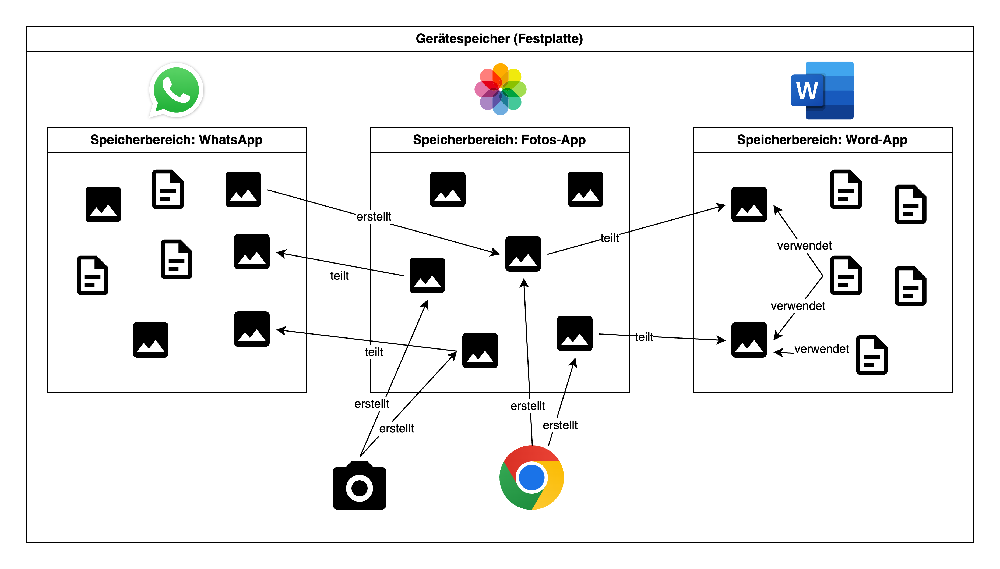
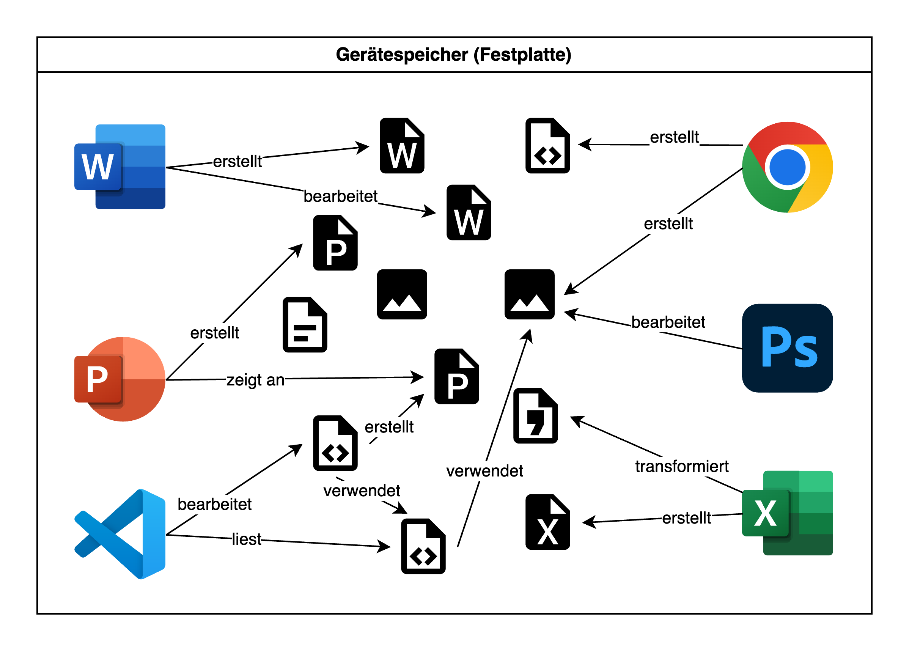

import Dir from '@tdev-components/FileSystem/Dir';

# Ordnung halten auf dem Computer
Sie sind vermutlich gewohnt, mit Ihrem Smartphone oder Tablet zu arbeiten. Auf mobilen Geräten Ordnung zu halten ist relativ einfach, denn Sie müssen sich in der Regel keine Gedanken machen, wo Sie etwas abspeichern:
- Ein Foto wird automatisch in der Foto-App gespeichert.
- Eine WhatsApp-Nachricht wird in WhatsApp gespeichert.
- Ihr Spielstand bei Ihrem Lieblingsgame wird im Spiel gespeichert.

Kurz gesagt: Auf Mobilgeräten ist der Speicherort für die Daten einer App eigentlich immer die App selbst:

Auf einem Laptop mit einem vollständigen Betriebssystem ist das aber anders. Hier gibt es ein **zentrales** Dateisystem, in dem alle Daten gespeichert werden. Die meisten Programme haben keinen eigenen Speicherbereich, den sie selbstständig organisieren.

Auf einem Laptop sind deshalb **Sie als Benutzer:in dafür verantwortlich, auf Ihrem Gerät Ordnung zu halten!**

## Warum ist Ordnung wichtig?
Wenn Sie alles auf Ihrem Computer irgendwo abspeichern, verlieren Sie schnell den Überblick. Typische Probleme sind:

- **Zeitverlust:** Sie suchen ewig nach einer Datei.
- **Doppelte Dateien:** Sie speichern dieselbe Datei mehrfach, weil Sie sie nicht finden.
- **Fehler:** Sie verwenden die falsche Version einer Datei.
- **Stress:** Ein unübersichtlicher Computer sorgt für Chaos.

## Wie benenne ich eine Datei sinnvoll?
Ein Dateiname sollte auf den ersten Blick verraten, was sich in der Datei befindet. Vermeiden Sie Namen wie:

:::danger[Beispiele für weniger sinnvolle Namen]
- `neu.docx`
- `Aufsatz final final2.docx`
- `Info-Projekt.docx`
- `Präsentation.pptx`
- `programmier code.py`
:::

Sie sind unklar und führen dazu, dass Sie später nicht mehr wissen, um was genau es geht. Stattdessen sollte der Name den Inhalt beschreiben – zum Beispiel das Fach, das Thema oder den Zweck der Datei. So erkennen Sie auch nach Wochen oder Monaten, wofür die Datei gedacht ist, ohne sie erst öffnen zu müssen.

:::success[Beispiele für sinnvolle Dateinamen]
- `Aufsatz Märchen.docx`  
- `Math_Trigonometrie_Vorbereitung.pdf`  
- `turtle_bewegen_aufgabe_2.py`
- `Projekt Wasserstoffauto - Notizen.docx`
- `Projekt Wasserstoffauto - Abschlussbericht.docx`
- `Projekt Wasserstoffauto - Präsentation.pptx`
:::

Die letzten drei Beispiele zeigen: Wenn zwei Dateien zum selben Thema oder Projekt gehören, ist es sinnvoll, diese nach einem einheitlichen Muster zu benennen.

::::info[Nummerierte Dateinamen]
Liegt den Dateien in einem Ordner eine bestimmte Reihenfolge zugrunde, kann es sinnvoll sein, die Dateien nummeriert zu benennen. So kann leicht nach dem Namen sortiert werden und man findet die schnell die gesuchten Inhalte.

import fileTree10 from "./assets/fileNames-numbered10.yaml";
import fileTreeBugged from "./assets/fileNames-numbered.yaml";

:::cards{flexBasis=300px}
<Dir dir={fileTree10} open />
::br
#### ⚠️ Weshalb `01` und nicht `1`?
Bei der Sortierung von Dateinamen wird der erste Buchstabe verglichen:
- Ziffern kommen weiter oben als Buchstaben
- Buchstaben werden alphabetisch sortiert
- Sind die ersten Buchstaben gleich, wird der zweite Buchstabe verglichen

Dies würde dann also zu folgender Sortierung führen:
<Dir dir={fileTreeBugged} open />
:::

::::

## Wie sieht eine sinnvolle Ordnerstruktur aus?
Eine gute Ordnerstruktur hilft Ihnen, Dateien schnell zu finden und zu organisieren. Hier sind einige Tipps:
- **Oberordner:** z.B. für jedes Fach, evtl. für jedes Schuljahr.
- **Unterordner:** für Themen oder Projekte.
- **Sinnvolle Ordnernamen:** gleiche Logik wie bei Dateien.

Eine sinnvolle Ordnerstruktur – **z.B. in Ihrer Schul-OneDrive** – könnte so aussehen:

import fileTreeSchule from "./assets/fileTreeSchule.yaml";

:::cards
<Dir
    dir={fileTreeSchule}
    open
/>
:::

:::aufgabe[Aufräumen!]
<TaskState id="29879a2c-bc98-4bbb-bfcb-2c66c85725d5" />
Schauen Sie sich Ihre Dateien und Ordner auf Ihrem Gerät an. Überlegen Sie sich folgende Dinge:
- Haben Sie all Ihre wichtigen Dateien (vor allem Ihre Schulsachen) in OneDrive gespeichert (mehr dazu im Abschnitt [Cloud](./04-Cloud.mdx))?
- Haben Sie eine sinnvolle Ordnerstruktur, die Ihnen hilft, Dateien schnell zu finden?
- Sind Ihre Dateien sinnvoll benannt, sodass Sie auf den ersten Blick wissen, worum es geht?

Wenn Sie noch irgendwo Verbesserungsbedarf sehen, dann nehmen Sie sich jetzt etwas Zeit und räumen Sie auf! Es lohnt sich!
:::

---