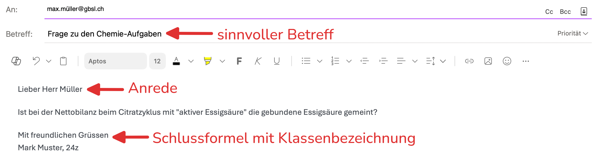

import TabItem from "@theme/TabItem";
import OsTabs from '@tdev-components/OsTabs'
import useBaseUrl from '@docusaurus/useBaseUrl';
import Video from '@tdev-components/Video';
import ProgressState from '@tdev-components/documents/ProgressState';
import RandomCatImage from '@hfr/random-cat-image';

# Modul 4: Kommunikation
:::info[Lernziele]
1. Sie können E-Mails und Teams-Nachrichten versenden und dabei alle Aspekte der «Netiquette» korrekt umsetzen.
2. Sie können bei einer E-Mail weitere Empfänger:innen im Cc und im Bcc anfügen und können erklären, was es mit diesen Feldern auf sich hat.
4. Sie können eine Datei per Teams und per Mail an bestimmte Empfänger:innen senden und achten vor dem Versenden auf eine sinnvolle Benennung der Datei.
5. Sie können in Teams einen Audio- oder Videoanruf starten und darin Ihren Bildschirm teilen.
:::

## Netiquette (Teams und E-Mail)
Auf Teams und in E-Mails werden Nachrichten mit **Sorgfalt** geschrieben. Es gehört eine kurze **Anrede** sowie eine **Schlussformel** (oder Grussformel) dazu. In der Schlussformel am Ende der Nachricht halten Sie nebst ihrem Namen auch die **Klassenbezeichnung** fest.

> Lieber Herr Müller
>
> Ist bei der Nettobilanz beim Citratzyklus mit "aktiver Essigsäure" die gebundene Essigsäure gemeint?
>
> Mit freundlichen Grüssen\
> Mark Muster, 24z

:::warning[Teams ≠ WhatsApp]
Auch wenn Sie nur eine kurze Frage haben, gehört die Anrede und Schlussformel dazu (es ist **kein WhatsApp-Chat unter Freunden**!).

Entwickelt sich durch die Antwort der Lehrperson einen Chat-Charakter (daher die Lehrperson schreibt innerhalb kurzer Zeit zurück und Sie haben eine Rückfrage zum selben Thema), darf die Anrede und die Schlussformel anschliessend für diese Unterhaltung weggelassen werden.
:::

**Zusätzlich bei E-Mails:** Bei E-Mails setzen Sie zudem immer einen passenden **Betreff**. Dieser hilft den Empfänger:innen, die E-Mail schnell zuzuordnen. Der Betreff sollte den Inhalt der E-Mail kurz zusammenfassen.

:::insight[Netiquette: Teams und E-Mail]
Teams-Nachrichten und E-Mails enthalten immer:
- …einen Betreff (nur E-Mails oder Teams-Posts mit Überschrift).
- …eine Anrede.
- …eine Schlussformel (Grussformel), inkl. Klassenbezeichnung.
:::

Eine vollständige, korrekte E-Mail könnte so aussehen:

:::warning[Mehrere Zeilen in Teams]
Kurz eine Nachricht schreiben - Anrede, Text, Grussformel... Doch [[:mdi[keyboard-return]]] schickt die Anrede ab, anstatt eine neue Zeile einzufügen 😖 ...

Egal ob in Word, MS-Teams, Whatsapp oder Instagram: Soll eine neue Zeile erzeugt werden, welche noch zum vorigen Abschnitt oder zur selben Nachricht gehört, so kann dies mit [[:mdi[apple-keyboard-shift]]] + [[:mdi[keyboard-return]]] erreicht werden.

**Alternativ** kann auch auf den Formatierungs-Modus gewechselt werden, in welchem neue Zeilen ganz normal mit [[:mdi[keyboard-return]]] eingefügt werden können.

:::

## E-Mail
In einer E-Mail gibt es drei verschiedene Arten von Empfänger:innen:

Empfänger:in
: Feld `An:`
: Die Person(en), an die diese E-Mail direkt gerichtet ist. 
Kopie
: Feld `Cc:`
: Die Person(en), die eine Kopie der E-Mail erhalten. Diese Personen sind nicht die Hauptempfänger:innen, aber sie sollen die E-Mail trotzdem erhalten und lesen können.
: Dieses Feld wird genutzt, wenn eine Person zwar nicht an der Unterhaltung beteiligt ist, aber trotzdem über den Inhalt informiert werden soll.
: Nutzen Sie diese Funktion sparsam, um die Empfänger:innen nicht unnötig zu überfluten.
Blindkopie
: Feld `Bcc:`
: Die Person(en), die eine Blindkopie der E-Mail erhalten. Diese Personen solle ebenfalls über die Kommunikation informiert werden, obwohl sie nicht die Hauptempfänger:innen sind.
: Der Unterschied zum Cc-Feld ist, dass die Empfänger:innen **nicht sehen, wer im Bcc-Feld augeführt ist**.
: Das ist besonders nützlich, wenn Sie eine E-Mail an mehrere Personen senden möchten, ohne dass Sie die E-Mail-Adressen aller Empfänger:innen offenlegen möchten (Privatsphäre).

<Video title="Cc- und Bcc-Feld aktivieren" src={useBaseUrl('/img/docs/material/BYOD-Basics-2025/06-Kommunikation/mail_recipients.mp4')}/>

<Video title="Dateien per Mail senden" src={useBaseUrl('/img/docs/material/BYOD-Basics-2025/06-Kommunikation/mail_send_files.mp4')}>
    **Wichtig:** Achten Sie vor dem Versenden auf eine sinnvolle Benennung der Datei.
</Video>

:::aufgabe[E-Mail senden]
Für diese Übung brauchen Sie drei Kolleg:innen. Sie müssen sich vorher nicht unbedingt mit ihnen absprechen.

<ProgressState id="f6ca8d1c-b4a5-4cc0-81d3-f1f386302185">
1. Wählen Sie eine Person __A__ aus, der Sie eine E-Mail schreiben möchten.
2. Verfassen Sie die E-Mail entsprechend der Netiquette.
3. Hängen Sie eine beliebige Datei an, die Sie versenden möchten. z.B. dieses Katzenbild
    <RandomCatImage />

    (Das Bild können Sie herunterladen, indem Sie einen __Rechtsklick :mdi[mouse-right-click]__ > __Bild speichern unter__ machen.)
4. Setzen Sie die Person __A__ als Empfänger:in (Feld `An`).
5. Setzen Sie eine zweite Person __B__ ins `Cc`.
6. Setzen Sie eine dritte Person __C__ ins `Bcc`.
7. Schicken Sie die E-Mail ab.
8. Befragen Sie Ihre drei Kolleg:innen:
    - Haben alle die E-Mail erhalten?
    - Haben alle die Datei erhalten und können sie diese öffnen?
    - Sehen Personen __A__ und __B__, dass die E-Mail an sie beide versendet wurde? Sehen Sie wirklich nicht, dass die E-Mail auch an __C__ versendet wurde?
    - Sieht Person __C__, an welche drei Personen (sich selbst eingeschlossen) die E-Mail versendet wurde?
</ProgressState> 

<Answer type="text" id="25586338-4391-42b3-b41a-ee4576983734" />
:::

## Teams
<Video title="Dateien per Teams senden" src={useBaseUrl('/img/docs/material/BYOD-Basics-2025/06-Kommunikation/teams_send_files.mp4')}>
    **Wichtig:** Achten Sie vor dem Versenden auf eine sinnvolle Benennung der Datei.
</Video>
<Video title="Bildschirm freigeben" src={useBaseUrl('/img/byod-basics/win/ms_teams_share_screen.mp4')}/>
<Video title="Tipp: Benachrichtigungen verwalten" src={useBaseUrl('/img/byod-basics/osx/ms_teams_configure_alerts.mp4')}/>

---