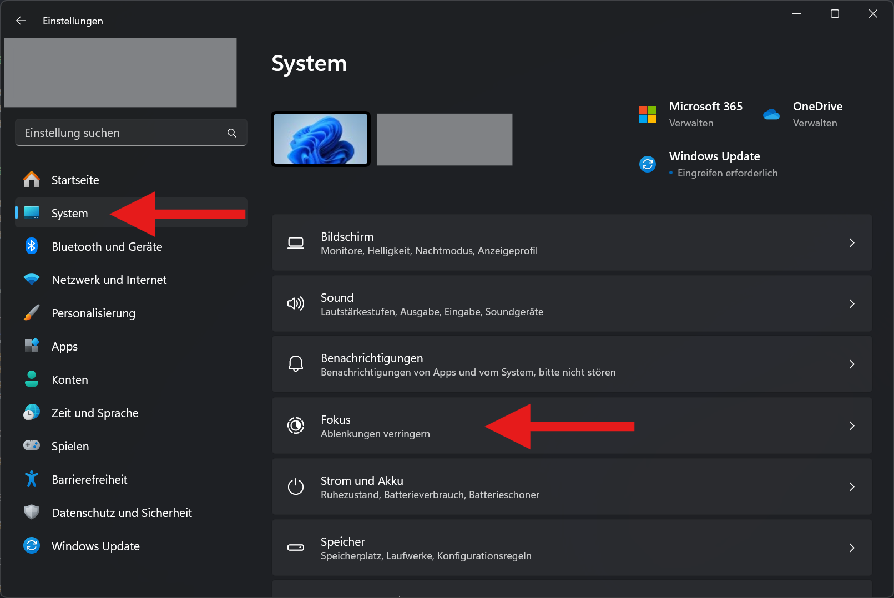
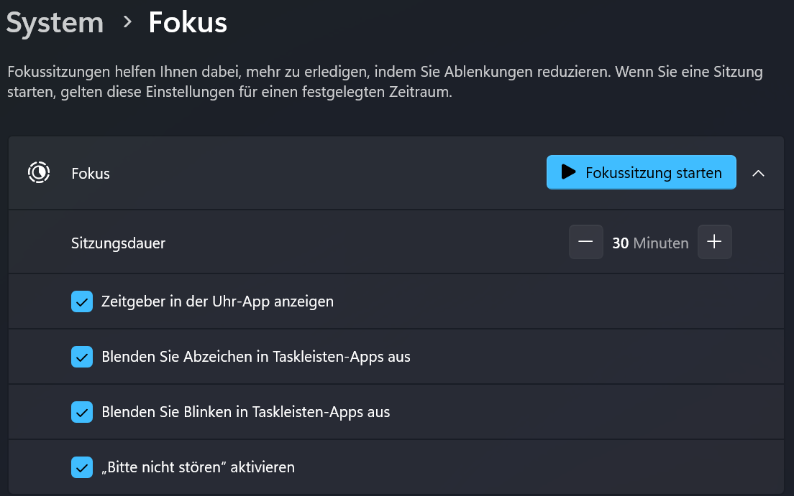
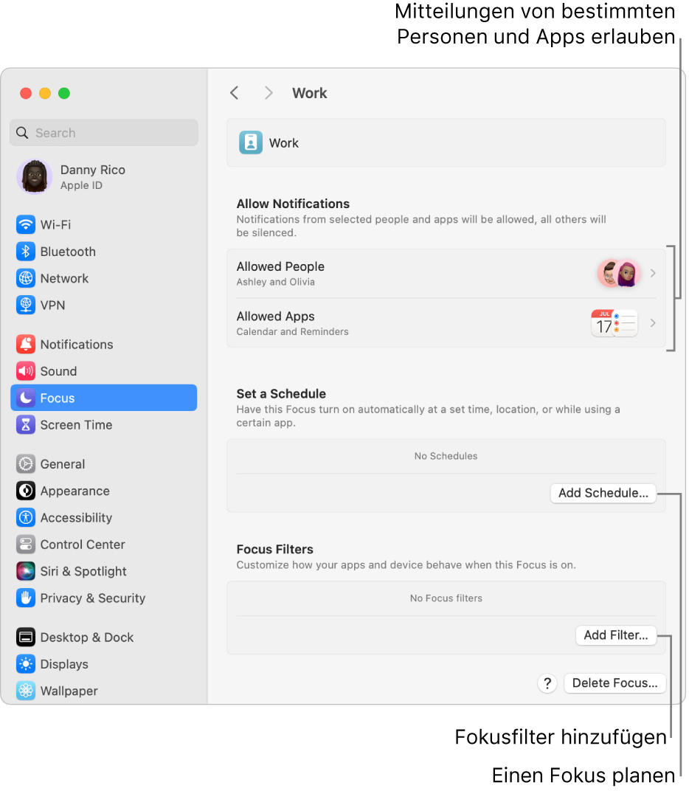
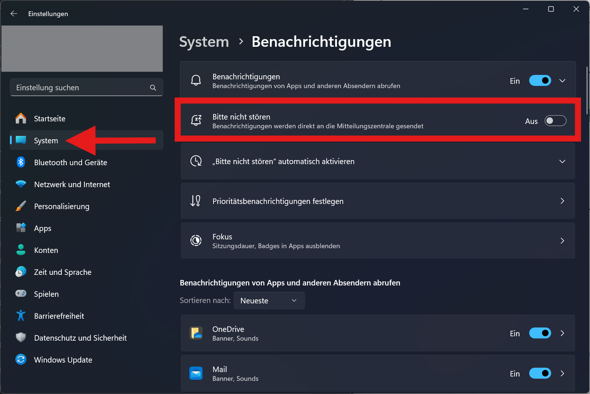
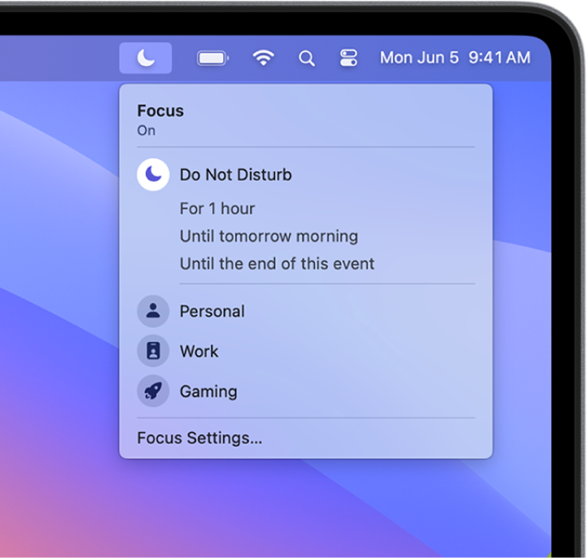

---
sidebar_custom_props:
  id: 0c0e490e-4719-4d74-b91b-79b230e4a505
---
import OsTabs from '@site/src/components/OsTabs'
import useBaseUrl from '@docusaurus/useBaseUrl';
import Video from '@site/src/components/Video'

# Betriebssystem

## Globale Suche

<OsTabs>
  <TabItem value="win11">

- **Startmenü** mit [[:mdi[microsoft-windows]]] öffnen und direkt mit Tippen beginnen.

Es kann nach Programmen, Ordnern, Dateien, aber auch z.B. nach dem Wetter gesucht werden.

</TabItem>
  <TabItem value="win10">

- **Startmenü** mit [[:mdi[microsoft-windows]]] öffnen  und direkt mit Tippen beginnen.
- Auf die Lupe [[:mdi[magnify]]] klicken und Suchanfrage starten.

Es kann nach Programmen, Ordnern, Dateien, aber auch z.B. nach dem Wetter gesucht werden.

</TabItem>
<TabItem value="mac">

- **Spotlight** mit [[:mdi[apple-keyboard-command]]]+[[Leerschlag]] öffnen und direkt mit Tippen beginnen.

Es kann nach Programmen, Ordnern, Dateien, aber auch z.B. nach dem Wetter gesucht werden.

</TabItem>
</OsTabs>

## Fokus-Sitzungen

Mit Fokus-Sitzungen kann man sich explizit vor Ablenkungen während der Lektion oder auch beim Lernen schützen.

<OsTabs>
  <TabItem value="win11">
    :::cards{flexBasis="350px"}
    
    __Einstellungen__ > __System__ > __Fokus__
    ::br
    
    :::
  </TabItem>
  <TabItem value="mac">
    :::cards{flexBasis="350px"}
    
    __Einstellungen__ > __Fokus__ > __Einen Fokus planen__
    [👉 Weitere Infos](https://support.apple.com/de-ch/guide/mac-help/mchl613dc43f/mac)
    :::
  </TabItem>
</OsTabs>

## Mitteilungen Stummschalten
Alternativ können die Mitteilungen auch für einen gewissen Moment stummgeschaltet werden. Beispielsweise bei Vorträgen.

<OsTabs>
  <TabItem value="win11">
    :::cards{flexBasis="350px"}
      
      __Einstellungen__ > __System__ > __Benachrichtigungen__
   
    :::
  </TabItem>
  <TabItem value="mac">
    :::cards{flexBasis="350px"}
    
    :::

  </TabItem>
</OsTabs>

## ⭐ Night-Shift

Wenns mal spät wird - Augenschonender Bildschirm am Abend um den Schlafrhythmus nicht zu stören.

<OsTabs>
  <TabItem value="win11">
    <Video src={useBaseUrl('/img/byod-basics/win11/nightshift.mp4')} />
  </TabItem>
  <TabItem value="win10">
    <Video src={useBaseUrl('/img/byod-basics/win/nightshift.mp4')} />
  </TabItem>
  <TabItem value="mac">
    <Video src={useBaseUrl('/img/byod-basics/osx/nightshift.mp4')} />
  </TabItem>
</OsTabs>
