import ProgressState from '@tdev-components/documents/ProgressState';
import DefinitionList from "@tdev-components/DefinitionList";

# Stromkreis

Das Fundament eines digitalen Computers sind **elektrische Stromkreise**. In einem Stromkreis fliesst elektrischer Strom von einer **Stromquelle** (z.B. eine Batterie) über **Leitungen** zu verschiedenen **Bauteilen** und schliesslich zurück zur Stromquelle.

::::cards{columns=3 flexBasis=250px}
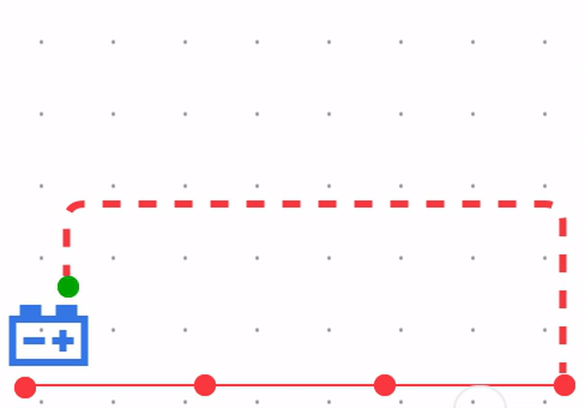

:::danger[Kurzschluss]
Ein Kurzschluss entsteht, wenn der Strom direkt vom Pluspol zum Minuspol der Stromquelle zurückfliessen kann, ohne dass ein Bauteil dazwischen geschaltet ist.
:::
::br
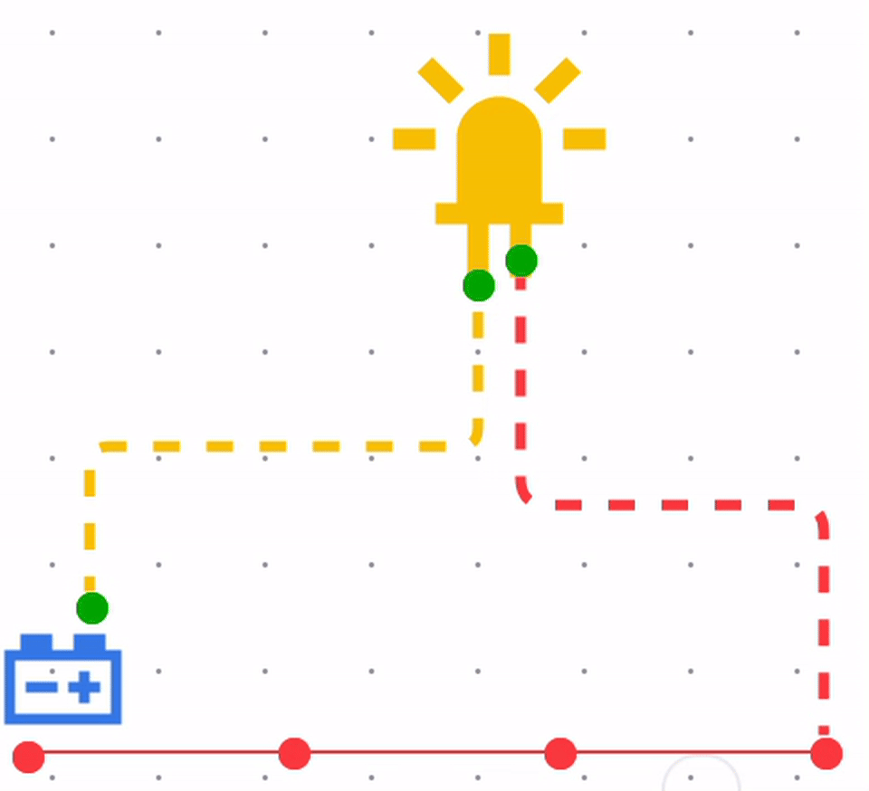
Eine **LED** (Light Emitting Diode) ist ein Bauteil, das Licht aussendet, wenn Strom durch sie fliesst.
::br
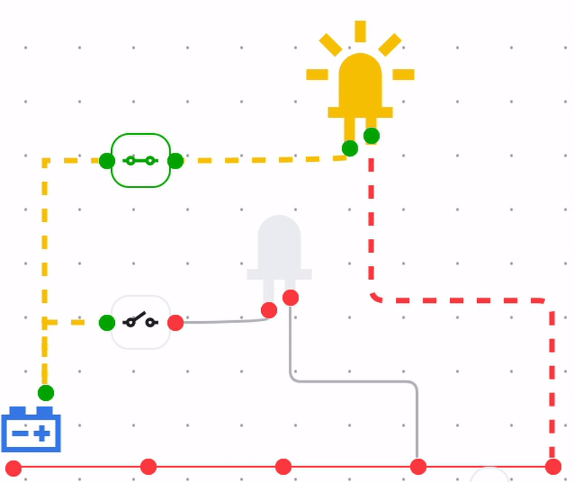
Ein **Schalter** ist ein Bauteil, das den Stromfluss in einem Stromkreis unterbrechen oder zulassen kann.
::::

:::info[Technischer Stromfluss vs. Elektronenfluss]
In der Elektrotechnik wird der Stromfluss traditionell als Fluss von positiven Ladungen vom positiven Pol zum negativen Pol betrachtet (konventioneller Stromfluss). Tatsächlich bewegen sich die Elektronen jedoch vom negativen Pol zum positiven Pol. Für die meisten Anwendungen in der Elektrotechnik und Elektronik ist es jedoch ausreichend, den konventionellen Stromfluss zu verwenden.
:::

In der Informatik wird also immer ausgehend **vom Pluspol** der Stromquelle gedacht, auch wenn dies physikalisch nicht ganz korrekt ist.

## Symbolische Schaltungen

In der Elektrotechnik werden Stromkreise oft mit **symbolischen Schaltplänen** dargestellt. Diese verwenden standardisierte Symbole, um die verschiedenen Bauteile und deren Verbindungen zu repräsentieren.

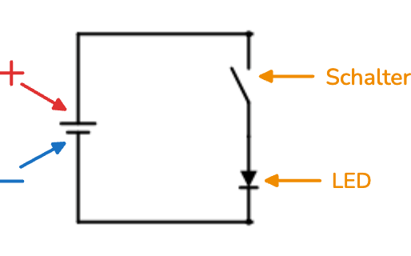

## Erster Schaltkreis

:::::aufgabe[Erster Stromkreis]
Gruppengrösse
: 2 Personen

#### Material
<DefinitionList compact>
  <dt>1x Steckbrett</dt>
  <dd>
    :::cards
    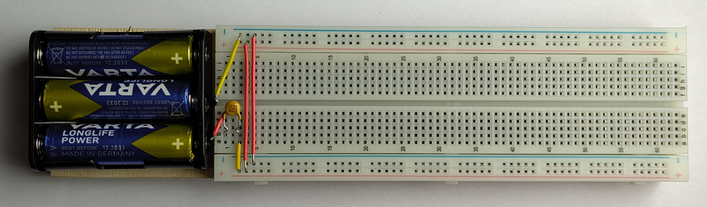
    :::
  </dd>
  <dt>1x Kabelset</dt>
  <dd>
    :::cards
    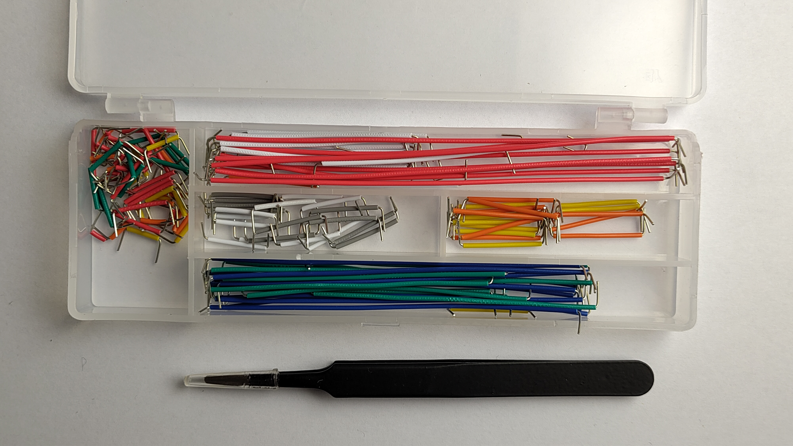
    :::
  </dd>
  <dt>4x LED rot</dt>
  <dd>
    :::cards
    ::br{flexShrink=1}
    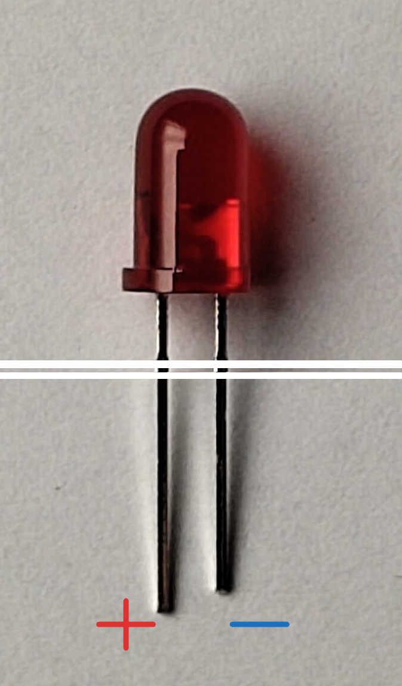
    ::br{flexShrink=1}
    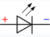
    ::br{flexGrow=2}
    Die Leuchtdiode leuchtet, wenn der lange Anschluss mit dem Pluspol und der kurze Anschluss mit dem Minuspol der Batterie verbunden ist. Wir brauchen sie als Anzeige, ob eine Leitung auf
    - 1 - Diode leuchtet - oder auf
    - 0 - Diode ist dunkel - gesetzt ist
    :::
  </dd>
  <dt>2x Doppelschalter</dt>
  <dd>
    :::cards
    ::br{flexShrink=1}
    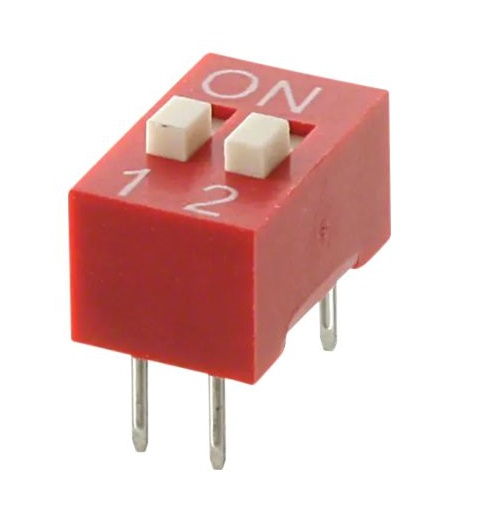
    ::br{flexShrink=1}
    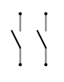
    ::br{flexGrow=2}
    Der Doppelschalter verfügt über zwei unabhängige Schalter. Im Zustand ON sind jeweils die beiden entsprechenden Anschlussdräht miteinander elektrisch verbunden.
    :::
  </dd>
</DefinitionList>

<ProgressState id="2269810c-c6f0-417c-9ed1-5da7b3abe922" confirm>

1. Holen Sie die benötigten Materialien.
2. Betrachten Sie das Steckbrett, lesen Sie die Info-Box aufmerksam durch, bevor Sie zum nächsten Schritt übergehen.
    ::::info[Steckbrett Aufbau]
    :::cards
    ::br{flexShrink=1}
    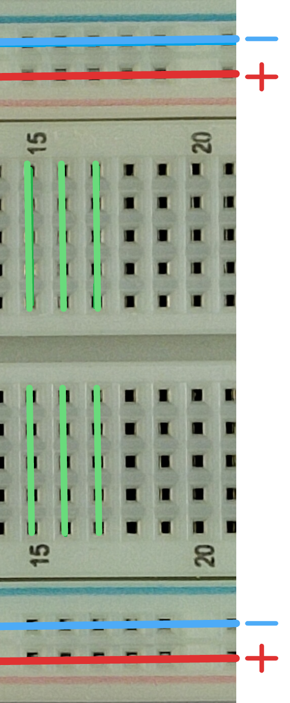
    ::br{flexGrow=2}
    Das Steckbrett (engl. *breadboard*) besteht aus vielen Löchern in welche wir weitere Bauteile einstecken können. Die Löcher sind **im Innern des Steckbretts elektrisch verbunden**. Durch geschickte Anordnung der Bauteile auf dem Steckbrett können wir eine gewünschte Schaltung aufbauen. Die Löcher sind folgendermassen verbunden:
    - Die horizontalen Reihen oben und unten sind für die Stromversorgung (Plus :mdi[battery-positive]{.red} und Minuspol :mdi[battery-negative]{.blue} der Batterie) gedacht.
    - Die vertikalen Spalten :mdi[reorder-vertical]{.green} in der Mitte sind für die Bauteile und Verbindungen gedacht.
    :::
    ::::
3. Bauen Sie auf dem Steckbrett die folgende Schaltung auf:
   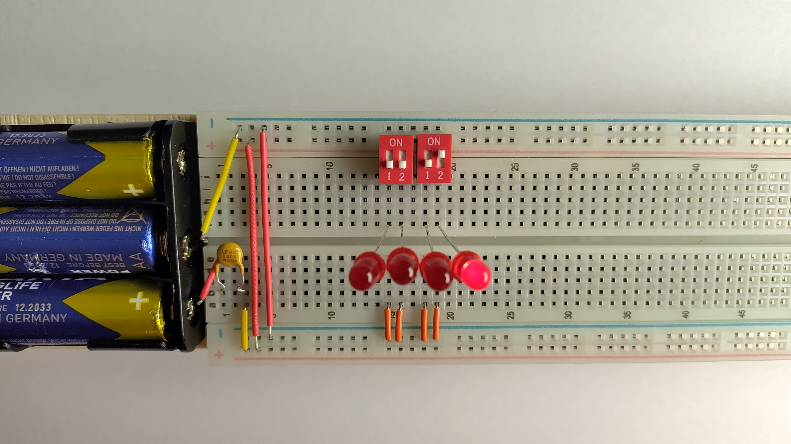
    :::warning[Hinweis]
    Stellen Sie sicher, dass die langen Beine der LEDs mit dem Pluspol der Batterie verbunden sind.
    :::
4. Testen Sie die Schaltung, indem Sie die beiden Schalter in verschiedene Positionen bringen. Beobachten Sie, wie sich das Verhalten der LED ändert.
5. Dokumentation:  
    Stellen Sie die Zahl `10` im Zweiersystem (Hilfestellung unter __Daten und Codes > Zahlensysteme__) dar, machen Sie ein Foto der Schaltung und halten Sie das Ergebnis im Textfeld unten fest.
</ProgressState>

<Answer type="text" id="5c086310-1148-43a8-9080-21b6b1ecc975" />

:::::

## Schaltung
Die Foto, nach welcher Sie die Schaltung aufgebaut haben, enthält viele Details, welche eigentlich unwesentlich sind (z.B. die vielen unbenutzten Löcher). Deshalb hat man Symbole eingeführt, mit welchen man eine **Schaltung auf das Wesentliche beschränkt** aufzeichnen kann. Für obiges Experiment sieht das so aus:

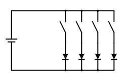

:::insight[Für Elektronikbegeisterte]
Eigentlich dürfen LEDs nicht direkt an eine Batterie angeschlossen werden. Es braucht noch einen Vorwiderstand. Unsere LEDs haben diesen Vorwiderstand schon eingebaut. Um die Sache nicht zu verkomplizieren, wurde er in der Schaltung nicht eingezeichnet.
:::

