import Tabs from '@theme/Tabs';
import TabItem from '@theme/TabItem';
import ProgressState from '@tdev-components/documents/ProgressState';

# Logische Grundoperationen

## Schalter
Es wäre falsch, sich für das Verständnis des Computers nur auf die Betrachtung von Leitungen zu beschränken. Genau so wichtig sind die **Schalter**, welche diese Leitungen ein und auschalten. Erst dadurch kann der Computer selbständig arbeiten und Zahlen miteinander verrechnen.

Die Schalter, welche man zum Bau eines Computers verwendet sind aber nicht gewöhnliche Schalter, welche von Hand betätigt werden. Stattdessen setzt man Schalter ein, welche durch Strom betätigt werden. In der Anfangszeit des Computers waren dies elektromagnetische Schalter, __Relais__ genannt.

::::definition[Relais]
Ein Relais ist ein **Schalter**, welcher durch einen **Elektromagneten** angetrieben wird. Wenn der Elektromagnet mit der Batterie verbunden wird, so fliesst ein **Strom**. Dieser erzeugt ein **Magnetfeld**, welches einen Eisenbügel (Anker) anzieht. Dadurch werden die Kontakte des Schalters bewegt. Je nach Art des Relais schliessen sich die Kontakte oder öffnen sich.

<Tabs>
  <TabItem value="relais-off" label="Elektromagnet: Aus" default>
    :::cards
    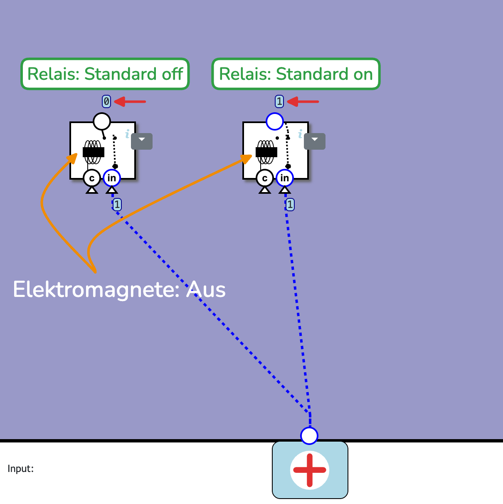
    :::
  </TabItem>
  <TabItem value="relais-on" label="Elektromagnet: Ein">
    :::cards
    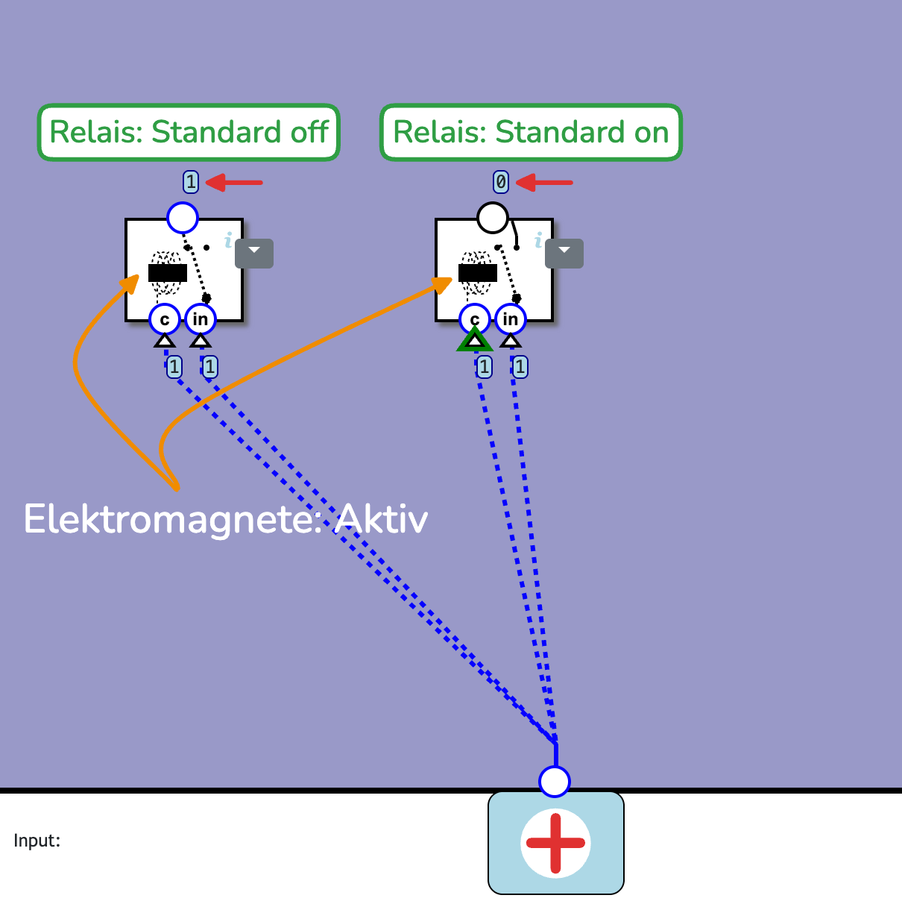
    :::
  </TabItem>
</Tabs>

Sobald das Relais von der Batterie getrennt wird, verschwindet das Magnetfeld und der Anker fällt durch eine Feder in die Ausgangslage zurück.
::::

## Relais-Schalter

Das Relais in unserem Baukasten kann sowohl als *Standard ON* als auch als *Standard OFF* Relais arbeiten - es ist ein sogenanntes **Umschaltrelais** und hat deshalb drei Kontakte.

:::cards
::br{flexShrink=1 flexBasis=120px}
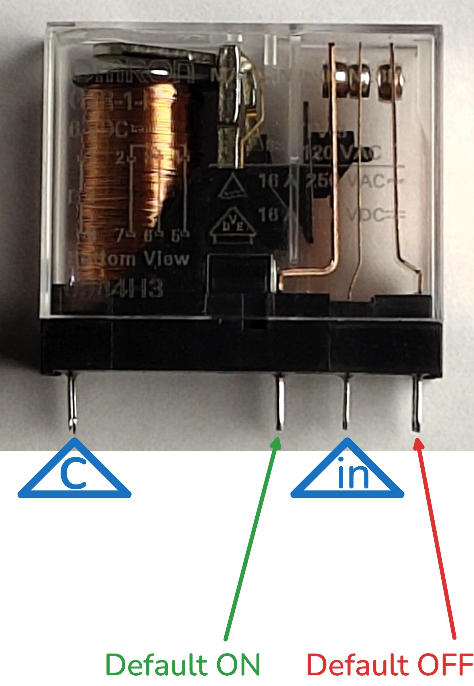
::br{flexShrink=1 flexBasis=60px}
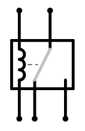
::br{flexGrow=3 flexBasis=300px}

- Links ist der kupferfarbige Elektromagnet zu sehen. Im Symbol ist er als gewellte Linie dargestellt.
- Die beiden Anschlussstifte des Elektromagneten befinden sich ebenfalls links (im Bild ist nur einer zu sehen).
- Auf der rechten Seite sind die Kontakte des Umschalters zu sehen. Der mittlere Kontakt wird durch den Elektromagneten bewegt und berührt entweder
   - den linken Kontakt (Ausgangslage, Elektromagnet nich mit Batterie verbunden) oder
   - den rechten Kontakt (Arbeitslage, Elektromagnet mit Batterie verbunden).

:::

::::aufgabe[1. Eine simple Relais-Schaltung]

LED
: 1x rot
: 1x gelb
: 1x grün
Relais
: 1x Umschaltrelais
Grundausstattung
: Batterie, Steckbrett, Verbindungskabel

<ProgressState id="4c06a5d1-8db3-410e-8038-960a49f0e727" confirm keepPreviousStepsOpen>
1. Holen Sie die benötigten Materialien.
2. Bauen Sie auf dem Steckbrett die folgende Schaltung auf:

   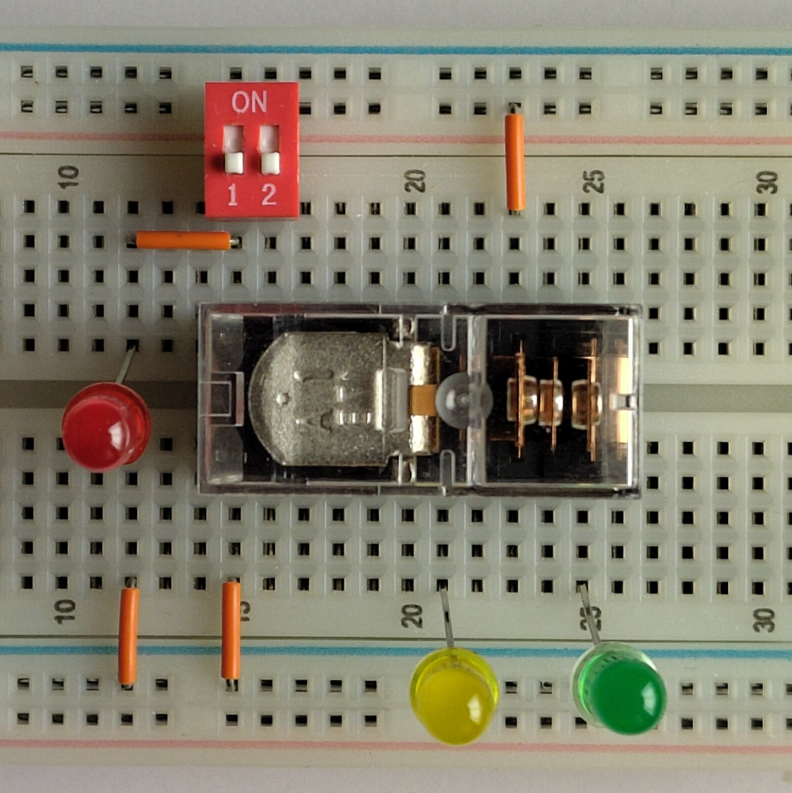

   :::warning[LED-Ausrichtung]
   Beachten Sie wieder, dass die kurzen Anschlüsse der LEDs immer auf der Seite des negativen Batteriepols stecken.
   :::
3. Schalten Sie den Schalter 1 am Doppelschalter ein und aus. So können Sie den Strom durch den Elektromagneten ein- und ausschalten. Beobachten Sie, wie sich die Kontakte im Relais bewegen. Wenn Sie alles richtig gemacht haben brennt die gelbe LED bei ausgeschaltetem Relais und die grüne, wenn das Relais eingeschaltet ist.
4. Vergleichen Sie die symbolische Darstellung der Schaltung - reduziert auf das Wesentliche - mit der realen Schaltung auf dem Steckbrett. Können Sie die einzelnen Bauteile wiedererkennen?

   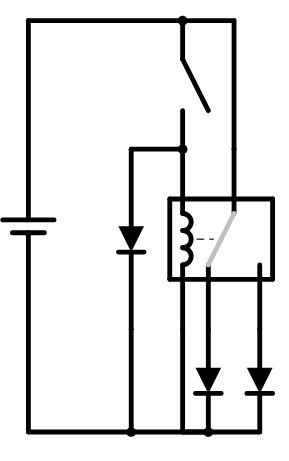
</ProgressState>

<Answer type="text" id="cbe886ed-640f-442f-832b-227d424de01e" placeholder="Notizen..." />
::::

## Logische Grundoperationen

Mithilfe von zwei Relais lässt sich der Grundbaustein für den Bau eines Computers bauen - ein sogenanntes __NAND__-Gatter. Basierend auf diesem Baustein können alle weiteren logischen Operationen realisiert werden.

Doch was ist ein Gatter? Im folgenden Video[^1] sehen Sie eine allgemeine Einführung zu den in der Informatik gängigen Gattern __UND__, __ODER__ und __NICHT__.

:::cards
::video[./images/LogischeGrundoperationen.mp4]{height=300px}
:::

### NAND-Gatter
Ein __NAND__-Gatter (NOT AND) ist ein logisches Gatter mit zwei Eingängen und einem Ausgang. Der Ausgang ist genau dann `0`, wenn beide Eingänge `1` sind. In allen anderen Fällen ist der Ausgang `1`.

| Eingang A | Eingang B | Ausgang E   |
|:---------:|:---------:|:-----------:|
|     0     |     0     |    **1**    |
|     0     |     1     |    **1**    |
|     1     |     0     |    **1**    |
|     1     |     1     |    **0**    |

:::info[Beispiel: Licht in der Garage]
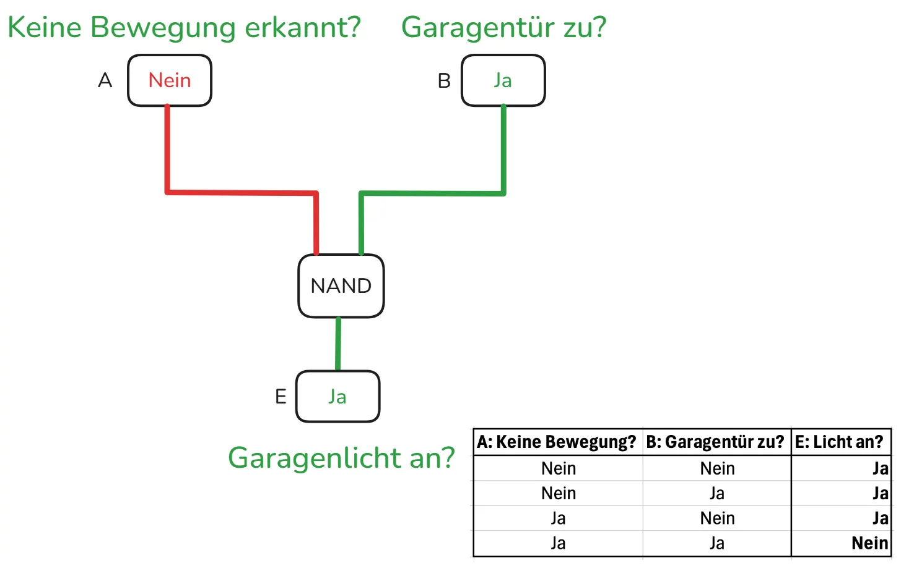
:::

## Simulation NAND-Gatter

Bevor wir das __NAND__-Gatter mit Relais aufbauen, können wir es zuerst in einer Simulation ausprobieren.

::::aufgabe[2. Simulation eines NAND-Gatters]
<Answer type="state" id="8d40d34d-cfae-45b2-b3e7-be61a2e4df41" />

Link
: [nandgame.com](https://nandgame.com/)

Versuchen Sie, das erste Level des Spiels zu lösen und halten Sie dann einen Screenshot des fertigen Gatters im Antwortfeld fest.

<Solution id="c23032a9-eb9e-4134-bb9a-c14b4c274a47" title="Hinweis 1">
Betrachten Sie das __Standard OFF__ Relais:

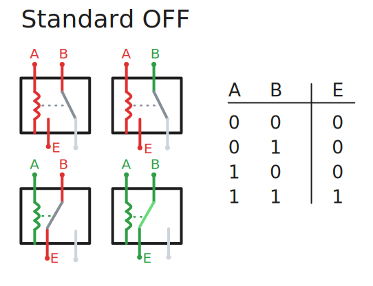

Es liefert nur dann Strom (E = 1), wenn beide Eingänge A und B den Wert 1 haben. Es entspricht also einem __AND__-Gatter.
</Solution>

<Solution id="f2189b68-100c-4786-a757-d0aacd223fb4" title="Hinweis 2">
Um das __AND__-Gatter aus dem Hinweis 1 in ein __NAND__-Gatter umzuwandeln, müssen wir den Ausgang invertieren. Dies erreichen wir durch ein __Standard ON__ Relais:

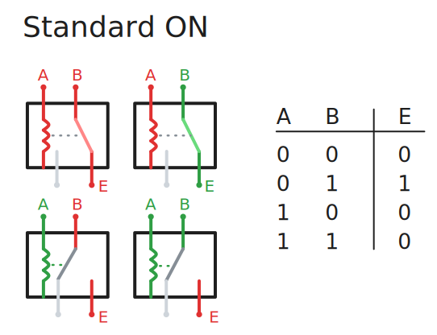

Können Sie nun das komplette __NAND__-Gatter zusammensetzen?
</Solution>
<Solution id="e518177a-5002-41b4-907d-fe14ba21e25b" title="Hinweis 3: Schaltplan">
Der gesamte Schaltplan des __NAND__-Gatters sieht folgendermassen aus:

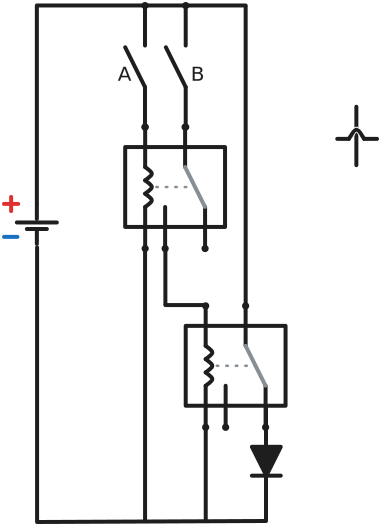
</Solution>
 
<Answer type="text" id="4cd3c70f-23fb-4dfd-a150-c990dedc9754" />

<Solution id="cf288fae-8b73-42e7-99a5-6ae2d617e80a">

</Solution>
::::

## NAND-Gatter mit Relais

::::aufgabe[3. NAND-Gatter mit Relais]
<Answer type="state" id="ecfefc37-d42e-46a9-ac17-cb590d25c34c" />

Versuchen Sie, das NAND-Gatter vom NAND-Spiel real nachzubauen. Dabei...
- sollen mit gelben LEDs die Eingänge A und B dargestellt werden (wenn z.B. Schalter __A__ an ist, soll das gelbe LED leuchten).
- soll der Ausgang des NAND-Gatters soll mit einer grünen LED dargestellt werden (wenn der Ausgang `1` ist, soll die grüne LED leuchten).

<Solution id="0c43dd05-09ee-4fbe-b085-7f6bafdb4df1" title="Hinweis 1: Schaltplan">
Hier ist der Schaltplan des NAND-Gatters:

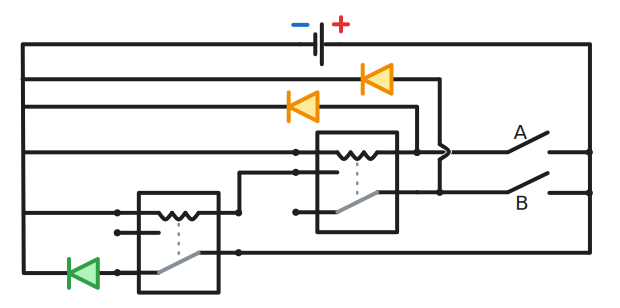

</Solution>

<Answer type="text" id="8b0fc583-103c-4304-a1a8-e1de6462c662" />

<Solution id="f45ca49a-25ab-4e84-92e3-402f83dd0ed9">
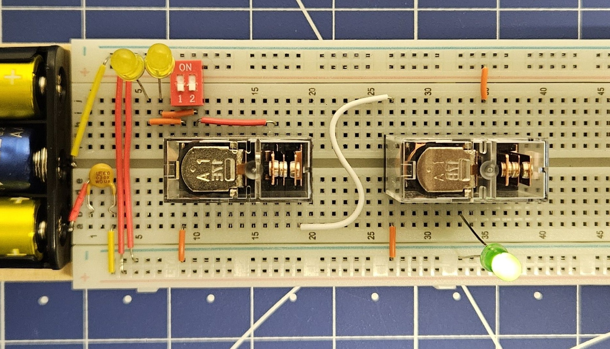
</Solution>

::::

## NOT, AND, OR, XOR

::::aufgabe[4. NOT, AND, OR, XOR mit NAND-Gattern]

Halten Sie jeweils einen Screenshot des fertigen Gatters im Antwortfeld fest.

<ProgressState id="154a2004-7269-4816-b6c5-e5de6a159b98" confirm>
1. Level 1: Bauen Sie ein __NOT__-Gatter mit einem NAND-Gatter.
    <Answer type="text" id="86bf2cf4-4e7e-486e-8b7e-e96f5296cb4b" />
    <Solution id="920c11a0-f105-498a-90a2-4ac29a4ca36e" standalone>
    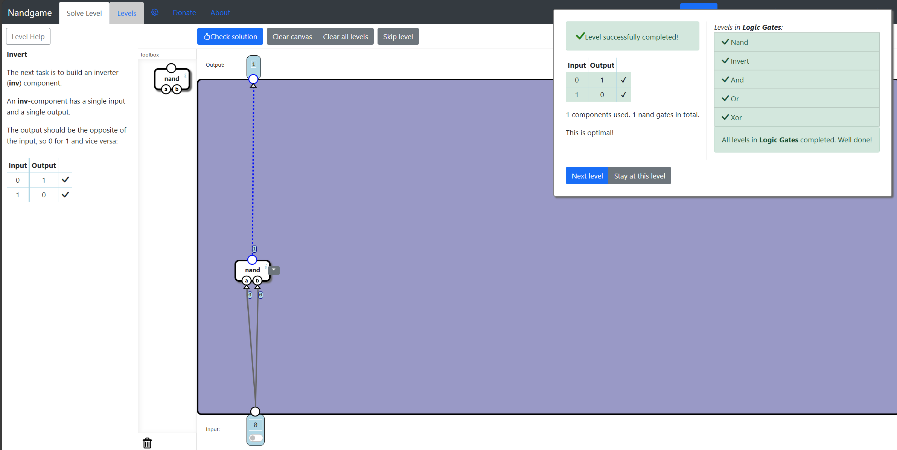
    </Solution>
2. Level 2: Bauen Sie ein __AND__-Gatter.
    <Answer type="text" id="aed11702-dd24-4241-8549-0a64af449a42" />
    <Solution id="a2b8d73d-a32c-4cae-82af-62e84c0961d9" standalone>
    
    </Solution>
3. Level 3: Bauen Sie ein __OR__-Gatter.
    <Answer type="text" id="63fee993-3278-4566-856f-6d5e9ca678bf" />
    <Solution id="9e8d5836-6ff0-49e6-b7d6-311f5f16178b" standalone>
    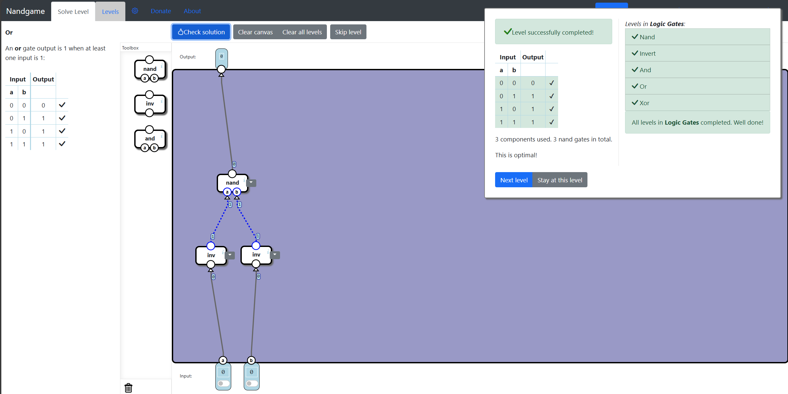
    </Solution>
4. Level 4: Bauen Sie ein __XOR__-Gatter.
    <Answer type="text" id="675979cf-cf5a-4376-bd59-ce16b76a8a16" />
    <Solution id="e6af9ffb-6bd7-40b4-a1f6-e0f5dce63923" standalone>
    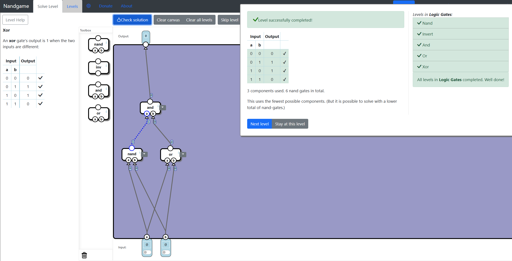
    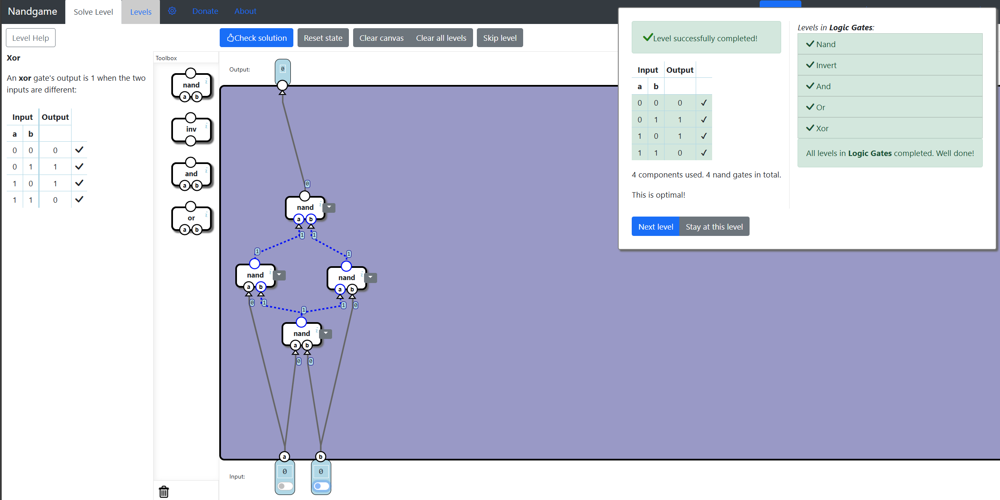
    </Solution>

</ProgressState>
::::

::::aufgabe[⭐ Gatter bauen]
<Answer type="state" id="24139356-1e92-4362-86f9-019ff4552971" />

Bauen Sie wahlweise ein AND, oder etwas komplexer ein OR-Gatter nur mit Relais nach.
- Verwenden Sie für die Eingänge gelbe LEDs und für den Ausgang eine grüne LED.
- Versichern Sie sich, dass es korrekt funktioniert.
- Fügen Sie ein Foto/Screenshot Ihres fertigen Gatters im Antwortfeld ein.

<Answer type="text" id="9b12a92e-fd61-4359-b6d0-3b6372c6f700" />

:::details[⭐ Vereinfachung der Schaltung]
Die Gatter __AND__ und __OR__ können theoretisch mit nur zwei Relais gebaut werden, wenn nicht ein __NAND__ als Grundbaustein verwendet wird, sondern direkt mit __Standard ON__ und __Standard OFF__ Relais gearbeitet wird.
:::
::::

[^1]: Quelle: https://www.youtube.com/@einfachinfo
