import ProgressState from '@tdev-components/documents/ProgressState';
import { noWhitespace } from '@tdev-components/documents/String/sanitizers';

# Binäre Addition

Wie funktioniert ein Computer? Diese Frage, oder zumindest die Unterfrage, wie ein Computer Zahlen addieren kann, möchten wir in der aktuellen Unterrichtseinheit beantworten.

Dazu werden in einem ersten Schritt die Grundlagen der binären Addition und Subtraktion erarbeitet.

:::info[Ziele]
- Verstehen, wie die binäre Addition funktioniert
- Binäre Rechnungen mit Stift und Papier durchführen können
- Verstehen, wie ein Computer mit Strom binäre Addition durchführen kann
:::

## Repetition Zahlensysteme

Zahlen im Zehnersystem sind aus __10__ Ziffern (`0, 1, 2, 3, 4, 5, 6, 7, 8, 9`) zusammengesetzt, Zahlen im Binärsystem aus __2__ Ziffern (`0, 1`). Um "Hundert und Eins", $101$ im Zehnersystem von "Eins Null Eins", $101_2$ im Binärsystem zu unterscheiden, wird bei Binärzahlen der Suffix `2` angehängt.

::::cards
#### Zehnersystem
$$
\begin{aligned}

328 &= 3 \cdot 10^2 + 2 \cdot 10^1 + 8 \cdot 10^0

\end{aligned}
$$
:::warning[Bemerke]
Jede Stelle einer Zahl gibt an, wie oft eine Potenz der Basis **10** vorkommt.  
Im obigen Beispiel also "Dreimal $10^2$, zweimal $10^1$ und achtmal $10^0$".
:::
::br
#### Binärsystem

$$
\begin{aligned}

1011_2 &= 1 \cdot 2^3 + 0 \cdot 2^2 + 1 \cdot 2^1 + 1 \cdot 2^0

\end{aligned}
$$

:::warning[Bemerke]
Jede Stelle einer Zahl gibt an, wie oft eine Potenz der Basis **2** vorkommt.  
Im obigen Beispiel also "Einmal $2^3$, einmal $2^1$ und einmal $2^0$", somit $8 + 2 + 1 = 11_{10}$ im Zehnersystem.
:::
::::

::::aufgabe[1. Bin → Dez, Dez → Bin]
<Answer type="state" id="7edbd4ea-3b6a-442d-b92d-5ddf3ad03194" />

:::flex
Wandeln Sie vom vom Binär- ins Dezimalsystem um.

<Answer type="string" solution="21" sanitizer={noWhitespace} id="35afcc00-6e76-48f0-9f9a-50c75ff427e8">

$10101_2=$

</Answer>

<Answer type="string" solution="39" sanitizer={noWhitespace} id="3546b037-72e5-4adc-8c64-c709ae81cf80">

$100111_2=$

</Answer>

<Answer type="string" solution="368" sanitizer={noWhitespace} id="9a7b2a00-d0d2-4f33-89d4-b5c5a88ab10a">

$101110000_{2}=$

</Answer>
::br
Wandeln Sie vom vom Dezimal- ins Binärsystem um.

<Answer type="string" solution="100100" sanitizer={noWhitespace} id="b01535c5-58ce-4083-97e9-b13aa13ae579">

$36_{10}=$

</Answer>

<Answer type="string" solution="1000011" sanitizer={noWhitespace} id="b49dc4a8-088f-44a3-ab77-0e9bd49b6387">

$67_{10}=$

</Answer>

<Answer type="string" solution="10001110" sanitizer={noWhitespace} id="ef436a14-13f7-4db0-a26d-32393c25f016">

$142_{10}=$

</Answer>
:::
::::

## Binäre Addition

Die binäre Addition funktioniert ähnlich wie die Addition im Zehnersystem. Allerdings wird hier nur mit den Ziffern `0` und `1` gerechnet:

1. Beide Binärzahlen werden rechtsbündig untereinander geschrieben.
2. Es wird von rechts nach links spaltenweise addiert, wobei
    - $0 + 0 = 0$
    - $0 + 1 = 1$
    - $1 + 0 = 1$
    - $1 + 1 = 10_{2}$ (also `0` schreiben und `1` merken)

::::cards
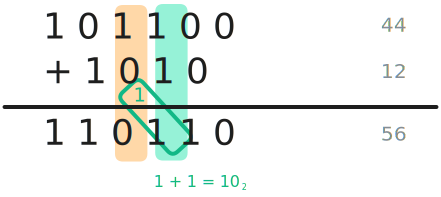

:::insight[Bemerke]
An der 4. Stelle von rechts entsteht ein Übertrag, da $1 + 1 = 10_2$. Die `0` wird in die Ergebnisstelle geschrieben und die `1` wird zur nächsten Stelle addiert.
:::
::br
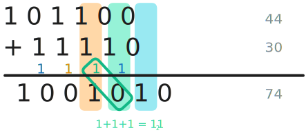
:::insight[Bemerke]
An der 3. Stelle von rechts entsteht ein Übertrag, der auf an der **4. Stelle** dazu führt, dass $1 + 1 + 1 = 11_2$ entsteht. Eine `1` wird in die Ergebnisstelle geschrieben und eine `1` wird zur nächsten Stelle addiert.
::::

:::aufgabe[2. Binäre Addition]
Berechnen Sie die folgenden binären Additionen mit **Stift** und fügen Sie ein Foto/Screenshot Ihres Lösungswegs ein.

<ProgressState id="ebd464e1-58e9-478d-bcf5-6c75e2c3a8fc" confirm keepPreviousStepsOpen labels={['Aufgabe 1', 'Aufgabe 2', 'Aufgabe 3', 'Aufgabe 4']}>
1. $1010101 + 101010$
    <Answer type="string" solution="1111111" sanitizer={noWhitespace} id="f4cc95a7-4075-40b7-bb83-6831c26a4d3e" />
2. $110100 + 10111$
    <Answer type="string" solution="1001011" sanitizer={noWhitespace} id="e1cf441c-0c6f-4f2e-810b-101a99419c96" />
3. $11111 + 1$
    <Answer type="string" solution="100000" sanitizer={noWhitespace} id="12382e5c-0266-42d4-8792-b9af0e10ca78" />
4. $14 + 19$ (zuerst ins Binärsystem umwandeln, dann addieren...)
    <Answer type="string" solution="100001" sanitizer={noWhitespace} id="2e54419c-b315-4f4d-b8ac-e4fcc7e75c92" />
</ProgressState>

<Answer type="text" id="d02ea835-482e-4087-9943-add128858bfe" />
:::

## Addieren mit Strom

Mit dem __NAND__-Gatter haben wir die Grundlage, um eine Schaltung zu bauen, die zwei binäre Zahlen mit mehreren Stellen addieren kann.

Als Ausgangspunkt verwenden wir folgende Rechnung

### Hinterste Stelle addieren - Der Halbaddierer
Wir betrachten zunächst die hinterste Stelle:

:::cards{flexBasis=300px}
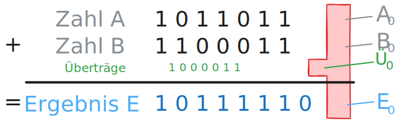
::br
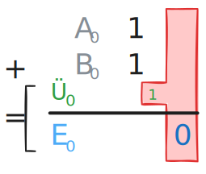
:::

Wir benötigen also eine **Schaltung**, welche aus den beiden Eingängen $A_0$ und $B_0$ das Ergebnis $E_0$ erzeugt und eine andere Schaltung, welche aus den selben Eingängen den Übertrag $a_0$ erzeugt.

Als Wahrheitstabellen ausgedrückt bedeutet dies:

:::cards{flexBasis=250px .slim}
| Eingang A0 | Eingang B0 | Ausgang E0 |
|:---------:|:---------:|:---------:|
|         0 |         0 |         0 |
|         0 |         1 |         1 |
|         1 |         0 |         1 |
|         1 |         1 |         0 |
::br
| Eingang A0 | Eingang B0 | Ausgang Ü0 |
|:---------:|:---------:|:---------:|
|         0 |         0 |         0 |
|         0 |         1 |         0 |
|         1 |         0 |         0 |
|         1 |         1 |         1 |
:::

Beide Wahrheitstabellen haben wir schon angetroffen. Diejenige für das Ergebnis $E_0$ entspricht der __XOR__-Operation, diejenige für den Übertrag $\ddot{U}_0$ entspricht der __UND__-Operation.

Kombiniert man die beiden Operationen richtig, so entsteht ein Halbaddierer für eine Stelle. Im folgenden Video[^1] wird diese Schaltung vorgestellt.

:::cards
::video[./images/Halbaddierer.mp4]{height=300px}
*Hinweis: Im Video wird der Ausgang E mit S für Summe bezeichnet.*
:::

Hier nochmals die Schaltung des Halbaddierers und das Symbol, welches wir in den Simulationen an Stelle der Schaltung verwenden:

:::cards{flexBasis=200px}
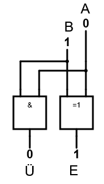
::br
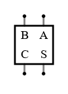
Hinweis:
- **C** steht für englisch Carry und bedeutet Übertrag
- **S** steht für Summe
:::

:::aufgabe[3. Simulation Halbaddierer]
<Answer type="state" id="e29bcb2d-6cd2-4a24-a3ee-a1ee662969f2" />

Link
: [nandgame.com](https://nandgame.com/)

Machen Sie im Nandgame das Level "Half Adder" und halten Sie einen Screenshot des fertigen Halbaddierers im Antwortfeld fest.

<Answer type="text" id="20f2e6ca-cc7f-452d-b2c3-8150b9902190" />

<Solution id="aa450244-3f67-4420-a602-5d37557760c8">
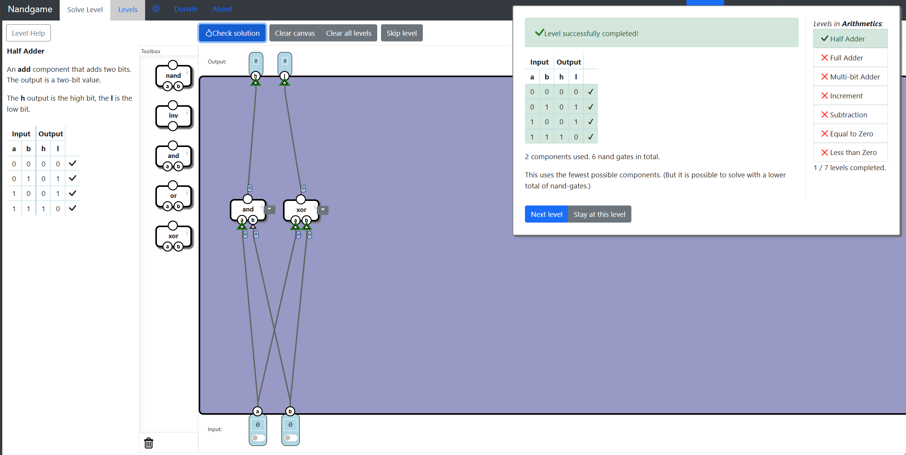
</Solution>
:::
### Weitere Einzelstellen addieren - Der Volladdierer

:::cards{flexBasis=300px}
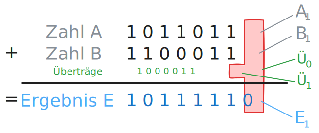
::br
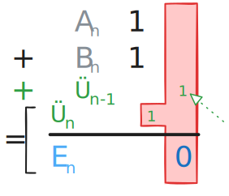
:::

Wir brauchen also eine **Schaltung**, welche 3 Eingänge hat: $A_n$, $B_n$, $\ddot{U}_{n-1}$.    
$\ddot{U}_{n-1}$ entspricht dem Übertrag aus der Stelle rechts von Stelle $n$.

Eine solche Schaltung heisst **Volladdierer** und wird im folgenden Video[^1] vorgestellt.

:::cards
::video[./images/Volladdierer.mp4]{height=300px}
:::

Hier nochmals die Schaltung des Volladdierers und das Symbol, welches wir in den Simulationen an Stelle der Schaltung verwenden:
 
:::cards{flexBasis=250px}
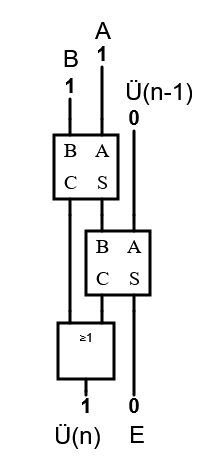
::br
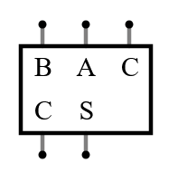
Hinweis:
- **C** steht für englisch Carry und bedeutet Übertrag
- **S** steht für Summe
:::

:::aufgabe[4. Volladdierer]
<Answer type="state" id="90172fa0-4e54-4b57-ba17-c9c02fccafd3" />

Link
: [nandgame.com](https://nandgame.com/)

Machen Sie im Nandgame das Level "Full Adder" und halten Sie einen Screenshot des fertigen Volladdierers im Antwortfeld fest.

<Answer type="text" id="9d5a4cf2-5296-43fa-95e0-80d8ecbff7db" />
<Solution id="36e4ea79-28eb-4021-9478-4f6c2c9af9c1">
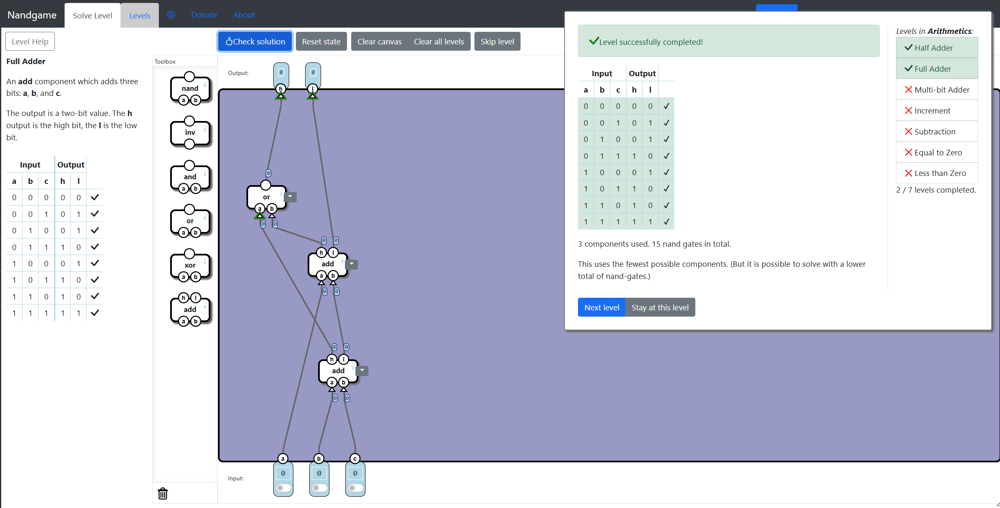
</Solution>
:::

[^1]: Quelle: https://www.youtube.com/@einfachinfo