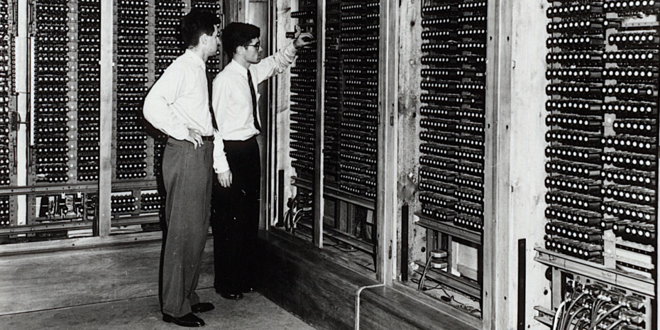
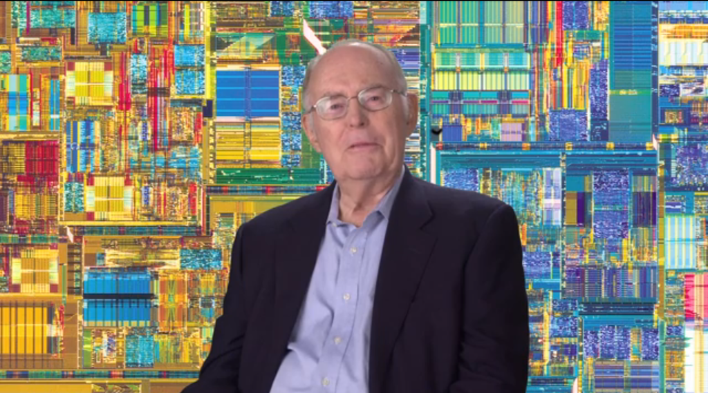

import ProgressState from '@tdev-components/documents/ProgressState';

# Miniaturisierung

Der Z4 von Konrad Zuse war der erste kommerziell verwendete Computer. Er füllte einen ganzen Raum aus und war mit ca. **2500 Relais** aufgebaut.

Unter http://www.horst-zuse.homepage.t-online.de/z4.html finden Sie weitere technische Daten zu dieser Maschine.

Wie kommt es, dass wir heute Computer haben, welche um Grössenordnungen **leistungsfähiger**, aber auch um Grössenordnungen **kleiner** sind, so dass wir diese in der Hosentasche mit herumtragen können?

Die Antwort liegt in der **Miniaturisierung** der Bauteile von Computern.

:::aufgabe[Leseauftrag]
<Answer type="state" id="aa92b995-bdaa-40ed-b19a-c5ee1866cb7d" />

Lesen Sie das nachfolgend verlinkte Dokument und halten Sie 3 aus Ihrer Sicht spannende Fakten fest. Markieren Sie dann die Aufgabe als erledigt.

Dokument
: [Miniaturisierung von Computern](https://erzbe-my.sharepoint.com/:w:/g/personal/balthasar_hofer_gbsl_ch/IQCwx-pufXyZSa7ELMtFgFPFAYGnIm9cwWUbQ1SWds6mO5Y?e=p73B15)[^1]
: (die Links im Dokument können Sie öffnen, wenn Sie gerne mehr wissen möchten)
Auftrag
: Dokument lesen
: 3 spannende Fakten notieren.

<Answer type="text" id="5543e74e-90f4-46cd-b9d3-722078b585a7" />
:::

## Handyprozessor

Heutige Prozessoren enthalten um Grössenordnungen mehr Transistoren, als der erste Prozessor von 1971. Doch wieviele sind es denn?

::::aufgabe[Mein Handyprozessor]
<Answer type="state" id="1784b2da-cf55-4bb5-b9af-bcb1e301ba3b" />

Finden Sie heraus, welcher Prozessor in Ihrem Handy steckt.

:::info[Anleitung]
<Tabs>
<TabItem label="iPhone" value="iPhone">

1. Stellen Sie zuerste den Typ Ihres iPhones fest. Diesen finden Sie entweder auf der Rückseite Ihres Handys oder in den Einstellungen (auf Ihren Namen klicken, dann zu "Dieses Gerät" scrollen).
2. Gehen Sie auf die Seite https://en.wikipedia.org/wiki/Apple_silicon und suchen Sie Ihren iPhone-Typ - beim entsprechenden Prozessor in der Tablle finden Sie die Transistoren-Zahl oder zumindest den SoC (System on Chip, das ist der Prozessor), welcher für die Recherche benutzen können.

</TabItem>
<TabItem label="Android" value="Android">

1. Gehen Sie in die Einstellungen Ihres Handys auf "Über das Telefon". Dort finden Sie den Gerätenamen Ihres Handys.
2. Suchen Sie mit dieser Information im Web nach dem Prozessortyp Ihres Handys

</TabItem>
</Tabs>
:::

- Suchen Sie nun im Web nach dem **Transistor Count** :mdi[search-web] für den Prozessor Ihres Handys.
- Geben Sie die genaue **Bezeichnung** des Prozessors und die **Anzahl seiner Transistoren** als Antworttext für diese Aufgabe ein.

<Answer type="text" id="7f277641-736e-4757-a87d-1cbd4bc84d9e" />
::::

## Prozessoren
Nachfolgend finden Sie eine Zusammenstellung von Prozessoren aus den **letzten 50 Jahren** mit ihrer Bezeichnung, dem Erscheinungsjahr und dem **Transistor Count** (Anzahl enthaltene Transistoren).

:::cards{.slim-table}
| Prozessortyp                   | Jahr | Transistor Count    |
|---------------------------------|------|--------------------:|
| Intel 4004                     | 1971 | 2250              |
| Motorola 6800                  | 1974 | 4100              |
| Intel 8086                     | 1978 | 29000             |
| Intel 80286                    | 1982 | 134000            |
| Motorola 68020                 | 1984 | 190000            |
| Intel 80486                    | 1989 | 1180000          |
| Intel Pentium                  | 1993 | 3100000          |
| Intel Pentium II Klamath       | 1997 | 7500000          |
| Intel Pentium III Coppermine   | 2000 | 21000000         |
| Intel Core 2 Duo Conroe        | 2006 | 291000000        |
| Intel Core i7 Quad Core        | 2008 | 731000000        |
| Intel Core i7 Quad Core Ivy Bridge | 2012 | 1400000000  |
| Intel Core i7 10 Core          | 2016 | 3200000000      |
| Apple M1                       | 2020 | 16000000000     |
| Apple M2 Ultra                 | 2023 | 134000000000    |

:::aufgabe[Transistorenentwicklung]

<ProgressState id="870855ba-56e0-4b57-bd4f-392ab0ca3294" confirm>
1. Öffnen Sie ein neues Dokument in Excel.
2. Übernehmen Sie die Daten aus obiger Tabelle in Ihr Excel-Dokument.
3. Markieren Sie die Spalten mit dem Jahr und dem Transistor Count und fügen Sie ein Punktdiagramm(XY) ein (__Einfügen > empfohlene Diagramme__).
4. Setzen Sie für die vertikale Achse einen logarithmischen Maßstab (Rechtsklick auf __Achsenbeschriftung > Achse formatieren > Logarithmische Skalierung__).
5. Machen Sie einen Screenshot von Ihrem Diagramm und laden Sie diesen als Antwort hier hoch.
</ProgressState>

<Answer type="text" id="bde1915e-1be3-4f51-aaef-6907e8bc99a5" />

:::

## Das Moorsche Gesetz

1965 hat Gordon Moore eine Beobachtung über die Entwicklung der Anzahl Transitoren in integrierten Schaltungen gemacht, welche unter dem Namen "Moore's Law" in die Geschichte einging.

Die folgende Wikipedia-Seite enthält einige interessante Fakten zum Moorschen Gesetz https://de.wikipedia.org/wiki/Mooresches_Gesetz

:::aufgabe[Moore's Law]
<Answer type="state" id="fe4a319f-da61-41b4-8e28-e8106e10f9fb" />

Versuchen Sie mit Hilfe dieser [Wiki-Seite](https://de.wikipedia.org/wiki/Mooresches_Gesetz) folgende Fragen zu beantworten (Sie müssen nur die jeweils referenzierten Abschnitte des Artikels anschauen):

1. Welche Vorhersage hat Moore über die Entwicklung der Anzahl Transistoren in integrierten Schaltungen gemacht (siehe Einleitung der Wikipediaseite)?
    <Answer type="text" id="69d4c837-db75-49b7-bd7f-c5028a67f6d5" />
2. Welcher mathemathischen Funktion entspricht die Zahl der Transistoren in integrierten Schaltungen in Abhängigkeit von der Zeit (siehe Schreibweise)?
    <Answer type="text" id="82565446-3b48-4db5-995e-b97eefd5c2e1" />
3. Decken sich Ihre Beobachtungen aus Aufgabe 3 mit der Vorhersage von Moore? Woran können Sie das erkennen (vergleichen Sie die Grafik auf der Wikipediaseite oben mit Ihrem eigenen Diagramm)?
    <Answer type="text" id="b4562555-7d66-467b-b128-4b8b96041e08" />
4. Hat sich Vorhersage von Moore bis heute bewahrheitet und geht die Entwicklung immer so weiter (siehe Grenzen)?
    <Answer type="text" id="eb524919-dfaf-4265-98fa-3258a6b80926" />

<Solution id="eb4394f1-bce0-47cd-a9aa-000a45288951">

1. Die mögliche Anzahl der Transistoren in einer integrierten Schaltung kann ca. alle 2 Jahre verdoppelt werden.
2. Der Exponentialfunktion.
3. Ja. Wenn man eine Exponentialfunktion in einem Diagramm mit logarithmisch skalierter Y-Achse aufzeichnet, so entsteht eine Gerade.   
Logarithmische Skalierung: Auf der Achse wird nicht die Grösse selber, sondern deren Logarithmus aufgetragen (erkennbar an den angeschriebenen Skalenwerten 1, 10, 100, 1000, ....)
4. Bis jetzt ja, wobei die Chip-Hersteller Ihre Entwicklungspläne nach dem Moorschen Gesetz ausrichteten und so eine Art selbstbewahrheitende Prophezeiung geschaffen haben. Die Entwicklung stösst an Grenzen. Mittlerweile sind die Transistoren in integrierten Schaltungen so klein, wie ein paar Dutzend Atome. wenn man die Transistoren noch kleiner macht, so treten physikalische Effekte auf, welche das Funktionieren der Transistoren verunmöglichen.
</Solution>

:::

[^1]: Author: sdg