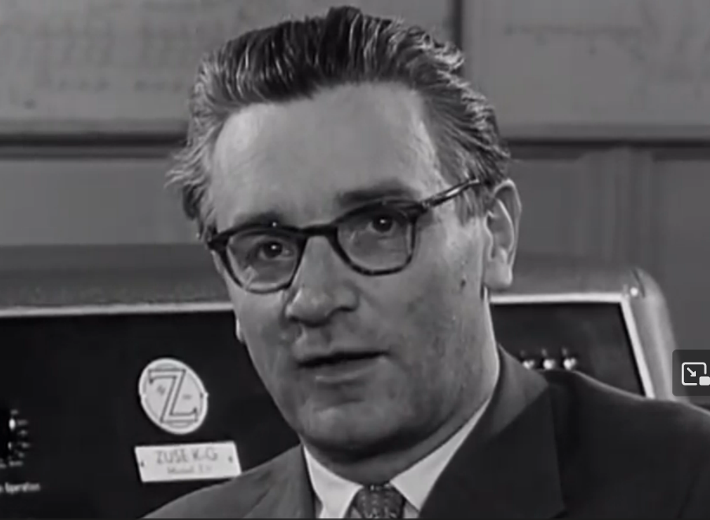

# Rechnen mit Strom

## Einleitung
**Konrad Zuse** hat in den 1940er-Jahren den ersten Computer gebaut, welcher im Zweiersystem rechnet. Im folgende Video[^1] sehen Sie Zuse in einem Film von 1958, wie er seine damaligen Computer vorstellt.

:::cards{flexBasis="200px"}

::br
::video[./images/KonradZuse1958.mp4] 
:::

## Darstellung von 0 und 1 im Computer
Wenn wir Menschen im Zweiersystem rechnen, dann verwenden wir die beiden Ziffern `0` und `1`. Damit können wir beliebig grosse Zahlen aufschreiben und schriftlich rechnen, vorausgesetzt wir haben genügend Papier und Tinte. Natürlich brauchen wir auch unser Hirn und unseren Körper, um aktiv werden zu können.

Im Computer ist die Situation anders: Er arbeitet mit Strom. Sein "Papier" sind die **elektrischen Leitungen** in seinem Inneren. Ausserdem braucht er eine **Stromquelle**, z.B. eine Batterie. Der Strom (eigentlich die damit verbundenen elektrischen Ladungen) ist dann seine "Tinte". Damit der Computer aktiv werden kann braucht es schliesslich noch eine grosse Menge Schalter, welche sein "Gehirn" bilden.

Wir definieren nun folgendes:
- Ist eine Leitung mit dem **positiven** Pol der Stromquelle verbunden, so sagt man dass diese Leitung auf `1` gesetzt ist.
- Ist eine Leitung mit dem **negativen** Pol der Stromquelle verbunden, so sagt man dass diese Leitung auf `0` gesetzt ist.

Eine einzelne Leitung kann also zu einem bestimmten Zeitpunkt **genau eine binäre Ziffer** darstellen. Man spricht bei einer solchen Ziffer von einem **Bit** (englisch **bi**nary digi**t**). Das heisst aber auch, dass für die Darstellung einer binären Zahl mit mehreren Ziffern für jede Ziffer eine **separate** Leitung benötigt wird.

[^1]: Quelle: https://www.youtube.com/watch?v=n8Yo-wD-QTo
