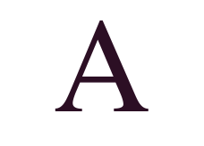
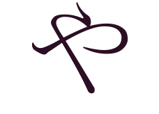
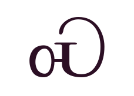
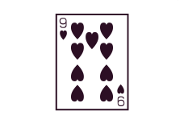

---
sidebar_custom_props:
  source:
    name: rothe.io
    ref: 'https://rothe.io/?page=code/3-text/4-unicode/'
page_id: 232f61ab-5118-4fee-b91c-1176922bfed8
---

# 4. Unicode

[Unicode](https://de.wikipedia.org/wiki/Unicode) ist ein internationaler Standard für Schriftzeichen und Symbole. Das Unicode-Konsortium erstellt einen Katalog von allen sinnvollen Schriftzeichen, welcher ständig erweitert wird. In der Version 40.0, welche im [Oktober 2021](https://home.unicode.org/unicode-cldr-v40-now-available-2/) veröffentlicht wurde, umfasst Unicode ca. $140'000$ Zeichen.

Hier sind ein paar Zeichen aufgeführt, um zu illustrieren wie umfangreich Unicode ist:

:::cards{cols=4 min=150px}

[Lateinischer Grossbuchstaben A, $65$ oder `U+0041`](https://unicode-table.com/de/0041/)
::br

[Hiragana-Buchstabe Ya, $12420$ oder `U+3084`](https://unicode-table.com/de/3084/)
::br

[Cherokee-Buchstabe S, $5069$ oder `U+13CD`](https://unicode-table.com/de/13CD/)
::br

[Spielkarte Neun der Herzen, $127161$ oder `U+1F0B9`](https://unicode-table.com/de/1F0B9/)
::br

[Entsetztes Gesicht mit explodierendem Kopf, $129327$ oder `U+1F92F`](https://unicode-table.com/de/1F92F/)
::br

[Affe, $128018$ oder `U+1F412`](https://unicode-table.com/de/1F412/)
::br

&#68037;

Zahl 6 in der [ägyptisch-demotischen](https://de.wikipedia.org/wiki/Demotische_Schrift) Schrift, [$68037$ oder `U+109C5`](https://unicode-table.com/de/109C5/)
::br

&#68038;

Zahl 7 in der [ägyptisch-demotischen](https://de.wikipedia.org/wiki/Demotische_Schrift) Schrift, [$68038$ oder `U+109C6`](https://unicode-table.com/de/109C6/)
:::

Quelle: [UT - Unicode Table](https://unicode-table.com/de/)

Jedes Unicode-Zeichen hat eine eindeutige Unicode-Nummer, welche häufig als hexadezimale Zahl geschrieben wird, aber natürlich auch dezimal oder binär dargestellt werden kann.

:::tip[Hexadezimal Zahlen]
Anstatt Zahlen im Dezimalsystem oder Binärsystem zu schreiben, kann auch das Hexadezimalsystem mit __16 eindeutigen Zeichen__ verwendet werden. Dabei werden die zehn Zahlenziffern mit den ersten 6 Buchstaben des Alphabets ergänzt:

|         |        |        |        |        |        |        |        |        |        |        |        |        |        |        |        |        |
| :------ | -----: | -----: | -----: | -----: | -----: | -----: | -----: | -----: | -----: | -----: | -----: | -----: | -----: | -----: | -----: | -----: |
| $Hex_{16}$ |    `0` |    `1` |    `2` |    `3` |    `4` |    `5` |    `6` |    `7` |    `8` |    `9` |    `A` |    `B` |    `C` |    `D` |    `E` |    `F` |
| $Dez_{10}$ |    `0` |    `1` |    `2` |    `3` |    `4` |    `5` |    `6` |    `7` |    `8` |    `9` |   `10` |   `11` |   `12` |   `13` |   `14` |   `15` |
| $Bin_{2}$ | `0000` | `0001` | `0010` | `0011` | `0100` | `0101` | `0110` | `0111` | `1000` | `1001` | `1010` | `1011` | `1100` | `1101` | `1110` | `1111` |

Jede Stelle in einer Hexadezimal-Zahl entspricht hier einer 16er Potenz. Das Unicode-Zeichen __A__ mit `U+0041`__ hat zum Beispiel die Hexadezimalzahl $41_{10}$, welche im Dezimalsystem der Zahl `65` entspricht: 

$$
\begin{aligned}

41_{16} &= 4 \cdot 16^1 + 1 \cdot 16^0 \\
    &= 4 \cdot 16 + 1 \cdot 1 \\
    &= 64 + 1 \\
    &= 65_{10}

\end{aligned}
$$

Oder das demotische Zeichen für die Zahl 6 mit `U+109C5` hat die Hexadezimalzahl $109C5_{16}$, welche im Dezimalsystem der Zahl `68037` entspricht:

$$
\begin{aligned}

109C5_{16} &= 1 \cdot 16^4 + 0 \cdot 16^3 + 9 \cdot 16^2 + C \cdot 16^1 + 5 \cdot 16^0 \\
    &= 1 \cdot 65536 + 0 \cdot 4096 + 9 \cdot 256 + 12 \cdot 16 + 5 \cdot 1 \\
    &= 65536 + 0 + 2304 + 192 + 5 \\
    &= 68037_{10}

\end{aligned}
$$

:::

### Anwendungsbereich Hexadezimalzahlen

Das praktische bei Hexadezimalzahlen: `4 bits` können mit nur **einer** Stelle im Hexadezimalsystem dargestellt werden. So entspricht die Binärzahl $1101_{2}$ der Hexadezimalzahl $D_{16}$:

$$
1101_{2} = 13_{10} = D_{16}
$$

In der Informatik ist die Einheit `Byte` (8 bits) sehr gebräuchlich (so hat Ihr Smartphone eine Speichergrösse von bspw. 256 Giga**byte**).

Ein Byte kann mit nur **zwei** Stellen im Hexadezimalsystem dargestellt werden. So entspricht die Binärzahl $1111 1001_{2}$ der Hexadezimalzahl $F9_{16}$:

$$
1111 1001_{2} = 249_{10} = 15 \cdot16^1 + 9\cdot 16^0 = F9_{16}
$$

:::tip[Umwandlung von Hexadezimalzahlen in Binärzahlen]
Um eine Hexadezimalzahl in eine Binärzahl umzuwandeln, kann jede Hexadezimalziffer durch ihre 4-Bit-Binärdarstellung ersetzen. Zum Beispiel:

$$
\begin{aligned}
1A3_{16} &= 1 \cdot 16^2 + A \cdot 16^1 + 3 \cdot 16^0 \\
    &= 1 \cdot 256 + 10 \cdot 16 + 3 \cdot 1 \\
    &= 
    \underbrace{0001}_{1} \;
    \underbrace{1010}_{A} \;
    \underbrace{0011}_{3}
    {}_{2}
\end{aligned}
$$
:::

:::tip[Umwandlung von Binärzahlen in Hexadezimalzahlen]
Um eine Binärzahl in eine Hexadezimalzahl umzuwandeln, kann dieBinärzahl in 4-Bit-Gruppen aufgeteilt und jede Gruppe durch die entsprechende Hexadezimalziffer ersetzt werden. Zum Beispiel die Binärzahl $1\;1001\;0110\;1110_{2}$ in die Hexadezimalzahl $D96E_{16}$:
$$
\begin{aligned}
1\;1001\;0110\;1110_{2} &=
\underbrace{0001}_{1} \;
\underbrace{1001}_{9} \;
\underbrace{0110}_{6} \;
\underbrace{1110}_{E}
{}_{2} \\
&= 1 \cdot 16^3 + 9 \cdot 16^2 + 6 \cdot 16^1 + E \cdot 16^0 \\
&= 1 \cdot 4096 + 9 \cdot 256 + 6 \cdot 16 + 14 \cdot 1 \\
&= D96E_{16}
\end{aligned}
$$
:::
