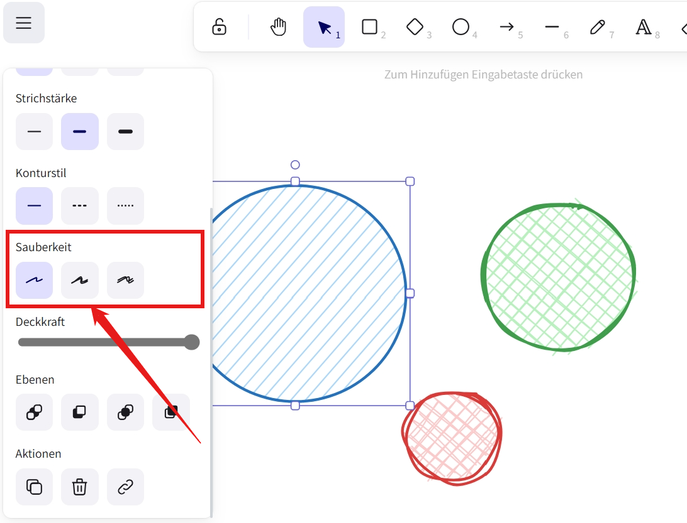
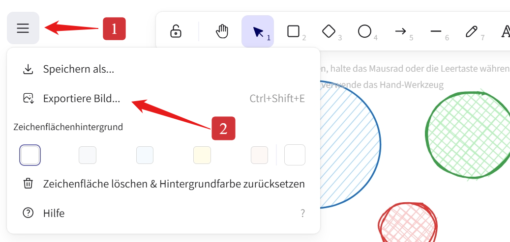
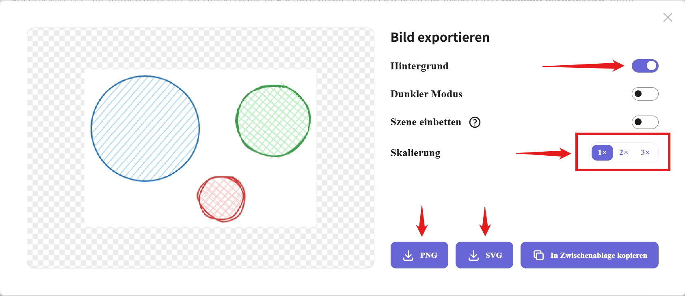

import ExcalidocWithCodeEditor from '@tdev-components/documents/Excalidoc/WithCodeEditor';
import SvgEditor from '@tdev-components/documents/CodeEditor/SvgEditor';
import RGB from "@tdev-components/VisualizationTools/ColorEncoding/RGB";

# Vektorgrafiken
:::tip[Rückblick: Rastergrafiken]
Bei Rastergrafiken ist ein Bild bei genügend Vergrösserung eine Art «Mosaik» - zusammengesetzt aus einzelnen Bildpunkten.
:::

Einen anderen Ansatz wird bei **Vektorgrafiken** angewandt: Hierbei werden Bilder aus geomtrischen Elementen, wie Linien, Kreisen, Rechtecken, etc. zusammenzusetzen. Im Unterschied zu Rastergrafiken lassen sich Vektorgrafiken damit **beliebig vergrössern**, ohne dass es zu einem Qualitätsverlust kommt. Das heisst, Vektorgrafiken wirken nie «verpixelt».

Der Aufbau von Vektorgrafiken aus einzelnen geometrischen Elementen bringt mit sich, dass solche Grafiken vor allem für Diagramme, Logos, digitale Zeichnungen etc. eingesetzt werden.

:::info[Fotos]
Fotos erfassen eine Momentaufnahme, indem sie die Lichtstrahlen, die von den Objekten reflektiert werden, festhalten (durch einen Sensor oder einen lichtempfindlichen Fotofilm). Diese Lichtstrahlen sind nicht geometrisch und können nicht in geometrische Elemente zerlegt werden. Daher sind Fotos stets Rastergrafiken.
:::

## Scalable Vector Graphics (SVG)
Das wohl weitverbreiteteste Format für Vektorgrafiken ist **SVG** (Scalable Vector Graphics). **SVG** ist eine sogenannte _Auszeichnungssprache_ (also eine formale Sprache), mit der mit man die geometrischen Objekte in einer Vektorgrafik beschreiben kann.

### Der Aufgbau einer SVG
::::aufgabe[Vektorgrafik ausprobieren]
<Answer type="state" id="a35c7380-effa-401b-a1f3-ae2f6808ee45" />

<SvgEditor id="705199e1-1d40-4d6d-931f-9b59381e7635" title='Flagge.svg'>
    ```svg
    <svg width="400" height="600" xmlns="http://www.w3.org/2000/svg">
        <rect x="50" y="50" width="100" height="200" fill="blue"/>
        <rect x="150" y="50" width="100" height="200" fill="yellow"/>
        <rect x="250" y="50" width="100" height="200" fill="red"/>
    </svg>
    ```
</SvgEditor>

1. Setzen Sie in der **ersten Zeile** die Werte für `width` auf `300` und für `height` auf `150`. Was verändert sich?
    <Answer type="text" id="a1f615aa-41a2-43af-bf24-d3757dd74aef" />
2. Verkleinern Sie der Reihe nach die Werte für `x`, `y`, `width` und `height` in der **zweiten und dritten und vierten Zeile**. Beobachten Sie jeweils, wie sich das Bild verändert.
    - Versuchen Sie die Werte so anzupassen, dass die Flagge wieder korrekt dargestellt wird, aber die gesamte Bildfläche (schwarz gestrichelt eingerahmt) ausfüllt.
    - Wozu dienen `x`, `y`, `width` und `height`?
    <Answer type="text" id="e0b8be60-b958-4647-965f-0c2a72fd50a8" />
3. Verändern Sie jetzt den Wert für `fill` in der **vierten Zeile** durch eine andere Farbe oder auch durch einen RGB-Farbwert. Was passiert?
    :::details[RGB-Farben]
    <RGB />
    :::
4. Wozu dient der `rect`-Befehl in einer SVG Grafik?
    <Answer type="text" id="fe91670d-ac76-4aa7-a429-4c829394ebc6" />

<Solution id="ab443472-4bdb-4fca-9964-018d8bacaccb">
1. Die Werte `width` und `height` auf der ersten Zeile gehören zum SVG-Element und bestimmen somit die Breite und Höhe der gesamten SVG Grafik. Wenn wir die Breite von `400` auf `320` und die Höhe von `600` auf `150` ändern, wird die Grafik also kleiner.
2. Die Werte `x`, `y`, `width` und `height` auf der zweiten und dritten Zeile gehören zu zwei `rect`-Elementen und bestimmen deren Position und Grösse der. `x` und `y` geben die Position des __oberen linken Ecks__ des Elements an, `width` und `height` die Breite und Höhe.
3. Der Wert `fill` bestimmt die Füllfarbe des Rechtecks. Wenn wir den Wert von `red` z.B. auf `green` ändern, wird das Rechteck grün.
4. Der `rect`-Befehl dient dazu, ein Rechteck in der SVG Grafik zu zeichnen. Es gibt noch viele weitere Befehle, um Linien, Kreise, Texte, etc. zu zeichnen.
</Solution>
::::

### Weitere Formen
::::aufgabe[Weitere Formen in Vektorgrafiken]
<Answer type="state" id="9431ef84-ca1b-4f8f-9e71-d3dfdc286682" />
In dieser Aufgabe lernen Sie einige weitere Befehle SVG kennen, die Sie in SVG Grafiken verwenden können. In der nächsten Aufgabe werden Sie damit anschliessend eine eigene Vektorgrafik entwerfen.

<SvgEditor id="6f13d6f2-e48b-4ddc-9366-ff0da559393d" title='Japan.svg'>
    ```svg
    <svg width="400" height="300" xmlns="http://www.w3.org/2000/svg">
        <rect
            x="50" y="50"
            width="300" height="200"
            stroke="black" stroke-width="5"
            fill="white" />
        <circle
            cx="200" cy="150" r="60"
            fill="red" />
    </svg>
    ```
</SvgEditor>

<SvgEditor id="0d8ab768-d77a-4070-b8a2-7a6d657362ea" title='Dänemark.svg'>
```svg
<svg width="400" height="300" xmlns="http://www.w3.org/2000/svg">
    <rect
        x="50" y="50"
        width="300" height="200"
        fill="red"/>
    <line
        x1="50" y1="150" x2="350" y2="150"
        stroke="white" stroke-width="30"/>
    <line
        x1="150" y1="50" x2="150" y2="250"
        stroke="white" stroke-width="30"/> 
</svg>
```
</SvgEditor>


Sobald Sie die beiden SVG-Beispiele analysiert und den Code verstanden haben, können Sie mit der nächsten Aufgabe fortfahren.
::::

:::aufgabe[Eigene Vektorgrafik erstellen]
<Answer type="state" id="51ae1c5a-63d6-4e85-b228-f91a34736e23" />
Sie kennen nun das grundlegende Format einer Vektorgrafik, sowie die wichtigsten Formen, die uns darin zur Verfügung stehen.

Entwerfen Sie jetzt auf einem Blatt Papier eine eigene Grafik, welche aus den Elementen besteht, die Sie kennengelernt haben.

<SvgEditor id="83c47226-99f3-4452-b577-09e21cf3709d" title='Zeichnung.svg'>
```svg
<svg width="400" height="300" xmlns="http://www.w3.org/2000/svg">

</svg>
```
</SvgEditor>
:::

:::aufgabe[Vektorgrafiken Zoomen]
<Answer type="state" id="dbe53b73-ec1e-4108-94ab-4fc61baad61a" />

<SvgEditor id="1f926307-6600-4338-8897-a758705edf40" title='Zoom.svg'>
```svg
<svg width="100" height="100" viewbox="0 0 50 50" xmlns="http://www.w3.org/2000/svg">
    <path 
        d="M17 22V20H20V17H22V20.5C22 20.89 21.84 21.24 21.54 21.54C21.24 21.84 20.89 22 20.5 22H17M7 22H3.5C3.11 22 2.76 21.84 2.46 21.54C2.16 21.24 2 20.89 2 20.5V17H4V20H7V22M17 2H20.5C20.89 2 21.24 2.16 21.54 2.46C21.84 2.76 22 3.11 22 3.5V7H20V4H17V2M7 2V4H4V7H2V3.5C2 3.11 2.16 2.76 2.46 2.46C2.76 2.16 3.11 2 3.5 2H7M10.5 6C13 6 15 8 15 10.5C15 11.38 14.75 12.2 14.31 12.9L17.57 16.16L16.16 17.57L12.9 14.31C12.2 14.75 11.38 15 10.5 15C8 15 6 13 6 10.5C6 8 8 6 10.5 6M10.5 8C9.12 8 8 9.12 8 10.5C8 11.88 9.12 13 10.5 13C11.88 13 13 11.88 13 10.5C13 9.12 11.88 8 10.5 8Z" 
        style="fill: royalblue;"
    />
</svg>
```
</SvgEditor>

Untersuchen Sie die obige SVG-Grafik die erste Zeile, im Besonderen die __`viewbox`__-Eigenschaft:
1. Was passiert, wenn Sie die `viewbox`-Werte `50` ändern? Was wenn Sie die die `0`-Werte ändern? Welche Auswirkung hat die `viewbox` auf das Bild?
    <Answer type="text" id="ba65a7c6-5aa5-41d0-a0e3-98d3e6d036bd" />
2. Wählen Sie den `viewbox`-Wert so, dass die Lupe :mdi[magnify-scan]{.blue} möglichst die gesamte Zeichnungsfläche (gestricheltes Quadrat) ausfüllt. **Ändern Sie nun** die `width` und `height`-Werte in der ersten Zeile. Was passiert?
    <Answer type="text" id="f2b0d1a4-3c5e-4b8f-9a6c-7d0e2f1a5b8c" />
3. ⭐ Hier wird ein neues Element `path` verwendet. Das `d` steht für _data_ und beschreibt die einzelnen Wegpunkte des Pfades, der gezeichnet wird soll. Kopieren Sie den **gesamten** `d`-Wert und fügen Sie diesen [hier im Svg-Path-Editor](https://yqnn.github.io/svg-path-editor/) ein. Ändern Sie den Pfad nach belieben ab oder erstellen Sie ihren eigenen Pfad. Kopieren Sie den neuen `d`-Wert und ersetzen Sie den alten in der SVG-Grafik.
<Solution id="581d4c67-4328-41af-921f-43bbc82d5e8b">
    1. Die Viewbox beschreibt, welcher Ausschnitt der Bildfläche angezeigt werden soll. Die ersten beiden Werte geben den linken oberen Ecken vor (`x` und `y` Koordinate), die letzten beiden Werte geben die Breite und Höhe des Ausschnittes an. 
    2. Hier ist eine Viewbox von `0 0 24 24` optimal. Die `width` und `height` angaben ändern nun die Dimension der Viewbox. Der Ausschnitt wird allerdings nicht verändert! Hier passiert also das **Skalieren**.
</Solution>
:::

---

## Excalidraw

Auch [Excalidraw](https://excalidraw.com/) basiert auf Vektorgrafiken, auch wenn hier das Format anders aufgebaut ist. Im Nachfolgenden Beispiel sehen Sie eine einfache Excalidraw-Grafik, die aus drei Kreisen besteht.

<ExcalidocWithCodeEditor id="c82833bc-d5c1-42d1-9e19-1c330a9873ad"
    defaultElements={require('./images/circles.excalidraw').elements}
/>

:::aufgabe[Excalidraw]
<Answer type="state" id="70983b2c-4305-4fe5-9a4d-cc40d15ab074" />
1. Verwenden Sie die grafische Oberfläche zum Ändern der Grafik. Was passiert im Code, wenn Sie bspw. die Farbe ändern?
    <Answer type="text" id="e9a0187b-07ad-47fd-8cf0-8fcaf962c65d" />
2. In Excalidraw kann die "Sauberkeit" einer Form festgelegt werden, daher wie stark die Striche "verwackelt" gezeichnet werden.
    
    Welche Eigenschaft ändert sich im Code, wenn Sie die Sauberkeit ändern?
    <Answer type="text" id="3a5e1753-3bb2-44e3-ab05-47c321806813" />
3. Was ist der Minimalwert, was der Maximalwert für die "Sauberkeit", die über Excalidraw eingestellt werden kann? Lässt sich der Wert auch im Code ändern? Probieren Sie unterschiedliche Werte aus.
    <Answer type="text" id="261b6589-947b-4014-a8a7-9b90c0630d0e" />
4. Was denken Sie, was braucht mehr Speicherplatz? Eine Rastergrafik oder eine Vektorgrafik? Überlegen Sie sich, weshalb Sie zu Ihrem Entschluss kommen und halten Sie Ihre Begründung fest.
    <Answer type="text" id="9971e274-9741-4c28-8621-202c46bf9780" />
5. Exportieren Sie das Bild als Vektorgrafik __SVG__ und als Rastergrafik __PNG__, wobei Sie beim __PNG__ 3 Vergrösserungen (1x, 2x, 3x) herunterladen. Beantworten Sie dann die folgenden Fragen:
    
    
    1. Öffnen Sie die drei heruntergeladenen Rastergrafiken - welche ist qualitativ am ansprechendsten? Wie stark können Sie hereinzoomen, bis es unscharf/verpixelt wird? Welche dieser drei Versionen würden Sie in einer schriftlichen Arbeit einfügen?
    2. Halten Sie den Speicherbedarf der drei Versionen fest. Welche braucht am meisten, welche am wenigsten Platz?
    <Answer type="text" id="419430e6-1d31-48f7-81ec-f2123481ede7" />

<Solution id="a1712708-13ce-4e45-8c59-3eaf72289eb4">
1. Der Code ändert sich ebenfalls - neben der veränderten Eigenschaft wechselt auch die Versionsnummer `version` (und `versionNonce`).
2. Die `roughness` ändert wie stark "verwackelt" eine Linie ist.
3. Über das Programm können die Werte `0`, `1` und `2` eingegeben werden.
4. Eine Vektorgrafik braucht im allgemeinen bedeutend weniger Platz, da nicht für jedes Pixel die Farbinformationen angegeben werden müssen.
5. Von Excalidraw exportierte Bilder sollten im Normalfall mit `3x` Vergrösserung exportiert werden, damit die Qualität einigermassen ansprechend ist. Oder noch besser: direkt das SVG herunterladen - Word und Powerpoint können auch damit umgehen :mdi[emoticon]{.yellow}. Dies braucht nicht nur weniger Speicherplatz, sondern stellt auch eine gute Qualität sicher.

</Solution>
:::