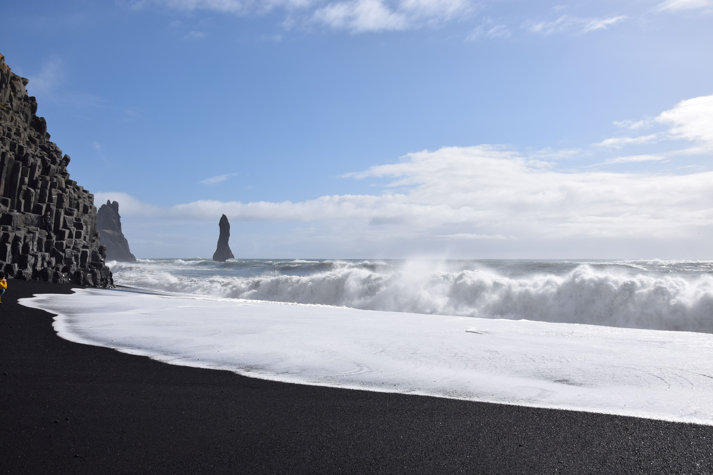
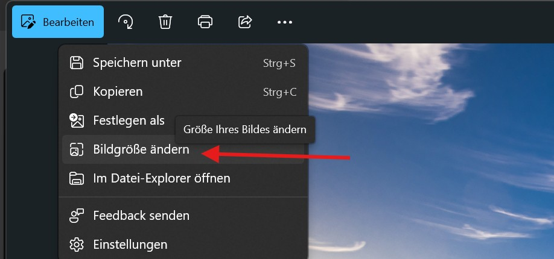
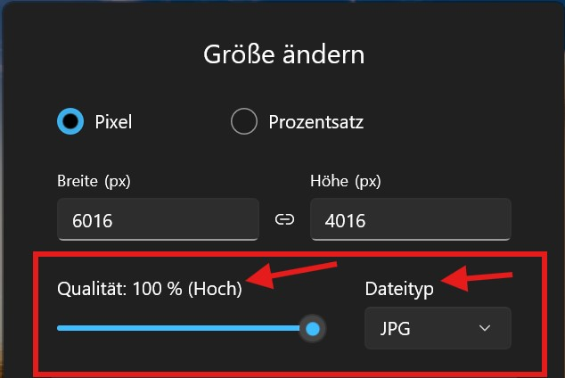
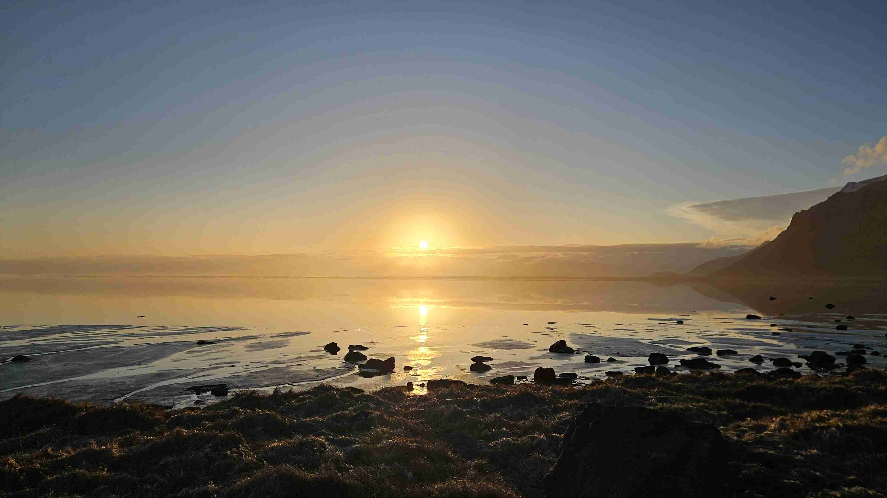
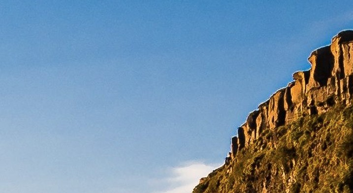

import { sanitizeNumber } from '@tdev-components/documents/String/sanitizers'

# PNG vs JPEG
Bei Rastergrafiken gibt es unterschiedliche Dateiformate. Bekannte Formate sind `.png` (Portable Network Graphics) und `.jpeg` (ausgesprochen `JAY-peg`), wobei beide Formate die Bilddaten komprimieren und somit Speicherplatz einsparen.

::::aufgabe[Komprimierung von Bildern]
<Answer type="state" id="105c3ff0-820f-4870-b6b5-73d50e7ead4c" />

Das folgende Foto hat im Original eine Auflösung von `6016x4016` Pixel mit einer Farbtiefe von 3 Byte.

1. Berechnen Sie die theoretische Speichergrösse in Megabyte. (gerundet auf eine Nachkommastelle, wobei $1'000'000\,Bytes=1\,MB$)
    <Answer label="Theoretische Grösse [MB]" type="string" id="8e2cca75-fda6-4139-9b42-1868ce7abe1a" solution="72.5" sanitizer={sanitizeNumber()}/>
2. Laden Sie das Originalbild unter dem folgenden Link herunter: <a href={require("./assets/iceland.png").default} download="iceland.png">👉 Originalbild</a>.
3. Wie gross ist der tatsächliche Speicherbedarf des Bildes auf Ihrem Laptop? (in Megabyte). Notieren Sie diese Zahl.
    <Answer label="Bildgrösse [MB]" type="string" id="89b96024-d392-4aae-b1a8-299829973119" />
4. Öffnen Sie das Bild in der Foto-App.
5. Ändern Sie das Dateiformat auf `JPG` und exportieren Sie das Bild mehrmals mit unterschiedlicher Bildqualität (benennen Sie die Bilder so, dass Sie später wissen, welche Qualität sie haben). Wie gross sind die Bilder nach dem Export?
    
    
    <Answer label="Bei 100 % [MB]" type="string" id="1e2b37f0-b77c-4637-877f-9f4b7a610268" />
    <Answer label="Bei 80 % [MB]" type="string" id="d65894c6-65c7-491b-893e-a540a1c5a580" />
    <Answer label="Bei 50 % [MB]" type="string" id="38e2bad7-5fdd-4e85-8b70-074b92eb3b6f" />
    <Answer label="Bei 20 % [MB]" type="string" id="8819c966-aa58-4ff6-8513-ec72e801ea0a" />
6. Vergleichen Sie die Bilder mit dem Original - ab welcher Bildqualität stellen Sie eine merkbare Verschlechterung der Qualität fest? Wo auf dem Bild sind die Änderungen besonders sichtbar?
    <Answer type="text" id="6f65fe0a-cc89-4caa-966b-09cde921a3b1" />

<Solution id="adf65f6c-0892-4249-8786-1719c06d9275">

1. Farbtiefe von 3 Bytes (8 bit pro Farbkanal / 256 Abstufungen pro Farbkanal)
    $$
    6016 * 4016 * 3 Byte = 72'480'768 Bytes = 72'481 KB = 72.5 MB
    $$
3. `32.5 MB`
5. Abhängig von der Bildqualität ändert sich die Bildgrösse:
    - `100 % ~ 13.4 MB`
    - ` 80 % ~ 3.2 MB`
    - ` 50 % ~ 1.7 MB`
    - ` 20 % ~ 1 MB`
6.  Die Bildqualität nimmt merklich ab - besonders bei "gleichaussehenden" Farben wie beim Himmel sind grobe Farbübergänge feststellbar. Ab 80 % sind kaum mehr Unterschiede zum Original feststellbar. Eine JPG-Qualität von `80 %` stellt oft das Optimum aus reduziertem Speicherbedarf und hoher Bildqualität dar. 
    :::cards
    
    ::br
    
    ::br
    
    :::
</Solution>
::::

## verlustfreie und verlustbehaftete Komprimierung

Beide Bildformate komprimieren die Bilder - allerdings geht bei `JPEG` Information verloren und kann **nicht wiederhergestellt** werden. Es handelt sich also um eine verlusbehaftete Komprimierung. `PNG` verwendet im Unterschied dazu eine verlustfreie Komprimierung, was sich durch eine unveränderte Qualität abzeichnet, jedoch auch im deutlich höheren Speicherbedarf äussert.