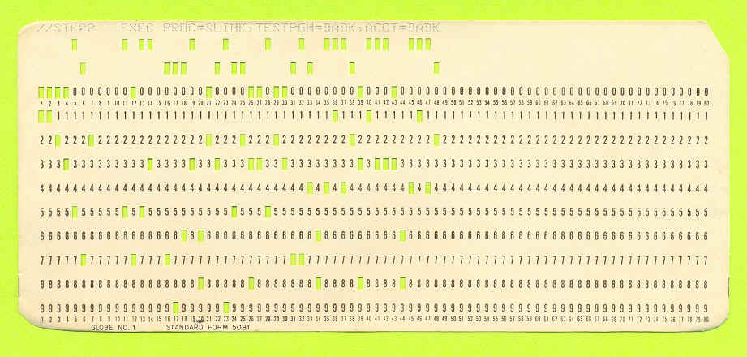

---
sidebar_custom_props:
  source:
    name: rothe.io
    ref: >-
      https://craft.rothe.io/RVDP1VFzxV372O/b/B1F8CC85-640B-4A2E-8141-ECFB1BA6C1DC/1.3-%E2%80%94-Datenmengen
page_id: 3a1c7666-bb55-476a-859d-8c06329bffad
image: ./images/punch-card-single.jpg
---

import String from '@tdev-components/documents/String';

# Datenmengen

Binär codierte Informationen werden als bits auf einen Datenträger gespeichert. Abhängig von der Codierung (ob bspw. mit- oder ohne Kompression) kann dieselbe Information mehr oder weniger bits auf einem Speichermedium beanspruchen.
Da der Speicherbedarf rasch mehrere tausend Bit's umfasst, werden jeweils 8 Bit's zu einem Byte zusammengefasst. Dateigrössen werden in der Regel in Bytes angegeben.

## Bit
Die Datenmenge, welche mit **zwei Zuständen** dargestellt werden kann, nennt man ein __Bit__. Ein Bit ist die kleinstmögliche Informationseinheit.

Wir können uns ein Bit als Kästchen vorstellen, in welchem eine Null oder eine Eins steht:

## Byte
Die Datenmenge, welche aus **acht Bits** gebildet wird, nennen wir ein **Byte**. Wir stellen uns ein Byte als acht Kästchen vor, die je eine Null oder eine Eins enthalten:

Da für jedes Kästchen zwei Möglichkeiten vorhanden sind, können wir ein Byte auf $2^8=256$ verschiedene Arten mit Nullen und Einsen füllen. Mit einem Byte können also $256$ verschiedene Dinge gespeichert werden, beispielsweise die Zahlen $0$ bis $255$ oder $256$ verschiedene Schriftzeichen.

## SI-Präfixe
Für Datenmengen werden die SI-Präfixe des Internationalen Einheitensystems (SI) verwendet, wie sie auch bei anderen Masseinheiten gebräuchlich sind (z.B. ein Kilogramm Brot, eine Megawattstunde, 34 Gigatonnen CO2-Emission pro Jahr).

| Bezeichnung | typisches Beispiel                                   |  Kürzel |    Potenz |    Grösse |
| :---------- | :--------------------------------------------------- | ------: | --------: | --------: |
| Bit         |                                                      | `1 bit` |           |           |
| Byte        | ein Buchstabe                                        |   `1 B` |    $10^0$ |   `8 bit` |
| Kilobyte    | eine halbe Seite Text                                |  `1 kB` |    $10^3$ |  `1000 B` |
| Megabyte    | eine Minute Musik (MP3)                              |  `1 MB` |    $10^6$ | `1000 kB` |
| Gigabyte    | eine Viertelstunde Video (Full HD)                   |  `1 GB` |    $10^9$ | `1000 MB` |
| Terabyte    | Speicherplatz einer (eher kleinen) Festplatte (2024) |  `1 TB` | $10^{12}$ | `1000 GB` |
| Petabyte    |                                                      |  `1 PB` | $10^{15}$ | `1000 TB` |
| Exabyte     |                                                      |  `1 EB` | $10^{18}$ | `1000 PB` |

## Historische Binärpräfixe
Weil Datenspeicher eine binäre Adressierung verwenden, sind Speicherkapazitäten üblicherweise eine Zweierpotenz. Deshalb war es früher üblich, $2^{10}=1024$ Byte als Kilobyte oder 1 kB zu bezeichnen.

1996 hat die International Electrotechnical Commission (IEC) spezielle Präfixe für **Binärpräfixe** festgelegt:

| Bezeichnungen |  Kürzel |   Potenz |    Grösse |
| :------------ | ------: | -------: | --------: |
| Kibibyte      | `1 kiB` | $2^{10}$ | `1024 kB` |
| Mebibyte      | `1 MiB` | $2^{20}$ | `1.05 MB` |
| Gibibyte      | `1 GiB` | $2^{30}$ | `1.07 GB` |
| Tebibyte      | `1 TiB` | $2^{40}$ | `1.10 TB` |
| Pebibyte      | `1 PiB` | $2^{50}$ | `1.12 PB` |

Auch heute kann man sich nicht immer sicher sein, ob die Angabe «1 TB» ein Terabyte, also $10^{12}$ Byte oder ein Tebibyte, also $2^{40}$ Byte bedeutet.

## Übungen

:::aufgabe[Umrechnen]
<Answer type="state" id="39e43e79-fb1e-4005-9224-bc254ab12e95" />

- <String label="2.7 MB = " unit="kB" solution="2700" type="number" inline inputWidth="8em" id="f32ef94c-c3dd-40d5-96f3-eaf06f60681d"/>
- <String label="4.5 GB = " unit="MB" solution="4500" type="number" inline inputWidth="8em" id="49fd7ab5-597d-4a28-90d9-dc6654ac2a07"/>
- <String label="512 kB = " unit="B" solution="512000" type="number" inline inputWidth="8em" id="45fb5d1d-02f8-4987-9a18-5d5231ed5509"/>
- <String label="1.2 TB = " unit="GB" solution="1200" type="number" inline inputWidth="8em" id="aac62484-636d-4698-ad3e-c9b0439aa439"/>
- <String label="240 kB = " unit="MB" solution="0.24" type="number" inline inputWidth="8em" id="1e36e609-7cfe-4fb2-9657-0ff67da98725"/>
- <String label="3.6 GB = " unit="kB" solution="3600000" type="number" inline inputWidth="8em" id="104588aa-27c0-41bd-b695-ea9bd5cb35de"/>
- <String label="8.1 TB = " unit="MB" solution="8100000" type="number" inline inputWidth="8em" id="091560d1-f203-4a05-a570-0ed6aea72a46"/>
- <String label="720 MB = " unit="TB" solution="0.00072" type="number" inline inputWidth="8em" id="d4f7187f-1e16-45d4-8932-1d3f88416c0f"/>
- <String label="1536 kB = " unit="MB" solution="1.536" type="number" inline inputWidth="8em" id="cefcff07-232f-40c8-bca0-1fbae68ac112"/>
- <String label="0.35 GB = " unit="kB" solution="350000" type="number" inline inputWidth="8em" id="de76b342-2f5a-446a-bc3a-d9d98a24ad6f"/>

#### Historische Einheiten

- <String label="7 kiB = " unit="B" solution="7168" type="number" inline inputWidth="8em" id="db7d3e43-4f37-40da-83a2-0f2d2af21582"/>
- <String label="128 MiB = " unit="MB" solution="134" type="number" sanitizer={(val) => val.slice('.')[0]} inline inputWidth='8em' id="300e802b-8182-4670-902e-179bf52b144a" />
- <String label="128 MB = " unit="MiB" solution="122" type="number" sanitizer={(val) => val.slice('.')[0]} inline inputWidth='8em' id="7bacaad3-2bd6-4a68-9b08-581da0f08e0d" />

Sie kaufen sich einen neuen USB-Stick mit $512$ GB Speicherplatz. Sie sind sich unsicher, ob das nun $512$ GB oder $512$ GiB sind.
- a. Wie viel MB Speicherplatz haben Sie mehr, wenn es sich um GiB handelt?
- b. Wie viele Stunden Film können Sie auf dem USB-Stick zusätzlich speichern, wenn 15 Minuten Film $1$ GB speicherplatz braucht?

<Answer type="text" id="0229a7d9-930d-4734-aaff-6d9d7a44c6e0" />

<Solution id="328f8924-357e-40b6-a90e-dcca11cedfcb">

- $512$ GiB = $512 \cdot 2^{30}$ B = $549'755'813'888$ B
- $512$ GB = $512 \cdot 10^{9}$ B =  $512'000'000'000$ B
- $\rightarrow$ Unterschied = $37'755'813'888$ B = $37.76$ GB

Es könnten ca. $\frac{37.76}{4} \approx 9.5$ Stunden Film mehr abgespeichert werden.

</Solution>
:::

::::aufgabe[Lochkarten-Speicher]
  <Answer type="state" id="a3ea1ed8-8ef8-42f0-a702-a22e06084015" />

  In den 1960er Jahren wurden Computerprogramme auf Lochkarten gespeichert. Eine Lochkarte ist eine Karte aus Karton, in die Löcher gestanzt werden. Die Löcher sind binär codiert: Ein Loch bedeutet eine Eins, kein Loch bedeutet eine Null.

  :::cards{align="flex-end"}
  ::br{basis="350px"}
    
  ::br{basis="100px"}
    
  :::

  > Die am weitesten verbreitete Lochkarte war die sog. *Hollerith-Lochkarte* - sie ist ein rechteckiges, etwa $18.7 cm \times 8.3 cm$ grosses Stück aus $0.17$ mm dünnem Karton, in das in vorgegebene Positionen mit Hilfe eines speziellen Lochungsgerätes spaltenweise Löcher gestanzt werden, um eine Folge von Zeichen zu codieren. [^1]
  >
  > Auf einer Lochkarte sind $80$ Spalten à $8$ bit angeordent, wobei ein Loch eine Eins bedeutet und kein Loch entsprechend eine Null. Es hat also total $80$ Bytes Daten. Zudem hat es noch eine "Kopfzeile", in welcher Zusatzinformationen wie bspw. die Seitennummer festgehalten werden können.

  Ihr neues iPhone hat $256$ GB Speicherplatz.

  1. Wie viele Lochkarten sind nötig, um den gesamten Speicherplatz des iPhones als Hollerith-Lochkarten abzuspeichern?
      <String label="Anzahl Lochkarten" solution="3200000000000" type="number" id="baf72a29-9548-4217-99f0-c58728d0c8df" />
  2. Wenn nun alle Lochkarten auf denselben Stapel gelegt werden: wie hoch wird dieser Turm? 
      <String label="Höhe des Turms" solution="544000" type="number" unit="km" id="80567cb1-52ea-4a75-9283-a2802e76e76e" />
  3. Der Mond ist durchschnittlich $384'400$ km von der Erde entfernt. Wie oft kann die Distanz Erde-Mond mit dem Lochkarten-Turm überbrückt werden? (Ergebnis auf zwei Dezimalstellen runden)
      <String solution="1.42" unit="mal zum Mond" type="number" id="4755fd92-c343-4bca-a20b-811797dfaf80" />
::::

[^1]: Quelle: [Wikipedia](https://de.wikipedia.org/wiki/Lochkarte)