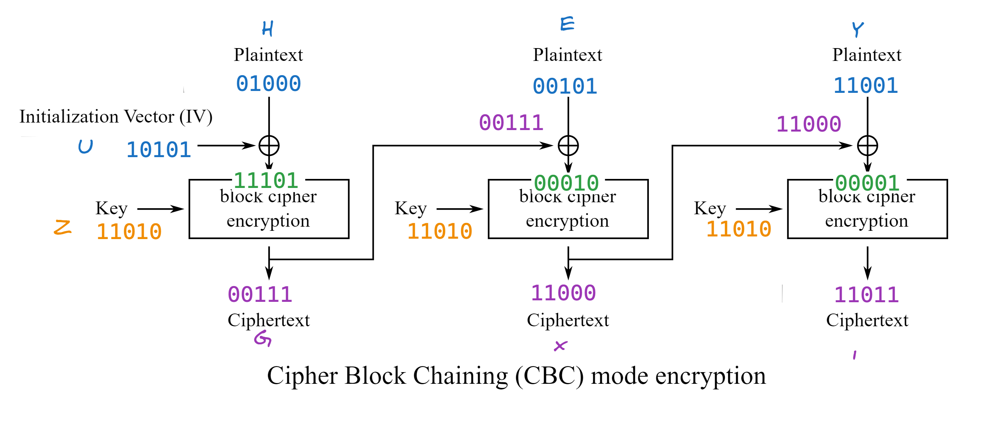
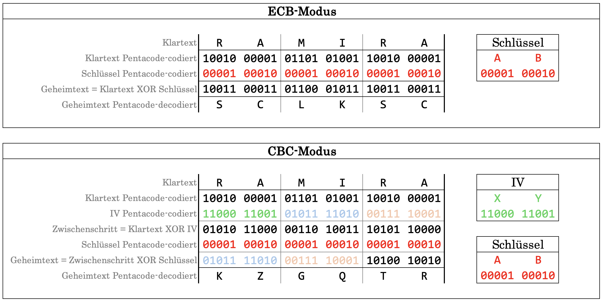

---
sidebar_custom_props:
  source:
    name: ofi.gbsl.website
    ref: 'https://ofi.gbsl.website/26e/Kryptologie/Symmetrisch/block-chaining'
page_id: f588c1fd-086d-44ed-aa30-af28f735434c
---

import DefinitionList from "@tdev-components/DefinitionList";
import XORBlockCipher from "@tdev-components/VisualizationTools/cryptology/XORBlockCipher";
import { TextEditor } from "@tdev-components/VisualizationTools/Pentacode";
import ProgressState from '@tdev-components/documents/ProgressState';
export const UPPER_NOSPACE = (val) => val.replace(/\s+/g, '').toUpperCase();

# Verkettung von Blöcken
Im letzten Kapitel wurde der Geheimtext zur Ver- bzw. Entschlüsselung in Blöcke aufgeteilt, die exakt so lang sind wie der Schlüssel. Die Blöcke werden anschliessend einzeln durch die XOR-Funktion mit dem Schlüssel ver- bzw. entschlüsselt.

:::insight[Allgemeine Blockchiffre]
Prinzipiell kann anstelle der XOR-Funktion jede beliebige mathematische Funktion (resp. Verkettung von Funktionen) zur Verschlüsselung verwendet werden (in den unten aufgeführten Grafiken daher mit dem allgemeinen Begriff *block cipher encryption* bezeichnet). Wir beschränken uns hier allerdings auf die einfache und gut verständliche XOR-Verschlüsselung.
:::

## Der Betriebsmodus «Electronic Code Book» (ECB)

Falls jeder Block mit dem immer gleichen Schlüssel verschlüsselt wird, spricht man vom «Electronic Code Book» (**ECB**) Betriebsmodus. Schematisch dargestellt sieht dieser wie folgt aus:

In der Abbildung wird deutlich, dass ECB kein eigenes Verschlüsselungsverfahren ist, sondern nur ein **Modus** ist. Er definiert, wie die einzelnen Blöcke verwendet werden. Die konkrete Verschlüsselungsfunktion ist in dieser Darstellung nicht genauer angegeben – wir verwenden der Einfachheit halber hier die XOR-Funktion.

Die Entschlüsselung funktioniert analog: Der Geheimtext wird wiederum in Blöcke aufgeteilt, welche separat mit dem Schlüssel entschlüsselt werden. Die dabei entstandenen Klartext-Blöcke ergeben aneinander gereiht den gesamten Klartext.

## Der Betriebsmodus «Cipher Block Chaining» (CBC)
Im CBC-Modus werden die Blöcke nicht mehr getrennt voneinander verarbeitet. Wie in der folgenden Abbildung ersichtlich ist, dient jeder Geheimtext-Block (ausser der letzte) im nachfolgenden Schritt zusätzlich als Input. So werden gleiche Klartext-Blöcke trotz identischem Schlüssel zu unterschiedlichen Geheimtextblöcken verschlüsselt.

Das Plus-Zeichen ich Kreis steht hier ebenfalls für die XOR-Operation. Diese ist gegeben, während die Verschlüsselung im grossen Rechteck mit der Bezeichnung *block cipher encryption* frei gewählt werden kann (also bspw. auch ein aktuell sicheres Verfahren). Da wir in unseren Beispielen allerdings jeweils die XOR-Verschlüsselung als _block cipher encryption_ verwenden, wird bei uns sowohl für die Verrechnung des Klartextblocks mit dem vorherigen Geheimtextblock, wie auch für die eigentliche Verschlüsselung die XOR-Operation verwendet.

Da bei der Verarbeitung des ersten Blocks noch kein Geheimtext-Block zur Verfügung steht, wird als eine Art _Platzhalter_ ein sogenannter **Initialisierungsvektor (IV)** verwendet.

Ändert man 1 Bit im IV, führt dies zu Änderungen im gesamten Geheimtext. Ändert man 1 Bit im Klartext, so ändern sich auch sämtliche darauffolgenden Blöcke im Geheimtext.

Ein Nachteil des CBC-Modus ist allerdings, dass die **Verschlüsselung** der verschiedenen Blöcke nicht gleichzeitig (also parallel) berechnet werden können, da das Resultat des vorherigen Blocks für die Verschlüsselung des aktuellen Blocks benötigt wird. D.h. ein bestimmter Klartext-Block kann erst verschlüsselt werden, wenn sämtliche vorherigen Blöcke bereits verschlüsselt sind.

Bei der **Entschlüsselung** sieht es anders aus. Da sofort sämtliche Geheimtextblöcke vorliegen, kann die Entschlüsselung problemlos parallelisiert werden, wie Sie in der folgenden Abbildung nachvollziehen können:

:::insight[XOR-Blockchiffre]
Selbstverständlich ist XOR als Verschlüsselungsfunktion aus kryptologischer Sicht nicht ideal – dafür aber für uns gut verständlich, überschaubar und einfach anzuwenden.

In der Realität ist es besonders wichtig, dass die Verschlüsselungsfunktion sämtliche Bits des aktuellen Blocks stark «vermischt». Damit ist gemeint, dass eine winzige Änderung an einer bestimmten Stelle im Klartextblock nicht nur zu einer kleinen Änderung an derselben Stelle im Geheimtextblock führt (wie dies bei XOR wegen der bitweisen Verarbeitung der Fall), sondern dass durch die kleine Änderung viele Bits überall im Block verändert werden.

Aus diesem Grund arbeiten aktuelle Verschlüsselungsfunktionen von Blockchiffren in **mehreren Runden**.
:::

### Beispiel CBC

p
: HEY
iv
: U
k
: Z

Beachten Sie, dass der IV nur beim ersten Block verwendet wird und die Blocklänge hier genau ein Buchstabe ist. Die XOR-Operation ist hier mit `+` dargestellt und auch bei der "Block-Cipher-Encryption" wird XOR verwendet.

## Vergleich ECB und CBC
In diesem Rechenbeispiel sehen Sie den ECB- und den CBC-Modus im Vergleich.

<DefinitionList>
  <dt>Klartext</dt>
  <dd>`RAMIRA`</dd>
  <dt>Schlüssel</dt>
  <dd>`AB`</dd>
  <dt>Initialvektor (für CBC)</dt>
  <dd>`XY`</dd>
</DefinitionList>

:::insight[Unterschiedliche Resultate]
Dieses Beispiel zeigt, was die Verkettung von Blöcken ausmachen kann. Bei beiden Modu werden zwei identische Klartextblöcke `RA` mit dem Schlüssel `AB` verschlüsselt.

Beim ECB-Modus weist dementsprechend auch der Geheimtext zwei identische Blöcke `SC` auf. Durch das Verketten der Blöcke kann diese unschöne Regelmässigkeit mit dem CBC-Modus vermieden werden.
:::

## XOR-Blockchiffre ausprobieren
<XORBlockCipher />

## Übungen
### ECB-Modus
:::warning[Übungen von Hand lösen]
Lösen Sie diese Übungen **von Hand**! Sie dürfen einzig den [Pentacode Text-Editor](Pentacode#pentacode-text-editor) als Hilfsmittel verwenden.
:::

<TextEditor />

::::aufgabe[Aufgabe 1]
Verschlüsseln Sie den folgenden Text mit der XOR-Blockchiffre im ECB-Modus.

Text
: `PAKET ZUGESTELLT`
Schlüssel
: `BETA`

<ProgressState id="ca1bb8d5-b74b-4003-8186-e44d2e383b29">
1. Codieren Sie zuerst den Text mit Pentacode (Sie dürfen dazu den Pentacode Text-Editor verwenden).
    <Answer label="p" type="string" id="5cb9daea-a3f9-471b-ae1e-fbc6967e9fe0" fullWidth monospace />
2. Codieren Sie den Schlüssel ebenfalls mit Pentacode.
    <Answer label="k" type="string" id="7a61ee6a-25c1-4f4b-a0ad-3d4f00031355" fullWidth monospace />
3. Verschlüsseln Sie den binär dargestellten Text anschliessend mit dem binär dargestellten Schlüssel mittels XOR-Blockchiffre.
    <Answer label="p" type="string" id="5cb9daea-a3f9-471b-ae1e-fbc6967e9fe0" fullWidth monospace disabled />
    <Answer label="k" type="string" id="7a61ee6a-25c1-4f4b-a0ad-3d4f00031355" fullWidth monospace disabled />
    <Answer label="c" type="string" id="b11950f2-d9be-403d-ab3a-ac97a49d8ab6" fullWidth monospace />
4. Decodieren Sie die Pentacode-codierte Geheimtext-Bitfolge zu einer Zeichenfolge.
    <Answer label="c" type="string" id="b11950f2-d9be-403d-ab3a-ac97a49d8ab6" fullWidth solution="RD@DVENTE GUGIXU"/>
</ProgressState>
::::

:::aufgabe[2. XOR Verschlüsselung]
<Answer type="state" id="3dd663a7-45ad-45e6-ab03-995fe51bbe97" />

Verschlüsseln Sie den Text `BUCHSTABENSPIELE` mit dem Schlüssel `AKRONYM`

<Answer type="text" id="a30ab42b-0e2a-4452-a7a4-f34c96e8a4cd" monospace/>

<Answer label="Text (nicht binär)" type="string" id="b680e137-905a-4bc5-a05a-fe65bc1684ee" solution="C?QG.MLCN--?PHMN" sanitizer={UPPER_NOSPACE} monospace width="80%"/>

:::

:::aufgabe[3. XOR Entschlüsseln]
<Answer type="state" id="400edf18-c72e-4d30-a3ca-711f10649d57" />

Entschlüsseln Sie den Text `XWVJZWEKK,XWVJIK` mit dem Schlüssel `VVXKZ`

<Answer type="text" id="f0c2bc43-cc15-4f58-8466-19f2f3374d2e" monospace />

<Answer label="Text (nicht binär)" type="string" id="f877bdef-a2e9-4b82-a6cc-1b61109970c7" solution="NANA ASS ANANAS." sanitizer={UPPER_NOSPACE} monospace width="80%"/>
:::

### CBC-Modus
:::warning[Übungen von Hand lösen]
Lösen Sie diese Übungen **von Hand**! Sie dürfen einzig den [Pentacode Text-Editor](Pentacode#pentacode-text-editor) als Hilfsmittel verwenden.
:::

## CBC Modus

:::info[Hinweis CBC-Modus]
- Jeder Block hat genau so viele Bits wie der Schlüssel. (Hier werden also meist 2 Buchstaben (=`10` bits) pro Antwort in einem Block verwendet.)
- `c1` ist ein Zwischenresultat, damit wird weitergearbeitet...
:::

::::aufgabe[4. CBC-Modus: Verschlüsseln]
<Answer type="state" id="6b6bd045-cd9b-4bd7-83d4-ccd3b485694c" />

Verschlüsseln Sie den Text `WINTER` mit dem Schlüssel `NY` und dem IV `AZ`.

<Answer type="text" id="aeaf6634-df2d-427f-9daa-970ff225f105" monospace />

 

(Antworten als Penta-Binärcode)
:::cards{rows=3 flexBasis=210px}
**Block 1**
<Answer label="p" inputWidth="9em" labelWidth="2em" type="string" id="9f33bc0e-1475-49ee-8201-f389920f3da7" solution="10111 01001" sanitizer={UPPER_NOSPACE} monospace/>
<Answer label="IV" inputWidth="9em" labelWidth="2em" type="string" id="576d141c-99d1-41dd-9cb6-2536b5eefc61" solution="00001 11010" sanitizer={UPPER_NOSPACE} monospace/>
<i>Nach XOR mit IV </i>
<Answer label="c1" inputWidth="9em" labelWidth="2em" type="string" id="6280885d-6427-4403-a09a-144b04f76716" solution="10110 10011" sanitizer={UPPER_NOSPACE} monospace/>
<Answer label="k" inputWidth="9em" labelWidth="2em" type="string" id="53ff56be-1a4b-4ad0-86fb-a98590d83d50" solution="01110 11001" sanitizer={UPPER_NOSPACE} monospace/>
<i>Nach XOR mit Schlüssel</i>
<Answer label="c" inputWidth="9em" labelWidth="2em" type="string"  id="029d1f0e-f597-4eb4-bac5-7c9ef6d8e849" solution="11000 01010" sanitizer={UPPER_NOSPACE} monospace/>

::br
**Block 2**

<Answer label="p" type="string" inputWidth="9em" labelWidth="2em"id="55c93903-3bdb-4189-8f80-68bb19f4cbd1" solution="01110 10100" sanitizer={UPPER_NOSPACE} monospace/>
<Answer label="IV" type="string" inputWidth="9em" labelWidth="2em"id="4fd15699-160c-4738-8288-b9d2a3ac40d3" solution="11000 01010" sanitizer={UPPER_NOSPACE} monospace/>
<i>Nach XOR mit IV </i>
<Answer label="c1" inputWidth="9em" labelWidth="2em" type="string" id="52dc90fe-224a-4739-b277-1181fb41c265" solution="10110 11110" sanitizer={UPPER_NOSPACE} monospace/>
<Answer label="k" inputWidth="9em" labelWidth="2em" type="string" id="53ff56be-1a4b-4ad0-86fb-a98590d83d50" disabled monospace/>
<i>Nach XOR mit Schlüssel</i>
<Answer label="c" inputWidth="9em" labelWidth="2em" type="string"  id="2bbfd220-5673-488a-a903-528ef7324885" solution="11000 00111" sanitizer={UPPER_NOSPACE} monospace/>
::br

**Block 3**

<Answer inputWidth="9em" labelWidth="2em" label="p" type="string" id="8e2339e3-d4d9-4339-9709-bbbaf28e4e05" solution="00101 10010" sanitizer={UPPER_NOSPACE} monospace/>
<Answer inputWidth="9em" labelWidth="2em" label="IV" type="string" id="8db5f43f-0bcd-4d11-8bca-a72286778e65" solution="11000 00111" sanitizer={UPPER_NOSPACE} monospace/>
<i>Nach XOR mit IV </i>
<Answer label="c1" inputWidth="9em" labelWidth="2em" type="string" id="3a7ac8ec-b6c6-4acd-b123-f1ca84d99fad" solution="11101 10101" sanitizer={UPPER_NOSPACE} monospace/>
<Answer label="k" inputWidth="9em" labelWidth="2em" type="string" id="53ff56be-1a4b-4ad0-86fb-a98590d83d50" disabled monospace/>
<i>Nach XOR mit Schlüssel</i>
<Answer label="c" inputWidth="9em" labelWidth="2em" type="string"  id="a44a611e-6cff-41ea-9277-4b0859ea6249" solution="10011 01100" sanitizer={UPPER_NOSPACE} monospace/>
:::

<Answer label="Text (nicht binär)" fullWidth type="string" id="dabff993-1dc5-43c8-bfca-f944c8dc3f96" solution="XJXGSL" sanitizer={UPPER_NOSPACE} monospace/>
::::

::::aufgabe[5. CBC-Modus: Entschlüsseln]
<Answer type="state" id="5d950f19-7371-4fbf-ac91-75fbad207f36" />

Entschlüsseln Sie den Text `NNHDFBA` mit dem Schlüssel `BE` und beliebigem IV.

<Answer type="text" id="1d46518d-94df-4d09-8d12-ae6f28df2b67" monospace />

 

(Antworten als Penta-Binärcode)
:::cards{rows=4 flexBasis=210px}
**Block 1**
<Answer label="c" inputWidth="9em" labelWidth="2em" type="string" id="150519fd-560b-42e6-acec-58407af94ada" solution="01110 01110" sanitizer={UPPER_NOSPACE} monospace/>
<Answer label="k" inputWidth="9em" labelWidth="2em" type="string" id="f20e9df7-4811-4856-a487-02e2ed6b883b" solution="00010 00101" sanitizer={UPPER_NOSPACE} monospace/>
<i>Nach XOR mit Schlüssel </i>
<Answer label="c1" inputWidth="9em" labelWidth="2em" type="string" id="92338241-0b77-4195-b65b-c4cf64bf6734" solution="01100 01011" sanitizer={UPPER_NOSPACE} monospace/>
<Answer label="IV" inputWidth="9em" labelWidth="2em" type="string" id="aa136c52-c970-437f-b9ff-270468514137" checker={(val) => UPPER_NOSPACE(val)?.length === 10} monospace/>
<i>Nach XOR mit IV </i>
<Answer label="p" inputWidth="9em" labelWidth="2em" type="string"  id="14beb904-594a-43ff-a67c-88b9ce93cb3c" checker={(val) => UPPER_NOSPACE(val)?.length === 10} monospace/>

::br
**Block 2**

<Answer label="c" type="string" inputWidth="9em" labelWidth="2em"id="97948788-feeb-4c72-94fe-5e176283218a" solution="01000 00100" sanitizer={UPPER_NOSPACE} monospace/>
<Answer label="k" type="string" inputWidth="9em" labelWidth="2em"id="f20e9df7-4811-4856-a487-02e2ed6b883b" disabled monospace/>
<i>Nach XOR mit Schlüssel</i>
<Answer label="c1" inputWidth="9em" labelWidth="2em" type="string" id="b4afd242-e054-4f3c-b865-2d14cc206057" solution="01010 00001" sanitizer={UPPER_NOSPACE} monospace/>
<Answer label="IV" inputWidth="9em" labelWidth="2em" type="string" id="d9ff2b83-e6de-490b-be42-11d4d4676da7" solution="01110 01110" sanitizer={UPPER_NOSPACE} monospace/>
<i>Nach XOR mit IV </i>
<Answer label="p" inputWidth="9em" labelWidth="2em" type="string"  id="00ac07c4-7f1f-4d9a-a908-7f41f20621b0" solution="00100 01111" sanitizer={UPPER_NOSPACE} monospace/>
::br

**Block 3**

<Answer label="c" inputWidth="9em" labelWidth="2em" type="string" id="b99355ce-bc59-4ac6-8183-cada8a706b27" solution="00110 00010" sanitizer={UPPER_NOSPACE} monospace/>
<Answer label="k" inputWidth="9em" labelWidth="2em" type="string" id="f20e9df7-4811-4856-a487-02e2ed6b883b" disabled monospace/>
<i>Nach XOR mit Schlüssel</i>
<Answer label="c1" inputWidth="9em" labelWidth="2em" type="string" id="dc3049f2-5006-4507-8dd5-8759b7c24465" solution="00100 00111" sanitizer={UPPER_NOSPACE} monospace/>
<Answer label="IV" inputWidth="9em" labelWidth="2em" type="string" id="e33acd9e-ccbf-4d39-aea2-9ee51b665fb2" solution="01000 00100" sanitizer={UPPER_NOSPACE} monospace/>
<i>Nach XOR mit IV </i>
<Answer label="p" inputWidth="9em" labelWidth="2em" type="string"  id="1bcc452d-3099-4ab4-b24d-b24407a63c41" solution="01100 00011" sanitizer={UPPER_NOSPACE} monospace/>
::br

**Block 4**

<Answer label="c" inputWidth="9em" labelWidth="2em" type="string" id="30d7f06d-2d98-4649-b585-c3e0e11841fc" solution="00001" sanitizer={UPPER_NOSPACE} monospace/>
<Answer label="k" inputWidth="9em" labelWidth="2em" type="string" id="f20e9df7-4811-4856-a487-02e2ed6b883b" disabled monospace/>
<i>Nach XOR mit Schlüssel</i>
<Answer label="c1" inputWidth="9em" labelWidth="2em" type="string" id="69af84b4-3d3a-4377-adbb-6870b71cb9c7" solution="00011" sanitizer={UPPER_NOSPACE} monospace/>
<Answer label="IV" inputWidth="9em" labelWidth="2em" type="string" id="791d6b06-0ab1-4cb7-82d2-388ed8cd7626" solution="00110" sanitizer={UPPER_NOSPACE} monospace/>
<i>Nach XOR mit IV </i>
<Answer label="p" inputWidth="9em" labelWidth="2em" type="string"  id="d0fbef85-346d-4d70-bb60-972205240d36" solution="00101" sanitizer={UPPER_NOSPACE} monospace/>
:::

<Answer label="Text (nicht binär)" fullWidth  type="string" id="4ce989c5-27ad-4146-bdf6-adb7b5908b55" solution="DOLCE" sanitizer={(val) => UPPER_NOSPACE(val)?.length === 7 ? UPPER_NOSPACE(val).slice(2) : UPPER_NOSPACE(val)} monospace/>
::::

### Vertiefungsaufgaben
:::aufgabe[ECB und CBC im Vergleich]
<TaskState id="2fc0dca8-356b-4a69-a20a-d91d3f70b6c9" />
Verschlüsseln Sie den Klartext `BORABORA` mit dem Schlüssel `RABE`. Verwenden Sie dazu die [XOR-Blockchiffre](Block-Chaining#xor-blockchiffre-ausprobieren), und zwar zuerst im **ECB-Modus** und dann im **CBC-Modus**. Verwenden Sie beim CBC-Modus der Vergleichbarkeit halber den Initialvektor `ABCD`.

Beantworten Sie anschliessend der Reihe nach die unten stehenden Fragen. Notieren Sie zuerst Ihre Antwort und klappen Sie anschliessend die Frage auf, um den Lösungsvorschlag anzusehen.

  
Frage 1: Hier passieren einige interessante Dinge. Was fällt Ihnen auf?

  

    **Beobachtung 1:** Im ECB-Modus erhalten wir den Geheimtext `PNPDPNPD` - also zweimal hintereinander die Buchstabenfolge `PNPD`. Auch im Klartext `BORABORA` finden wir zweimal hintereinander die Buchstabenfolge `BORA`. Im CBC-Modus sehen wir diese Symmetrie nicht mehr.

     **Beobachtung 2:** Dafür taucht beim CBC-Modus im zweiten Block plötzlich der Initialvektor wieder auf - und zwar egal, mit welchem Initialvektor wir es versuchen.
  

<QuillV2 id="64c07b9a-e591-45af-9ba9-d1a4a7faef7e" />

---

  
Frage 2: Wie erklären Sie sich die **Beobachtung 1** aus der Antwort zur ersten Frage?

  

    Im ECB-Modus wird jeder Block mit den gleichen Schlüssel verschlüsselt. Wenn also zwei Klartextblöcke identisch sind, dann werden auch die resultierenden Geheimtextblöcke identisch sein. Da der Schlüssel `RABE` genau halb so lang ist wie der Klartext `BORABORA` verschlüsseln wir also zweimal den Klartextblock `BORA` mit dem Schlüssel `RABE` und erhalten somit zweimal den Geheimtextblock `PNPD`.

    Beim CBC-Modus sehen wir dieses Verhalten nicht mehr, weil wir dort für jeden Block $n$ den Output des vorangehenden Blocks $n-1$ als zusätzlichen Input verwenden. Tatsächlich ist dies genau die Idee hinter diesem Verknüpfen von Blöcken.
  

<QuillV2 id="e1cc7c8b-3744-410e-9201-09ebd655d900" />

---

  
⭐️ Frage 3: Wie erklären Sie sich die **Beobachtung 2** aus der Antwort zur ersten Frage?

  

    Für diese Erklärung verwenden wir für die XOR-Operation das mathematische Symbol $\oplus$. Der Leserlichkeit halber verzichten wir zudem darauf, den Text jeweils explizit ins Binärformat umzuwandeln. Tatsächlich ist die XOR-Funktion aber natürlich nicht für Buchstaben, sonder nur für Binärzahlen definiert!

    Mithilfe der [Wahrheitstabelle für die XOR-Verschlüsselung](XOR) können Sie sich leicht davon überzeugen, dass folgende Gesetze gelten:

    - $x \oplus x = 0$
    - $x \oplus 0 = 0 \oplus x = x$

    Wenn wir nun das Resultat für den ersten Block berechnen wollen, so nehmen wir zuerst den Klartextblock `BORA` und den Initialvektor `ABCD` und rechnen $\text{ BORA } \oplus \text{ ABCD }$. Diesen Input verschlüsseln wir mit der XOR-Verschlüsselung mit dem Schlüsse `RABE` und erhalten somit insgesamt

    $$\text{ BORA } \oplus \text{ ABCD } \oplus \text{ RABE }$$

    Für den zweiten Block verwenden wir diesen Output des ersten Blocks nun aber auch wieder als Input. Auch hier ist der Klartextblock wieder `BORA` und der Schlüssel wieder `RABE`. Also erhalten wir für den zweiten Block folgenden Geheimtext:

    $$\text{ BORA } \oplus (\text{ BORA } \oplus \text{ ABCD } \oplus \text{ RABE }) \oplus \text{ RABE }$$

    Wenn wir die Klammern entfernen (die dienen lediglich der Übersicht), so erhalten wir folgende Berechnung:

    $$\text{ BORA } \oplus \text{ BORA } \oplus \text{ ABCD } \oplus \text{ RABE } \oplus \text{ RABE }$$

    Weil aber $x \oplus x = 0$ gilt, können wir diese Berechnung wie folgt kürzen:

    $$0 \oplus \text{ ABCD } \oplus 0$$

    Und weil wir wissen, dass $x \oplus 0 = 0 \oplus x = x$ gilt, so ergibt sich:

    $$0 \oplus \text{ ABCD } \oplus 0 = \text{ ABCD }$$

    Dieses Phänomen tritt also nur deshalb auf, weil wir als Verschlüsselungsmechanismus die XOR-Verschlüsselung verwenden, die "zufällig" auch für die Verkettung verwendet wird. Bei echten Anwendungen von CBC verwenden wir andere, sicherere Verschlüsselungsmechanismen und werden diese Regelmässigkeit deshalb dort nicht antreffen.
  

<QuillV2 id="9ec49105-fdeb-43ed-8d27-151ea4109539" />
:::

:::aufgabe[CBC: Initialvektor bei der Entschlüsselung]
<TaskState id="ed330dac-0b39-4b82-a28f-f459bfb29b8d" />
Auf den ersten Blick erstaunlich ist die Tatsache, dass die **Ent**schlüsselung mit falschem Initialvektor (IV) nur dazu führt, dass der erste Klartext-Block unleserlich ist, während die restlichen Blöcke korrekt entschlüsselt werden. Weshalb ist das so?

Notieren Sie zuerst Ihre Antwort und vergleichen Sie anschliessend mit der Musterlösung.

<QuillV2 id="284f2ffd-b348-4470-8ffb-864362687ef3" />

<Solution id="cbec53de-1a5e-4e59-906d-dce1bb986f01">
Bei der **ver**schlüsselung verwenden wir den IV als zusätzlichen Input, wenn wir den ersten Block verschlüsseln. Da wir für jeden weiteren Block $n$ den Output des vorangehenden Blocks $n-1$ als zusätzlichen Input verwenden, zieht sich bei der Verschlüsselung jede Veränderung am IV durch die gesamte Kette hindurch.
 
Bei der **ent**schlüsselung passiert alles in umgekehrter Reihenfolge. Den Klartext eines Blocks $n$ erhalten wir, indem wir den Geheimtext dieses Blocks zuerst mit dem Schlüssel entschlüsseln und das Resultat anschliessend mit dem **Geheimtext des vorangehenden Blocks** $n-1$ (und nicht etwa mit dem Resultat seiner Entschlüsselung) XOR-verrechnen. Der ursprünglich verwendete IV ist in den beiden Geheimtexten bei der Verschlüsselung "hineingerechnet" worden und wir müssen ihn in diesem Moment für die Entschlüsselung nicht kennen.
 
Lediglich für den ersten Block haben wir keinen solchen vorangehenden Block $n-1$. Hier müssen wir den ursprünglich verwendeten IV kennen und anwenden. Wenn wir hier den falschen IV verwenden, dann wir der erste Block unleserlich - jedoch hat dies eben keinen Einfluss auf alle anderen Blocks.
</Solution>
:::