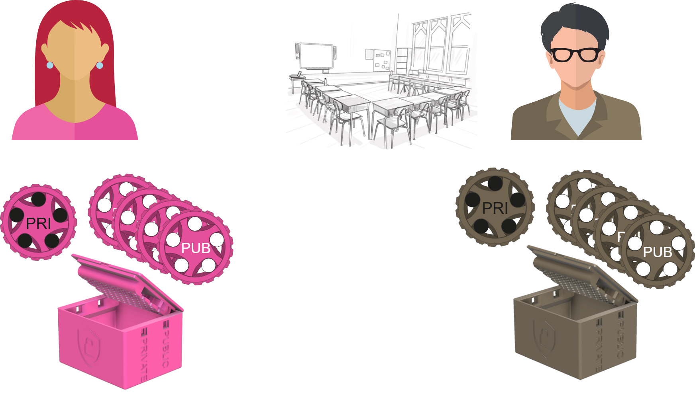

# Schlüsselaustausch

Ausgangslage
: Alice und Bob können sich nicht physisch treffen
: Sie möchten sich eine geheime Nachricht schicken
Ziel
: Vertraulichkeit
Material
: Eine Box mit zwei zugehörigen Schlüsseln __PUB__ und __PRI__
: Beide Schlüssel können passen nur zu dieser Box - beide Schlüssel können die Box verschliessen, aber einmal verschlossen, kann die Box nur mit dem anderen Schlüssel wieder geöffnet werden.
: Vom __PUB__-Schlüssel und den Boxen gibt es beliebig viele Kopien, vom __PRI__-Schlüssel gibt es allerdings nur einen.

:::aufgabe[Vorgehensweise]
<Answer type="state" id="b08bcc38-672f-4723-a278-489622f4a1d7" />
Wie müssen Alice und Bob vorgehen, um unter diesen Umständen eine geheime Nachricht auszutauschen? Spielen Sie das Szenario mit den Materialien nach und halten Sie Ihre Vorgehensweise hier fest (jede:r für sich).

<QuillV2 id="4d057b7a-c000-4702-aa56-6bc8c6e6dc7d" />
:::