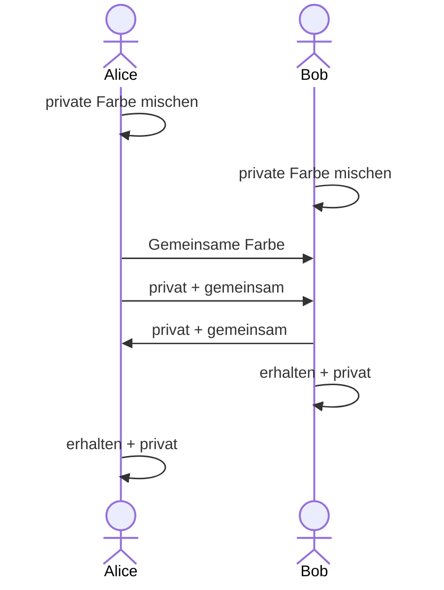

---
sidebar_custom_props:
  source:
    name: rothe.io
    ref: 'https://rothe.io/?b=crypto&p=792141'
page_id: 102143bf-753f-4022-a0f5-39ed133a3a33
---

import PrimefactorizationTiming from "@tdev-components/VisualizationTools/cryptology/PrimefactorizationTiming";
import DefinitionList from "@tdev-components/DefinitionList";
import ColorExchange from "@tdev-components/VisualizationTools/ColorExchange";

# Asymmetrie
Es gibt Vorgänge, die in die eine Richtung einfach durchzuführen sind, in die entgegengesetzte Richtung allerdings sehr aufwändig oder gar unmöglich:

| einfacher Vorgang               | aufwändiger/schwieriger Vorgang                   |
|:--------------------------------|:--------------------------------------------------|
| Kryptobox mit Schlüssel öffnen  | Kryptobox ohne oder mit falschem Schlüssel öffnen |
| offenes Bügelschloss schliessen | Bügelschloss ohne Schlüssel öffnen                |

Diese Beispiele zeigen, worauf die asymmetrische Verschlüsselung basiert:

:::definition[Asymmetrische Verschlüsselung]
Die asymmetrische Verschlüsselung basiert auf Aufgaben, die in eine Richtung einfach auszuführen sind, während man eine geheime Information braucht, um den Vorgang rückgängig zu machen.

Verfügt jemand nicht über diese geheime Information, ist die Umkehrung des Vorgangs **nicht in sinnvoller Zeit** zu bewältigen.
:::

Im folgenden Gibt es zwei Beispiele, die das Prinzip der asymmetrischen Verschlüsselung weiter illustrieren: das erste Beispiel ist eine praktische Anwendung aus der Kunst, das zweite Beispiel ist ein mathematisches Problem (zum Ausprobieren 😉).

## Aus der Kunst: Geheime Farbe
Alice und Bob arbeiten an einem neuen Kunstwerk, auf das die Öffentlichkeit gespannt wartet. Die beiden möchten dafür **eine** ganz besondere Farbe verwenden. Diese Farbe soll aber unbedingt bis zur Vernissage **geheim bleiben**. Alice und Bob wohnen weit auseinander und können sich nicht treffen, um die geheime Farbe gemeinsam herzustellen, sie können sich lediglich Farbkübel per Post zusenden.

**Wie soll das gehen?** Alice und Bob haben eine Idee und gehen wie folgt vor:

:::flex
  <DefinitionList>
    <dt>Private Farbe</dt>
    <dd>**Schritt 1**: Alice und Bob mischen sich je in einem Farbkübel eine persönliche, geheime Farbe, die sie niemandem mitteilen (private Farbe genannt).</dd>

    <dt>Öffentliche Farbe</dt>
    <dd>**Schritt 2** Alice wählt nun zusätzlich eine Farbe, die nicht geheim gehalten wird. Sie füllt zwei grosse Farbkübel mit dieser Farbe, einen behält sie für sich selbst, den anderen schickt sie per Post an Bob (öffentliche Farbe genannt).</dd>

    <dt>Zwischenfarbe</dt>
    <dd>**Schritt 3**: Im nächsten Schritt mischen sich Alice und Bob je in einem leeren Farbkübel eine neue Farbe: Sie nehmen dazu genau dieselbe Menge der eigenen privaten Farbe und der gemeinsamen Farbe. Diese neue Farbe schicken sie sich wieder gegenseitig zu.</dd>

    <dt>Zielfarbe</dt>
    <dd>**Schritt 4**: Im letzten Schritt erzeugen Sie die Zielfarbe fürs Kunstwerk. Dazu nehmen sie zwei Einheiten der soeben erhaltenen Farbe und eine Einheit der privaten Farbe und erhalten die gemeinsame private Farbe, mit der sie die Teile des neuen Kunstwerks bemalen.</dd>
  </DefinitionList>
::br

:::

### Eve
Die neugierige Journalistin Eve möchte unbedingt wissen, was Alice und Bob aushecken, um noch vor der Vernissage einen exklusiven Zeitungsbericht zu veröffentlichen. Daher versucht sie, an die gemeinsame private Farbe zu gelangen. Sie überwacht die Post und füllt sich von jeder transportierten Farbe ein wenig in eigene Behälter ab.

### Ausprobieren
::::aufgabe[Geheime Farbe herausfinden]
<TaskState id="aa92e889-4064-4cb9-a7ff-244f40c0971d" />
Bestimmen Sie je eine Farbe für Alice und Bob und schauen Sie sich die Ergebnisse an.

<ColorExchange />

---
  
Wieso erhalten Alice und Bob schlussendlich dieselbe Farbe?

<QuillV2 id="e247b1be-ff28-4ed1-a997-8d5d0534dcc1" />

<Solution id="59e1d25e-34de-4d03-8a59-dbea32d03786">
Bob und Alice beginnen je mit ihrer Geheimfarbe. Zudem gibt es eine öffentliche Farbe, die beide kennen.
  
Alice kreiert anschliessend die Farbmischung "Alice + Öffentlich", und Bob kreiert "Bob + Öffentlich".

Diese beiden Mischungen tauschen Sie dann über den öffentlichen Kanal aus (wieso das okay ist, ist die Frage der nächsten Aufgabe). Jetzt kann Alice aus ihrer Geheimfarbe und er Mischung "Bob + Öffentlich" ihre finale Mischung "Alice + Bob + Öffentlich" produzieren. Analog dazu produziert Bob seien finale Mischung "Bob + Alice + Öffentlich". Diese beiden Mischungen sind natürlich identisch.
</Solution>
::::

:::aufgabe[Wieso kennt Eve die geheime Farbe nicht?]
<TaskState id="def3cec1-d468-4ad1-85b2-efdbe939dd2b" />

Wieso kann Eve aus den verschickten Farben die geheime Farbe nicht herstellen?

<QuillV2 id="d07e338d-ece1-4234-bec8-d7a38701cc78" />

<Solution id="348ad1ee-f158-43c3-a83f-1b05bd7d2594">
Eine Mischung aus zwei Farben lässt sich natürlich nicht einfach "entmischen". Im Prinzip ist es aber nicht völlig ausgeschlossen, dass Eve die Geheimfarben von Bob und Alice dennoch rekonstruieren könnte. Schliesslich kennt sie die öffentliche Farbe. Sie könnte die öffentliche Farbe also mit allen möglichen anderen Farben mischen, bis sie irgendwann eine der beiden Farbmischungen erhält. Allerdings gibt es sehr viele (theoretisch sogar unendlich viele) mögliche Farben. Dieser Prozess würde also enorm lange, oder sogar unendlich lange dauern.
</Solution>
:::

:::aufgabe[Sicherheitsprinzip]
<TaskState id="117e1271-dbe9-42b8-bb03-411a24003e1a" />

Worauf beruht die Sicherheit des Verfahrens? Wieso ist es für Eve so schwierig, die geheime Farbe zu rekonstruieren?

<QuillV2 id="f5dfe637-37e0-451d-9195-a74d7c0379f9" />

<Solution id="d52adace-b67c-4648-b888-3295f28c5170">
Eine Mischung aus zwei Farben lässt sich natürlich nicht einfach "entmischen". Im Prinzip ist es aber nicht völlig ausgeschlossen, dass Eve die Geheimfarben von Bob und Alice dennoch rekonstruieren könnte. Schliesslich kennt sie die öffentliche Farbe. Sie könnte die öffentliche Farbe also mit allen möglichen anderen Farben mischen, bis sie irgendwann eine der beiden Farbmischungen erhält. Allerdings gibt es sehr viele (theoretisch sogar unendlich viele) mögliche Farben. Dieser Prozess würde also enorm lange dauern.

Das Sicherheitsprinzip beruht also darauf, dass es zwar sehr einfach ist, zwei Farben zu mischen, aber sehr schwierig, eine Mischung wieder in die ursprünglichen Farben zu zerlegen. Dieses Prinzip wird auch bei der Verschlüsselung verwendet.
</Solution>
:::

## Ein mathematisches Problem dieser Art
Auch in der Mathematik gibt es Operationen, die einfach und schnell auszuführen sind. Die Umkehrung jedoch ist selbst für einen Computer aufwändig und kann Jahre dauern.

Ein Beispiel dafür ist das Multiplizieren zweier (Prim-)Zahlen. Jeder Computer kann pro Sekunde mehrere Milliarden Multiplikationen ausführen. Ein Produkt zweier Primzahlen in die beiden Faktoren zu zerlegen, ist jedoch ungleich aufwändiger - insbesondere wenn die Zahlen mehrere hundert Stellen lang sind.

:::aufgabe[Multiplizieren vs. Faktorisieren]
<TaskState id="0690bbc7-87eb-4701-ba6e-7bd92f2aa3f3" />
1. Berechnen Sie $41 \cdot 83$ auf Papier. Überlegen Sie sich dabei, wie Sie vorgehen.
2. Schaffen Sie es, die Zahl $3397$ in ihre zwei Primfaktoren zu zerlegen? Und $1117$? Wie könnte man dabei vorgehen?

<QuillV2 id="da368276-a071-48d8-82ec-24aa2d5ef4e0" />

<Solution id="196cf4d4-60a0-466b-976d-4c4b06ca56af">
1. z.B. schriftliche Multiplikation -> für Mensch und Maschine sehr einfach.
2. Primzahlen durchprobieren
   * Primfaktoren von $3397$:
      * Teilbar durch $2$? → Nein.
      * Teilbar durch $3$? → Nein.
      * Teilbar durch $5$? → Nein.
      * ...
      * Teilbar durch $43$? → Ja!
      * $3397$ = $43$ * $79$
      * $79$ ist ebenfalls eine Primzahl
      * → Die Primfaktoren sind $43$ und $79$
   * Primfaktoren von 1117:
      * 1117 ist bereits ein Primzahl.
   * Das Problem: Das Vorgehen ist zwar recht einfach. Allerdings müssen wir dazu für jede Zahl wissen, ob sie eine Primzahl ist. Um herauszufinden, ob eine Zahl $x$ eine Primzahl ist, müssen wir für jede Zahl $y$ von $2$ bis $\sqrt{x}$ prüfen, ob $x$ durch $y$ teilbar ist. Wenn das für keine Zahl $y$ der Fall ist, dann ist $x$ eine Primzahl. Dieser Prozess ist enorm aufwändig. Zwar können wir natürlich Listen von Primzahlen erstellen und diese dann später wieder verwenden. Solche Listen können aber auch nicht unendlich gross werden, denn irgendwann geht uns der Speicherplatz aus. Wenn wir also für eine genügend grosse Zahl bestimmen müssen, ob es sich dabei um eine Primzahl handelt, dann haben wir ein Problem...

</Solution>
:::

### Ausprobieren

<PrimefactorizationTiming />

:::aufgabe[Aufwand für den Computer]
<TaskState id="005edc1e-5908-4bc7-a031-9f79a540e770" />
1. Wie schnell sind Computer beim Multiplizieren und Faktorisieren? Überprüfen Sie mit dem untenstehenden Experimentier-Tool, wie schnell Ihr Computer beim Multiplizieren und Faktorisieren von grossen Primzahlen ist. Verwenden Sie für jede Grössenordnung (6, 7, 8, evtl. 9 und 10 stellige Primzahlen) mehrere ($>3$) Messungen vor.
2. Halten Sie die Messergebnisse fest - kopieren Sie dazu den Plott der Messwerte als Bild in die Antwort.
3. Was bedeutet es für eine kryptographische Anwendungen, wenn die beiden Primzahlen statt `9` oder `10` Stellen mehrere hundert Stellen lang sind?

<QuillV2 id="cf5670a3-e0ea-45f9-8705-002b312c72da" />

<Solution id="1d39392f-c263-4c86-8b86-8f182fd39e80">
Messwerte auf einem modernen Laptop für zwei Primzahlen mit...:
* ... 6 Stellen: \<1ms zum Multiplizieren, ca. 10ms zum Faktorisieren
* ... 7 Stellen: \<1ms zum Multiplizieren, ca. 110ms zum Faktorisieren
* ... 8 Stellen: \<1ms zum Multiplizieren, ca. 1 Sekunde zum Faktorisieren
* ... 9 Stellen: \<1ms zum Multiplizieren, ca. \>1 Minute zum Faktorisieren
* ... 10 Stellen: \<1ms zum Multiplizieren, ca. \>13 Minute zum Faktorisieren

Je nach Grösse der Zahl würde es Tage, Monate, oder sogar Billionen von Jahren dauern, um eine so grosse Zahl in ihre Primfaktoren zu zerlegen. Das erinnert Sie vielleicht an das Beispiel mit der geheimen Farbmischung...!
 
Analog zu ihrer Geheimfarbe könnten sich Alice und Bob beispielsweise je eine geheime Primzahl ausdenken - die muss nicht einmal besonders gross sein. Dann verwenden Sie eine öffentlich bekannte, sehr grosse Primzahl (die «öffentliche Farbe») und multiplizieren ihre geheime Primzahl mit der öffentlichen Primzahl. Ihre jeweiligen Ergebnisse könnten sie dann bedenkenlos über einen ungesicherten Kanal austauschen, ohne dass Eve daraus die beiden Geheimzahlen eruieren kann: die Geheimzahlen sind nämlich die Primfaktoren dieser «Zahlen-Mischung», und die Faktorisierung würde - wie wir gerade gelernt haben - enorm lange dauern.
</Solution>
:::

## In der Kryptographie
Die beiden Beispiele zeigen, wie asymmetrische Verschlüsselung funktioniert. In der Kryptographie werden asymmetrische Verfahren eingesetzt, um **geheime Schlüssel** für symmetrische Verschlüsselungsverfahren auszutauschen. Die asymmetrische Verschlüsselung ist also ein Hilfsmittel, um die eigentliche Verschlüsselung mit einem symmetrischen Verfahren durchzuführen. Die asymmetrische Verschlüsselung ist also nicht für die Verschlüsselung selbst gedacht, sondern für den Austausch von geheimen Schlüsseln, die dann für die eigentliche Verschlüsselung verwendet werden.

:::insight[Gemeinsame Geheimzahl]
Sie haben weiter Oben bereits gelernt, wie sich Bob und Alice auf eine gemeinsame **Geheimfarbe** einigen können. Noch praktischer wäre es, wenn sie sich stattdessen auf eine gemeinsame Geheim**zahl** einigen könnten. Diese könnten sie dann mit einer entsprechenden Abmachung als geheimen Schlüssel für ein symmetrisches Verschlüsselungsverfahren verwenden (angenommen, sie verwenden ein präzises Messgerät, welches für die Farbe deren __RGB__-Werte ausgibt).
:::

::::aufgabe[⭐️ Die mathematische Seite]
<TaskState id="c15e7a27-7669-478f-8ec2-7bf087585ac0" />
Wenn Sie wissen möchten, wie Bob und Alice aus mathematischer Sicht zu einer solchen gemeinsamen Geheimzahl kommen können, dann schauen Sie sich dieses Video an:
::youtube[https://www.youtube.com/embed/Yjrfm_oRO0w?si=Nwy4vh_qLeAG3bPR]

:::insight[Vereinfachung]
Im Video werden einige mathematische Prinzipien etwas vereinfacht dargestellt. Tatsächlich werden nicht $g^a$ und $g^b$ über den öffentlichen Kanal ausgetauscht, sondern $g^a \mod n$, respektive $g^b \mod n$.
:::
::::

---