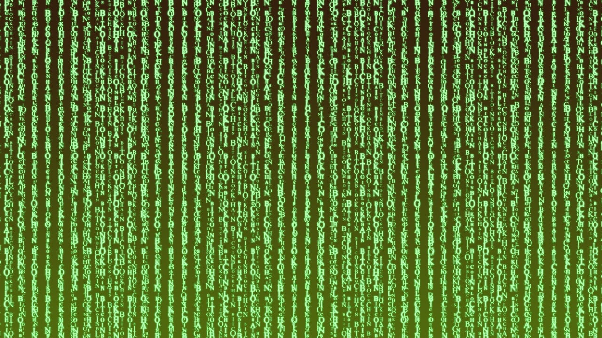

import DefinitionList from "@tdev-components/DefinitionList";
import CmsText from '@tdev-components/documents/CmsText';
import WithCmsText from '@tdev-components/documents/CmsText/WithCmsText';

# Kryptologie
:::cards

:::

:::info[Note]
<WithCmsText 
    entries={{
        name: "9ad0c107-28ef-4987-8f15-2976bd9e4a7a",
        punkte: "44024b46-00dd-4739-972a-f0765074a129", 
        note: "a3ede29b-6d1a-453f-b835-f09a52578239"
    }}
>
    <DefinitionList>
        <dt>Name</dt>
        <dd><CmsText name="name" /></dd>
        <dt>Punkte</dt>
        <dd><CmsText name="punkte" /></dd>
        <dt>Note</dt>
        <dd><CmsText name="note" /></dd>
    </DefinitionList>
</WithCmsText>
:::

# Lernziele

:::note[Begrifflichkeiten]
-Sie können die Kryptographie und die Kryptolanalyse als Teilbereiche der Kryptologie, sowie deren Hauptaufgaben nennen.
-Sie können die Grundbegriffe der Kryptographie nennen, erklären und miteinander in Zusammenhang setzen.
-Sie können die vier Sicherheitsziele nennen und erklären.
- Sie können für ein konkretes Fallbeispiel erörtern, inwiefern die jeweiligen Sicherheitsziele darin (primär) verfolgt werden.
:::

:::note[Verschlüsselungsverfahren]
- Sie können die Funktionsweisen der gelernten antiken Chiffren (Skytale, Polybios, Caesar, monoalphabetische Substitution, Vigenère) erklären.
- Sie verstehen das Prinzip symmetrischer Verschlüsselungsverfahren und wenden Erkenntnisse in Beispielen mit antiken Verfahren an.
- Sie können den Zusammenhang zwischen der Vigenère-Chiffre und der Caesar-Chiffre erklären.
- Sie können mit allen gelernten antiken Chiffren und mit einem gegebenen Schlüssel eine Nachricht ver- und entschlüsseln.
- Sie können für ein gegebenes Verschlüsselungsverfahren die Grösse seines Schlüsselraums (Anzahl möglicher Schlüssel) mit der Effizienz / Machbarkeit eines Brute-Force-Angriffs in Zusammenhang bringen.
- Sie können erklären, weshalb es sich bei der Caesar-Verschlüsselung und der monoalphabetischen Substitution nicht um starke, sondern um schwache Verschlüsselungen handelt.
- Sie können einen Caesar-verschlüsselten Text mithilfe der Häufigkeitsanalyse ohne Kenntnis des Schlüssels entschlüsseln. Sie können zudem erklären, wie man dieses Verfahren verallgemeinert auf die monoalphabetische Substitution anwenden kann.
- Sie wissen, wie der ECB und CBC Modus funktionieren und können diese exemplarisch mit XOR als Verschlüsselungsalgorithums anwenden.
    - Sie können erklären, weshalb man bei modernen Verschlüsselungsverfahren mit binärcodierten Daten arbeitet und welche Vor- und Nachteile dies mit sich bringt.
    - Sie können Texte und Pixelgrafiken (im «Pentacode-Stil») von Hand mit Pentacode codieren und decodieren.
    - Sie können Texte und Pixelgrafiken mit der XOR-Chiffre ver- und entschlüsseln.
    - Sie können die Funktionsweise der Blockchiffre im ECB- und CBC-Modus erklären und die beiden Modi miteinander vergleichen.
    - Sie können Texte und Pixelgrafiken mit der XOR-Blockchiffre im ECB- und im CBC-Modus ver- und entschlüsseln.
- Sie kennen das Prinzip von Kerckhoffs und können begründen, wieso es sinnvoll ist, die Funktionsweise von Algorithmen nicht geheimzuhalten (*Security through Obscurity*).
- Sie können für ein konkretes Fallbeispiel erörtern, ob Kerckhoffs' Prinzip dort befolgt wurde.
- Sie wissen, dass moderne symmetrische Verfahren mit Bitfolgen anstelle von Buchstaben arbeiten und mathematisch viel komplexer sind.
- Sie erkennen das Problem des Schlüsselaustauschs bei symmetrischen Verfahren (z.B. über unsichere Kanäle).
- Sie kennen **Man-in-the-Middle-Angriffe** und verstehen, dass auch öffentliche Schlüssel auf ihre Echtheit überprüft werden müssen.
- Sie begreifen **asymmetrische** Verfahren mit ihren Schlüsselpaaren als Hilfsmittel für einen sicheren Austausch (z.B. Vorhängeschloss/Schlüssel-Analogie oder Box mit einem Verschluss zum schliessen und einem zum öffnen).
- Sie wissen, dass die Sicherheit asymmetrischer Verschlüsselungsverfahren darauf beruht, dass es für gewisse mathematische Operationen keine effiziente Möglichkeit gibt, sie rückgängig zu machen.
- Sie können asymmetrische Ansätze zur Übertragung einer geheimen Nachricht ("Geheime Truhe", "Farben mischen"), sowie allfällige Schwächen dieser Ansätze nennen und erklären.
- Sie können erklären, wie eine Nachricht über asymmetrische Verschlüsselung an eine oder mehrere Personen versendet wird.
- Sie können die Rolle des öffentlichen und des privaten Schlüssels in der asymmetrischen Verschlüsselung erklären.
- Sie können die symmetrische und asymmetrische Verschlüsselung miteinander vergleichen.
- Sie können beschreiben, wie symmetrische und asymmetrische Verfahren zur Ver- und Entschlüsselung miteinander kombiniert werden können.
- Sie verstehen, dass **Zertifikate** zur Bestätigung der Echtheit von öffentlichen Schlüsseln durch eine vertrauenswürdige Stelle mit Hilfe einer digitalen Signatur verwendet werden.
:::

:::note[Hashfunktionen]
- Sie wissen, dass Passwörter nicht im Klartext gespeichert werden.
- Sie können die Wünsche / Anforderungen an eine kryptographische Prüfsumme / Hashfunktion nennen, erklären und begründen.
- Sie kennen die Zielsetzung und die Funktionsweise von Hashverfahren (Stichworte *sicheres Speichern von Passwörtern*, *Intregritätsprüfung*)
- Sie können erklären, weshalb wir Passwörter immer in Form von Prüfsummen (Hashwerten) speichern müssen.
- Sie kennen Angriffsmöglichkeiten auf Passworthashes (*Dictionnary*, *Brute Force*).
:::

:::note[Digitale Signaturen]
- Sie verstehen, dass das Prinzip der asymmetrischen Verschlüsselung auch für digitale Signaturen eingesetzt werden kann.
- Sie kennen die Rolle von Zertifizierungsstellen.
:::

:::warning[Unterrichtsinhalte]
An der Prüfung werden auch Inhalte/Diskussionen/Experimente zu den obigen Themen aufgegriffen, welche nur im Unterricht behandelt/diskutiert wurden.
:::
