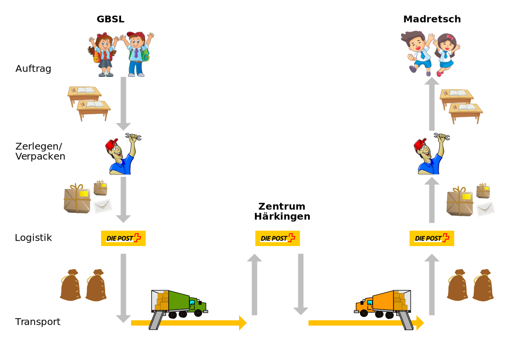

import PageReadCheck from '@tdev/page-read-check/PageReadCheck';

#  Schicht 1: Physikalische Schicht (Netzzugangsschicht)

Auf der physikalischen Schicht geht es um das konkrete Transportmittel (Velokurier, Lastwagen, ... resp. WLAN, LAN, Mobilfunk, ...). Auch hier werden Adressen benötigt, es sind weltweit eindeutige Adressen, die fix an das Gerät geknüpft sind.

## Beispiel «Schule»
Im Beispiel «Schule» müssen die Säcke, die die vielen Pakete enthalten, nun endlich transportiert werden. Dies übernehmen Speditionsangestellte, die die Säcke mit Hilfe von Lastwagen an den nächsten Zielort (z.B. in ein Paketzentrum oder an die Lieferadresse) bringen. Die Spedition kümmert sich nur um den aktuellen Transportabschnitt.

## Internet

Die physikalische Schicht besteht aus der Hardware, also den Kabeln und Geräten (mit ihren physikalischen Adressen). Die physikalische Adresse wird MAC-Adresse genannt (siehe Begriff MAC-Adressen).

Wieso braucht es zwei Adressen, logische Adressen (Vermittlungsschicht) und physikalische dieser Schicht? Innerhalb eines lokalen Netzwerks werden die physikalischen Adressen verwendet. Da es aber keine Möglichkeit gibt, alle physikalischen Adressen auf der Welt zu kennen und zu wissen, wie man diese Geräte erreichen kann, braucht es logische Adressen, die zu einem bestimmten Netzwerk gehören. Nur so ist es möglich, mit dem gleichen Gerät am Morgen zu Hause und später an der Schule online zu sein.

---

<PageReadCheck 
  minReadTime={120}
  id="4be758cb-645a-4cd8-925b-4221446a36b3"
/>

### Weitere Informationen

::youtube[https://www.youtube-nocookie.com/embed/ZhEf7e4kopM]

<PageReadCheck 
  text={(unlocked, doc) => unlocked ? 'Gesehen?' : `Gesehen? (${doc.fReadTime})` }
  disabledReason={(doc) => `Mindestens ${doc.meta.fMinReadTime} Video ansehen, um zu entsperren.`}
  minReadTime={360}
  id="81f725ad-f187-40a4-99d1-13a2ec21cbf6"
/>