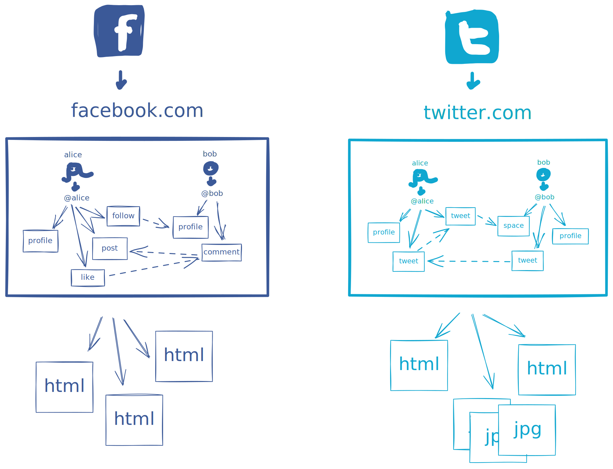
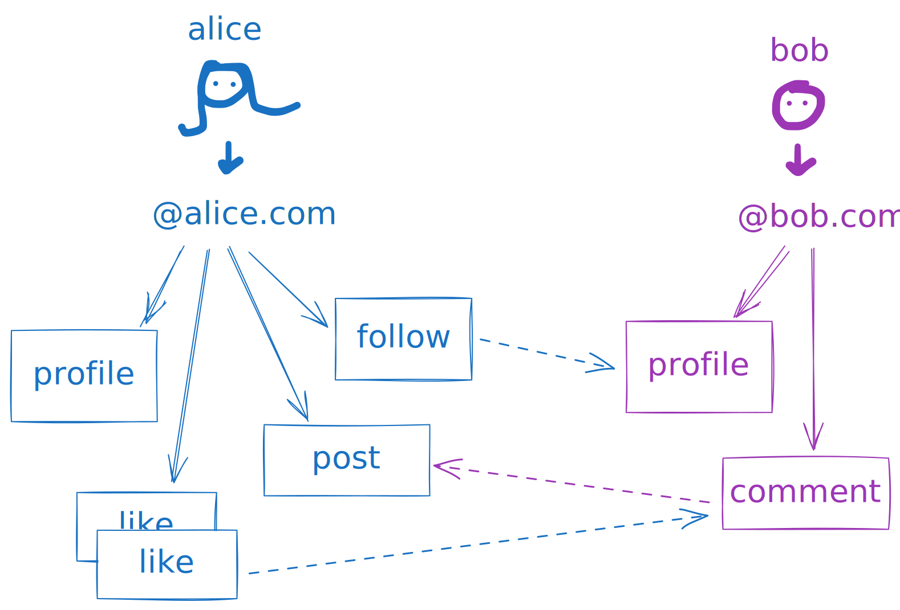
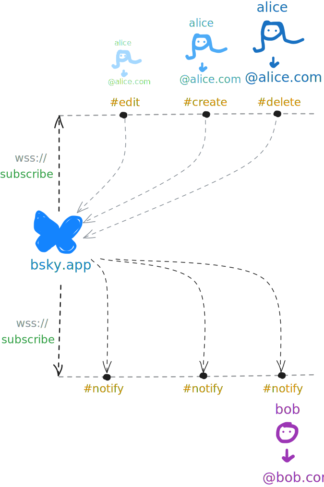

# Open Social Network

:::tip[Links]
Blogposts
: [Open Social](https://overreacted.io/open-social/) by Dan Abramov
: [Where it's at](https://overreacted.io/where-its-at/)
: [A Social Filesystem](https://overreacted.io/a-social-filesystem/)
Tools
: inspektion des AT-Protokolls https://pdsls.dev/
: Spezifikation https://atproto.com/
Alternativen
: **TikTok** https://skylight.social/
: **Twitter** https://bsky.app/
: **Microblogging** https://leaflet.pub/
:::

## Offen vs. geschlossen

:::cards{flexBasis="350px"}

::br

:::

:::aufgabe[Unterschiede]
<Answer type="state" id="a64edddf-c5d2-409c-8e20-4e736e9c5881" />

Wo liegt der Unterschied zwischen offenen und geschlossenen sozialen Netzwerken?
1. Wer hat Zugriff auf die Daten?
2. Wer entscheidet über den Ort der Datenspeicherung?
3. Was passiert, wenn die Firma hinter der App eines sozialen Netzwerks pleite geht?
4. Weitere Unterschiede?

<Answer type="text" id="e14cf2c1-7337-4596-9f25-4707e6feaa33" />
:::

## Domains vs AT-Handles

Ein AT-Handle ist wie eine Domain, die einen Namen zu einer IP-Adresse auflöst. Anstelle einer IP-Adresse löst ein AT-Handle jedoch auf eine Useridentifikation (die __did__ des Users) auf, z.b. `at://gbsl.website` verlinkt auf die __did__ `did:plc:rrmh6qmue5dv2nhq2ebffqe7`. Diese __did__ bleibt applikationsübergreifend gleich, auch wenn der User seinen AT-Handle ändert.

:::aufgabe[AT-Handles]
<Answer type="state" id="d31bc6bf-669b-4659-b54f-06c2546f8bf8" />

Tool
: https://pdsls.dev/

- Finden Sie die __did__ von `at://gbsl.website` mit obigem Tool heraus.
- Was für Sammlungen (Kollektionen) hat `at://gbsl.website`?  
    <Answer type="text" id="ab8fd0a3-aa5c-473e-bbd1-40e77e424766" />
- Wie viele Beiträge hat `at://gbsl.website` auf Bluesky geliked? Finden Sie die Inhalte dieser Beiträge heraus?  
    <Answer type="text" id="d9c8e1b7-5a0c-4f1e-9b3c-2a7e5f8c9e6a" />
:::

## AT-Protokoll

Das AT-Protokoll ist ein offenes Protokoll, das von der Firma Bluesky entwickelt wurde. Es ermöglicht die Interaktion zwischen verschiedenen sozialen Netzwerken, die das Protokoll unterstützen.

:::aufgabe[AT-Protokoll]
<Answer type="state" id="8ca6aef8-c2cb-431e-8d36-da117a59746f" />

Weshalb spielt es für Apps die das AT-Protokoll verwenden keine Rolle, wo die Daten gespeichert werden? Halten Sie in eigenen Worten fest, wie das Apps Änderungen "mitkriegen" und diese ihre User weitergeben können.

<Answer type="text" id="f0174162-a3e2-4060-8839-44c916fab1a6" />

:::

:::aufgabe[AT-Stream]
<Answer type="state" id="7f325615-9a0e-49ab-9787-864fce6e8eac" />

Tool
: https://pdsls.dev/jetstream

1. Erstellen Sie einen Bluesky-Account und finden Sie Ihre __did__ mit https://pdsls.dev heraus.
2. Verbinden Sie sich mit https://pdsls.dev/jetstream auf den Bluesky-Stream und filtern Sie nach Ihrer __did__.
3. Posten Sie einen Beitrag auf Bluesky und beobachten Sie, wie dieser Beitrag im Stream auftaucht.
4. Liken Sie einen Beitrag auf Bluesky und beobachten Sie, wie dieser Like im Stream auftaucht.
5. Markieren Sie die Aufgabe als erledigt, wenn Sie die Schritte 1-4 durchgeführt haben.
:::