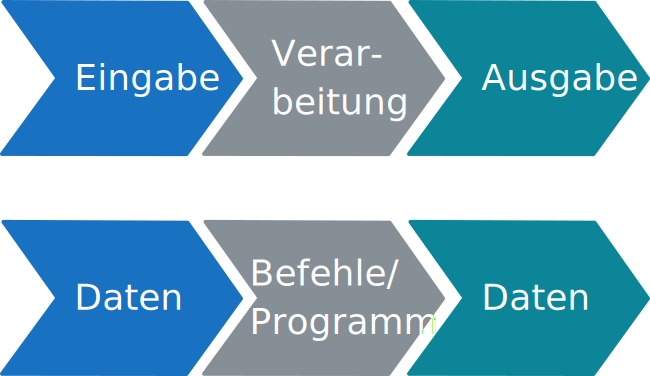
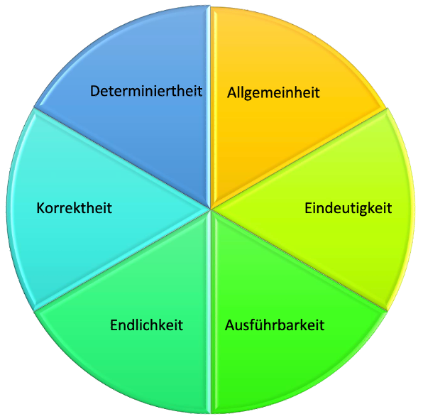

# Algorithmus

## Definition

> «Ein Algorithmus beschreibt die Methode, mit der eine Aufgabe gelöst wird. Ein Algorithmus besteht aus einer Folge von Schritten, deren korrekte Abarbeitung die gestellte Aufgabe löst. Die Abarbeitung oder den Vorgang selbst bezeichnet man als Prozeß.»
> 
> Les Goldschlager/Andrew Lister: *Informatik*, 1984

Damit wir von einem Algorithmus sprechen, müssen also **zwei** Bedingungen erfüllt sein:
1. Es muss eine **Schritt-für-Schritt-Anleitung** vorliegen.
2. Diese Schritt-für-Schritt-Anleitung muss eine **Aufgabe oder ein Problem lösen**.

Die folgende Tabelle zeigt ein paar Beispiele von Prozessen mit zugehörigem Algorithmus:

| Prozess             | Algorithmus                             | Typischer Schritt                 |
|:--------------------|:----------------------------------------|:----------------------------------|
| Kranich falten      | [Faltanleitung](./02-Faltanleitung.mdx) | Papier entlang einer Linie falten |
| Möbel zusammenbauen | [Bauanleitung](./03-Bauanleitung.mdx)   | Schraube anziehen                 |
| Musikstück spielen  | [Notenblatt](./05-Notenblatt.mdx)       | Ein `c'` spielen                  |

## EVA
Algorithmen folgen dem Grundprinzip der Informatik: **EVA** (Eingabe, Verarbeitung, Ausgabe). Dabei wird eine **Eingabe** verarbeitet und es entsteht eine **Ausgabe**. Die Verarbeitung erfolgt in mehreren **Schritten**, die nacheinander abgearbeitet werden.

## Anforderungen
Wir können Algorithmen auf verschiedenen Anforderungen hin prüfen:

| Anforderung          | Beschreibung                                                                                                                                              | Erklärung / Beispiel                                                                                                                                 |
|----------------------|-----------------------------------------------------------------------------------------------------------------------------------------------------------|------------------------------------------------------------------------------------------------------------------------------------------------------|
| **Allgemeinheit**    | Es soll nicht nur ein einzelnes Problem gelöst werden.                                                                                                    | Ein Addier-Algorithmus soll nicht nur 7 + 4 addieren können, sondern zwei beliebige natürliche Zahlen.                                                    |
| **Eindeutigkeit**    | Die Abfolge der einzelnen Schritte soll genau festgelegt sein. Es soll zu jedem Zeitpunkt klar sein, welcher Schritt als nächstes ausgeführt werden muss. | Ein Algorithmus sollte keine Angaben machen wie «jetzt könnte man beispielsweise…»                                                                   |
| **Ausführbarkeit**   | Man (respektive, ein Prozessor) muss jeden Einzelschritt des Algorithmus auch wirklich ausführen können.                                                  | Ein Algorithmus sollte keine Schritte enthalten, die nicht ausführbar sind, wie z.B. «den Himmel berühren».                                          |
| **Endlichkeit**      | Ein Algorithmus soll immer nach einer endlichen Anzahl Schritte zu einer Lösung kommen und auch nur endlich viel Platz auf dem Computer beanspruchen.     | Benötigt er unendlich lange, erhält man nie ein Ergebnis. Benötigt er unendlich viel Platz, kann ihn kein Computer der Welt speichern und ausführen. |
| **Korrektheit**      | Ein Algorithmus soll für alle möglichen (erlaubten) Eingaben zu einer korrekten Lösung kommen.                                                            | Ein Sortier-Algorithmus sollte immer die Elemente in der richtigen Reihenfolge sortieren.                                                            |
| **Determiniertheit** | Ein Algorithmus soll mit den gleichen Eingabewerten immer zur gleichen Ausgabe kommen. Es sollte keinen Zufallsfaktor geben.                              | Die Quadratwurzel aus 49 muss immer 7 geben.                                                                                                         |

:::insight[Welche Anforderungen sind wichtig?]
Diese Anforderungen entscheiden **nicht**, ob es sich um einen Algorithmus handelt oder nicht. Wir nutzen sie, um **Algorithmen zu beschreiben**.

In der Praxis erfüllen Algorithmen nicht zwingend alle Anforderungen:
- **Eindeutigkeit**, **Ausführbarkeit**, **Endlichkeit** und **Korrektheit** sollten immer erfüllt sein, damit wir einen _brauchbaren_ Algorithmus haben.
- **Determiniertheit** ist generell wünschenswert, allerdings **nicht immer** zwingend notwendig.
- **Allgemeinheit** ist eine wünschenswerte Eigenschaft, aber grundsätzlich nicht zwingend notwendig und auch nicht immer umsetzbar.
:::

## Spezielle Sprachen
Algorithmen werden oft in einer **Fachsprache** oder in einer **symbolischen Sprache** verfasst. Damit lassen sich die einzelnen Schritte eines Algorithmus oft **klarer und kürzer** ausdrücken als in der Alltagssprache. Beispiele für solche Sprachen sind:

- Die **Notenschrift** ist eine symbolische Sprache, in welcher die zu spielende Musik kompakt festgehalten werden kann.
- **Rezepte** sind normalerweise in einer Fachsprache verfasst, welche Fachbegriffe wie «Schnee», «schlagen» oder «Glasieren» und Mengenangaben wie «TL» oder «Prise» enthält.
- **Bauanleitungen**, z.B. IKEA-Anleitungen zum Zusammenbau von Möbeln sind in einer nonverbalen Zeichensprache verfasst.

:::insight
Wie die einzelnen Schritte eines Algorithmus lauten, hängt stark vom Gebiet ab, für welches der Algorithmus verwendet wird. Die Einzelschritte beim Spielen eines Musikstücks unterscheiden sich stark von den Schritten beim Kochen.
:::

## Struktur
Ein Algorithmus definiert, in welcher **Reihenfolge** die einzelnen Schritte nacheinander abgearbeitet werden. Die Beschreibung dieser Reihenfolge ist die **Struktur** des Algorithmus. Während die Einzelschritte je nach Anwendungsgebiet unterschiedlich sind, sind die Strukturen (beim Programmieren spricht man von **Kontrollstrukturen**) von Algorithmen universell.

Folgende Strukturen können unterschieden werden:
Sequenz 👣
: eine Folge von Schritten/Anweisungen, die nacheinander abgearbeitet werden.
Wiederholung 🔁
: Einer oder mehrere Schritte werden eine bestimmte Anzahl mal wiederholt.
Bedingte Ausführung ⑂
: Einer oder mehrere Schritte werden nur ausgeführt, wenn eine bestimmte Bedingung erfüllt ist.
Unterprogramm 🏷
: Eine Sequenz kann mit einem Namen versehen werden. Anstatt immer die ganze Sequenz aufzuschreiben, kann der Name angegeben werden.
Parameter ⊕ ⊖
: Das Ergebnis eines Algorithmus kann variiert werden durch Werte, welche bei jeder Ausführung neu festgelegt werden.

## ⭐️ Al-Chwarizmi

Abu Dschaʿfar Muhammad ibn Musa al-Chwārizmī war ein Mathematiker und Universalgelehrter. Er stammte zwar aus dem iranischen Choresmien, verbrachte jedoch den größten Teil seines Lebens in Bagdad und war dort im «Haus der Weisheit», einer Art Akademie, tätig.

Al-Chwarizmi gilt als einer der bedeutendsten Mathematiker, da er sich mit Algebra als elementarer Untersuchungsform beschäftigte.[^1]

In der lateinischen Übersetzung eines Werkes von Al-Chwarizmi wurde sein Name als «algorismus» geschrieben. Davon leitet sich der heutige Begriff «Algorithmus» ab.[^2]

[^1]: Quelle: [Wikipedia: al-Chwarizmi](https://de.wikipedia.org/wiki/Al-Chwarizmi)
[^2]: Quelle: [Wiktionary: Algorithmus](https://de.wiktionary.org/wiki/Algorithmus)
