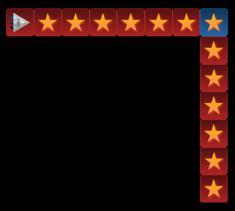
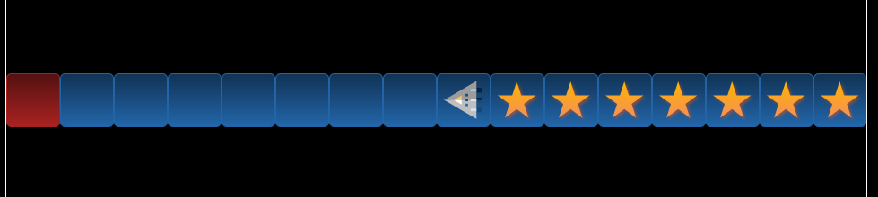
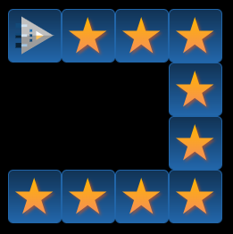

# RoboZZle

Mit algorithmischem Denken können die folgenden RoboZZles (Kunstwort aus **Robo**ter + Pu**zzle**) gelöst werden.

import String from '@tdev-components/documents/String';

export const Solution = ({ fns }) => {
  return (
    

      {fns.map((fn, i) => (
        

          <h3 style={{ width: '4em', marginBottom: 0 }}>{fn.name}:</h3>
          

            {
              [...new Array(fn.fields)].map((_, idx) => {
                return (
                  

                )
              })
            }
          

        

      ))}
    

  );
};

:::cards{flexBasis="275px" alignItems="start"}
    
    [Beispiel 1a](https://alexanderson1993.github.io/robozzle-react/?level=-1)

    <Solution 
      fns={[
        { name: 'Mn', fields: 10}
      ]}
    />
    <Answer type="text" id="ab546c51-c07d-421b-998c-079eec78a7f5" />
  ::br
    
    [Beispiel 1b](https://alexanderson1993.github.io/robozzle-react/?level=-2)

    <Solution 
      fns={[
        { name: 'Mn', fields: 5},
        { name: 'F1', fields: 2}
      ]}
    />
    <Answer type="text" id="f66b338f-0975-4d1c-96ea-9ca923231c6a" />
:::
:::cards{maxWidth="350px"}
  
  [Beispiel 2](https://alexanderson1993.github.io/robozzle-react/?level=-4)

  <Solution 
    fns={[
      { name: 'Mn', fields: 3}
    ]}
  />
  <Answer type="text" id="c69b9a3b-0a8a-4567-8f02-5169552b70e0" />
:::

:::info[Mn, F1, F2,...]
Die Abkürzungen __Mn__, __F1__, __F2__ usw. stehen für die Namen der Unterprogramme - sie geben also einer __Sequenz__ einen Namen, über welche diese aufgerufen werden kann!

__Mn__ ist dabei die Abkürzung für "Main" und steht für das Hauptprogramm, welches beim Klick auf Start ausgeführt wird.
:::

:::tip
Es müssen nicht immer alle Felder eines Unterprogramms ausgefüllt werden. In diesem Fall wird das Unterprogramm nur mit den Feldern aufgerufen, die es auch hat.
:::

## Aufgaben

### 1
:::aufgabe[Robozzle 1]
  <Answer type="state" id="dad7144a-37dc-43b6-8a63-aeb6701186a8" />

  [Puzzle 1](https://alexanderson1993.github.io/robozzle-react/?level=14288)

  

  <Solution 
    fns={[
      { name: 'Mn', fields: 5}
    ]}
  />

  <Answer type="text" id="9ccf235b-728f-4fd9-b174-b0f83f1e0317" />
:::

### 2
:::aufgabe[Robozzle 2]
  <Answer type="state" id="817d4d82-a301-41cd-8f80-2ad7aba43308" />

  [Puzzle 2](https://alexanderson1993.github.io/robozzle-react/?level=14737)

  
  <Solution 
    fns={[
      { name: 'Mn', fields: 8}
    ]}
  />

  <Answer type="text" id="92976a7e-d27c-403c-8cbe-4eedcfa3261c" />
:::

### 3
:::aufgabe[Robozzle 3]
  <Answer type="state" id="cd97fd59-1a05-49f8-9257-6eb44b1cc518" />

  [Puzzle 3](https://alexanderson1993.github.io/robozzle-react/?level=14261)

  
  
  <Solution 
    fns={[
      { name: 'Mn', fields: 9}
    ]}
  />

  <Answer type="text" id="b5058938-6e21-4770-9cfe-89aa580e9613" />
:::

### 4
:::aufgabe[Robozzle 4]
  <Answer type="state" id="300594c6-c18b-43ef-a902-41e299911f62" />

  [Puzzle 4](https://alexanderson1993.github.io/robozzle-react/?level=-3)

  
  <Solution 
    fns={[
      { name: 'Mn', fields: 10}
    ]}
  />

  <Answer type="text" id="303bd090-3c63-4324-8be6-7ee82753fd72" />
:::

### 5
:::aufgabe[Robozzle 5]
  <Answer type="state" id="35bafe95-42d6-4ae6-ba7c-9917ab89cf81" />

  [Puzzle 5](https://alexanderson1993.github.io/robozzle-react/?level=105)

  
  <Solution 
    fns={[
      { name: 'Mn', fields: 4}
    ]}
  />

  <Answer type="text" id="e29d2c96-9ac2-4b81-aa8e-064e0ce0e744" />
:::

### 6
:::aufgabe[Robozzle 6]
  <Answer type="state" id="972be364-ac66-4185-a9ff-80e96b32c421" />

  [Puzzle 6](https://alexanderson1993.github.io/robozzle-react/?level=140)

  
  <Solution 
    fns={[
      { name: 'Mn', fields: 6}
    ]}
  />

  <Answer type="text" id="42e31674-68ff-4f7e-ae71-4067f6c46bf3" />
:::

### 7
:::aufgabe[Robozzle 7]
  <Answer type="state" id="6b8528fe-06ee-447a-af40-d78d8bd978af" />

  [Puzzle 7](https://alexanderson1993.github.io/robozzle-react/?level=27)

  
  <Solution 
    fns={[
      { name: 'Mn', fields: 10}
    ]}
  />

  <Answer type="text" id="1710b7c5-ab54-4547-bfdb-48c15f0ffa12" />
:::

### 8
:::aufgabe[Robozzle 8]
  <Answer type="state" id="dd083a7e-ed85-42aa-b33a-17f7fbcffcf1" />

  [Puzzle 8](https://alexanderson1993.github.io/robozzle-react/?level=15093)

  
  <Solution 
    fns={[
      { name: 'Mn', fields: 4}
    ]}
  />

  <Answer type="text" id="cbbe6c43-65dc-41a4-82b7-5c1aad456217" />
:::

### 9
:::aufgabe[Robozzle 9]
  <Answer type="state" id="24577e8c-1a50-4f6c-9cde-3698e122af1a" />

  [Puzzle 9](https://alexanderson1993.github.io/robozzle-react/?level=12986)

  
  <Solution 
    fns={[
      { name: 'Mn', fields: 10}
    ]}
  />

  <Answer type="text" id="4aceb7b6-07e2-428a-8c6f-10acf1931795" />
:::

### 10
:::aufgabe[Robozzle 10]
  <Answer type="state" id="bad183fc-86cf-4305-bf7d-47bae6ef5d77" />

  [Puzzle 10](https://alexanderson1993.github.io/robozzle-react/?level=16166)

  
  <Solution 
    fns={[
      { name: 'Mn', fields: 3},
      { name: 'F1', fields: 4},
    ]}
  />

  
  <Answer type="text" id="3ced16c8-52d6-4ff1-9b6a-5d8bdc84dda8" />
:::

### ⭐ 11
:::aufgabe[⭐ Mein RoboZZle]
<Answer type="state" id="d5d4c66f-e8f1-4f1e-b435-39e706cf2e8c" />

Suchen Sie sich selber ein spannendes RoboZZle aus und lösen Sie dies. Halten Sie neben der Lösung und dem Link zum Rätsel auch kurz fest, was Sie an diesem RoboZZle besonders interessant fanden.

<String id="8684c66a-591d-489a-8c8b-342f62c49143" type="url" fullWidth>
  
      Link :mdi[link-variant]{.blue}
  
</String>

<Answer type="text" id="0ccf2ee1-7126-41ab-8a3c-4d706a72e5e2" />

:::

### ⭐ 12
:::aufgabe[⭐ Toblerone]
  <Answer type="state" id="e1c17885-8577-4d62-8dfc-4b380458424d" />

  [Puzzle 12](https://alexanderson1993.github.io/robozzle-react/?level=87)

  
  <Solution 
    fns={[
      { name: 'Mn', fields: 5},
      { name: 'F1', fields: 3},
    ]}
  />

  <Answer type="text" id="3c4b4356-e842-4035-a384-3f13aac95eac" />
:::
