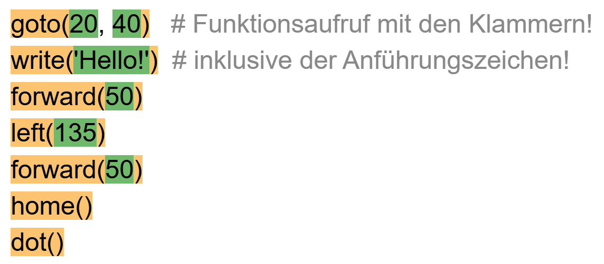
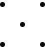
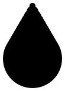
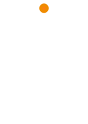
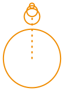
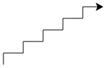

---
keywords:
  - Python
  - Sequenz
  - Unterprogramme
page_id: 4ac09d00-bd4c-4920-bc98-21343e21549b
---
import ProgressState from '@tdev-components/documents/ProgressState';

# 1. Einführung Python 👣

Programmieren heisst, einer Maschine Befehle zu erteilen und sie damit zu steuern. Die erste solche Maschine, die Sie steuern, ist eine kleine Schildkröte (bzw. ein kleines Dreieck) auf dem Bildschirm: Die Turtle :mdi[turtle]{.green}.

Turtlebefehle werden grundsätzlich Englisch geschrieben und enden immer mit einem Klammerpaar. Dieses enthält weitere Angaben zum Befehl. Selbst wenn keine weiteren Angaben nötig sind, muss ein leeres Klammerpaar vorhanden sein. Die Klein-/Grossschreibung muss exakt eingehalten werden.

Die Turtle kann sich innerhalb ihres Fensters bewegen und dabei eine Spur zeichnen. Um die Turtle zu bewegen, verwenden wir die drei Befehle `forward(distanz)`, `left(winkel)` und `right(winkel)`.

## Das erste Programm

Das erste Python-Programm zeichnet ein Quadrat. Damit die Befehle zum zeichnen verwendet werden können, muss zuerst eine Datei mit den entsprechenden Befehlen (ein sogenanntes Modul) `turtle` geladen werden.

```py live_py slim title=Quadrat
from turtle import *

left(90)
forward(80)
left(90)
forward(80)
left(90)
forward(80)
left(90)
forward(80)
```

:::note[`from turtle import *`]

Damit Python die Befehle zum zeichnen verwenden kann, müssen diese zuerst aus einer Bibliothek **importiert** werden. Damit beim Importieren nicht jeder einzelne Befehl angegeben werden muss, wird das Zeichen `*` verwendet welches alle verfügbaren Befehle importiert.
:::

:::note[Befehle: `forward`, `left`]

Alle Befehle in Python sind nach demselben Schema aufgebaut:

- einen Befehlsnamen
- runde Klammern
- _optional_ in den runden Klammern eine Auflistung\* von Parametern, die auch leer sein darf.

```
       forward(90)
       \_____/  \
         /    Parameter (Bedeutung hier: 90 Schritte vorwärts)
Befehlsname

       penup()
       \___/ \
         /   kein Parameter
Befehlsname
```

\* werden mehrere Parameter übergeben, dann werden diese mit Kommas abgetrennt, z.B. `goto(20, 30)`

Wird ein Befehl im Programm ausgeführt, spricht man von einem **Befehlsaufruf** - nebst dem Befehlsnamen gehören auch die runden Klammern dazu!
:::

:::aufgabe[Aufgabe 1]
<Answer type="state" id="240bbc14-fba9-4863-a522-efca0b1aa99e" />

Markieren Sie im untenstehenden Programm folgende Strukturmerkmale eines Algorithmus mit den vorgegebenen Farben:

Unterprogramme
: Aufruf eines Unterprogramms
: <span className="badge badge--warning">Orange</span>
Parameter
: Verwendete Parameter
: <span className="badge badge--success">Grün</span>

<Answer 
  type="text"
  id="df78aeb7-f72b-4053-a554-616cfc7271ec"
  toolbar={{background: true}}
  style={{background: 'white', color: 'black'}}
  default={`goto(20, 40)
write('Hello!')
forward(50)
left(135)
forward(50)
home()
dot()
` }
/>

<Solution id="57e04e8c-cc85-4bb3-aae1-cb68fcf758ed">

</Solution>
:::

::::aufgabe[Aufgabe 2]
<Answer type="state" id="80263b54-c75e-41d1-8ddd-3f8d39ccb056" />

Ändern Sie die Parameter im Programm __QUADRAT.PY__ so ab, dass:

- das Quadrat doppelt so gross gezeichnet wird
- das Quadrat um 45° nach links gedreht gezeichnet wird

```py live_py title=quatrat.py id=7d72f0f0-1928-4f06-8783-09000e8f2f4a
from turtle import *

left(90)
forward(80)
left(90)
forward(80)
left(90)
forward(80)
left(90)
forward(80)
```

#### ⭐️ Zusatz:

Die Form der Turtle kann mit dem Befehl `shape` verändert werden. Ändern Sie auf Zeile `3` die Turtleform auf eine Schildkröte durch **Aufrufen des Befehls** `shape` mit dem **Parameter** `'turtle'`.

:::details[Mögliche Parameter für den Befehl `shape`]
- `'arrow'`
- `'turtle'`
- `'circle'`
- `'square'`
- `'triangle'`
- `'classic'` (standard)
:::

<Solution id="18c86fcd-6e82-4df7-931c-86d5bf528a55">

```py live_py slim
from turtle import *

shape('turtle')
left(135)
forward(160)
left(90)
forward(160)
left(90)
forward(160)
left(90)
forward(160)
```
</Solution>

::::


### Farben

Die Stiftfarbe kann mit dem Befehl `pencolor('red')` auf rot gewechselt werden. Es gibt eine vordefinierte Farbpalette für die Stiftfarben.

```py live_py title=farben slim
from turtle import *

forward(30)
right(90)

pencolor('red')
forward(30)
right(90)

pencolor('blue')
forward(30)
right(90)

pencolor('green')
forward(30)
```

:::details[Gesamte Farbpalette :mdi[palette]{.cyan}]
<div className="small-table no-table-header">

|             |                                                                            |
| :---------- | :------------------------------------------------------------------------- |
| `yellow`    | <div style={{width: '8em', height: '1em', background: 'yellow'}}></div>    |
| `gold`      | <div style={{width: '8em', height: '1em', background: 'gold'}}></div>      |
| `orange`    | <div style={{width: '8em', height: '1em', background: 'orange'}}></div>    |
| `red`       | <div style={{width: '8em', height: '1em', background: 'red'}}></div>       |
| `maroon`    | <div style={{width: '8em', height: '1em', background: 'maroon'}}></div>    |
| `violet`    | <div style={{width: '8em', height: '1em', background: 'violet'}}></div>    |
| `magenta`   | <div style={{width: '8em', height: '1em', background: 'magenta'}}></div>   |
| `purple`    | <div style={{width: '8em', height: '1em', background: 'purple'}}></div>    |
| `navy`      | <div style={{width: '8em', height: '1em', background: 'navy'}}></div>      |
| `blue`      | <div style={{width: '8em', height: '1em', background: 'blue'}}></div>      |
| `skyblue`   | <div style={{width: '8em', height: '1em', background: 'skyblue'}}></div>   |
| `cyan`      | <div style={{width: '8em', height: '1em', background: 'cyan'}}></div>      |
| `teal`      | <div style={{width: '8em', height: '1em', background: 'teal'}}></div>      |
| `turquoise` | <div style={{width: '8em', height: '1em', background: 'turquoise'}}></div> |
| `lawngreen` | <div style={{width: '8em', height: '1em', background: 'lawngreen'}}></div> |
| `green`     | <div style={{width: '8em', height: '1em', background: 'green'}}></div>     |
| `darkgreen` | <div style={{width: '8em', height: '1em', background: 'darkgreen'}}></div> |
| `chocolate` | <div style={{width: '8em', height: '1em', background: 'chocolate'}}></div> |
| `brown`     | <div style={{width: '8em', height: '1em', background: 'brown'}}></div>     |
| `black`     | <div style={{width: '8em', height: '1em', background: 'black'}}></div>     |
| `gray`      | <div style={{width: '8em', height: '1em', background: 'gray'}}></div>      |
| `white`     | <div style={{width: '8em', height: '1em', background: 'white'}}></div>     |

</div>
:::

:::warning[`'string'`]
Beachten Sie die Anführungszeichen rund um die Farb-Namen. Damit Python die Farben als Text (eng. `string`) erkennt und nicht plötzlich nach einem gleichnamigen Befehl sucht, werden rund um Texte immer Anführungszeichen verwendet.
:::

### Stiftbreite

Die Stiftbreite kann mit dem Befehl `pensize(2)` verändert werden. Standardmässig ist die Stiftbreite `1`

```py live_py slim
from turtle import *
forward(20)

pensize(5)
forward(20)

pensize(10)
forward(20)

pensize(15)
forward(20)

pensize(20)
forward(20) 
```


:::warning[Zahlen]
Beachten Sie, dass bei Zahlen keine Anführungszeichen verwendet werden. *Eine Verwechslungsgefahr mit anderen Befehlen besteht nicht, da in Python keine Befehle mit einer Zahl beginnen.*
:::

:::aufgabe[Aufgabe 3: Zickzack]
<Answer type="state" id="e89c6ae9-ae02-43a1-a606-fc3eab08be7e" />

Versuchen Sie, folgendes Zickzack-Muster mit einer Stiftdicke von `5` zu zeichnen. Die Streckenlänge und die Winkel dürfen Sie schätzen.


```py live_py title=zickzack.py id=ab8648f3-80f0-4f24-8470-c7bfeefa9ee6
from turtle import *

```

#### ⭐️ Zusatz:
Machen Sie bei jedem Richtungswechsel einen Punkt:


<Solution id="c78d232b-af05-498f-a671-01919ce85fd2">

```py live_py slim
from turtle import *

pensize(5)

color('red')
left(60)
forward(40)
dot()       # punkt zeichnen
right(120)
forward(40)
dot()       # punkt zeichnen
left(120)

color('orange')
forward(40)
dot()       # punkt zeichnen
right(120)
forward(40)
dot()       # punkt zeichnen
left(120)

color('lime')
forward(40)
dot()       # punkt zeichnen
right(120)
forward(40)
left(120)

hideturtle()
```
</Solution>
:::

## Kommentare

In Python können Kommentare eingefügt werden, die aber auf die Ausführung des Programms **keinen Einfluss** haben.
Kommentare sind eine wichtige Hilfe, um Programme (Algorithmen) besser zu verstehen, oder aber um zusätzliche Informationen, wie den Autor des Programms, festzuhalten.

```py live_py slim
# Autor: B. Hofer
# Datum: 5.09.2021

from turtle import *      # importiere alle Befehle der Bibliothek "turtle"

speed(1)        # verlangsame die Turtle auf die langsamste Geschwindigkeit
forward(100)    # 100 Schritte vorwärts
left(120)       # drehe um 120 ° nach links
speed(3)        # zurück auf Normalgeschwindigkeit
forward(100)
left(120)
speed(10)       # Schneller...
forward(100)
left(120)
hideturtle()    # verstecke die Turtle
```


:::aufgabe[Aufgabe 4: Programm untersuchen]
<Answer type="state" id="77e09573-8d92-443e-892d-c182c405a812" />

1. Versuchen Sie nachzuvollziehen, welche Zeile was macht - welche Unterprogramme sind neu dazugekommen?
2. Fügen Sie auf den ersten Zeilen den **Autor** und das **Datum** hinzu.
3. Fügen Sie immer dann, wenn ein Unterprogramm zum ersten Mal verwendet wird, einen **Kommentar** hinzu, welcher beschreibt, was dieses Unterprogramm macht und, falls vorhanden, welchen Einfluss die Parameter haben.

```py live_py title=Stift-und-Punkte id=764c988c-2a3d-409c-9e03-4dee147d12ba
from turtle import *

forward(40)
left(90)

penup()
forward(40)
dot(10)
right(180)
forward(40)
left(90)
pendown()

forward(40)
left(90)
forward(80)
left(90)
forward(80)
left(90)
forward(80) 
```
:::

:::aufgabe[Aufgabe 5: Würfel]
<Answer type="state" id="41c270a6-4046-415e-8eee-96c84b7b700c" />

Ändern Sie das Programm so ab, dass die gewürfelte Zahl `5` gezeichnet wird:



Verstecken Sie auch die Turtle am Ende! (Code-Beispiel zu den [Kommentaren](#kommentare) studieren)

```py live_py title=Würfel__5.py id=035454e4-9b17-4d93-bd4e-5b1466c2abc6
from turtle import *

forward(40)
left(90)

penup()
forward(40)
dot(5)
right(180)
forward(40)
left(90)
pendown()

forward(40)
left(90)
forward(80)
left(90)
forward(80)
left(90)
forward(80) 
```

<Solution id="4277475d-572c-4795-93fd-96ce7dbcf4a9">

```py live_py slim
from turtle import *

penup()
dot(10)
forward(40)
left(90)

forward(40)
dot(10)
right(180)
forward(40)
left(90)
forward(40)
dot(10)
left(90)
forward(80)
dot(10)
left(90)
forward(80)
dot(10)
left(90)
hideturtle()
```
</Solution>
:::

## Weitere Aufgaben

:::::aufgabe[Aufgabe 6: Regentropt]
<Answer type="state" id="425b06f5-ced0-41b5-9b92-fd2480d6b056" />

Schreiben Sie ein Programm, welches einen Regentropf zeichnet:



::::tip[Herangehensweise]
<ProgressState 
  labels={[
        'Hinweis 1',
        'Hinweis 2',
        'Hinweis 3', 
        'Hinweis 4',
        'Hinweis 5'
    ]}
>
1. Betrachten Sie den Regentropf ganz genau: sehen Sie die Ungereimtheit zuoberst an der Spitze?
2. Dort sieht man, dass es sich um einen Punkt handelt:
  
  Punkte können in Python mit dem Befehl `dot(radius)` gezeichnet werden. Der Radius ist die Grösse des Punktes.
3. Der Regentropf besteht aus mehreren (total 10) untereinander gezeichneten Punkten mit grösserwerdendem Radius.
  
4. Experimentieren Sie, ob Sie den Regentropfen erzeugen können - Abstände und Radien können Sie selber wählen.
5. (falls sie selber keine Konfiguration finden konnten):  
  Zeichnen Sie den ersten Punkt mit Radius `10`, bewegen Sie sich `10` Schritte nach unten und zeichnen Sie den nächsten Punkt mit Radius `20`, dann wieder `10` Schritte nach unten und den nächsten Punkt mit Radius `30` usw. bis zum letzten Punkt mit Radius `100`.
</ProgressState >


::::


```py live_py title=regentropf.py id=e03daaaf-cc34-4cba-ba2d-7e09863f5e54
from turtle import *
```

<Solution id="8474f40c-b720-4ec8-84dc-0b7006509c88">

```py live_py slim
from turtle import *

right(90)

dot(10)
forward(10)

dot(20)
forward(10)

dot(30)
forward(10)

dot(40)
forward(10)

dot(50)
forward(10)

dot(60)
forward(10)

dot(70)
forward(10)

dot(80)
forward(10)

dot(90)
forward(10)

dot(100)
forward(10)
```
</Solution>

:::::


:::aufgabe[Aufgabe 7: Treppe]
<Answer type="state" id="a9da2219-390c-4d3c-8af0-46b92cba6892" />

Zeichnen Sie eine Treppe mit fünf Stufen, die eine Breite von `29` Pixeln und eine Höhe von `17` Pixeln haben.



```py live_py title=treppe.py id=83700b30-a08c-4578-bf5e-292a504fb661
from turtle import *
```

<Solution id="28b5216a-9d13-42f4-b607-00967795957f">

```py live_py slim
from turtle import *

left(90)
forward(17)
right(90)
forward(29)
left(90)
forward(17)
right(90)
forward(29)
left(90)
forward(17)
right(90)
forward(29)
left(90)
forward(17)
right(90)
forward(29)
left(90)
forward(17)
right(90)
forward(29)
```
</Solution>
:::
