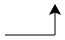

import Strukto from '@site/src/components/VisualizationTools/Strukto';

# 5. Parameter ⊕⊖

Ein weiteres Strukturelement eines Algorithmus sind __Parameter__. Die Verwendung von Parametern haben wir bereits in Aktion gesehen -  im Struktogramm sind alle Parameter <u>unterstrichen</u>, in Python werden alle Parameter als Liste, abgetrennt mit Kommas, in den <u>runden Klammern</u> geschrieben.

:::info[Zur Erinnerung]
Parameter ⊕ ⊖
: Das Ergebnis eines Algorithmus kann variiert werden durch Werte, welche bei jeder Ausführung neu festgelegt werden.
: **Beispiel**: Bei einem Online-Rezept kann der Parameter *Anzahl Personen*  mit den Knöpfen `⊕` und `⊖` variiert werden - die Mengenangaben werden dann aktualisiert, ohne die Reihenfolge der Einzelschritte zu verändern.
:::

::::aufgabe[Aufgabe 1]
<Answer type="state" id="a603eafc-7d9d-4745-b3cd-4613440c1317" />

Markieren Sie im folgenden Programm (links) wie folgt:
- Parameter <u>unterstreichen</u>
- Befehlsnamen <span style={{background: 'yellow'}}>gelb</span> markieren

:::flex
<Answer 
    type="text"
    id="5d982467-ce54-4d49-b02b-5cb031053b34"
    monospace 
    toolbar={{background:1, underline:1}}
    default={`from turtle import *

goto(20, 30)
for i in range(5):
    left(90)
    forward(17)
    right(90)
    forward(29)`}
/>
::br
```py live_py slim
from turtle import *

goto(20, 30)
for i in range(5):
    left(90)
    forward(17)
    right(90)
    forward(29)
```
:::

<Solution id="06202bc8-c764-4a66-ac60-8376eb05aa9a">


</Solution>
::::


Wie können Unterprogramme geschrieben werden, die **Parameter** akzeptieren?

Untersuchen Sie die folgenden Unterprogramme (führen Sie diese aus!) und notieren Sie sich, was Sie feststellen.


:::aufgabe[Unterprogramme mit Parametern]
<Answer type="state" id="42ab260d-417d-4cda-a173-6e11abea1f76" />

`hello.py`
```py live_py slim
def hallo(name):
    print('Hallo', name)

hallo('Maria')
hallo('Reto')
hallo('Hans')
```
`rechnen.py`
```py live_py slim
def quotient(zahl1, zahl2):
    print(zahl1, ':', zahl2, '=', zahl1 / zahl2)

quotient(2, 3)
quotient(5, 9)
quotient(12, 20 + 4)
```

- ⭐️ Was sind die Parameter bei `quotient(12, 20 + 4)`?
- ⭐️ In welcher Reihenfolge werden diese verrechnet? 

<Answer type="text" id="bdc8ef98-1690-49c0-bc81-8b3e50d758fc" />
<Solution id="84d70fe9-937d-4dfa-a12f-193af91d6626">

- Die beiden übergebenen Parameter sind `12` und `24`.
- Bevor die Parameter übergeben werden, werden diese jeweils ausgewertet, daher zuerst wird `20 + 4` berechnet und das Resultat `24` als Parameter übergeben.

</Solution>

:::


## Unterprogramme mit Parametern

Parameter sind also Werte, die an ein Unterprogramm **übergeben** werden können. Damit der übergebene Wert im Unterprogramm **wiederverwendet** werden kann, braucht jeder Parameter einen Namen. Der Wert ist dann über diesen Namen abrufbar. Der **Parametername** ist frei wählbar, sollte aber seine Bedeutung widerspiegeln.

### Beispiel

```py live_py slim
from turtle import *

def quadrat(size):
    for i in range(4):
        forward(size)
        left(90)

color('red')
quadrat(50) # ein Quadrat mit der Grösse 50 zeichnen

color('blue')
quadrat(100) # ein Quadrat mit der Grösse 100 zeichnen
```

Unterprogramm
: `quadrat`
: Zeichnet ein Quadrat mit der übergebenen Grösse.
Parametername
: `size`
: Englisch für "grösse". Der Parameter beschreibt also, wie **gross** das Quadrat, welches vom Unterprogramm gezeichnet wird, sein soll.
: Es wird eine **Zahl** erwartet - mit Text oder anderen Werten kann das Unterprogramm nichts anfangen.

## Mehrere Parameter

Manchmal ist es praktisch (oder auch nötig), mehrere Parameter an ein Unterprogramm zu übergeben. Das sieht man etwa beim Befehl `goto(x, y)`. Beim obigen Programm könnte etwa auch die Farbe direkt im Unterprogramm `quadrat` gesetzt werden:

```py live_py slim
from turtle import *

def quadrat(size, farbe):
    color(farbe)
    for i in range(4):
        forward(size)
        left(90)

quadrat(50, 'red')  # ein rotes Quadrat mit der Grösse 50 zeichnen
quadrat(100, 'blue') # ein blaues Quadrat mit der Grösse 100 zeichnen
```

Es ist prinzipiell möglich, beliebig viele Parameter nacheinander zu übergeben.

:::danger[Häufige Fehler]
Ein häufiger Fehler sind vergessene Kommas zwischen zwei Parameternamen. Dann entsteht ein **SyntaxError**. Die Fehlermeldung macht aber darauf aufmerksam.

```bash
goto(100 200)
     ^^^^^^^
SyntaxError: invalid syntax. Perhaps you forgot a comma?
```
:::


::::aufgabe[Parameternamen]
<Answer type="state" id="a3f42726-24e0-4a66-8a08-5bc74976c567" />

:::cards{min-width=200px}
::br{flex-grow=2 code=true}
```py live_py title=sechseck.py id=fcd69fed-4ed9-4706-954e-c49cf1c8b764
from turtle import *

```
::br{overflow-y=auto max-height=550px flex-grow=1}
1. Definieren Sie das Unterprogramm Namens `sechseck` mit einem Parameter `size`, mit welchem ein Sechseck mit der Grösse `size` gezeichnet werden kann. Rufen Sie das Programm mit `sechseck(20)` auf. 

    
2. Erzeugen Sie nun `10` Sechsecke. Das kleinste Sechseck hat die Seitenlänge `10`, das grösste die Seitenläng `100`.

    

3. Fügen Sie der Funktion `sechseck(size)` den Parameter `farbe` hinzu und erzeugen Sie damit folgendes Bild:

    

    Farben: `violet, indigo, blue, green, lime, lightgreen, yellow, orange, orangered, red`

    ❓ In welcher Reihenfolge müssen die Sechsecke gezeichnet werden, damit genau das obige Bild entsteht?

    **Tipp**: Die Stiftdicke können Sie mit `pensize(10)` auf `10` setzen.
 
:::
<Solution id="ddb86a65-3456-449a-914d-3992bb074adf">

```py live_py slim
from turtle import *

speed(10)

def sechseck(size, farbe):
    color(farbe)
    for i in range(6):
        forward(size)
        left(60)

pensize(10)

sechseck(100, 'violet')
sechseck(90, 'indigo')
sechseck(80, 'blue')
sechseck(70, 'green')
sechseck(60, 'lime')
sechseck(50, 'lightgreen')
sechseck(40, 'yellow')
sechseck(30, 'orange')
sechseck(20, 'orangered')
sechseck(10, 'red')
```
</Solution>

::::

## Wiederholungen

:::finding[Wiederholung: 🔁 Wiederholte Ausführung]
Mit `for i in range(n):` wird eine wiederholte Ausführung vorbereitet. Der nachfolgende **Codeblock** wird `n` Mal wiederholt.
```py live_py slim
from turtle import *
for i in range(4):
    forward(50)
    left(90) 
```
:::

Wozu steht eigentlich das `i` im `for i in range(4)`? Das ist fast wie ein Parameter: `i` enthält die Anzahl bereits ausgeführter Wiederholungen.

:::cards{min-width=220px}
Während Wiederholung 1: `i=0`, keine Wiederholung abgeschlossen ist.

::br
Während Wiederholung 2: `i=1`, eine Wiederholung ist bereits abgeschlossen.

::br
Während Wiederholung 3: `i=2`, zwei Wiederholungen sind bereits abgeschlossen.

::br
Während Wiederholung 4: `i=3`, drei Wiederholungen sind bereits abgeschlossen.

:::

Der Wert, welcher in `i` steht, kann auch verwendet werden:

```py live_py slim
from turtle import *

def quadrat(size):
    for i in range(4):
        forward(size)
        left(90)

for i in range(10):
    quadrat(i * 10 + 10)
```

::::details[⭐️ Zusatzparameter von `range()`]

:::def[`range(start, ende, schritt)`]
Der Befehl `range` kann mit bis zu drei Parametern arbeiten, wobei `start` der erste verwendete Wert, `ende` das obere ganzzahlige Limit angibt (welches aber selber nie erreicht wird!) und `schritt` den Abstand zwischen zwei Zahlen angibt.
```py live_py slim
for i in range(2, 11, 3):
    print(i)
```

Im obigen Beispiel startet `i` bei `2` und wird solange um `3` erhöht, bis die Zahl `11` erreicht oder überschiesst. 

**! 11 wird nicht angenommen**.

:::
::::


::::aufgabe
<Answer type="state" id="222e78e2-9227-4696-916d-8f0c7e147b76" />

1. <Answer type="state" id="0641b4ff-9bf2-452d-a97e-3b7626beb3f2" inline /> Kopieren Sie die Definition eines Hauses aus der letzten Übung in dieses Programm. Modifizieren Sie das Unterprogramm `haus(size)` so ab, dass nun die Grösse des Hauses spezifiziert werden kann. Die Wurzel einer Zahl kann mit `sqrt(zahl)` berechnet werden.
    :::details[Haus von Nikolaus]
    
    :::
2. <Answer type="state" id="ae65d26b-3922-4fe1-a8c8-ff25760325f4" inline /> Schreiben Sie ein Unterprogramm `move(x, y)`, welches die Schritte
   1. Stift heben
   2. zur Position `x`, `y` gehen
   3. Stift senken  
   
   zusammenfasst. 
3. <Answer type="state" id="d291c105-5a41-497d-b2d6-8a0a1941a60b" inline /> Mit dem Befehl `randint(min, max)` aus der Bibliothek `random` kann eine zufällige ganze Zahl erzeugt werden. Dabei muss der kleinst- und grösstmögliche Wert angegeben werden. Mit `move(randint(-20, 20), randint(-20, 20))` kann also die Turtle an eine beliebige Position verschoben werden. Zeichnen Sie 20 Häuser an zufälligen Positionen mit der Grösse `30`.


4. <Answer type="state" id="01b44f0a-a0e7-47c9-a604-c6735e670782" inline /> Wählen Sie nun auch die Grösse zufällig: `haus(randint(10, 100))`
5. <Answer type="state" id="8760223e-f4ac-4d16-b1a9-60b0808add71" inline /> Nun soll auch noch die Farbe zufällig gewählt werden. Der Befehl `choice` aus der Bibliothek `random` gibt jeweils ein zufälliges Element einer Liste zurück: `choice([1, 3, 5, 7, 9])` etwa wählt zufällig eine ungerade Zahl zwischen 1 und 10 aus. Die Liste der Farben:
```py
['violet', 'indigo', 'blue', 'green', 'lime', 'lightgreen', 'yellow', 'orange', 'orangered', 'red']
```

```py live_py title=stadt.py id=125d0c61-4e44-4e13-90bf-e1c99e4bb581
from turtle import *
from math import sqrt
from random import randint, choice

```
<Solution id="9ade393f-3a94-4b7f-87f5-114ffc4f1e60">

```py live_py slim
from turtle import *
from math import sqrt
from random import randint, choice 

def move(x, y):
    penup()
    goto(x, y)
    pendown()

def haus(size):
    # Viereck zeichnen
    for i in range(4):
        forward(size)
        left(90)
    # Diagonale 1
    left(45)
    forward(sqrt(2) * size)
    # Hausdach
    left(90)
    forward(sqrt(2) * size / 2)
    left(90)
    forward(sqrt(2) * size / 2)
    # Diagonale 2
    left(90)
    forward(size * sqrt(2))
    # wieder nach rechts schauen
    left(45)

# Die Programmausführung beginnt hier
speed(20)
pensize(3)

for i in range(30):
    pencolor(choice(['violet', 'indigo', 'blue', 'green', 'lime', 'lightgreen', 'yellow', 'orange', 'orangered', 'red']))
    move(randint(-250, 250), randint(-250, 250))
    haus(randint(10, 100))
```
</Solution>

::::


:::aufgabe[⭐️ Zusatz]
<Answer type="state" id="d89c87d2-8c51-415a-9101-f577aa1f1c65" />

Zeichnen Sie folgende Quadrate. Auf wie viele Zeilen können Sie Ihr Programm kürzen?


```py live_py title=quadrate.py id=a64133e9-5b2e-415a-a884-2671bdb3027e
from turtle import *
```
<Solution id="16dda73a-b4d1-49b1-ac93-8eb7af5ef6b3">

```py live_py slim
from turtle import * 

def move(x, y):
    penup()
    goto(x, y)
    pendown()

for i in range(1, 11):
    move(i * 10, -i * 10)
    for n in range(4):
        left(90)
        forward(i * 20)
```
</Solution>

:::
