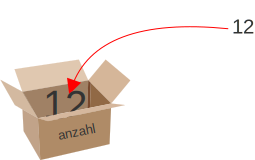
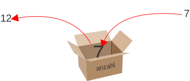

---
sidebar_custom_props:
  id: 3aca4fb7-1b4c-4eea-8dc4-150b29d6ac2b
page_id: 3aca4fb7-1b4c-4eea-8dc4-150b29d6ac2b
---

import Strukto from '@tdev-components/VisualizationTools/Strukto';

# 6. Variablen

## Einführung
Im vorhergehenden Kapitel haben Sie Quadrate gezeichnet, deren Seitenlänge im Programm fest eingebaut waren. Manchmal möchten Sie aber die Seitenlänge mit einem Eingabedialog einlesen. Dazu muss das Programm die eingegebene Zahl als Variable speichern.
Variablen kann man sich wie eine Zügelbox vorstellen, welche mit einem Namen angeschrieben ist. Der Name beschreibt, was sich in der Box befindet, damit man den Inhalt später auch wieder findet.



Mit der Schreibweise `anzahl = 12` wird eine solche Box erstellt. In Zukunft sagen wir, dass damit die Variable `anzahl` **definiert** und ihr einen **Wert zugewiesen** wird. Um den Inhalt der Box zu erhalten, kann der Name (ohne Anführungszeichen) geschrieben werden. Im Struktogramm werden alle Variablen **umrahmt**.

:::flex{width=250px alignItems=center}
<Strukto program={[
    {type: 'step', code: <span><span className="var">anzahl</span> = 12</span>},
    {type: 'step', code: <span>Ausgabe: <span className="var">anzahl</span></span>}
]} />
::br

```py live_py slim
anzahl = 12
print(anzahl)
```
:::

#### Mit Variablen rechnen
```py live_py slim
anzahl = 12
print(anzahl + 13)
```

#### Mehrere Variablen
```py live_py slim
anzahl = 12
gewicht = 100
print(f'{anzahl} Tafeln Schokolade sind {anzahl * gewicht} g schwer')
```

::::details[Formatierter Text: `f'{anzahl} Tafeln'`]
:::def[formatierter Text `f''`]
Variablenwerte lassen sich mit geschweiften Klammern `{}` in einen Text einfügen. Dazu muss zu Beginn des Textes ein kleines `f` (für "fromatierten Text") hinzugefügt werden.

```py live_py slim
name = 'Alfred'
print(f'Hallo {name}')
```
:::
::::

## Überschreiben: Variablen neu Zuweisen 
In einer "Zügelbox" kann immer nur ein einziger Wert gelagert werden. Wenn später also ein neuer Wert in eine bereits beschriftete Zügelbox gelegt wird, so wird zu diesem Zeitpunkt dort liegende Wert verdrängt. Künftig wird diese erneute Zuweisung **Überschreiben einer Variable** genannt.



```py live_py slim
anzahl = 12
print(f'Anzahl = {anzahl}')
anzahl = 7
print(f'Anzahl = {anzahl}')
```

Im obigen Beispiel wird der **initiale Wert** der Variable `anzahl` (12) mit dem neuen Wert `7` überschrieben.

:::finding[Merke: Gültigkeitsbereich]
Die Variable wird **nicht rückwirkend** verändert. Solange eine Variable nicht überschrieben wird, besitzt sie den aktuell zugewiesenen Wert.
:::

:::aufgabe
<Answer type="state" id="62c07ab2-e5a8-4217-8f69-b877055cfd43" />

Was geschieht im untenstehenden Programm? Fügen Sie bei jeder mit `print` startenden Zeile einen Kommentar hinzu mit:
- ausgegebene Zahl `=>`
- aktuell gespeicherter Wert in der Variable `anzahl` `anzahl=`

```py live_py id=17a267c3-da3a-477b-9b1e-9ac027afb70d title=variable.py
anzahl = 2
print(anzahl)       # => 2, anzahl=2
print(anzahl + 2)   #

anzahl = 7
print(anzahl)       #
print(anzahl + 2)   #

anzahl = anzahl + 3
print(anzahl)       #

anzahl = anzahl + 3
print(anzahl + 1)   #

anzahl = anzahl + 3
print(anzahl)       #
```

<Solution id="e6f8fdb3-1edc-4d98-8b4b-65857dc454b8">

```py live_py slim
anzahl = 2          # setzt anzahl=2
print(anzahl)       # => 2, anzahl=2
print(anzahl + 2)   # => 4, anzahl=2

anzahl = 7          # setzt anzahl=7
print(anzahl)       # => 7, anzahl=7
print(anzahl + 2)   # => 9, anzahl=7

anzahl = anzahl + 3 # setzt anzahl=7 + 3
print(anzahl)       # => 10, anzahl=10

anzahl = anzahl + 3 # setzt anzahl=10 + 3
print(anzahl + 1)   # => 14, anzahl=13

anzahl = anzahl + 3 # setzt anzahl=13 + 3
print(anzahl)       # => 16, anzahl=16
```

</Solution>
:::

:::finding[Gleichheitszeichen]
In der mathematischen Sprache wird das Gleichheitszeichen `=` als Gleichung interpretiert. In Programmiersprachen wird es als **Zuweisung** verstanden und die Reihenfolge kann nicht vertauscht werden (z.B. `12 = anzahl` ist nicht gültig).
:::

# Variablenwert einlesen, verändern und ausgeben

Im Programm kann mit Hilfe einer **Eingabebox** ein Wert __eingelesen__ und einer Variable __zugewiesen__ werden.

```py live_py slim
from turtle import *
speed(12)

anzahl = input('Wie viele Strecken soll die Spirale haben?')
anzahl = int(anzahl)

seite = 10
for i in range(anzahl):
    forward(seite)
    left(90)
    seite = seite + 10
```

Zeile 4
: der Wert der Variable `anzahl` wird eingelesen - die Benutzer:in wird nach einer Zahl gefragt - die *Zeile 5* wird erst ausgeführt, wenn die Eingabe gemacht wurde.
Zeile 5
: die eingegebene Zahl in eine ganze Zahl (Integer) umgewandelt - ab jetzt kann der Variablenwert als Zahl gebraucht werden.
: auf *Zeile 8* wird sie für die Anzahl Wiederholungen im `for i in range` verwendet.
Zeile 7
: der Startwert der __Variable__ `seite` wird auf `10` festgelegt.
: Auf *Zeile 9* wird jeweils so viele Schritte vorwärts gemacht, wie der Wert der Variable `seite` beträgt.
Zeile 11
: der Wert der Variable `seite` wird nach jeder Wiederholung um `10` erhöht.
: Damit wird bei der nächsten Ausführung der *Zeile 9* die Seite um `10` Schritte grösser.

:::tip[Eingabe]
In Python ist das Resultat einer Eingabe **immer ein Text**. Ein Text kann aber in eine Zahl umgewandelt werden, so dass dann auch damit gerechnet werden kann.
- Der Befehl `int` wandelt eine Eingabe in eine **ganze Zahl** um.
- Der Befehl `float` wandelt eine Eingabe in eine **Dezimalzahl** um.
:::

Eine eingegebene Zahl kann also entweder in eine ganze Zahl (`int`) oder in eine Dezimalzahl (`float`) umgewandelt werden. 

:::cards{width=400px}
```py live_py slim
# Centimeter zu Meter
grösse = input('Wie gross bist du [cm]?')
grösse = int(grösse)
print(f'Ich bin {grösse / 100} m gross')
```
Die Eingabe `180` wird in eine ganze Zahl umgewandelt und durch `100` geteilt, um die Grösse in Metern zu erhalten.
::br
```py live_py slim
# Meter zu Centimeter
grösse = input('Wie gross bist du [m]?')
grösse = float(grösse)
print(f'Ich bin {grösse * 100} cm gross')
```
Die Eingabe `1.80` wird in eine Dezimalzahl umgewandelt und mit `100` multipliziert, um die Grösse in Zentimetern zu erhalten.
:::


### Eingabe - Struktogramm

Wird ein Wert über eine Eingabeaufforderung eingelesen, so wird dies im Struktogramm mit einem **Parallelogramm** angezeigt, wobei auch die Variable, welcher das Resultat zugewiesen wird, festgehalten wird:

:::flex{width=250px alignItems=center}
<Strukto program={[
    {type: 'input', code: <span><span className="var">grösse</span> = Wie gross bist du [cm]?</span>},
    {type: 'step', code: <span>Ausgabe: Ich bin <span className="var">grösse</span> cm gross.</span>}
]} />
::br

```py live_py slim
grösse = input('Wie gross bist du [cm]?')
print(f'Ich bin {grösse} cm gross')
```
:::

::::aufgabe[Aufgabe 1 - BMI]
<Answer type="state" id="cc20a8bd-6fd0-4d5a-bd18-970cf0d54d53" />

Übersetzen Sie das folgende Struktogramm in Python Code:

:::flex{width=250px}

<Strukto program={[
    {type: 'input', code: <span><span className="var">grösse</span> = Wie gross bist du [m]?</span>},
    {type: 'input', code: <span><span className="var">gewicht</span> = Wie schwer bist du [kg]?</span>},
    {type: 'step', code: <span><span className="var">bmi</span> = <span className="var">gewicht</span> geteilt durch das Produkt von <span className="var">grösse</span> mal <span className="var">grösse</span></span>},
    {type: 'step', code: <span>Ausgabe: BMI: <span className="var">bmi</span></span>}
]} />
::br

```py live_py title=bmi.py id=a2442706-c582-4d76-a347-f91e50f5d3b6
```
:::

:::details[Fehler `TypeError`]
Was ist die Bedeutung des folgenden Fehlers?
```error
TypeError: Can't multiply sequence by non-int of type 'str'
```
→ Der eingegebene Text kann nicht multipliziert werden - zuerst müssen `gewicht` und `grösse` in Dezimalzahlen (`float`) umgewandelt werden: `gewicht = float(gewicht)`.
:::

:::tip[Funktioniert mein Code?]
Probieren Sie den BMI Rechner mit folgendem Beispiel aus:
Grösse
: `1.8` Meter
Gewicht
: `80` Kilogramm
Ergebnis
: BMI: 24.691358
:::

<Solution id="081013e2-4c1c-4353-adb0-cb3c9972d0ab">

```py live_py slim
grösse = input('Wie gross bist du [cm]?')
gewicht = input('Wie schwer bist du [kg]?')

# umwandeln zu Zahlen
grösse = float(grösse)
gewicht = float(gewicht)

bmi = gewicht / (grösse * grösse) # Klammern sind entscheidend!
print(f'BMI: {bmi}')
```
</Solution>
::::

:::aufgabe[Aufgabe 2 – `n-Eck`]
<Answer type="state" id="f84f8da0-180b-4089-8545-584ec4414230" />

Nach der Eingabe der Anzahl Ecken in einer Eingabebox soll die Turtle ein regelmässiges n-Eck zeichnen. Beispielsweise wird nach der Eingabe `8` ein 8-Eck gezeichnet. Den passenden Drehwinkel soll das Programm berechnen. 

```py live_py title=n-eck.py id=5e60a1fd-0c9c-4f6c-9e28-5455e7500d0c
from turtle import *

```

<Solution id="c50312da-a117-4a43-aa9a-d9b2b6488440">

```py live_py slim
from turtle import *
n = int(input('Wie viele Ecken soll das n-Eck haben?'))

for i in range(n):
    forward(40)
    left(360 / n)
hideturtle()
```
</Solution>
:::

:::aufgabe[Aufgabe 3]
<Answer type="state" id="bf7f6694-f471-455b-8f35-30350e54bd5f" />

Nach der Eingabe eines Winkels in einer Eingabebox zeichnet die Turtle `30` Strecken der Länge `100`, wobei sie nach jeder Strecke um den gegebenen Winkel nach links dreht. Experimentieren Sie mit verschiedenen Winkeln und zeichnen Sie schöne Figuren.

Mit `speed(10)` können Sie das Zeichnen beschleunigen.

```py live_py title=star.py id=d6f4d7f5-1deb-4031-82bc-c9482369477e
from turtle import *
```

<Solution id="526e87c5-0aee-4480-a249-2dbfe0a4497b">

```py live_py slim
from turtle import * 

winkel = input('Winkel?')
winkel = int(winkel)

speed(10)

for i in range(30):
    forward(100)
    left(winkel)
```
</Solution>
:::
