import Strukto from '@tdev-components/VisualizationTools/Strukto';
import ProgressState from '@tdev-components/documents/ProgressState';

# 5. Parameter ⊕⊖

Ein weiteres Strukturelement eines Algorithmus sind __Parameter__. Die Verwendung von Parametern haben wir bereits in Aktion gesehen -  im Struktogramm sind alle Parameter <u>unterstrichen</u>, in Python werden alle Parameter als Liste, abgetrennt mit Kommas, in den <u>runden Klammern</u> geschrieben.

:::info[Zur Erinnerung]
Parameter :mdi[plus-circle-outline] :mdi[minus-circle-outline]
: Das Ergebnis eines Algorithmus kann variiert werden durch Werte, welche bei jeder Ausführung neu festgelegt werden.
**Beispiel**
: Bei einem Online-Rezept kann der Parameter *Anzahl Personen*  mit den Knöpfen __:mdi[plus-circle-outline]__ und __:mdi[minus-circle-outline]__ variiert werden - die Mengenangaben werden dann aktualisiert, ohne die Reihenfolge der Einzelschritte zu verändern.
: z.B. [Muffins-Rezept](https://www.chefkoch.de/rezepte/1692201277528566/Die-schnellsten-und-besten-Muffins-ueberhaupt.html)
:::

::::aufgabe[1. Parameter identifizieren und finden]
<Answer type="state" id="a603eafc-7d9d-4745-b3cd-4613440c1317" />

Markieren Sie im Programm unten alle Parameter und Befehlsnamen wie folgt:
- Parameter <u>unterstreichen</u>
- Befehlsnamen <span style={{background: 'yellow'}}>gelb</span> markieren

:::flex{flexBasis="250px"}
<Answer 
    type="text"
    id="5d982467-ce54-4d49-b02b-5cb031053b34"
    monospace 
    toolbar={{background:1, underline:1}}
    default={`from turtle import *

goto(20, 30)
for i in range(5):
    left(90)
    forward(17)
    right(90)
    forward(29)`}
/>
::br{marginTop="1.2em"}
```py live_py slim
from turtle import *

goto(20, 30)
for i in range(5):
    left(90)
    forward(17)
    right(90)
    forward(29)
```
:::

<Solution id="06202bc8-c764-4a66-ac60-8376eb05aa9a">

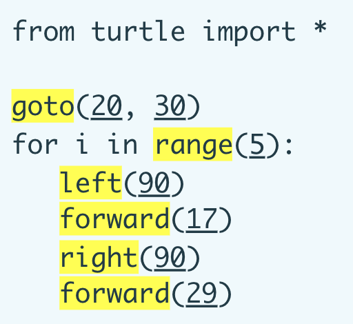
</Solution>
::::


Wie können Unterprogramme geschrieben werden, die **Parameter** akzeptieren?


::::aufgabe[2. Unterprogramme mit Parametern]
<Answer type="state" id="42ab260d-417d-4cda-a173-6e11abea1f76" />

Untersuchen Sie die folgenden Unterprogramme (führen Sie diese aus!) - verstehen Sie, was passiert? Finden Sie einen Zusammenhang mit Parametern? Halten Sie Ihre Erkenntnisse fest.

:::flex{flexBasis="420px"}
#### hello.py
```py live_py slim
def hallo(name):
    print('Hallo', name)

hallo('Maria')
hallo('Reto')
hallo('Hans')
```
<Answer type="text" id="b376475c-61d1-47d7-8ee2-6c409dd72ab1" />
::br
#### rechnen.py
```py live_py slim
def quotient(zahl1, zahl2):
    print(zahl1, ':', zahl2, '=', zahl1 / zahl2)

quotient(2, 3)
quotient(5, 9)
quotient(12, 20 + 4)
```
<Answer type="text" id="a72a532a-86bf-48a6-8566-76819f102cb2" />
:::


Zusatzfragen:
- ⭐️ Welche Parameter werden bei `quotient(12, 20 + 4)` übergeben?
- ⭐️ In welcher Reihenfolge werden die Parameter bei `quotient(12, 20 + 4)` verrechnet? 

<Answer type="text" id="4aa9790d-103f-44cc-a08f-794a921c2506" />

<Solution id="84d70fe9-937d-4dfa-a12f-193af91d6626">

- Die beiden übergebenen Parameter sind `12` und `24`.
- Bevor die Parameter übergeben werden, werden diese jeweils ausgewertet, daher zuerst wird `20 + 4` berechnet und das Resultat `24` als Parameter übergeben.

</Solution>

::::


## Unterprogramme mit Parametern

Parameter sind also Werte, die an ein Unterprogramm **übergeben** werden können. Damit der übergebene Wert im Unterprogramm **wiederverwendet** werden kann, braucht jeder Parameter einen Namen. Der Wert ist dann über diesen Namen abrufbar. Der **Parametername** ist frei wählbar, soll aber wenn möglich die Bedeutung des übergebenen Wertes widerspiegeln.

### Beispiel

```py live_py slim
from turtle import *

def quadrat(grösse):
    for i in range(4):
        forward(grösse)
        left(90)

color('red')
quadrat(50)

color('blue')
quadrat(100)
```

Unterprogramm
: `quadrat`
: Zeichnet ein Quadrat mit der übergebenen Grösse.
Parametername
: `grösse`
: Der Parameter beschreibt, wie **gross** das Quadrat, welches vom Unterprogramm gezeichnet wird, sein soll.
: Es wird eine **Zahl** erwartet - mit Text oder anderen Werten kann das Unterprogramm nichts anfangen.

:::info[Beachte]
<div className="compactDeflist">
Z. 9
: Es wird ein Quadrat mit der Seitenlänge `50` gezeichnet (in roter Farbe, da vorher `color('red')` ausgeführt wurde).
Z. 12
: Es wird ein Quadrat mit der Seitenlänge `100` gezeichnet (in blauer Farbe, da vorher `color('blue')` ausgeführt wurde).
</div>
:::

## Mehrere Parameter

Manchmal ist es praktisch (oder auch nötig), mehrere Parameter an ein Unterprogramm zu übergeben. Das sieht man etwa beim Befehl `goto(x, y)`, bei welchem die x- und y-Koordinaten übergeben werden. Beim obigen Programm könnte etwa auch die Farbe direkt im Unterprogramm `quadrat` gesetzt werden:

```py live_py slim
from turtle import *

def quadrat(grösse, farbe):
    color(farbe)
    for i in range(4):
        forward(grösse)
        left(90)

quadrat(50, 'red')
quadrat(100, 'blue')
```
:::info[Beachte]
<div className="compactDeflist">
Z. 9
: Die Parameter `50` und `'red'` werden übergeben und im Unterprogramm auf Z. 4 und Z. 6 verwendet.
: Es wird ein rotes Quadrat mit der Seitenlänge `50` gezeichnet.
Z. 10
: Die Parameter `100` und `'blue'` werden übergeben und im Unterprogramm auf Z. 4 und Z. 6 verwendet.
: Es wird ein blaues Quadrat mit der Seitenlänge `100` gezeichnet.
</div>
:::


## Aufgaben
### 3. Sechseck
::::aufgabe[3. Parameternamen]
:::cards{flexBasis="300px"}
::br{flex-grow=2 code=true}
```py live_py title=sechseck.py id=fcd69fed-4ed9-4706-954e-c49cf1c8b764
from turtle import *

```
::br{overflow-y=auto max-height=550px flex-grow=1}
<ProgressState id="bd9a30d2-31a3-4a41-9728-67fc51e7d1b1" confirm float='right'>
1. Definieren Sie das Unterprogramm Namens `sechseck` mit einem Parameter `grösse`, mit welchem ein Sechseck mit der Grösse `grösse` gezeichnet werden kann. Rufen Sie das Programm mit `sechseck(20)` auf. 

    
2. Erzeugen Sie nun `10` Sechsecke. Das kleinste Sechseck hat die Seitenlänge `10`, das grösste die Seitenläng `100`.

    

3. Fügen Sie der Funktion `sechseck(grösse)` den Parameter `farbe` hinzu und erzeugen Sie damit folgendes Bild:

    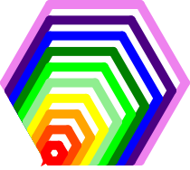

    Farben: `violet, indigo, blue, green, lime, lightgreen, yellow, orange, orangered, red`

    ❓ In welcher Reihenfolge müssen die Sechsecke gezeichnet werden, damit genau das obige Bild entsteht?

    **Tipp**: Die Stiftdicke können Sie mit `pensize(10)` auf `10` setzen.
</ProgressState>
:::
<Solution id="ddb86a65-3456-449a-914d-3992bb074adf">

```py live_py slim
from turtle import *

speed(10)

def sechseck(grösse, farbe):
    color(farbe)
    for i in range(6):
        forward(grösse)
        left(60)

pensize(10)

sechseck(100, 'violet')
sechseck(90, 'indigo')
sechseck(80, 'blue')
sechseck(70, 'green')
sechseck(60, 'lime')
sechseck(50, 'lightgreen')
sechseck(40, 'yellow')
sechseck(30, 'orange')
sechseck(20, 'orangered')
sechseck(10, 'red')
```
</Solution>

::::
### 4. Hilfsfunktion
:::info[Hilfsfunktionen]
*Sequenzen*, die immer wieder vorkommen, sollen als **Hilfsfunktion** zusammengefasst werden.  
**Tipp**: Speichern Sie bewährte Hilfsfunktionen in Ihrem persönlichen Bereich in einem Ordner __Hilfsprogramme__ ab.
:::

::::aufgabe[4. `move_to(x, y)`]
<Answer type="state" id="4ebaa3cd-f5bd-4a0f-ba29-e948cce7b83a" />

Im untenstehenden Programm werden die Zeilen zum Bewegen der Turtle ohne dabei eine Linie zu zeichnen, immer wiederholt.

Schreiben Sie ein Unterprogramm `move_to(x, y)`, welches diese Schritte zusammenfasst, also:
- den Stift anhebt
- zur Position (x, y) bewegt
- und den Stift absenkt


```py live_py title=move_to.py id=a5ad79c4-4ea2-4b7e-a7bc-bb8224ad2e06
from turtle import *

def quadrat(grösse, farbe):
    color(farbe)
    for i in range(4):
        forward(grösse)
        left(90)

penup()
goto(30, 30)
pendown()
quadrat(20, 'red')

penup()
goto(-50, 30)
pendown()
quadrat(30, 'blue')

penup()
goto(0, 100)
pendown()
quadrat(40, 'green')
```

<Solution id="b0fbce6a-3580-4614-adb5-630979387662">
```py live_py slim
from turtle import *

def move_to(x, y):
    penup()
    goto(x, y)
    pendown()

def quadrat(grösse, farbe):
    color(farbe)
    for i in range(4):
        forward(grösse)
        left(90)

move_to(30, 30)
quadrat(20, 'red')

move_to(-50, 30)
quadrat(30, 'blue')

move_to(0, 100)
quadrat(40, 'green')
```
</Solution>

::::

## Häufige Fehler
:::danger[SyntaxError: Vergessene Kommas]
Ein häufiger Fehler sind vergessene Kommas zwischen zwei Parameternamen. Dann entsteht ein **SyntaxError**. Die Fehlermeldung macht aber darauf aufmerksam.

```py live_py slim
from turtle import *
goto(100 200)
```

```bash
goto(100 200)
     ^^^^^^^
SyntaxError: invalid syntax. Perhaps you forgot a comma?
```
:::

:::danger[TypeError: Falsche Anzahl Parameter]
Ein weiterer häufiger Fehler ist die falsche Anzahl übergebener Parameter. Auch hier macht die Fehlermeldung darauf aufmerksam - wie viele Argumente (`positional argument`) erwartet werden und wie viele übergeben wurden.
```py live_py slim
from turtle import *
def quadrat(grösse):
    for i in range(4):
        forward(grösse)
        left(90)
quadrat(50, 'red')
```

```bash
File "snippet.py", line 6, in <module>
TypeError: quadrat() takes 1 positional argument but 2 were given
```
Hier wird also darauf hingewiesen, dass `quadrat()` nur einen Parameter erwartet, aber zwei übergeben wurden.
:::

::::danger[Überschreibung von Unterprogrammen]
Wird ein Parametername verwendet, der bereits als Unterprogrammname existiert, so wird das Unterprogramm überschrieben. Das führt zu Fehlern, die schwer zu finden sind.

```py live_py slim
from turtle import forward, left, color

def square(grösse, color):
    color(color)
    begin_fill()
    for i in range(4):
        forward(grösse)
        left(90)
    end_fill()
square(50, 'red')
```
```bash
File "snippet.py", line 4, in square
TypeError: 'str' object is not callable
```

Die Fehlermeldung ist etwas kryptisch, aber sie weist darauf hin, dass versucht wurde, einen String (`str`), also etwa `'red'`, wie ein Unterprogramm aufzurufen.  
Das passiert, weil auf **Z. 3** der Parametername `color` das Unterprogramm `color()` aus der Bibliothek `turtle` (**Z. 1**) überschrieben hat.
:::success[Lösung]
Der Parametername muss geändert werden - dabei gibt es unterschiedliche Ansätze:
- Parametername in deutscher Sprache: `farbe` statt `color`.
- Abkürzung des Parametername: `col` oder `colr` statt `color`.
- Ein Präfix verwenden: `my_color` oder `p_color` statt `color`.
:::
::::

### 5. Fehler finden
::::aufgabe[5. Fehler finden und beheben]
<Answer type="state" id="3b730979-1a76-477d-a633-64ca53e1b40f" />

:::cards{flexBasis="300px" justifyContent="center"}
::br{flexGrow=0}
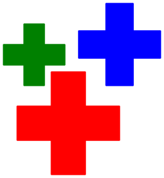
Gewünschte Ausgabe
:::

Finden und beheben Sie die Fehler im folgenden Programm.

```py live_py title=fehler.py id=d7d1d6d3-b063-4922-812a-343ad38ba62f maxLines=27
from turtle import *

def move_to(x, y):
    penup()
    goto(x, y)
    pendown()

def bucket(forward):
    right(90)
    for i in range(3):
        forward(forward)
        left(90)
    right(180)

def cross(size, color):
    color(color)
    begin_fill()
    for i in range(4):
        bucket(size)
        left(90)
    end_fill()

cross(50, 'red')
move_to(80, 120)
cross(40, 'blue', 'green')
move_to(-40 110)
cross(30, 'green')
```
<Solution id="56d80b70-8bb1-4268-88a2-591f50fb9df8" className="compactDeflist">
```py showLineNumbers
from turtle import *

def move_to(x, y):
    penup()
    goto(x, y)
    pendown()

# highlight-next-line
def bucket(forward):
    right(90)
    for i in range(3):
        # highlight-next-line
        forward(forward)
        left(90)
    right(180)

# highlight-next-line
def cross(size, color):
    # highlight-next-line
    color(color)
    begin_fill()
    for i in range(4):
        bucket(size)
        left(90)
    end_fill()

cross(50, 'red')
move_to(80, 120)
# highlight-next-line
cross(40, 'blue', 'green')
# highlight-next-line
move_to(-40 110)
cross(30, 'green')
```

Z. 8, 11
: Der Parametername `forward` überschreibt das Unterprogramm `forward()` aus der Bibliothek `turtle`. Ändern Sie den Parameternamen etwa in `length` oder `size`.
Z. 15, 16
: Der Parametername `color` überschreibt das Unterprogramm `color()` aus der Bibliothek `turtle`. Ändern Sie den Parameternamen etwa in `farbe` oder `col`.
Z. 25
: Es werden drei Parameter übergeben, aber nur zwei erwartet. Entfernen Sie den dritten Parameter `'green'`.
Z. 27
: Es fehlt ein Komma zwischen den Parametern `-40` und `110`.

</Solution>
::::

## Zufall
Zufallszahlen sind für die Informatik sehr wichtig - etwa für die Simulation von realen Situationen, bei Computerspielen oder aber auch für die Kryptologie (beim verschlüsseln von Daten).  
Aber auch beim Erzeugen von künstlerischen Werken sind Zufallszahlen sehr nützlich, da dadurch unvorhersehbare und interessante Muster entstehen können.

In Python gibt es die Bibliothek `random`, welche verschiedene Befehle zum Arbeiten mit Zufallszahlen bereitstellt.

:::def[`randint(min, max)`]
Der Befehl `randint(min, max)` gibt eine zufällige ganze Zahl im Bereich von `min` bis `max` zurück, wobei die Grenzwerte auch erreicht werden können.

```py live_py slim
from random import randint

print('Zufallszahl zwischen 1 und 10:', randint(1, 10))
print('Zufallszahl zwischen 1 und 99:', randint(1, 99))
```
:::

### 6. Orakel
::::aufgabe[6. Liebes-Orakel]
<Answer type="state" id="7de08fe3-ad59-4916-9449-361786fc4f0f" />

:::cards{flexBasis="250px"}
::br{flexGrow=2}
Das Spiel "Liebt mich, liebt mich nicht" kennen wohl aus der Kindheit. Bei einer Blume werden die Blütenblätter nacheinander abgezupft, während man abwechselnd "Liebt mich" und "Liebt mich nicht" sagt. Am Ende entscheidet das letzte Blütenblatt über die Antwort.
::br{flexGrow=0}

:::

Schreiben Sie ein Liebes-Orakel, welches dieselbe Frage wie die Blume beantwortet.

Beim Ausführen soll das Programm einen Text ausgeben:

- `Liebt mich (1) oder liebt mich nicht (0)? 0`
- `Liebt mich (1) oder liebt mich nicht (0)? 1`

```py live_py id=845659ab-f724-4e60-a053-3690e983396c
```

<Solution id="86216f5c-3b2b-42a1-8fad-ce3c6f373a61">
```py live_py slim
from random import randint
print('Liebt mich (1) oder liebt mich nicht (0)?', randint(0, 1))
```
</Solution>

::::

### 7. Sterne

::::aufgabe[7. Stern zufälliger Grösse]

:::flex{flexBasis="300px"}
```py live_py id=dca4358c-8263-45e7-809a-45db5f62ba4d
from turtle import *
from random import randint

```
::br
<ProgressState id="a910bd87-ef2b-483e-ba3f-7211ec81848e" confirm>
1. Schreiben Sie ein Unterprogramm `star`, welches einen Stern mit 5 Zacken und einer Seitenlänge von `100` zeichnet. Testen Sie das Unterprogramm, indem Sie es aufrufen.
2. Modifizieren Sie das Unterprogramm so, dass die Seitenlänge als Parameter übergeben werden kann. Testen Sie das Unterprogramm, indem Sie es mit verschiedenen Seitenlängen aufrufen.
3. Rufen Sie das Unterprogramm `star` nun mit einer zufälligen Seitenlänge zwischen `5` und `150` auf.
</ProgressState>
:::

<Solution id="23cc7852-d7e6-47ca-b8ce-af669aeceb1f">
```py live_py slim
from turtle import *
from random import randint

def star(size):
    for i in range(5):
        forward(size)
        right(2 * 360 / 5)
star(randint(5, 150))
```
</Solution>
::::

### 8. Sternenhimmel

::::aufgabe[8. Sternenhimmel]

:::cards{flexBasis="300px" justifyContent="center"}
::br{flexGrow=0}
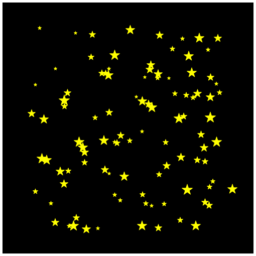
**Zielsetzung**: Ein Sternenhimmel mit vielen Sternen an zufälligen Positionen.
:::

:::flex{flexBasis="300px"}
```py live_py id=3a915381-3637-44d7-a6b5-d69b14a38a96
from turtle import *
from random import randint

```
::br
<ProgressState id="8828c265-8dcb-4faf-bc01-453fbbf0c7e2" confirm>
1. Fügen Sie die Hilfsfunktion `move_to(x, y)` aus der Aufgabe 4. und die Funktion `star(size)` aus der Aufgabe 7. in das Programm ein.
2. Zeichnen Sie 10 Sterne der Grösse `30` an zufälligen Positionen zwischen `-200` und `200` für x- und y-Koordinate:
    1. Stern der Grösse `30` zeichnen.
    2. verwenden Sie `randint(-200, 200)` als Argument für die x- und y-Koordinate der Funktion `move_to`.
    3. Schritte i. und ii. `10` Mal wiederholen.
    4. Tipp: `speed(0)` am Anfang des Programms sorgt für eine schnelle Zeichnung.
3. Zeichnen Sie nun auch noch die Grösse der Sterne zufällig zwischen `5` und `50`.
4. Setzen Sie die [Hinergrundfarbe](../20-commands/index.mdx#zeichnungsfläche) auf schwarz und füllen Sie die Sterne gelb aus und zeichnen Sie nun `100` Sterne.
</ProgressState>
:::

:::details[⭐️ Zusatz: Zufällige Sternfarben]
1. Fügen Sie der Funktion `star(size)` einen weiteren Parameter `farbe` hinzu.
2. Übergeben Sie beim Aufruf von `star` eine zufällige Farbe aus der Liste `['yellow', 'white', 'lightgrey', 'lightyellow']`. Um eine zufällige Farbe auszuwählen, kann die Funktion `choice` aus der Bibliothek `random` verwendet werden. Hier ein Beispiel, welches Sie für die Farbauswahl anpassen können:
```py live_py slim
from random import choice
print('Zufälliger Schultag:', choice(['Mo', 'Di', 'Mi', 'Do', 'Fr']))
```

:::

<Solution id="e8e978ee-1a50-4713-a529-20d1bc16352a">
```py live_py slim maxLines=26
from turtle import *
from random import randint

speed(0)

def move_to(x, y):
    penup()
    goto(x, y)
    pendown()

def rand_pos():
    move_to(randint(-200, 200), randint(-200, 200))

def star(size):
    begin_fill()
    for i in range(5):
        forward(size)
        right(2 * 360 / 5)
    end_fill()

Screen().bgcolor('black')
color('yellow')
for i in range(100):
    rand_pos()
    star(randint(5, 20))
hideturtle()
```
</Solution>
::::

### 9. Zufällige Kunst

::::aufgabe[9. Zufällige Kunst]
:::cards{columns=3}
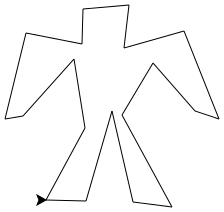
::br
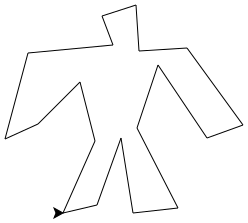
::br
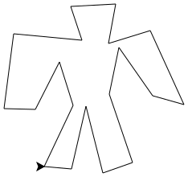
::br

::br
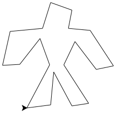
::br
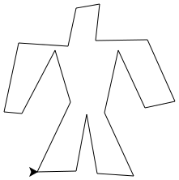
:::

Material
: Stift
: eine ausgedruckt [👉 Vorlage](./images/screen-coordinates_py.svg)

<ProgressState id="4b884f34-c1d3-4b3c-a160-067fde5169bd" confirm>
1. Zeichnen Sie mit bis zu 20 Punkten eine Figur auf dem Koordinaten-Gitter.
2. Zeichnen Sie die Figur mit Turtles nach, wobei Sie ausschlisslich den Befehl `goto(x, y)` (und die in Aufgabe 4 geschriebene Funktion `move_to(x, y)`) verwenden dürfen.
3. Nun kommt der Zufall ins Spiel: haben Sie eine Idee, wie Sie die Figur mit zufälligen Punkten zeichnen können? Überlegen Sie sich eine Vorgehensweise und probieren Sie diese allenfalls auch mit ein paar Punkten aus. Im nächsten Schritt wird eine mögliche Lösung vorgestellt.
4. Fügen Sie eine neue Funktion `circa_to(x, y)` hinzu, welche die Turtle an eine Position nahe bei `x`, `y` bewegt. Mit `randint(-5, 5)` können Sie eine zufällige Position zur x- und y-Koordinate beim Aufrufen von `goto` hinzufügen. Ersetzen Sie danach alle Aufrufe von `goto(x, y)` durch `circa_to(x, y)`, um die Figur mit zufälligen Abweichungen zu zeichnen.  
    <Solution id="f17657d1-7540-4a00-960e-1e9b9fa9874a" standalone>
    ```py
    from turtle import *
    from random import randint
    def circa_to(x, y):
        goto(x + randint(-5, 5), y + randint(-5, 5))
    ```
    </Solution>
5. Zeichnen Sie die Figur mehrmals übereinander, um einen interessanten Effekt zu erzielen.
</ProgressState>

```py live_py id=53754c1e-6c03-4207-aa4e-8a5cbc6077af
from turtle import *
from random import randint

```
:::details[⭐️ Zusatz]
Einige Ideen für Erweiterungen:
- Fügen Sie einen Parameter `jitter` zur Funktion `circa_to` hinzu, mit welchem die maximale Abweichung kontrolliert werden kann. Für `jitter=2` soll die Figur nur leicht, für `jitter=50` stärker verzerrt werden.
- Fügen Sie einen Parameter `scale` zur Funktion `circa_to` hinzu, mit welcher die Grösse der Figur kontrolliert werden kann. Für `scale=0.5` soll die Figur halb so gross, für `scale=2` doppelt so gross gezeichnet werden.
- Können Sie die Figur an einer beliebigen Position zeichnen?
::::

## Parameter bei Wiederholungen

:::finding[Wiederholung: 🔁 Wiederholte Ausführung]
Mit `for i in range(n):` wird eine wiederholte Ausführung vorbereitet. Der nachfolgende **Codeblock** wird `n` Mal wiederholt.
```py live_py slim
from turtle import *
for i in range(4):
    forward(50)
    left(90) 
```
:::

Wozu steht eigentlich das `i` im `for i in range(4)`? Das ist fast wie ein Parameter: `i` enthält die Anzahl bereits ausgeführter Wiederholungen.

:::cards{columns=2}
Während Wiederholung 1: `i=0`, keine Wiederholung ist abgeschlossen.
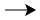
::br
Während Wiederholung 2: `i=1`, eine Wiederholung ist bereits abgeschlossen.
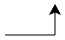
::br
Während Wiederholung 3: `i=2`, zwei Wiederholungen sind bereits abgeschlossen.
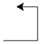
::br
Während Wiederholung 4: `i=3`, drei Wiederholungen sind bereits abgeschlossen.
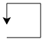
:::

Der Wert, welcher in `i` steht, kann auch verwendet werden:

```py live_py slim
from turtle import *

def quadrat(size):
    for i in range(4):
        forward(size)
        left(90)

for i in range(10):
    quadrat(i * 10 + 10)
```

::::details[⭐️ Zusatzparameter von `range()`]

:::def[`range(start, ende, schritt)`]
Der Befehl `range` kann mit bis zu drei Parametern arbeiten, wobei `start` der erste verwendete Wert, `ende` das obere ganzzahlige Limit angibt (welches aber selber nie erreicht wird!) und `schritt` den Abstand zwischen zwei Zahlen angibt.
```py live_py slim
for i in range(2, 11, 3):
    print(i)
```

Im obigen Beispiel startet `i` bei `2` und wird solange um `3` erhöht, bis die Zahl `11` erreicht oder überschiesst. 

**! 11 wird nicht angenommen**.

:::
::::

### ⭐ Challenges

:::aufgabe[⭐️ Quadrate]
<Answer type="state" id="d89c87d2-8c51-415a-9101-f577aa1f1c65" />

Zeichnen Sie folgende Quadrate. Auf wie viele Zeilen können Sie Ihr Programm kürzen?

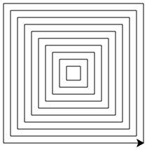

```py live_py title=quadrate.py id=a64133e9-5b2e-415a-a884-2671bdb3027e
from turtle import *
```
<Solution id="16dda73a-b4d1-49b1-ac93-8eb7af5ef6b3">

```py live_py slim
from turtle import * 

def move_to(x, y):
    penup()
    goto(x, y)
    pendown()

for i in range(1, 11):
    move_to(i * 10, -i * 10)
    for n in range(4):
        left(90)
        forward(i * 20)
```
</Solution>

:::


::::aufgabe[⭐️ Punkte]


:::cards{flexBasis="300px" justifyContent="center"}
::br{flexGrow=0}
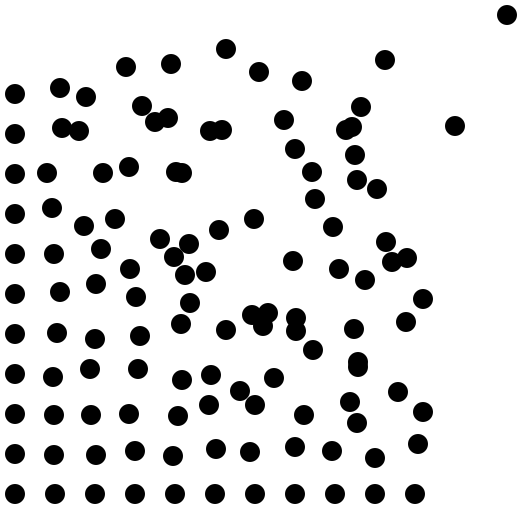
**Zielsetzung**: Ein Punktegitter mit unterschiedlich starken Abweichungen.
:::

<ProgressState id="61e96c85-c34c-42dc-9edc-55decfc0b4c6" confirm>
1. Zeichnen Sie eine Punkt-Zeile mit
    - 11 Punkten mit Radius `15` in x-Richtung (verwenden Sie den `dot`-Befehl)
    - Abstand `30` Einheiten
    - mit der Funktion `move_to(x, y)` aus Aufgabe 4 (ohne `forward`!).

    
2. Zeichnen Sie nun 11 solcher Punkt-Zeilen untereinander, mit einem Abstand von `30` Einheiten in y-Richtung. Die Schleifenvariable soll anders als `i` heissen (z.B. `j`).

    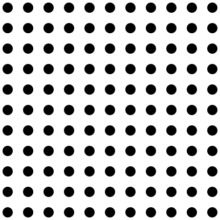

    <Solution id="8c0ed94a-4eb6-40fd-b898-d78d9ec50f9e" standalone>
    ```py live_py slim
    from turtle import *
    from random import randint

    def move_to(x, y):
        penup()
        goto(x, y)
        pendown()

    for j in range(11):
        for i in range(11):
            move_to(i * 30 - 200, j * 30 - 200)
            dot(15)
            
    hideturtle()
    ```
    </Solution>
3. Fügen Sie die Funktion `circa_to(x, y)` aus Aufgabe 9 hinzu und verwenden Sie diese anstelle von `move_to(x, y)`, um die Punkte mit zufälligen Abweichungen zu zeichnen. Verwenden Sie eine Abweichung von $\pm 5$ Einheiten. Um die exakte Position zu kennzeichnen, soll zusätzlich ein kleiner roter Punkt an die unveränderte Position gesetzt werden.

    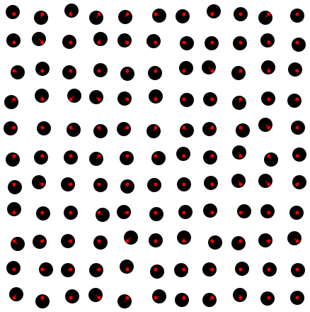
    
    <Solution id="455a0a51-39ca-4513-baad-e88b8da29569" standalone>
    ```py live_py slim
    from turtle import *
    from random import randint

    def move_to(x, y):
        penup()
        goto(x, y)
        pendown()

    def circa_to(x, y):
        move_to(x + randint(-5, 5), y + randint(-5, 5))

    for j in range(11):
        for i in range(11):
            circa_to(i * 30 - 200, j * 30 - 200)
            dot(15)
            goto(i * 30 - 200, j * 30 - 200)
            dot()

    hideturtle()
    ```
    </Solution>
4. Fügen Sie der Funktion `circa_to(x, y)` einen Parameter `jitter` hinzu, mit welchem die maximale Abweichung kontrolliert werden kann. Finden Sie heraus, wie Sie mit den beiden Schleifenvariablen `i` und `j` eine grössere Abweichung für die Punkte weiter rechts-oben im Gitter erreichen können?

    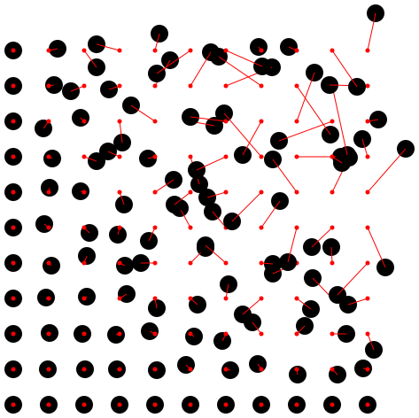

5. Finales Bild: Kommentieren Sie die Zeilen aus, in welchen die roten Punkte und Striche gezeichnet werden.
    

</ProgressState>


```py live_py title=point-grid.py id=838457b5-f64f-46ec-9e11-4d990dec6cec
from turtle import *
from random import randint

```

::::
