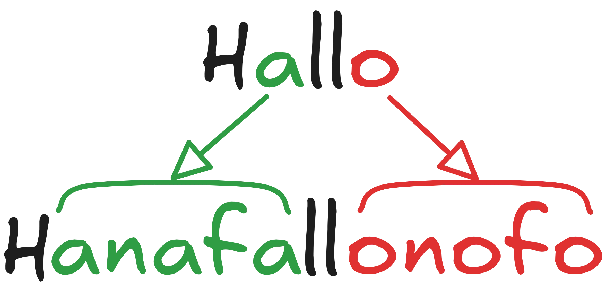

import ProgressState from '@tdev-components/documents/ProgressState';

# 📝 Grüfnisch



<blockquote>

Grüfnisch ist in der Schweiz unter Jugendlichen und Kindern eine verbreitete Spielsprache. Diese Sprache wird von vielen Kindern und Jugendlichen auch als Geheimsprache benutzt. Bei „Grüfnisch“ werden alle Vokale wie folgt ersetzt:[^1]

a
: anafa
e
: enefe
i
: inifi
o
: onofo
u
: unufu
ä
: änäfä
ö
: önöfö
ü
: ünüfü


### Beispiele

Hallo
: Hanafallonofo

Gymnasium Biel Seeland
: Gymnanafasinifiunufum Binifienefel-Senefeenefelanafand


</blockquote>

:::info[Ziel: Python spricht Grüfnisch]
Das Ziel ist, einen vorgegebenen Text auf Grüfnisch zu übersetzen.
:::

In Python lassen sich Texte verändern, zusammenfügen und trennen.

## Texte verknüpfen

Texte können verknüpft werden - entweder mit `+` oder indem eine spezielle Syntax für die Verknüpfung von Textteilen verwendet wird.

:::def[`'hallo ' + 'bello'`]

Mit `+` lassen sich zwei gleichwertige Datentypen (daher, **entweder** zwei Zahlen, **oder** zwei Texte, **nicht jedoch** Texte und Zahlen, verknüpfen)

```py live_py slim
print('Hallo ' + 'Biber')
```
:::


:::def[`f''`, `f'Hallo, Nr. {7}'`]

Ein formatierter Text wird in Python mit `f'` (statt nur `'`) gestartet. Anschliessend können geschweifte Klammern verwendet werden, welche durch deren Inhalt ersetzt werden. Hier Spielt es keine Rolle, ob Texte oder Zahlen verwendet werden.

```py live_py slim
name = 'Maria'
print(f'Hallo {name}, ich bin {15} jährig.')
```
:::

## Gross- und Kleinschreibung

:::def[`.upper()`: Grossbuchstaben]

```py live_py slim
text = 'Hallo ich bin Alfred. Ich schreibe an einem wichtigen Buch.'
gross = text.upper()

print(gross)
```
:::

:::def[`.lower()`: Kleinbuchstaben]
```py live_py slim
text = 'Hallo ich bin Alfred. Ich schreibe an einem wichtigen Buch.'
klein = text.lower()

print(klein)
```
:::

## Text ersetzen

:::def[`.replace(alt, neu)`]
Mit `replace(alt, neu)` werden **alle** `alt`en Textstücke durch die `neu`en ersetzt. Der Text wird dabei nicht direkt verändert, sondern nur der Rückgabewert (=das Resultat) ist verändert.

```py live_py slim
text = 'Hallo ich bin Alfred. Ich schreibe an einem wichtigen Buch.'

# Alle "." durch "!!!" ersetzen
text = text.replace('.', '!!!')

print(text)
```

:::

::::warning[Gross- & Kleinschreibung]
Python nimmts genau beim ersetzen - die Gross- & Kleinschreibung spielt eine Rolle, nicht jedoch der Ort des `alt`en Wortes!

Im folgenden Beispiel wird etwa nur das kleingeschriebene `ich` ersetzt, jedoch auch wenn es inmitten eines Textes auftritt. Das grossgeschrieben `Ich` zu Beginn des Satzes wird ignoriert, dafür wird das `ich` in `wichtigem` ersetzt.

```py live_py slim
text = 'Hallo ich bin Alfred. Ich schreibe an einem wichtigen Buch.'
text = text.replace('ich', 'ICH')

print(text)
```

Lösungsansätze:
Mehrfachersetzung
: Jegliche erlaubte Wortkombinationen ersetzen, also __ich__ und __Ich__.
Kleinschreibung
: Zuerst alles in kleine Buchstaben umwandeln und danach ersetzen.
: *Nachteil*: Die ursprüngliche Gross- und Kleinschreibung geht verloren.

:::flex{minWidth="300px"}
```py live_py slim
text = 'Hallo ich bin Alfred. Ich schreibe an einem wichtigen Buch.'

text = text.replace('ich', 'XXX') # Alle 'ich' durch XXX ersetzen
text = text.replace('Ich', 'XXX') # Alle 'Ich' durch XXX ersetzen
print(text)
```
::br
```py live_py slim
text = 'Hallo ich bin Alfred. Ich schreibe an einem wichtigen Buch.'

text = text.lower() # text kleinschreiben
text = text.replace('ich', 'XXX') # Alle 'ich' durch XXX ersetzen
print(text)
```
:::
::::


### Vervielfachen

Um Textteile zu vervielfachen, können diese mit einem Faktor 'multipliziert' werden.


```py live_py slim
print('❤️ ' * 5)
```

oder auch komplizierter:

```py live_py slim
for i in range(5):
    print('❤️ ' * (i + 1))
```

## Grüfnisch-Übungen


:::aufgabe[Grüfnisch]
<Answer type="state" id="317d4b72-0cc3-4a45-9192-320bc3405f9c" />

Wie lautet der Satz `Hallo, es ist Winter` auf Grüfnisch? (Von Hand, ohne Programm übersetzen)

<Answer 
    type="string"
    id="cf4dfba6-f319-4509-bdac-92deaa32fec4"
    solution="hanafallonofo enefes inifist winifintenefer"
    sanitizer={(val) => val.toLowerCase().replaceAll(',', ' ').replaceAll('.', ' ').trim().replaceAll(/\s+/g, ' ')}
    fullWidth
/>

:::

::::aufgabe[Deutsch → Grüfnisch]
<Answer type="state" id="55083ae2-51cc-4fcd-ad81-b113b9e4daf7" />

<ProgressState id="6bc8da88-cf84-4b92-bb4d-a1c36beb0c69" confirm float='right' preventTogglingFutureSteps>
1. Erstellen Sie ein Programm, welches einen Satz auf Grüfnisch übersetzt und ausgibt.
2. Funktioniert Ihr Text auch, wenn Sie den Satz mit Grossbuchstaben, bspw. `Informatikunterricht` übersetzen? Passen Sie ihn entsprechen an.
3. Um die Ausgabe etwas spannender zu machen, können wir die Ausgabe auch von Beavis ausgeben lassen. Ändern Sie Ihr Programm so, dass Beavis Grüfnisch spricht...  
    ```py live_py slim
    from cowsay import beavis
    beavis('Hanafallonofo Pythonofon')
    ```
    :::details[Weitere Figuren]

    Anstelle von `cow()` können auch andere Figuren verwendet werden. Diese muss dann aber auch aus der Bibliothek `cowsay` importiert werden.

    - `beavis`
    - `cheese`
    - `daemon`
    - `cow`
    - `dragon`
    - `ghostbusters`
    - `kitty`
    - `meow`
    - `milk`
    - `stegosaurus`
    - `stimpy`
    - `turkey`
    - `turtle`
    - `tux`
    :::
4. Zusatz ⭐️: Passen Sie Ihr Programm so an, dass auch die Zusatzregel bei Grüfnisch umgesetzt wird. Wie könnte dies gelingen?
    > Ausnahme beim Ersetzen: Bei Diphthongen/Zwielauten wird nur der erste verlängert (z. B. „au“ ⇒ „anafau“).
    > Beispiel: "Bauen" hat den Diphtong `au` und wird also grüfnisch "Banafauenefen" ausgesprochen.

</ProgressState>

```py live_py id=00070a97-3898-46a6-88df-79c2cd28ad17 title=gruefnisch.py
text = 'hallo, es ist winter!'
print('Original', text)
```

<Solution id='e2368d96-664c-4c52-86aa-496a5e936cdd'>

```py live_py slim
from cowsay import beavis
text = 'Hallo, es ist Winter!'

grüfnisch = text.lower()
grüfnisch = grüfnisch.replace('a', 'anafa')
grüfnisch = grüfnisch.replace('e', 'enefe')
grüfnisch = grüfnisch.replace('i', 'inifi')
grüfnisch = grüfnisch.replace('o', 'onofo')
grüfnisch = grüfnisch.replace('u', 'unufu')
grüfnisch = grüfnisch.replace('ä', 'änäfä')
grüfnisch = grüfnisch.replace('ö', 'önöfö')
grüfnisch = grüfnisch.replace('ü', 'ünüfü')

beavis(grüfnisch)
```
</Solution>

<Solution title='⭐️ Kurzschreibweise' id='e2368d96-664c-4c52-86aa-496a5e936cdd'>

```py live_py slim
from cowsay import beavis
text = 'Hallo, es ist Winter!'

grüfnisch = text.lower()
for vokal in 'aeiouäöü':
    neu = f'{vokal}n{vokal}f{vokal}'
    grüfnisch = grüfnisch.replace(vokal, neu)
beavis(grüfnisch)
```
</Solution>

<Solution title='⭐️ Zusatz: Diphthonge' id='e2368d96-664c-4c52-86aa-496a5e936cdd'>

```py live_py slim
from cowsay import beavis
text = 'Hallo, es ist Winter!'

grüfnisch = text.lower()
# alle Diphdonge durch Grossbuchstaben ersetzen
for vokal1 in 'aeiouäöü':
    for vokal2 in 'aeiouäöü':
        diphdong = vokal1 + vokal2
        grüfnisch.replace(diphdong, diphdong.upper())

for vokal in 'aeiouäöü':
    neu = f'{vokal}n{vokal}f{vokal}'
    grüfnisch = grüfnisch.replace(vokal, neu)

# alle grossen Diphdonge auf Grüfnisch übersetzen
for vokal1 in 'AEIOUÄÖÜ':
    for vokal2 in 'AEIOUÄÖÜ':
        diphdong = vokal1 + vokal2
        vokal1 = vokal1.lower()
        vokal2 = vokal2.lower()
        grüfnisch.replace(diphdong, f'{vokal1}n{vokal1}f{vokal1}{vokal2}')

beavis(grüfnisch)
```
</Solution>
::::

## Texte sprechen lassen
Mit der Bibliothek `speech` kann ein Text vom Browser gesprochen werden.

::::def[`speak`]
```py live_py slim
from speech import speak

speak('Hallo, es ist Winter!')
```

Die Sprachausgabe kann angepasst werden:
```py live_py slim
from speech import speak
### PRE
speak('Hi there, i speak english now.', lang='en-US')
speak('Jetzt doppelt so schnell', lang='de-DE', rate=2)
speak('Jetzt halb so schnell', lang='de-DE', rate=0.5)
speak('Jetzt höher', lang='de-DE', pitch=2) # max 2
speak('Jetzt tiefer', lang='de-DE', pitch=0.1) # min 0.1
speak('Jetzt leiser', lang='de-DE', volume=0.5) # Werte zwischen 0 und 1, Standard ist 1
```
Es kann auch die __Stimme__ verändert werden, wobei nicht jede Stimme in jedem Browser verfügbar ist.
```py live_py slim
from speech import speak, voices
voices('de-DE') # gibt die verfügbaren Stimmen aus
speak('Hallo, es ist Winter!', lang='de-DE', voice='Microsoft Katja - German (Germany)')
```

Die __verfügbaren Sprachen__ können mit `languages()` ausgegeben werden.
```py live_py slim
from speech import speak, languages
languages()
```

:::warning[Browser-Feature]
Nicht jeder Browser unterstützt das Sprechen von Texten in allen Sprachen.
:::

::::


::::aufgabe[Text sprechen lassen]
<Answer type="state" id="eca0709a-a220-492b-b01a-e0a0361514fe" />

Versuchen Sie, den Grüfnisch-Text sprechen zu lassen. Verwenden Sie das bereits erstellte Programm und passen Sie es entsprechend an.

```py live_py title=speak.py id=30c2fca4-97be-41be-87e2-bd8988b32e3a
from speech import speak, voices, languages

```
::::


:::aufgabe[Grüfnisch → Deutsch]
<Answer type="state" id="935ce811-5679-4de1-a8a6-501ec5cf7dfd" />

Können Sie auch ein Programm schreiben, welches vom Grüfnisch ins Berndeutsch übersetzt?

```py live_py title=von_grüfnisch.py id=c3fd9f11-7cae-40b7-8c5a-78568036676e
text = 'Hanafallonofo Pythonofon'

```

<Solution id='4a3dcd2e-1618-4a94-8801-905ea168d29e'>

```py live_py slim 
from cowsay import beavis
text = 'Hanafallonofo Pythonofon'

berndeutsch = text.lower()
berndeutsch = berndeutsch.replace('anafa', 'a')
berndeutsch = berndeutsch.replace('enefe', 'e')
berndeutsch = berndeutsch.replace('inifi', 'i')
berndeutsch = berndeutsch.replace('onofo', 'o')
berndeutsch = berndeutsch.replace('unufu', 'u')
berndeutsch = berndeutsch.replace('änäfä', 'ä')
berndeutsch = berndeutsch.replace('önöfö', 'ö')
berndeutsch = berndeutsch.replace('ünüfü', 'ü')

beavis(berndeutsch)
```
</Solution>

:::

[^1]: Quelle: [Wikipedia](https://de.wikipedia.org/wiki/Spielsprache#Gr%C3%BCfnisch)
