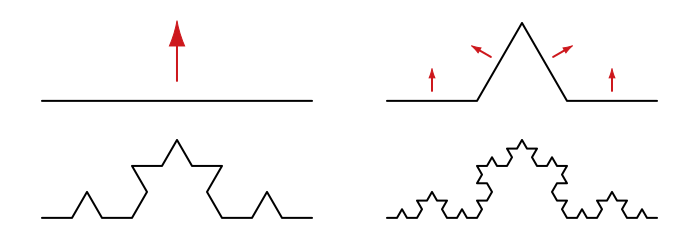
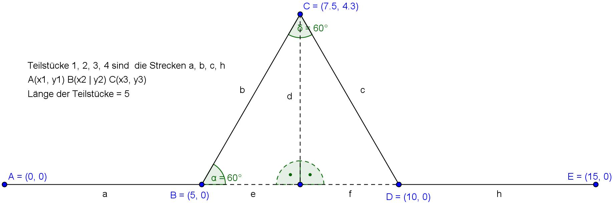
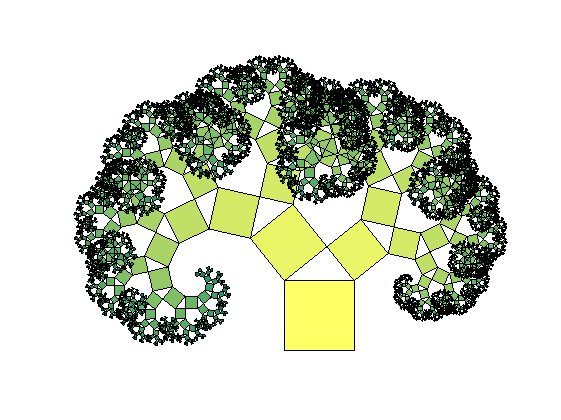

# ⭐ Rekursion

Ein Unterprogramm kann sich selber aufrufen. Das ergibt im Normalfall eine unendliche Wiederholung, so dass das Programm abstürzt. Wird das Unterprogramm jedoch jedesmal mit einem veränderten Parameter aufgerufen, so kann eine **Abbruchbedingung** erstellt werden, welche angibt, ob das Unterprogramm erneut aufgerufen werden soll oder nicht.

## Beispiel

Im folgenden Programm wird ein einfacher binärer Baum gezeichnet:


```py live_py slim
from turtle import *

left(90)
def baum(grösse):
    forward(grösse)
    left(45)
    forward(grösse / 2)
    backward(grösse / 2)
    right(90)
    forward(grösse / 2)
    backward(grösse / 2)
    left(45)
baum(40)
```

Diesen Baum können wir nun so umbauen, dass jeder Ast auch wieder ein binärer Baum ist:


```py live_py slim
from turtle import *

left(90)
def baum(grösse):
    if grösse < 5:
        forward(grösse)
    else:
        forward(grösse)
        left(45)
        baum(grösse / 2)
        backward(grösse / 2)
        right(90)
        baum(grösse / 2)
        backward(grösse / 2)
        left(45)
baum(100) 
```

Bemerken Sie, dass eine Abbruchbedingung eingefügt wurde - falls die grösse kleiner als 5 ist, wird nur eine Strecke gezeichnet, andernfalls ein ganzer Baum.

## Koch Kurve

:::aufgabe
<Answer type="state" id="ed83c1e8-9552-4c00-8119-2170df88cacd" />

Eine Koch-Kurve ist wie folgt aufgebaut:



wobei ein einzelnes Element wie folgt aussieht:



```py live_py title=koch.py id=2d48cb14-345b-4270-9de7-e6c4ab1c2768
from turtle import *


```

⭐️ Zusatz: Zeichnen Sie ein Sechseck bestehend aus 6 Koch-Kurven.

:::


## ⭐️ Pythagorasbaum

Versuchen Sie, einen rekursiven Pythagoras-Baum zu zeichnen.



:::aufgabe[Pythagorasbaum]
<Answer type="state" id="ff09fce5-4957-4a2c-92a3-7ea73b20fc17" />

```py live_py title="pythagoras.py" id=90d2c2c3-004c-433d-9445-8c225b51b5ae
from turtle import *

```
:::

Weitere Inspirationen für Fraktale https://natureofcode.com/book/chapter-8-fractals/

