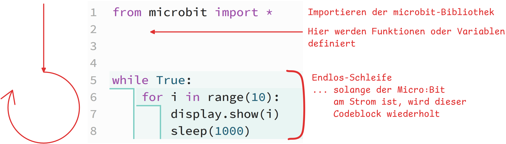

# 2. Micro:Bit

Micro:Bit's sind Mini-Computer, die mit Python programmiert werden können.

:::cards

:::

Micro:Bit-Programme sind immer gleich aufgebaut:




:::aufgabe[Micro:Bit - Programm ausprobieren]
<Answer type="state" id="6f1ef7a7-7467-468e-82b0-355771f0bd08" />

CodeEditor
: [https://python.microbit.org/v/3/project](https://python.microbit.org/v/3/project)

Probieren Sie das folgende Programm auf einem Micro\:Bit aus.

```py
from microbit import *

while True:
    for i in range(10):
        display.show(i)
        sleep(1000)
```

Ändern Sie den Code so, dass die Zahlen nun von `9` bis `0` heruntergezählt werden. Halten Sie den Code unten fest:

```mpy live_py id=97f21544-4213-4fb4-8168-e1fb6d18a62e
```

<Solution id="ad10c3a3-214f-4291-85fb-06fbbe9e66be">
  ```py
  from microbit import *

  while True:
      for i in range(10):
          display.show(9 - i)
          sleep(1000)
  ```
</Solution>
:::

:::aufgabe[Micro:Bit - Display Füllen Top-Down]
<Answer type="state" id="321f1e85-b677-4e20-9980-49d06768f4f1" />

CodeEditor
: [https://python.microbit.org/v/3/project](https://python.microbit.org/v/3/project)

::video[./videos/microbit-ex-top-down.mp4]{autoplay="true" loop="true" height="220px" width="100%"}

```mpy live_py id=ac1a9e7b-e31c-451a-a97f-ef719c728b4b
```

<Solution id="969622a4-4de8-4b0f-93d0-8a42eae13f53">
  ```py
  from microbit import *

  while True:
      display.clear()
      for y in range(5):
          for x in range(5):
              display.set_pixel(x, y, 9)
              sleep(200)
  ```
</Solution>
:::

:::aufgabe[Micro:Bit - Display Füllen Left-Right]
<Answer type="state" id="89da107e-07b3-4e0c-8927-0c2773ea6c2d" />

CodeEditor
: [https://python.microbit.org/v/3/project](https://python.microbit.org/v/3/project)

::video[./videos/microbit-ex-left-right.mp4]{autoplay="true" loop="true" height="220px" width="100%"}

```mpy live_py id=725be69c-c314-4692-8318-71343ae20df5
```

<Solution id="d64236c8-565a-464c-afe5-5e17ca2695c7">
  ```py
  from microbit import *

  while True:
      display.clear()
      for x in range(5):
          for y in range(5):
              display.set_pixel(x, y, 9)
              sleep(200)
  ```
</Solution>
:::

:::aufgabe[Micro:Bit - Display Füllen und Leeren]
<Answer type="state" id="abed10f6-8ebe-4a55-b806-9988a4e7596e" />

CodeEditor
: [https://python.microbit.org/v/3/project](https://python.microbit.org/v/3/project)

::video[./videos/microbit-ex-fill-and-clear.mp4]{autoplay="true" loop="true" height="220px" width="100%"}

```mpy live_py id=0feb0fee-5bc6-4c2e-8479-45751af90245
```

<Solution id="969622a4-4de8-4b0f-93d0-8a42eae13f53">
  ```py
  from microbit import *

  while True:
      display.clear()
      for x in range(5):
          for y in range(5):
              display.set_pixel(x, y, 9)
              sleep(50)
      for x in range(5):
          for y in range(5):
              display.set_pixel(4-y, 4-x, 0)
              sleep(50)
  ```
</Solution>
:::

:::aufgabe[Micro:Bit - Zufall]
<Answer type="state" id="4d2133f8-3caa-4519-b93e-7496ceb130fd" />

CodeEditor
: [https://python.microbit.org/v/3/project](https://python.microbit.org/v/3/project)

In jedem Durchgang wird ein zufälliges Pixel gewählt und der Zustand gewechselt (__einschalten__ falls es dunkel ist, __auschalten__ falls es hell ist).

::video[./videos/microbit-ex-random.mp4]{autoplay="true" loop="true" height="220px" width="100%"}

```mpy live_py id=9bccd610-62ab-4578-926b-a90a7da4a86e
```

<Solution id="7590d515-1a75-4bff-809f-d23d70c33e35">
  ```py
  from microbit import *
  from random import randint

  while True:
      for d in range(9):
          x = randint(0, 4)
          y = randint(0, 4)
          light = display.get_pixel(x, y)
          display.set_pixel(x, y, 9 - light)
          sleep(10)
  ```
</Solution>
:::

:::aufgabe[⭐ Challenge - Diagonal]
<Answer type="state" id="d391e6d3-bafb-4ce1-a2ee-b2762ee3016f" />

CodeEditor
: https://python.microbit.org/v/3/project

::video[./videos/microbit-ex-diag.mp4]{autoplay="true" loop="true" height="220px" width="100%"}

```mpy live_py id=ecbc0d7d-0990-46fb-ab1a-75c03edd6210
```

<Solution id="90cb2fe2-762b-4d3c-94f1-e53eb198a319">
  ```py
  from microbit import *

  def toggle(x, y):
      display.set_pixel(x, y, 9 - display.get_pixel(x, y))
  while True:
      for d in range(9):
          for x in range(max(0, d - 4), min(4, d) + 1):
              y = d - x
              toggle(x, y)
              sleep(100)
  ```
</Solution>
:::