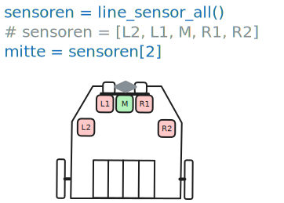
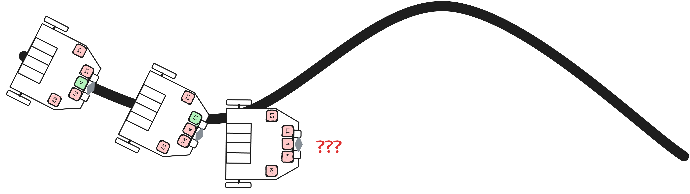
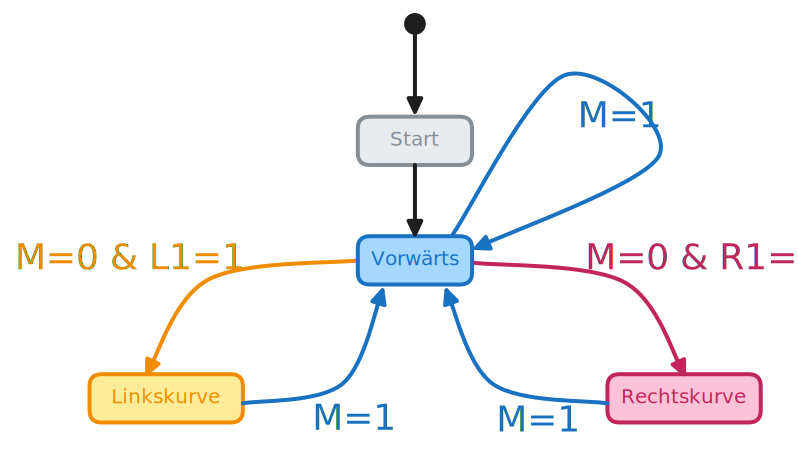
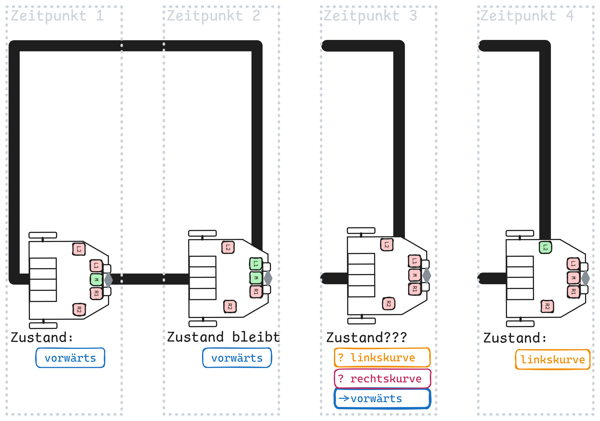
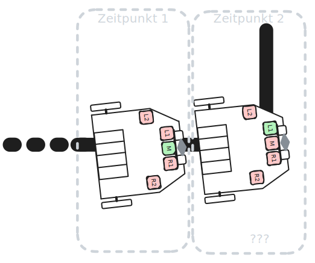
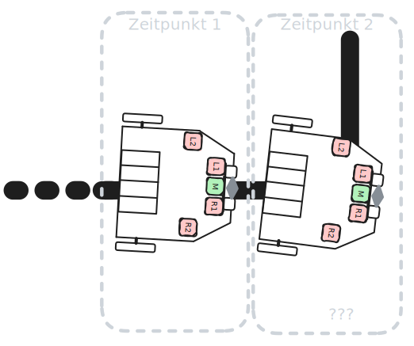
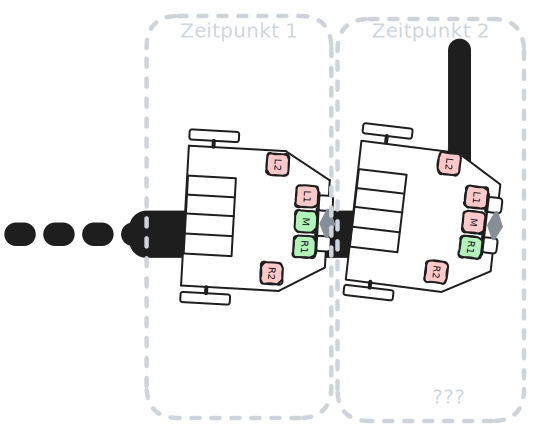
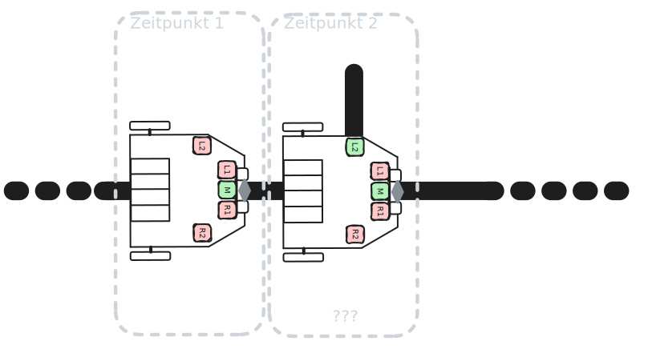
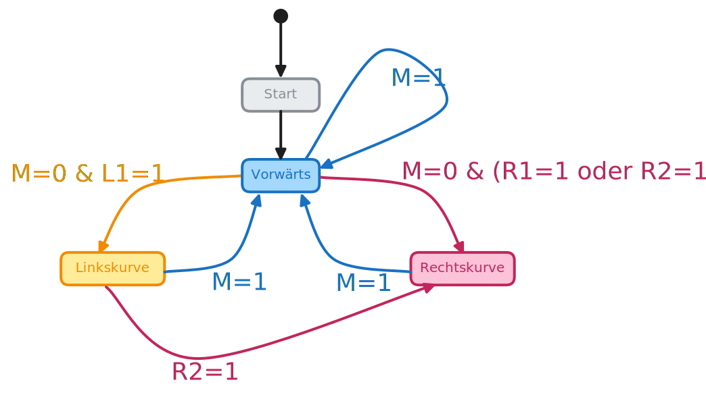

import Restricted from '@tdev-components/documents/Restricted';

# Linienfolger

Für einen Linienfolger braucht es Sensoren, welche die Linie erkennen können. Der Maqueen Plus V2 hat fünf Liniensensoren, welche schwarz/weiss unterscheiden können.

Dabei gilt:
Schwarz
: Sensorwert __1__
Weiss
: Sensorwert __0__

Die Sensoren sind wie folgt angeordnet und können mit `line_sensor_all()` ausgelesen werden:



Ein einfacher Ansatz für einen Linienfolger wäre, die Liniensensoren immer zu überprüfen und entsprechend die Motoren anzusteuern:

Sensor M = 1
: Geradeaus fahren
Sensor L1 = 1 und M = 0
: Linkskurve, da nun zu weit rechts
Sensor R1 = 1 und M = 0
: Rechtskurve, da nun zu weit links

In Python würde das etwa so aussehen:

```python
from microbit import *
from maqueen import *
while True:
    sensoren = line_sensor_all()
    if sensoren[2] == 1:
        motor_run(Motor.ALL, 40)
    elif sensoren[1] == 1:
        motor_run(Motor.LEFT, 0)
        motor_run(Motor.RIGHT, 40)
    elif sensoren[3] == 1:
        motor_run(Motor.LEFT, 40)
        motor_run(Motor.RIGHT, 0)
    else:
        motor_stop()
```
:::tip[Bemerke]
Weil zuerst der mittlere Sensor __M__ überprüft wird, ist bei den folgenden `elif` Bedingungen bereits **sicher**, dass __M__ Null ist, da sonst die erste Bedingung zugetroffen hätte. Deshalb braucht es ein zusätzliches `... and sensoren[2]==0` nicht.
:::

Dieser Ansatz funktioniert allerdings nicht zuverlässig 😭.



:::aufgabe
<Answer type="state" id="f666e93e-fb45-453d-90bd-a1489dacefea" />

Erklären Sie kurz anhand der obigen Abbilgung, weshalb der einfache Linienfolger nicht zuverlässig funktioniert.

<Answer type="text" id="176cf1ac-a450-40f6-a4e2-35688a6c3a1e" />
:::

---

<Restricted id="8e173b0e-2238-4120-8ec8-d0fff180c541">

## Zustandsdiagramm
Um den Linienfolger robuster und zuverlässiger zu machen, braucht es eine Zustandsmaschine. Der Roboter ist stets nur in einem Zustand. Abhängig von den Sensorwerten wird dann der Zustand gewechselt. In jedem Zustand ist zudem definiert, wie die Motoren angesteuert werden.


:::cards{cols=2 width=390px}
Im Unterricht haben wir folgendes Zustandsdiagramm erarbeitet:



::br
In Python wurde dieses Zustandsdiagramm wie folgt umgesetzt:

```python
from microbit import *
from maqueen import *

zustand = 'vorwärts'

# Zustandsmaschine umsetzen
while True:
    sensoren = line_sensor_all()
    if zustand == 'vorwärts':
        # zuerst immer Motoren ansteuern
        motor_run(Motor.ALL, 40)
        # ... dann die Sensoren einlesen
        if sensoren[2] == 1:
            # alles beim Alten, weiterfahren
            zustand = 'vorwärts'
        elif sensoren[1] == 1:
            zustand = 'linkskurve'
        elif sensoren[3] == 1:
            zustand = 'rechtskurve'
    elif zustand == 'linkskurve':
        motor_run(Motor.LEFT, 0)
        motor_run(Motor.RIGHT, 40)
        # TODO: dann die Sensoren einlesen
    elif zustand == 'rechtskurve':
        motor_run(Motor.LEFT, 40)
        motor_run(Motor.RIGHT, 0)
        # TODO: dann die Sensoren einlesen
```
:::
:::tip[Bemerke]
Mit diesem Zustandsdiagramm ist es nicht möglich, von einer Rechtskurve direkt zu einer Linkskurve überzugehen.
:::

Mit diesem Ansatz ist es nun auch möglich, den Roboter zuverlässig auf der Linie zu halten, da der aktuelle Zustand **beibehalten** wird, bis die Sensoren einen **Zustandswechsel auslösen**.


:::info[Zustandsübergänge]
Zustandsübergänge werden **nur durch die Sensoren** ausgelöst. Somit spielt es keine Rolle, wenn im Zustand __linkskurve__ der Sensor __L1__ plötzlich wieder weiss sieht. Der Roboter wird weiterhin eine Linkskurve fahren, bis der Sensor __M__ wieder schwarz detektiert und somit in den Zustand __vorwärts__ übergangen wird.
:::

## Ecken erkennen

Obiger Ansatz funktioniert gut, aber nicht perfekt.



:::tip[Ecken erkennen]
- Bei **Zeitpunkt 2** bleibt der Maqueen im __Vorwärts__-Zustand, da der Sensor __M__ weiterhin schwarz sieht. Das passt soweit ✅.
- Bei **Zeitpunkt 3** sehen alle Sensoren weiss. Da aktuell keine Bedingung in der `if-elif` Abfrage wahr wird, bleibt der Roboter im Zustand __Vorwärts__.
- Bei **Zeitpunkt 4** sieht der Sensor __L2__ schwarz. Dies ist der entscheidende "Hinweis", dass es sich um einen linke Ecke handelt. **Achtung**: Es können Spezialfälle auftreten!
:::

:::aufgabe[Spezialfälle]

Bei den unten aufgeführten Spezialfällen ist der Maqueen zum Zeitpunkt 1 jeweils im Zustand __Vorwärts__. Welcher Zustand nimmt der Maqueen beim Zeitpunkt 2 an?

---
<Answer type="state" id="8ec81456-3a7e-4a7e-ae0b-4401b6070285" label="Spezialfall 1"/>



Der Maqueen fährt leicht schräg nach links auf der Linie.

<Answer type="string" label="[1]: Zeitpunkt 2" id="f23ad090-8c0b-4af5-a942-ab28ec04c0ec" />
---
<Answer type="state" id="989d8450-1bfd-4a4e-88af-ae9126568723" label="Spezialfall 2"/>



Der Maqueen fährt leicht schräg nach rechts auf der Linie.

<Answer type="string" label="[2]: Zeitpunkt 2" id="23547a3b-f540-443b-aa20-edd067496424" />
---
<Answer type="state" id="33e2d546-081a-4b7c-8762-f80d3f030f72" label="Spezialfall 3"/>



Der Maqueen fährt leicht schräg nach rechts auf der Linie, so dass __M__ und __R1__ auf der Linie sind.

<Answer type="string" label="[3]: Zeitpunkt 2" id="fecdf918-3d98-4572-a64d-ed93cea90560" />
---
<Answer type="state" id="20b68a3e-112e-40df-afef-d66c4dc6d7f8" label="Spezialfall 4"/>



⭐ Der Maqueen fährt über eine Einbahn.

<Answer type="string" label="[4]: Zeitpunkt 2" id="11a88957-22ce-4493-a4fe-8a56c963a050" />

---

Wie müsste das Zustandsdiagramm angepasst werden, damit der Maqueen auch in diesen Spezialfällen die Linie zuverlässig folgen kann?

<Answer type="text" id="10e671d8-6de1-4f81-a32a-958354dfc432" />
:::

</Restricted>

---

<Restricted id="b36e2fb2-58fe-4493-b00a-aa5f6f6bcc7e">

## Optimierung




:::aufgabe
<Answer type="state" id="b7442dd1-cb2f-4dfd-8396-01540ad13b61" />

Wann sollte der Roboter vom Zustand __Rechtskurve__ in den Zustand __Linkskurve__ wechseln?

<Answer type="text" id="01b8449e-61b4-4f28-9839-f2587ca6a2a3" />

Programmieren Sie die zusätzlichen Überprüfungen und testen Sie Ihr Roboter.
:::

</Restricted>
