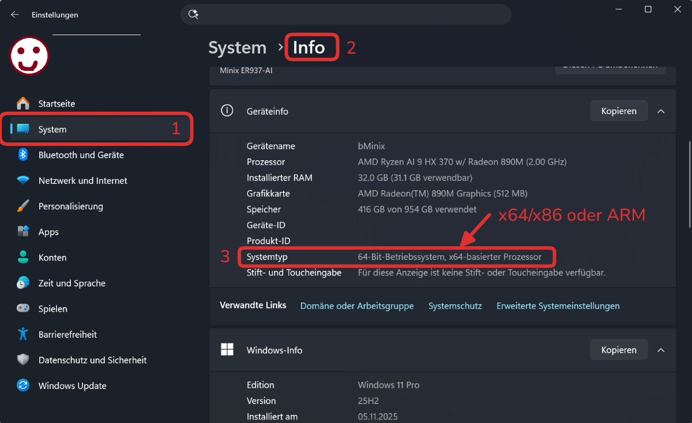
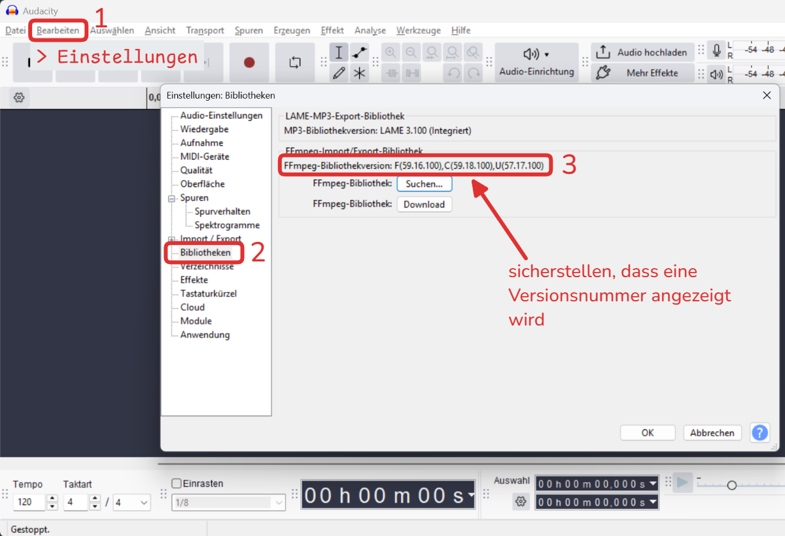
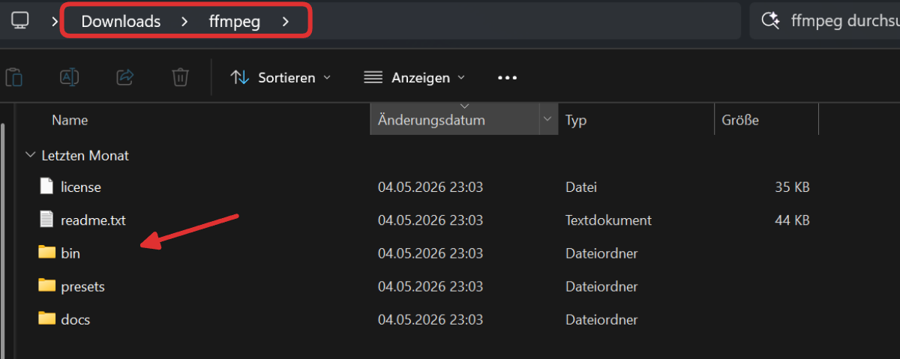
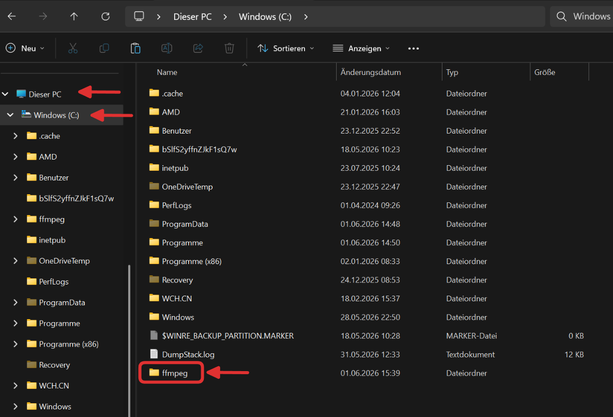
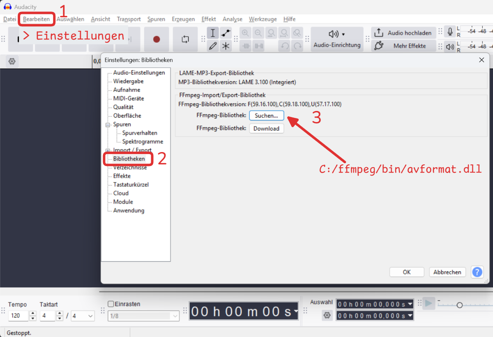
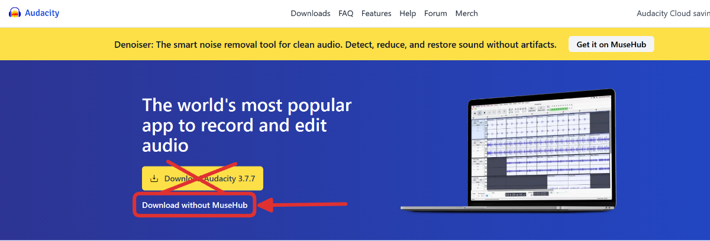
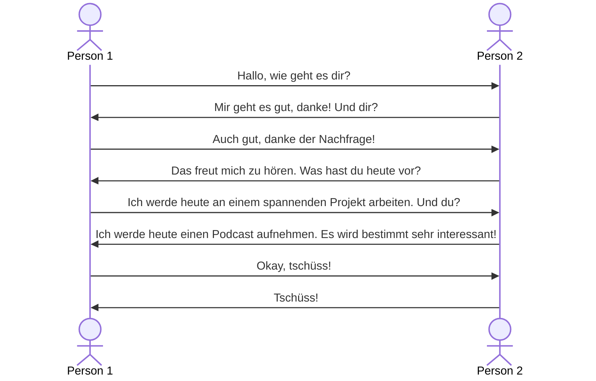

import OsTabs from '@tdev-components/OsTabs'
import Steps from '@tdev-components/Steps';

# Audacity

Um einen Podcast zu erstellen, können Sie im einfachsten Fall Ihre Stimme mit dem Handy aufnehmen und fertig.

Sie können aber auch Ihren Text mit Musik oder Geräuschen untermalen. Dabei können Sie eigene Aufnahmen oder Material aus dem Internet verwenden. Bei letzterem müssen Sie allerdings darauf achten, dass Sie keine Urheberrechte verletzten.

Für das Zusammenmischen von verschiedenem Tonmaterial eignet sich die Software Audacity sehr gut.

::youtube[https://www.youtube-nocookie.com/embed/Vn7HYyopGXk]

## Installation von Audacity

<OsTabs>
  <TabItem value="win">
    1. Audacity herunterladen und installieren: [Audacity für Windows](https://apps.microsoft.com/store/detail/audacity/XP8K0J757HHRDW)
    2. Um mit verschiedenen Audioformaten arbeiten zu können, müssen Sie die Bibliothek __ffmpeg__ installieren.
        1. Überprüfen, ob Sie einen __x64/x86__ oder __ARM__-Prozessor haben, um die richtige Version von Audacity herunterzuladen.  
             
        2. Die richtige Version von ffmpeg herunterladen und installieren.
            <OsTabs>
                <TabItem value="x64/x86">
                    Windows __x64/x86__
                    : [FFMPEG 5.0.0](https://lame.buanzo.org/FFmpeg_5.0.0_for_Audacity_on_Windows_x86_64.exe)

                    <Steps>
                        1. Herunterladen und installieren.
                        2. Nach der erfolgreichen Installation den Laptop neu starten.
                        3. Überprüfen, ob die Installation erfolgreich war und Audacity ffmpeg erkennt:  
                            
                    </Steps>
                </TabItem>
                <TabItem value="ARM">
                    <Steps>
                        1. Dateien herunterladen
                            - Gehen Sie auf die [ffmpeg-win-arm64 GitHub Releases](https://github.com/tordona/ffmpeg-win-arm64/releases/tag/8.1.1)-Seite.
                            - Laden Sie die __ffmpeg-8.1.1-essentials-shared-win-arm64.7z __ herunter
                        2. Entpacken & Ablegen
                            - Entpacken Sie den heruntergeladenen Ordner (__Reachtsklick → Alle extrahieren...__).
                            - Benennen Sie den entpackten Ordner um zu __ffmpeg__. In diesem Ordner sollten folgende Dateien enthalten sein:  
                                
                            - Verschieben Sie den gesamten Ordner __ffmpeg__ nach `C:\`:  
                                
                        3. Bibliothek in Audacity einbinden
                            - Öffnen Sie Audacity und gehen Sie zu __Bearbeiten → Einstellungen → Bibliotheken__.
                            - Klicken Sie auf __FFmpeg-Bibliothek hinzufügen...__.
                            - Navigieren Sie zum Ordner `C:\ffmpeg\bin` und wählen Sie Sie die Datei `avformat.dll` oder `avformat-62.dll` aus.  
                                
                    </Steps>
                </TabItem>
            </OsTabs>
  </TabItem>
  <TabItem value="mac">
    <Steps>
        1. Audacity herunterladen: [Download without MuseHub](https://www.audacityteam.org/)
            
        2. Um mit verschiedenen Audioformaten arbeiten zu können, müssen Sie die Bibliothek __ffmpeg__ installieren. Folgen Sie dazu der Anleitung von Audacity: [FFMPEG für Mac](https://support.audacityteam.org/basics/installing-ffmpeg#macos)
    </Steps>
  </TabItem>
</OsTabs>

## Vor der Aufnahme: Ausprobieren und Einstellungen anpassen

Bevor Sie die erste Aufnahme machen, sollten Sie sich mit der Software vertraut machen und eine erste kurze Aufnahme bearbeiten.

Mikrofon
: Sicherstellen dass im **Stereo-Kanal** aufgenommen wird, damit Sie später die Stimme von Person 1 und Person 2 getrennt bearbeiten können.
: https://support.audacityteam.org/basics/recording-your-voice-and-microphone
: Sicherstellen, dass die Lautstärke des Mikrofons korrekt einstellt ist, damit die Aufnahme nicht zu leise oder zu laut ist.
: https://support.audacityteam.org/basics/recording-your-voice-and-microphone/setting-recording-levels-and-playback-levels
Aufnahme
: Lesen Sie bspw. zu zweit oder mit veränderter Stimme folgenden kurzen Dialog ein
:::dd

:::
Bearbeitung
: **Stereo-Effekt** ausprobieren
: Trennen Sie die beiden Tonspuren auf und lassen Sie die eine Stimme nur auf der linken Seite und die andere Stimme nur auf der rechten Seite hören.
Mehrere Spuren
: Fügen Sie eine weitere Tonspur hinzu und experimentieren Sie mit verschiedenen Effekten, z.B. **Echo** oder **Hall**.
: https://support.audacityteam.org/audio-editing/making-crossfades
Lautstärke
: Experimentieren Sie mit der **Lautstärke** der verschiedenen Spuren, damit die Stimmen gut hörbar sind und sich nicht gegenseitig überlagern.
: https://support.audacityteam.org/audio-editing/loudness-normalization