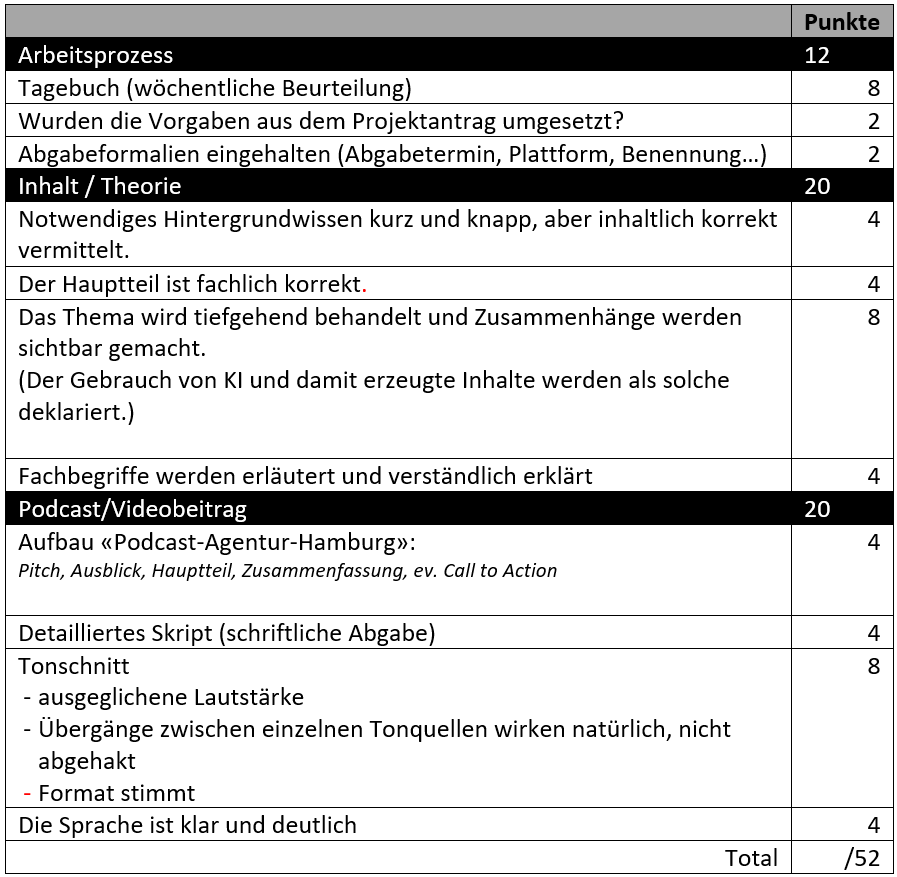
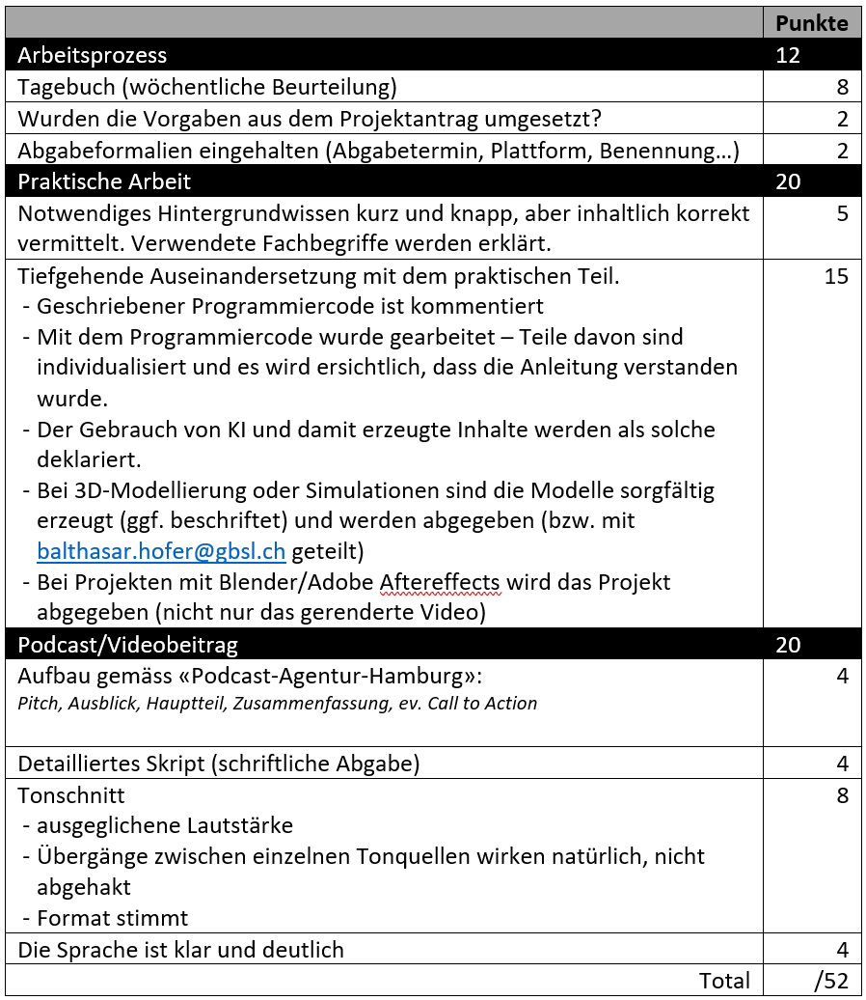
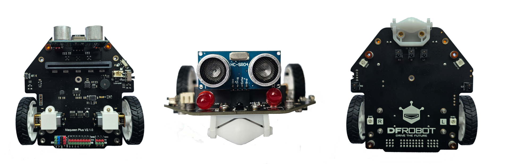

import BrowserWindow from '@tdev-components/BrowserWindow';
import PermissionsPanel from '@tdev-components/PermissionsPanel';
import DefinitionList from "@tdev-components/DefinitionList";
import CmsText from '@tdev-components/documents/CmsText';
import WithCmsText from '@tdev-components/documents/CmsText/WithCmsText';

# Projekt

:::info[TL;DR]
Gruppengrösse
: 2, Partnerarbeit
Termin 1: Projektantrag
: Sonntag 10.05.2026, 16:00 Uhr
: [👉 Vorlage](https://erzbe-my.sharepoint.com/:w:/g/personal/balthasar_hofer_gbsl_ch/EcKlfnWD2TtLspneUsiwOsMBQR7xaockSJxd3gWfmRBeXQ?e=KtxPNg)
: __klasse-vorname1-vorname2.docx__
: [👉 Abgabe Projektantrag auf OneDrive](https://erzbe-my.sharepoint.com/:f:/g/personal/balthasar_hofer_gbsl_ch/IgBvBpSkjcreQIWcFKE5r0LAAevf5JGemRR1bqmpXP8IrxM)
Termin 2: Finale Abgabe
: 16.06.2026, 22:00 Uhr
: Finale Abgabe auf OneDrive
:::

Zu zweit suchen Sie sich selbständig ein Thema aus der Informatik aus, welches Sie **interessiert** und über mehrere Wochen umgesetzt werden kann.

## Ablauf

Suchen Sie sich ein Thema, in welches Sie sich innerhalb von 5 Doppellektionen einarbeiten können. Ihr Projekt darf auch einen praktischen Teil beinhalten (muss aber nicht).

Das Endprodukt ihres Projekts ist ein **4-7 Minuten** langer **Podcast** oder, wenn Visualisierungen zwingend sind, ein **Videobeitrag**. Zudem wird eine **wöchentliche schriftliche** Reflexion zum Arbeitsprozess und dem Projekt verfasst, die in die Beurteilung einfliesst.

## Tagebucheinträge
:::info[Tagebuch]
Wann
: bis am Abend des jeweiligen Tages, an welchem die Inf-Doppelstunde stattfindet
Wie
: schriftliche Reflexion hier auf der Webseite
: Aktueller Stand, was wurde in dieser DL erreicht, was wurde dazugelernt, konnte die Zeit effizient genutzt werden, was sind die nächsten Schritte, etc.
Wer
: Jede Person für sich alleine, da die Lernerfahrungen individuell sind.
: *Kopieren von Texten nicht erwünscht*
: *KI-Texte nicht erwünscht*
Länge
: Mehr als zwei Sätze, weniger als eine Seite. Es geht hier nicht um die Länge, sondern um die Qualität der Reflexion.
Beurteilung
: Max. 2 Punkte pro Eintrag (wird gesondert für die Schlussbeurteilung miteinbezogen) 
:::

:::tip[Tagebuch Nr. 1]
<PermissionsPanel documentRootId="fc4b445e-0e7a-4a2b-97d9-d580d9d6348f" />

<Answer type="text" id="fc4b445e-0e7a-4a2b-97d9-d580d9d6348f"  />

<WithCmsText 
    entries={{
        punkte: "fe550d5e-dda8-4924-96c1-9be51eb70671",
        notizen: "dfd19b88-cf08-4040-91fa-a047642da1d3", 
    }}
>
    <DefinitionList>
        <dt>Punkte</dt>
        <dd><CmsText name="punkte" /> / 2</dd>
        <dt>Notizen</dt>
        <dd><CmsText name="notizen" /></dd>
    </DefinitionList>
</WithCmsText>
:::

:::tip[Tagebuch Nr. 2]
<PermissionsPanel documentRootId="58d39aa5-3074-4be9-8e6e-12b37dec8db9" />

<Answer type="text" id="58d39aa5-3074-4be9-8e6e-12b37dec8db9"  />

<WithCmsText 
    entries={{
        punkte: "6b083ce5-97e7-4d28-a1ab-992611468d73",
        notizen: "4e56c3ec-1bab-4def-9cda-fb0c676e02a7", 
    }}
>
    <DefinitionList>
        <dt>Punkte</dt>
        <dd><CmsText name="punkte" /> / 2</dd>
        <dt>Notizen</dt>
        <dd><CmsText name="notizen" /></dd>
    </DefinitionList>
</WithCmsText>
:::

:::tip[Tagebuch Nr. 3]
<PermissionsPanel documentRootId="c9206adb-35ff-47c7-a83c-de3d3f1fd2db" />

<Answer type="text" id="c9206adb-35ff-47c7-a83c-de3d3f1fd2db"  />

<WithCmsText 
    entries={{
        punkte: "1069bee9-4abb-4fb6-afa7-bdce24a7ccc6",
        notizen: "454deb0b-92a8-480d-847a-0e372ed2e51c", 
    }}
>
    <DefinitionList>
        <dt>Punkte</dt>
        <dd><CmsText name="punkte" /> / 2</dd>
        <dt>Notizen</dt>
        <dd><CmsText name="notizen" /></dd>
    </DefinitionList>
</WithCmsText>
:::

:::tip[Tagebuch Nr. 4]
<PermissionsPanel documentRootId="bff19857-2d26-408d-b7ee-9aaf665c7255" />

<Answer type="text" id="bff19857-2d26-408d-b7ee-9aaf665c7255"  />

<WithCmsText 
    entries={{
        punkte: "724c44ee-7baf-4ee8-90b3-675d8f972e75",
        notizen: "7797377f-ad59-4673-8249-135772c9c9c8", 
    }}
>
    <DefinitionList>
        <dt>Punkte</dt>
        <dd><CmsText name="punkte" /> / 2</dd>
        <dt>Notizen</dt>
        <dd><CmsText name="notizen" /></dd>
    </DefinitionList>
</WithCmsText>
:::

:::tip[Tagebuch Nr. 5]
<PermissionsPanel documentRootId="17ad8701-f633-43f4-8227-a87bcf6b7f02" />

<Answer type="text" id="17ad8701-f633-43f4-8227-a87bcf6b7f02"  />

<WithCmsText 
    entries={{
        punkte: "0373ef2a-aac5-4351-b80c-d9c53b04e81a",
        notizen: "12a54797-f30e-4f3f-a9c8-63ed4aaa712c", 
    }}
>
    <DefinitionList>
        <dt>Punkte</dt>
        <dd><CmsText name="punkte" /> / 2</dd>
        <dt>Notizen</dt>
        <dd><CmsText name="notizen" /></dd>
    </DefinitionList>
</WithCmsText>
:::

## Beurteilung

<Tabs
  values={[
    {label: 'Theoretische Arbeit', value: 'theorie'},
    {label: 'Praktische Arbeit', value: 'praktisch'},
  ]}>
<TabItem value="theorie">

</TabItem>
<TabItem value="praktisch">

</TabItem>
</Tabs>

---

:::info[Verfügbare Hardware an der Schule]
Die Schule bietet begrenzte Hardware-Stückzahlen, um sich z.B. im Rahmen eines Hardware-Projekts mit den Möglichkeiten der folgenden Geräte\* auseinanderzusetzen.
- Micro\:Bit Platine
- Maqueen Roboter (Gesteuert über Micro\:Bit)
- 3D Drucker
- EV3 Roboter (können nur an der Schule gebraucht werden)
- Arduinos inkl. mehrerer Sensoren, WLAN-Kompatibel
- ESP32 inkl. WLAN
- Raspberry PI 3 (ohne WIFI)

\* *Erfordert die Rücksprache mit Herrn Hofer, um die Verfügbarkeiten zu organisieren*
:::

## Themenwahl und Ideensuche 

Informieren Sie sich über Themen, die Sie spannend finden. Tauschen Sie sich anschliessend mit den Klassenkamerad:innen aus und finden Sie eine Projektpartner:in, welche Ihre Interessen teilt. Entscheiden Sie sich für ein Thema und schreiben Sie einen Projektantrag in folgender [👉 Vorlage](https://erzbe-my.sharepoint.com/:w:/g/personal/balthasar_hofer_gbsl_ch/EcKlfnWD2TtLspneUsiwOsMBQR7xaockSJxd3gWfmRBeXQ?e=KtxPNg).

Füllen Sie den Projektantrag aus und laden Sie den Antrag bis am Freitag Abend, 10.05.2026, 16:00 Uhr hoch auf: [👉 OneDrive Projektantrag](https://erzbe-my.sharepoint.com/:f:/g/personal/balthasar_hofer_gbsl_ch/IgBvBpSkjcreQIWcFKE5r0LAAevf5JGemRR1bqmpXP8IrxM)

## Projektideen und Inspiration
Bei der Wahl Ihres Projektthemas sind Sie grundsätzlich frei. Die einzige Bedingung ist, dass es einen Bezug zur Informatik haben muss. Nachfolgend finden Sie einige Ideen und Themenbereiche, die Ihnen als Inspiration dienen können. Sie können aber natürlich auch gerne eigene Ideen entwickeln oder Themenbereiche kombinieren.

:::warning[Eingeschränkte Ressourcen]
Die Schule verfügt über einige Ressourcen wie z.B. 3D-Drucker, Micro:Bits, etc., die Sie für Ihr Projekt gerne nutzen können. Beachten Sie aber, dass diese Ressourcen begrenzt sind, und dass deren Verfügbarkeit nicht garantiert werden kann. Sie stehen zudem ausschliesslich während der Unterrichtszeit zur Verfügung und können nicht mit nach Hause genommen werden.
:::

### Eine Lerneinheit erstellen
Gibt es ein Thema, das wir im Informatikunterricht noch nicht behandelt haben? Möchten Sie z.B. etwas über das Darknet, über die Enigma-Verschlüsselungsmaschine oder über die Geschichte der Informatik lernen? Dann haben Sie jetzt die Möglichkeit dazu! Am besten _lernt_ man nämlich beim _Lehren_ – also dann, wenn man jemandem etwas erklären muss, denn dann muss man das Thema so gut verstehen, dass man sein Wissen ordnen, strukturieren und in eigenen Worten wiedergeben kann.

Wenn Sie also ein Thema haben, das Sie interessiert, dann können Sie dazu eine spannende Lerneinheit erstellen. Besonders gut geeignet ist beispielsweise ein Lernvideo (Legetechnik, Stop-Motion, Präsentation an der Tafel, etc.), in Verbindung mit einem Arbeitsblatt, einem Online-Quiz (z.B. Kahoot, LearningApps) oder sonstigem geeignetem Übungsmaterial.

### Game Development
Möchten Sie ein einfaches grafisches Computerspiel entwickeln? Mit einem Framework wie [Pygame](https://www.pygame.org/news) ist das gar nicht so schwierig. Sie können z.B. ein klassisches Arcade-Spiel wie Pong, Snake oder Breakout nachbauen, oder aber auch ein eigenes Spielkonzept entwickeln. Es gibt viele Tutorials und Ressourcen online, die Ihnen den Einstieg erleichtern können – sofern Sie bereit sind, sich selbstständig in einige fortgeschrittene Python-Konzepte einzuarbeiten (z.B. Objektorientierung).

Alternativ können Sie den grafischen Teil auch weglassen und stattdessen ein textbasiertes Spiel – ein sogenanntes Text Adventure – entwickeln. Was sie dabei an Grafik und Benutzeroberfläche einsparen, können Sie in eine komplexere Spielmechanik und eine packende Story investieren, z.B. durch die Implementierung eines Inventarsystems, von verschiedenen Charakteren mit unterschiedlichen Eigenschaften, oder von komplexeren Handlungssträngen.

### Eine weitere Programmiersprache lernen
Im Informatikunterricht haben Sie die Grundlagen des Programmierens mit Python gelernt. Python wird in der Praxis zwar sehr häufig verwendet, aber es gibt natürlich auch viele andere Programmiersprachen, die für verschiedene Anwendungsbereiche besonders geeignet sind. Die gute Nachricht: Sie haben nicht nur Python gelernt, sondern auch ganz viele grundlegende Programmierkonzepte, die sich problemlos auf andere Programmiersprachen übertragen lassen. Konstrukte wie Variablen, Schleifen, Verzweigungen und Funktionen finden Sie nämlich in fast jeder Programmiersprache.

Wenn Sie Ihre Programmier-Skills also etwas erweitern möchten, dann könnten Sie beispielsweise die Grundlagen einer der folgenden Sprachen lernen:

JavaScript
: Die wichtigste Programmiersprache für die Webentwicklung, aber auch sehr vielseitig einsetzbar (z.B. mit Node.js auch für die Server-Entwicklung, oder mit Frameworks wie React Native für die App-Entwicklung).
TypeScript
: Eine Erweiterung von JavaScript, die vor allem in der professionellen Softwareentwicklung sehr beliebt ist, weil sie durch die Einführung von statischen Typen die Wartbarkeit und Fehlersicherheit von Softwareprojekten verbessert - auch wenn die Lernkurve etwas steiler ist als bei JavaScript.
React
: Ein sehr populäres JavaScript-Framework für die Entwicklung von Benutzeroberflächen, das von Facebook entwickelt wurde und in vielen professionellen Webprojekten zum Einsatz kommt. Es ist zwar kein eigenständige Programmiersprache, sondern ein Framework, aber es könnte dennoch eine spannende Herausforderung sein, sich damit auseinanderzusetzen und eine kleine Webanwendung damit zu entwickeln. (p.S. diese Seite hier ist übrigens mit React gebaut)
Java
: Eine der am weitesten verbreiteten Programmiersprachen, die vor allem in der Unternehmenssoftware, aber auch in der Android-App-Entwicklung sehr beliebt ist. Der Einstieg ist etwas komplexer als bei Python, aber es gibt viele Ressourcen und Tutorials, die Ihnen dabei helfen können.
C
: Sicher eine der anspruchsvollsten, jedoch auch eine der ältesten und einflussreichsten Programmiersprachen, die vor allem in der Systemprogrammierung, aber auch in der Spieleentwicklung und in eingebetteten Systemen (z.B. Arduino) weit verbreitet ist

### Robitik mit Micro:Bit und Maqueen
Der Micro:Bit ist ein kleiner, aber leistungsfähiger Mikro-Computer, der speziell für Bildungszwecke entwickelt wurde. Er verfügt über verschiedene Sensoren (z.B. Beschleunigungssensor, Kompass, Temperaturfühler, Mikrofon) und Aktoren (z.B. LEDs, Lautsprecher), mit denen man viele kreative Projekte umsetzen kann. Beispielsweise können Sie damit einen Schrittzähler, eine kleine Wetterstation oder eine einfache Alarmanlage bauen. Mit etwas Kreativität entwickeln Sie damit womöglich sogar ein neuartiges Instrument. Das Beste ist: Den Micro:Bit können Sie mit Python programmieren.

Der Micro:Bit kann zudem in dem Maqueen-Roboter eingebaut werden, um damit einen kleinen, programmierbaren Roboter zu bauen. Mit diesem können Sie z.B. eine kleine Rennstrecke aufbauen und einen autonomen Rennwagen programmieren, der diese Strecke bewältigen kann. Oder Sie entwickeln ein neues Spiel, bei dem der Maqueen-Roboter eine zentrale Rolle spielt.

### 3D-Druck
Noch nie war es so einfach, eine Idee zu einem echten dreidimensionalen Objekt werden zu lassen, wie heute mit 3D-Druckern. Sie können z.B. eine praktische Handy-Halterung, ein individuelles Schlüsselanhänger oder eine originelle Deko-Figur entwerfen und ausdrucken. Es gibt viele kostenlose 3D-Modellierungsprogramme (z.B. Tinkercad, Blender), die Sie für die Gestaltung Ihrer 3D-Modelle verwenden können, und viele Online-Ressourcen, die Ihnen den Einstieg erleichtern können.

Im Rahmen dieses Projekts könnten Sie beispielsweise mit einem einfachen 3D-Modellierungsprogramm wie _Tinkercad_ einen cleveren Alltagsgegenstand entwerfen, der ein Problem löst, das Sie im Alltag haben. Das könnte z.B. eine praktische Kabelhalterung sein, die verhindert, dass Ihre Ladekabel ständig von Ihrem Schreibtisch herunterfallen, oder eine clevere Aufbewahrungslösung für Ihre Stifte und Notizbücher.

Mit _Tinkercad_ kommen Sie ohne grosse Vorkenntnisse schnell zu einem ersten Ergebnis – leider ist das Tool dementsprechend aber auch recht stark eingeschränkt. In professionelleren Projekten werden deshalb deutlich komplexere Tools wie _Autodesk Fusion_, _OnShape_ oder _Blender_ verwendet. Ziel Ihres Projekts könnte es also auch sein, ein sehr viel simpleres Objekt zu entwerfen, dieses dafür aber mit einem professionellen Tool zu entwickeln. Das zentrale Artefakt Ihres Projekts wäre in dem Fall nicht in erster Linie das gedruckte Modell, sondern z.B. ein Lernvideo, in dem Sie die wichtigsten Funktionen des Tools erklären und den Entwicklungsprozess demonstrieren.

Das 3D-Drucken an sich ist natürlich ebenfalls ein Handwerk, das gelernt sein will – 3D-Drucker sind nämlich nicht ganz so einfach zu bedienen, wie 2D-Drucker. Besonders herausfordernd ist dabei das sogenannte «Slicing» – also die Umwandlung eines 3D-Modells in Anweisungen, die der 3D-Drucker verstehen und umsetzen kann. Die Grundlagen des 3D-Drucks und des Slicings zu verstehen, ist demnach sicherlich auch Teil Ihres Projekts. Allerdings sollten Sie sich nicht zu sehr auf diesen Aspekt fokussieren, denn hier braucht es vor allem viel Übung und Trial & Error. Das ist für ein solches Projekt nicht ideal, denn die 3D-Drucker der Schule stehen Ihnen nicht zur freien Verfügung.

## Abgabe
:::tip[Abgabe]

Es wird ein **.zip-Ordner** mit dem Namen `name_vorname.zip` (bzw. für Gruppen `name1-vorname1 name2-vorname2.zip`) per obigem OneDrive-Link abgegeben.

Darin enthalten sind:

| Was                                              | Format                |                                Dateiname |
| :----------------------------------------------- | :-------------------- | ---------------------------------------: |
| Podcast / Videobeitrag                           | `.mp3` /   `.mp4` | `podcast.mp3` /   `videobeitrag.mp4` |
| Skript (Gliederung) des Podcasts / Videobeitrags | `.pdf`                |                             `skript.pdf` |
| Projektmaterial (Programmcode, Projektdateien)   | Ordner                |                              `material/` |
:::

[^1]: *Die Buchausschnitte sind urheberrechtlich geschützt und dürfen ausschliesslich für den schulischen Gebrauch verwendet werden. Die Weitergabe ist verboten.*
