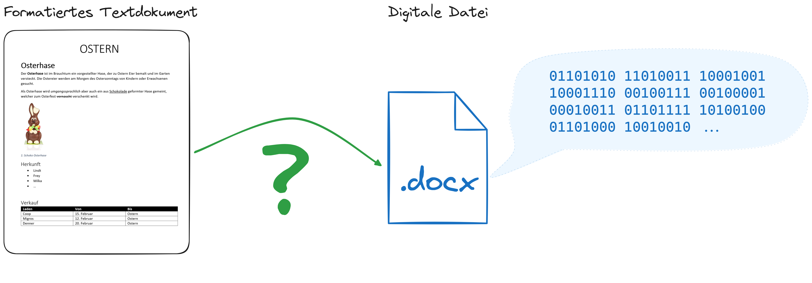
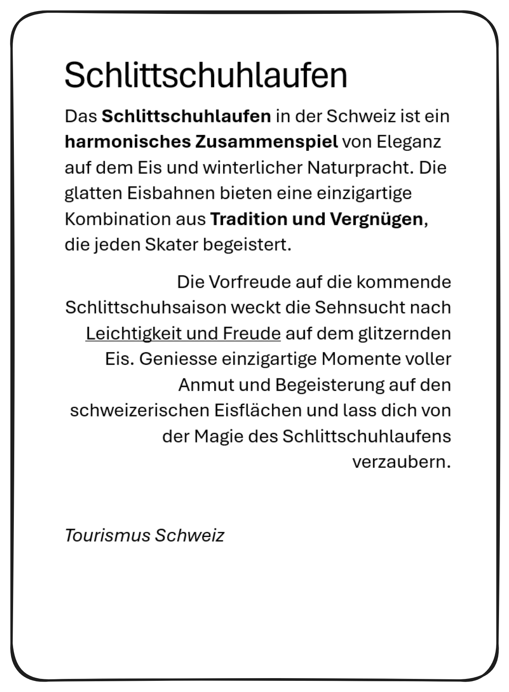

import Bin2Text from '@tdev-components/VisualizationTools/Bin2Text'
import Text2Bin from '@tdev-components/VisualizationTools/Text2Bin'
import Restricted from '@tdev-components/documents/Restricted';
import QuillV2 from '@tdev-components/documents/QuillV2';

# Textdokumente

:::info[Datei]
Was ist eine Datei? Wikipedia sagt dazu:

> Eine Datei (englisch file) ist in der Informationstechnologie die Zusammenfassung gleichartiger digitaler Daten, die zum Speichern auf Datenträgern oder Speichermedien, zur Wiedergabe, zum Bearbeiten und zur Datenübertragung dient und durch einen Dateinamen identifiziert wird.
> Das Wort „Datei“ ist nicht erst durch die Informationstechnologie entstanden, sondern war auch bereits zuvor bekannt. Dem Duden zufolge ist die Datei ein „nach zweckmäßigen Kriterien geordneter, zur Aufbewahrung geeigneter Bestand an sachlich zusammengehörenden Belegen oder anderen Dokumenten.“
> Das Wort „Datei“ ist ein Kunstwort aus Daten und Kartei, weil eine Kartei vergleichbar aus Karteikarten mit einheitlicher Inhaltsstruktur besteht.[^1]
:::

## Perspektive der Anwender:in
Ein digitales Textdokument ist eine Datei, die (primär) Text enthält und digital gespeichert wird. Textdokumente können in verschiedenen Formaten gespeichert werden, die sich in ihrer Struktur und den Möglichkeiten zur Formatierung unterscheiden.

Bekannte Formate für Textdokumente sind:

`.docx`
:  Das Dateiformat von Microsoft Word
`.odt`
: Das Dateiformat von LibreOffice - der kostenlosen Open-Source-Alternative zu Microsoft Office
`.txt`
: Ein einfaches Textformat, das nur den reinen Text speichert, ohne Formatierungen und ohne Bilder
`.pdf`
: Das Dateiformat von Adobe Acrobat, das unabhängig von der verwendeten Software immer gleich aussieht, jedoch nicht so einfach zu bearbeiten ist wie `.docx` oder `.odt`
`.html`
: Das Dateiformat von Webseiten.
`.md`
: Das Dateiformat von Markdown-Dateien - eine simplere Variante von `.html`, die auch von Menschen gut lesbar ist und somit einfacher zu schreiben ist.
: 💡 Die Inhalte dieser Webseite sind im Markdown-Format geschrieben.

## Perspektive des Computers
Betrachtet man jedoch die Dateien aus der Perspektive eines Computers - genauer gesagt eines Datenträgers - so sehen alle Dateien gleich aus: Sie sind eine Abfolge von Einsen und Nullen, die in einem bestimmten Format gespeichert sind.

Das Betriebssystem ist verantwortlich, alle zu einer Datei gehörenden Daten (also die Einsen und Nullen) wieder zu finden, in der richtigen Reihenfolge zu lesen und diese Daten in die entsprechende Anwendung (bspw. Word) zu übergeben.

Damit die Informationen aus dem Textdokument korrekt angezeigt werden kann, müssen die Daten in einem bestimmten Format gespeichert werden. Dieses Format wird durch die Dateiendung angezeigt. Beispielsweise wird eine Textdatei, die im Format von Microsoft Word gespeichert ist, mit der Dateiendung `.docx` versehen. Bei Dateien mit dieser Endung wird also eine **einheitliche Inhaltsstruktur** erwartet, die bei allen `.docx`-Dateien gleich ist.

## Wie funktioniert das?



### Text in binäre Form umwandeln
Dies ist für einen Computer einfach: Jeder Buchstabe, jedes Zeichen und jedes Bild kann in eine Abfolge von Einsen und Nullen umgewandelt werden. Diese Umwandlung erfolgt nach einem festgelegten Schema, das für alle Computer gleich ist. So kann ein Computer die Einsen und Nullen wieder in Text oder Bilder umwandeln.

<Text2Bin />

<Bin2Text />

### Formatierung und Darstellung
Schwieriger wird es bei Formatierungen! Da nur Einsen und Nullen gespeichert werden, muss auch die Formatierung in dieser Form gespeichert werden.

::::::aufgabe[Text formatieren]
<Answer type="state" id="102be25c-18a0-4b5b-805e-54cd406686f3" />

Unten finden Sie ein formatiertes Textdokument als Vorlage - doch Sie können nur Binär-Informationen an Ihre Partner:in weitergeben. Deshalb müssen Sie eine andere Form finden, die Informationen zu übermitteln.

1. Entwerfen Sie ein möglichst leicht verständliches, aber auch ein unmissverständliches Format, um diese Informationen ebenfalls in der Übermittelten Datei zu speichern.
2. Übermitteln Sie den Binär-Form per Teams an ihre Partner:in aus der anderen Halbklasse.
3. Versuchen Sie die Informationen zu entschlüsseln und das Textdokument zu rekonstruieren.

:::::details[Vorlage für formatiertes Textdokument]
::::cards{flexBasis=250px}
<Restricted id="789635d2-d344-47ed-a765-853abb130fdf">


```plaintext
Skifahren
Der alpine Skisport in der Schweiz verbindet atemberaubende Berglandschaften mit erstklassigen Pisten, gemütlichen Berghütten und herzlicher Gastfreundschaft. Jeder Schwung ist ein Moment der Freiheit und des Glücks. 
Tauche ein in die Schweizer Skisaison und erlebe die unvergleichliche Magie des Winters.
- Tourismus Schweiz
```
</Restricted>
::br
<Restricted id="76702226-9525-48db-8c11-d145b7819c61">

```plaintext
Schlittschuhlaufen
Das Schlittschuhlaufen in der Schweiz ist ein harmonisches Zusammenspiel von Eleganz auf dem Eis und winterlicher Naturpracht. Die glatten Eisbahnen bieten eine einzigartige Kombination aus Tradition und Vergnügen, die jeden Skater begeistert. 
Die Vorfreude auf die kommende Schlittschuhsaison weckt die Sehnsucht nach Leichtigkeit und Freude auf dem glitzernden Eis. Geniesse einzigartige Momente voller Anmut und Begeisterung auf den schweizerischen Eisflächen und lass dich von der Magie des Schlittschuhlaufens verzaubern.

Tourismus Schweiz
```
</Restricted>
::::
:::::

#### Text vorbereiten
<QuillV2 toolbar={{code: true}} id="294265e6-09e7-480f-9e9c-12dfb80c0f40" />

<Restricted id="6840dd02-30d1-460a-87b0-a8d73207e42a">

#### Empfangener Binär-Code wiederherstellen
<QuillV2 toolbarExtra={{align: true}} id="45e878d7-9e08-4721-9d02-790613d3a23d" />

</Restricted>

::::::

[^1]: Quelle: [Wikipedia](https://de.wikipedia.org/wiki/Datei) zugegriffen am 20.11.2024