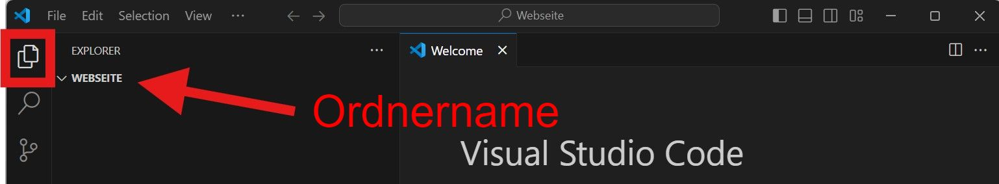

# HTML

HTML ist eine Abkürzung und steht für **H**yper**t**ext **M**arkup **L**anguage. Es ist eine **Auszeichnungssprache**, die verwendet wird, um Inhalte im Web zu strukturieren und zu formatieren. HTML ist die Grundlage für jede Webseite im Internet.

Die Struktur eines Textes wird in HTML durch __Tags__ definiert.

:::cards{flexBasis=250px}
```html
<name>Inhalt</name>
```
- Tags werden nie angezeigt, sondern nur der Inhalt zwischen den Tags.
- Es gibt öffnende Tags (`<name>`)...
- ...und schliessende Tags (`</name>`).
::br
Tags können auch verschachtelt werden:
```html
<überschrift>
    Eine <fett>wichtige</fett> Information
</überschrift>
```
wobei Zeilenumbrüche keine Rolle spielen - obige Struktur ist gleichbedeutend mit:
```html
<überschrift>Eine <fett>wichtige</fett> Information</überschrift>
```
:::

## Tag-Namen
Das [World Wide Web Consortium](https://www.w3.org/) (W3C) hat ab 1994 die Spezifikationen für HTML festgelegt, wobei sie auch die Tag-Namen für verschiedene Struktur-Elemente eines Dokuments festgelegt haben.

`h1`
: Überschrift 1. Die grösste Überschrift
`h2`
: Überschrift 2. Eine etwas kleinere Überschrift
`h3`, `h4`, `h5`, `h6`
: Überschriften 3 bis 6. Immer kleiner werdende Überschriften
`p`
: Absatz oder Paragraph - wie in Word...
`a`
: Link. Verknüpfung zu einer anderen Webseite.
`ul`
: Ungeordnete Liste. Eine Liste ohne Nummerierung.
`ol`
: Geordnete Liste. Eine Liste mit Nummerierung.
`li`
: Listenelement. Ein Element in einer Liste.
`b`
: Fett. Text fett darstellen.
`i`
: Kursiv. Text kursiv darstellen.
`u`
: Unterstrichen. Text unterstrichen darstellen.
`div`
: Division. Ein Container für andere Elemente.
`span`
: Ein Container für Inline-Elemente.

### Attribute

Für einige Elemente braucht es zusätzliche Informationen, damit sie korrekt dargestellt werden können. Beispielsweise muss bei einem Bild angegeben werden, wo das Bild zu finden ist! Diese Information wird in einem __Attribut__ gespeichert.

```html

```
:::warning[Kein schliessendes Tag]
Es gibt einige wenige Tags, wie das Bild-Tag ``, die kein schliessendes Tag haben. Sie werden auch als __leere Tags__ bezeichnet.
:::

Weitere Attribute sind:

`alt`
: Alternativer Text, der angezeigt wird, wenn das Bild nicht geladen werden kann.
`width`
: Breite des Bildes.
`height`
: Höhe des Bildes.
`href`
: Der Link, auf den verwiesen wird.
: z.B. `<a href="https://www.google.com">Google</a>`

## Beispiel

::codepen[https://codepen.io/lebalz/pen/KwPKbpJ]{defaultTab=html,result height=700px}


## VS Code

VS Code ist ein Text-Editor, mit dem man HTML-Dateien praktisch bearbeiten kann.

:::aufgabe[VS Code installieren]
<Answer type="state" id="f6a96a4c-ada7-420a-9090-49098a499ac5" />

Installation
: [VS Code](https://code.visualstudio.com/) herunterladen und installieren.

Markieren Sie diese Aufgabe als erledigt, wenn Sie VS Code installiert haben.
:::

## Eine erste Webseite

:::::aufgabe[Vorbereitung]
<Answer type="state" id="79fdf8c2-2741-4daa-9c53-8e5befcabef8" />

Ordner
: __OneDrive - EDUBERN/Informatik/Webseite__

Die Vorbereitung beinhaltet 5 Schritte - führen Sie diese aus und markieren Sie die Aufgabe als erledigt.
::::details[**5** Vorbereitungs-Schritte]
1. Erstellen Sie einen neuen Ordner im Informatik-Ordner namens __Webseite__.
2. Öffnen Sie VS Code und darin den zuvor erstellten Ordner: __File > Open Folder__.
    ::video[./images/open-folder.mp4]
    :::warning[Überprüfen]
    Überprüfen Sie, dass nun der Ordner __Webseite__ in VS Code geöffnet ist.
    
    :::
3. Erstellen Sie eine neue Datei namens __index.html__ und einen neuen Ordner namens __bilder__.
    ::video[./images/create-files-and-folders.mp4]
4. Fügen Sie den folgenden Code in die Datei __index.html__ ein und speichern Sie mit [[Ctrl+S]].:
    ```html
    <!DOCTYPE html>
    <html>
    <head>
        <title>Meine erste Webseite</title>
    </head>
    <body>
        <h1>Willkommen auf meiner Webseite</h1>
        <p>Das ist meine erste Webseite.</p>
    </body>
    </html>
    ```
5. Öffnen Sie die Webseite im Browser, indem Sie __index.html__ im Explorer doppelklicken:
    ::video[./images/open-website.mp4]
::::
:::::
### Rezept-Seite
Auf der Webseite soll Ihr Lieblingsrezept präsentiert werden. Die bisherige Webseite enthält nur das Grundherüst und ist eingeteilt in einen `head` und einen `body`-Teil. Was kommt in welchen Teil?

`<head>`
: Im `head`-Teil stehen nur die für einen Computer nützlichen Informationen, die allergings nie für eine Webseitenbesucher:in sichtbar sind. Hier steht z.B. der Titel der Webseite oder weitere Zusatzinformationen, die beim Auffinden der Webseite bspw. über Google helfen.
: Es stehen aber auch Informationen für den Browser drin, bspw. wie gross die Seite angezeigt werden soll oder in welchen Dateien weitere Inhalte zu finden sind. 
`<body>`
: Im `body`-Teil steht der eigentliche Inhalt der Webseite. Hier stehen die Texte, Bilder, Links und weiteren Elemente, die die Besucher:innen sehen sollen.

::::aufgabe[Rezept-Seite]
<Answer type="state" id="c3191974-c394-4e2d-8085-63450e0729ac" />

1. Ändern Sie den Titel der Webseite in passend für Ihr Rezept.
2. Fügen Sie das mitgebrachte Bild im Ordner __bilder__ ein und benennen Sie es so um, dass keine Leerschläge und Umlaute enthalten sind. **Die Dateieindung (normalerweise `.jpg`, `.png`, `.webp` oder `.heic`) darf aber nicht entfernt werden.**
3. Fügen Sie das Bild auf Ihrer Webseite direkt unter der Überschrift ein.
    :::note[Bild einfügen]
    Ein Bild kann mit dem ``-Tag eingefügt werden. Das Attribut `src` gibt den Pfad zum Bild an - also eine Beschreibung, wie vom Dokument aus das Bild gefunden werden kann.
    ```html
    
    ```
    :::
4. Speichern Sie die Datei und öffnen Sie die Webseite im Browser.
5. Markieren Sie die Aufgabe als erledigt.
::video[./images/link-image.mp4]
::::

Das ständige Wechseln zwischen VS Code und dem Browser ist mühsam. Es gibt aber eine Erweiterung für VS Code, die das Leben einfacher macht: __Live Preview__. Zudem kann in diesem Zuge auch gleich das automatische Speichern aktiviert werden.

:::aufgabe[Live Preview installieren]
<Answer type="state" id="2926bd08-1465-44fe-b74f-dbc90c9c9973" />

1. Installieren Sie die Erweiterung [Live Preview](https://marketplace.visualstudio.com/items?itemName=ms-vscode.live-server).
2. Aktivieren Sie das automatische Speichern: __File > Auto Save__.
3. Markieren Sie die Aufgabe als erledigt.

::video[./images/install-preview-autosave.mp4]

:::

Die Webseite enthält nun erst die Überschrift und ein (überbreites) Bild.

Die Bildgrösse kann im ``-Tag mit dem Attribut `width` werden - die Angabe erfolgt in Pixeln.:

```html	

```
Um die nötigen Rezept-Zutaten und die Zubereitungsschritte zu präsentieren, können Listen verwendet werden.

:::def[Ungeordnete Liste `<ul>`]
Eine Ungeordnete Liste (`ul` für **u**nordered **l**ist) sieht wie folgt aus:

```html
<ul>
    <li>500 ml Milch</li>
    <li>150 g Zucker</li>
    <li>4 Eigelb</li>
    <li>100 g dunkle Schokolade, gehackt</li>
    <li>1 TL Vanilleextrakt</li>
</ul>
```
Die `li`-Tags stehen für **l**ist **i**tem und enthalten die einzelnen Elemente der Liste.
:::

:::info[Abstände]
Die Abstände und das Einrücken zwischen der einzelnen Tags ist dem Computer egal - für die Lesbarkeit ist es allerdings hildreich, verschachtelte Elemente einzurücken.
::: 

:::def[Geordnete Liste `<ol>`]
Eine Geordnete Liste (`ol` für **o**rdered **l**ist) sieht wie folgt aus:

```html
  <ol>
    <li>Miuch u Zucker ine Topf gheie u erhitzä, bis dr Zucker ufglöst isch. Sofort wägnä vom Herd.</li>
    <li>Eigäub ire Schüssle verrührä u när d Miuch-Zucker-Mischig derzuegheie.</li>
    <li>Aues uf 80 ° erhitze - geng rührä dasses nid ahhockt!</b></li>
    <li>Wäg vom Herd u die ghackti Schoggi drigheie und dr Vanilleextrakt drungerzieh. Rührä bis d Schoggi gschmutzä isch</li>
    <li>Ab id Ismaschinä tue bises schön crémig isch.</li>
    <li>No für min. 2 Stung id gfürüri 🥶</li>
    <li>Umpfertig 🧁🍧🍨🍦</li>
  </ol>
```
:::

:::aufgabe[Rezept fertigstellen]
<Answer type="state" id="78c221bb-6619-4c15-ad91-c7b9c5448bdc" />

Halten Sie Ihr Rezept fest. Fügen Sie die Zutaten in eine ungeordnete Liste und die Zubereitungsschritte in eine geordnete Liste ein. Weitere Beschreibungen können in Absätzen (`<p>`) eingefügt werden. Es dürfen auch noch weitere Bilder hinzugefügt werden.

Markieren Sie die Aufgabe anschliessend als erledigt.
:::