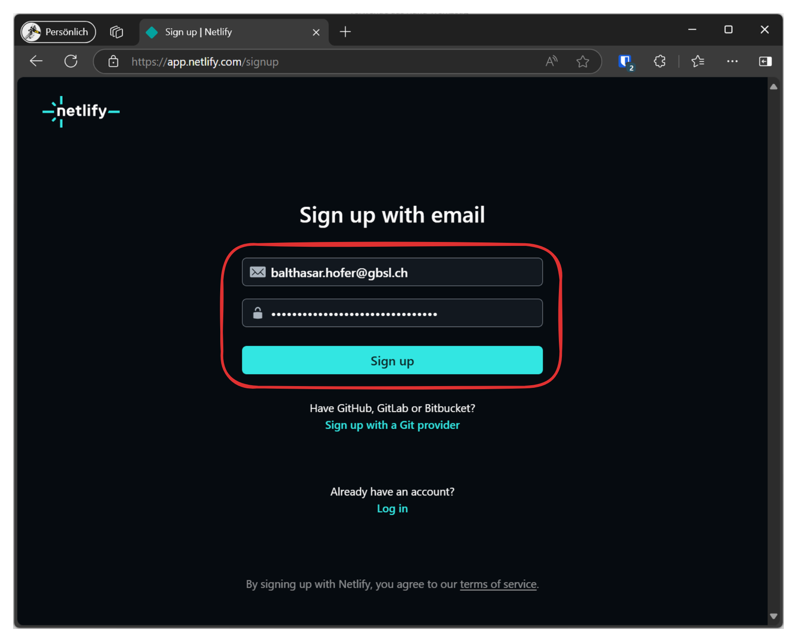
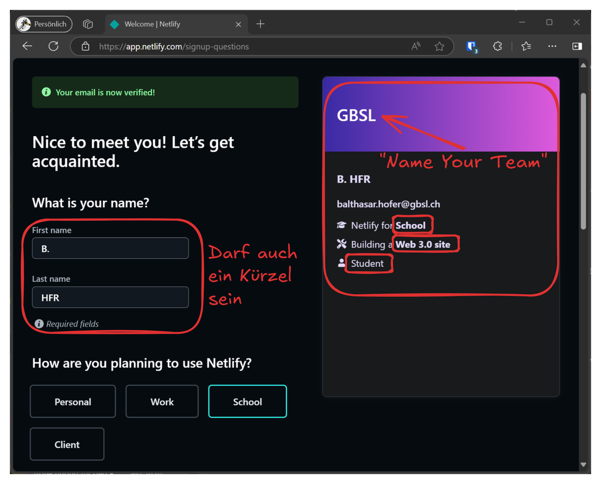
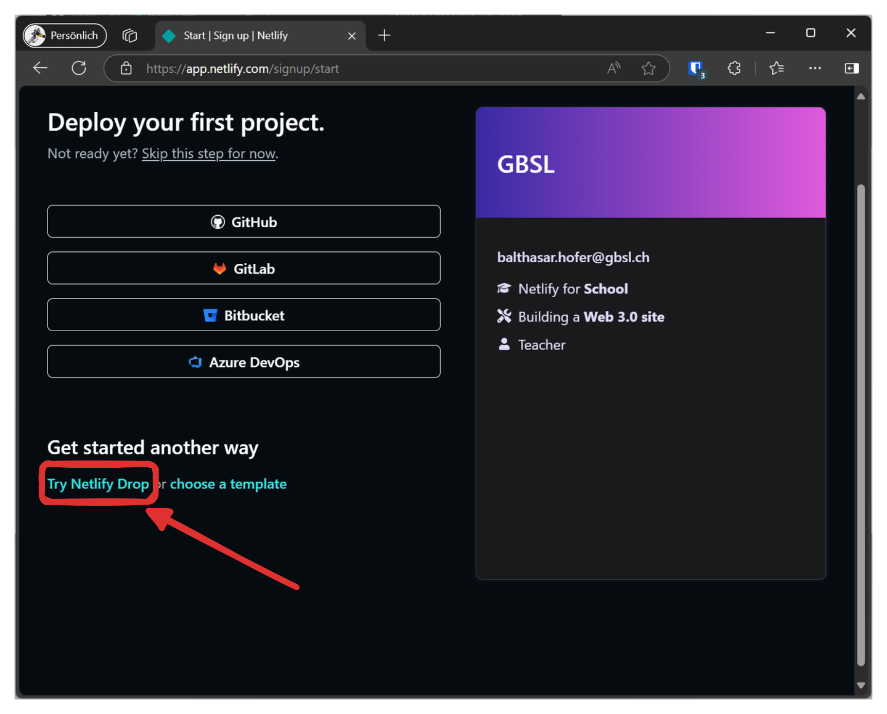
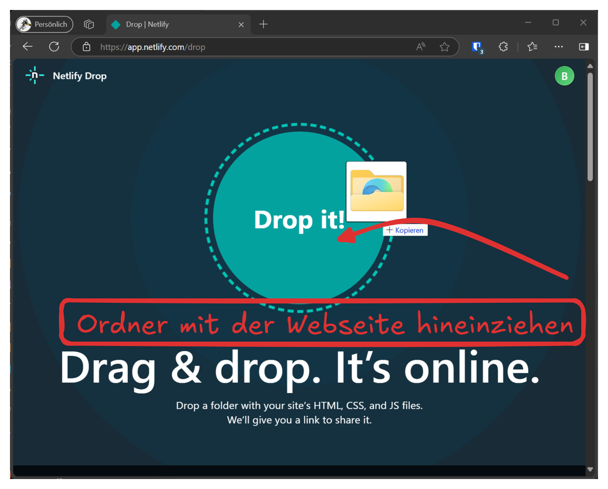
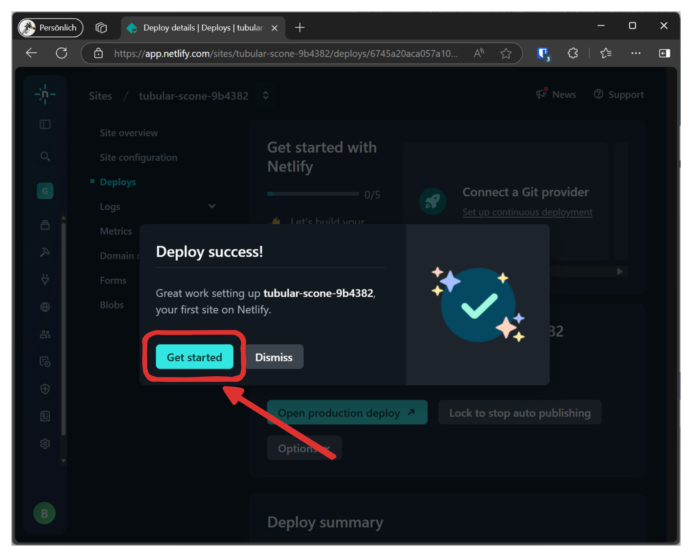
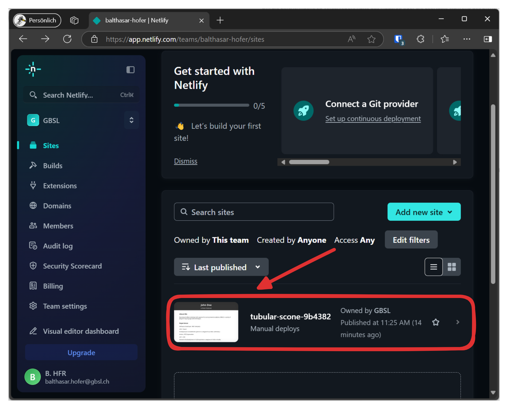
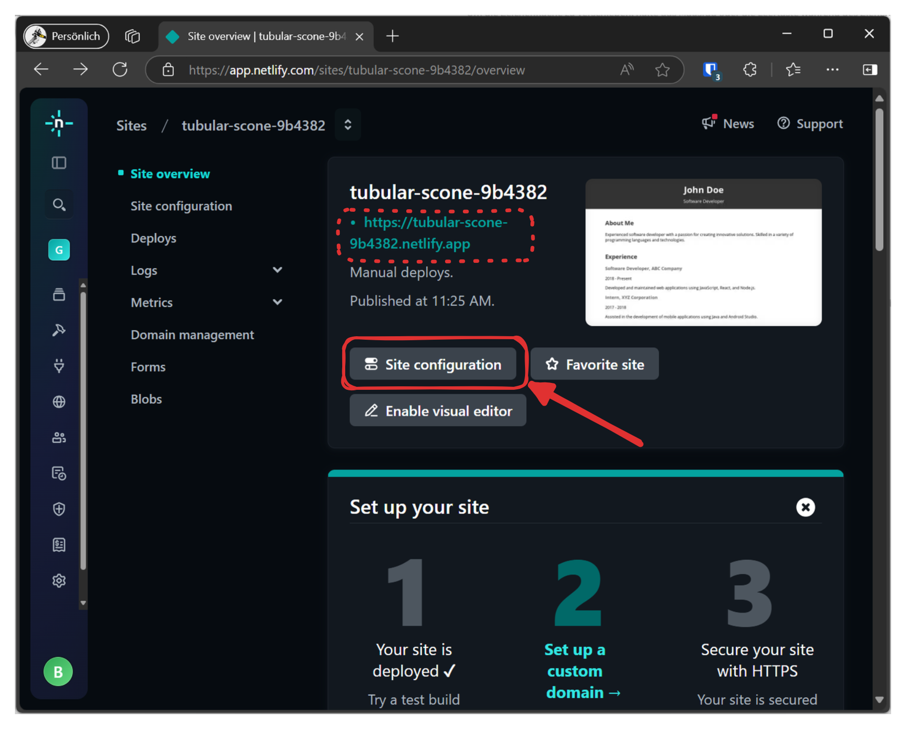
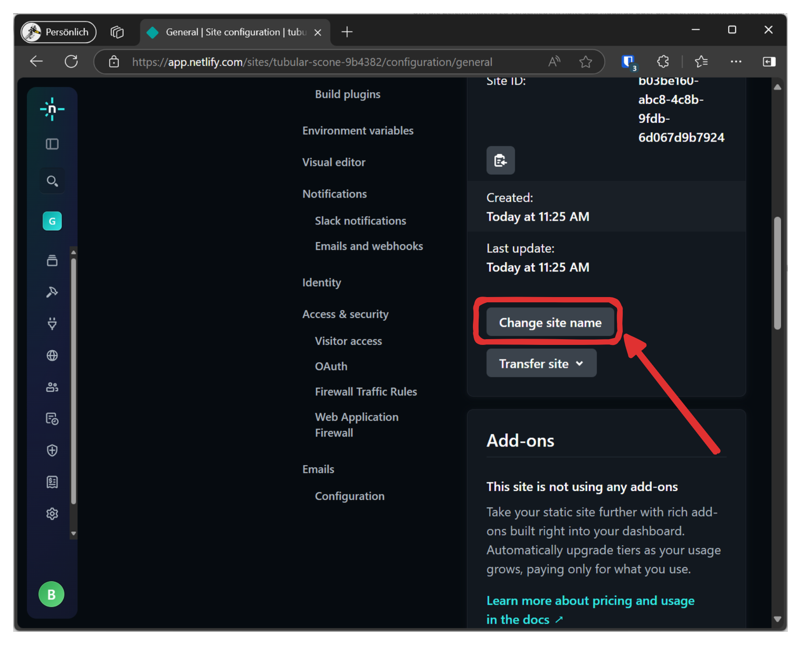
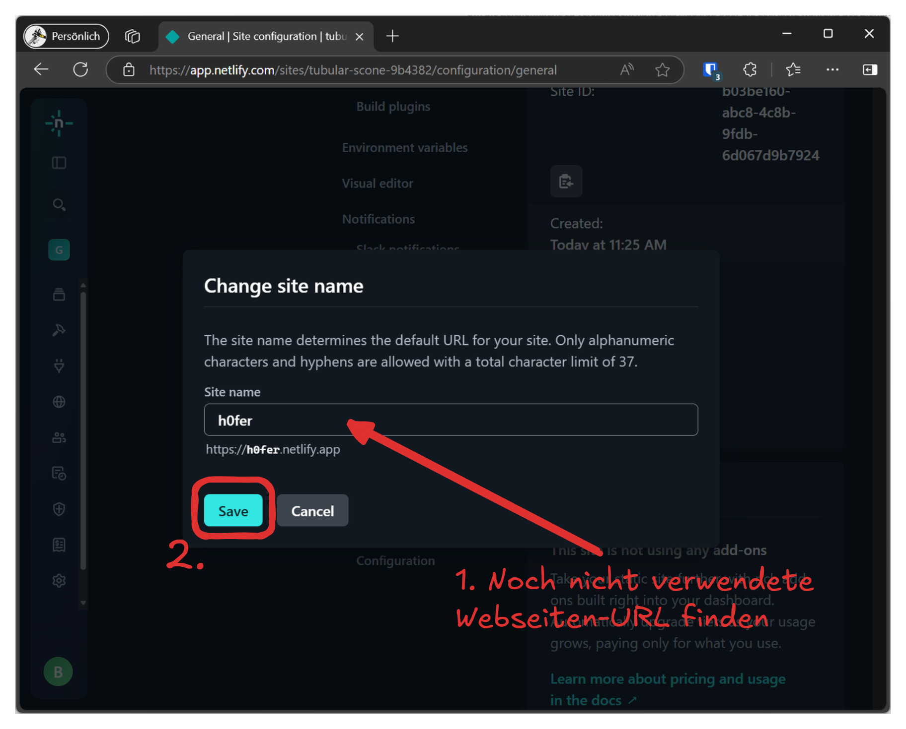
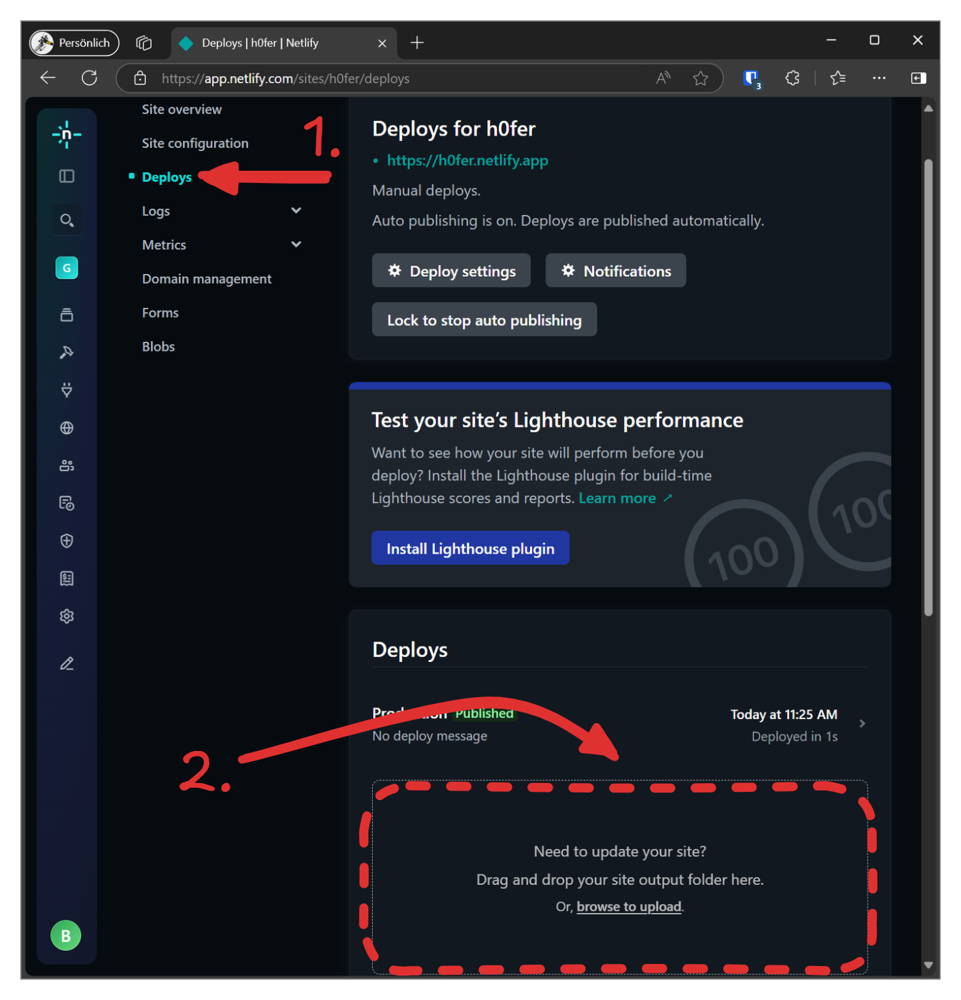

# Netlify

Um eine Webseite online zu stellen, wird ein Webserver benötigt. Dieser Server muss ständig laufen, was Kosten verursacht. Netlify bietet kostenlose Webseiten-Server an, die einfach zu bedienen sind. Dazu ist ein Netlify-Account notwendig.

Versuchen Sie es selbst und veröffentlichen Sie Ihre Webseite auf Netlify.

Netlify
: [Netlify Signup](https://app.netlify.com/signup)

## Webseite veröffentlichen

## Webseite updaten

