# Bootstrap

Mit __CSS__ können wir Webseiten gestalten, indem wir für jeden HTML-Tag eigene Regeln schreiben. CSS Frameworks wie Bootstrap oder Tailwind CSS enthalten bereits fertige **Gestaltungsregeln**, die wir einfach verwenden können. Diese fertigen Regeln werden über sogenannte __Klassen__ den HTML-Elementen zugewiesen - ähnlich wie Aufkleber, die man auf Objekte klebt.

Im folgenden Beispiel ist der HTML-Inhalt und die Struktur identisch:

:::cards{flexBasis=550px}
#### Ohne Bootstrap Klassen
::codepen[https://codepen.io/lebalz/pen/NPKypPm]{defaultTab=html,result height=400px}
::br
#### Mit Bootstrap Klassen
::codepen[https://codepen.io/lebalz/pen/ByBYpGP]{defaultTab=html,result height=400px}
:::

:::info[Bemerke: keine Zeile CSS nötig]
Es wurden ausschliesslich das Attribut `class=` hinzugefügt und die entsprechenden Bootstrap-Klassen verwendet. Es wurde keine Zeile CSS geschrieben.
:::


## Ein Lebenslauf mit Bootstrap

Es soll eine kleine Webseite mit dem eigenen Lebenslauf erstellt werden. Vorerst wird folgende Webseite aufgebaut, die Inhalte und Farben können später angepasst werden.

:::cards{maxWidth="500px" margin="0 auto"}
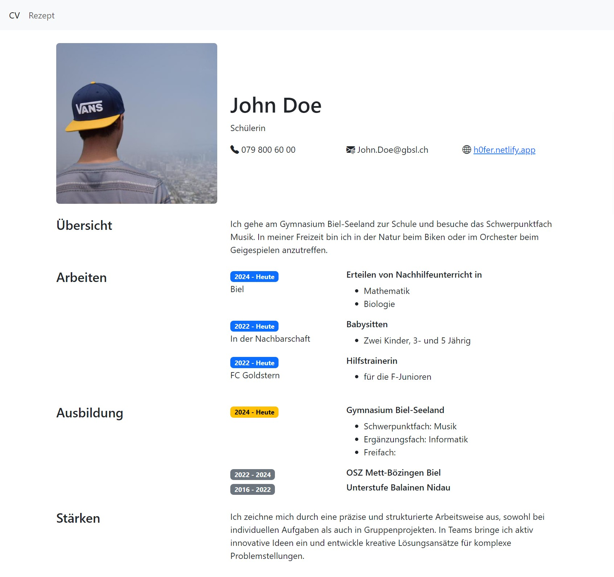
:::

<Tabs>
    <TabItem label="S 1" value="1">

### Neue Seite hinzufügen

Ordner
: __OneDrive - EDUBERN/Informatik/Webseite/__
Dateiname
: __cv.html__ (für "Curriculum Vitae")

```html title="cv.html" {6-7}
<!doctype html>
<html lang="en">
<head>
    <meta charset="utf-8">
    <meta name="viewport" content="width=device-width, initial-scale=1">
    <link href="https://cdn.jsdelivr.net/npm/bootstrap@5.3.2/dist/css/bootstrap.min.css" rel="stylesheet" integrity="sha384-T3c6CoIi6uLrA9TneNEoa7RxnatzjcDSCmG1MXxSR1GAsXEV/Dwwykc2MPK8M2HN" crossorigin="anonymous">
    <link rel="stylesheet" href="https://cdn.jsdelivr.net/npm/bootstrap-icons@1.11.3/font/bootstrap-icons.min.css">
</head>
<body>

</body>
</html>
```

Markiert ist die Einbindung für Bootstrap 5 und die Bootstrap Icons.

:::aufgabe[Bootstrap einbinden]
<Answer type="state" id="c5228cea-f6fb-4415-86a8-91a18740d1b6" />
Kopieren Sie den gesamten Inhalt und fügen Sie ihn in die Datei `cv.html` ein.
:::
    </TabItem>
    <TabItem label="S 2" value="2">

:::info[`<body>`]
Der gezeigt HTML-Code bezieht sich nun immer auf den Inhalt zwischen den `<body>` Tags.
:::

```html title="cv.html"
<div>
    <div>
        <div>
            <h4>Übersicht</h4>
        </div>
        <div>
            Ich gehe am Gymnasium Biel-Seeland zur Schule und besuche das Schwerpunktfach Musik. In meiner Freizeit bin
            ich in der Natur beim Biken oder im Orchester beim Geigespielen anzutreffen.
        </div>
    </div>
</div>
```

:::aufgabe[Schritt 1]
<Answer type="state" id="9769736d-8242-4294-ad95-c1ddb7166363" />

Fügen Sie den gezeigten HTML-Code zwischen die `<body></body>` Tags ein. Überprüfen Sie, dass die Webseite in VS-Code in der Live-Vorschau wie folgt angezeigt wird.

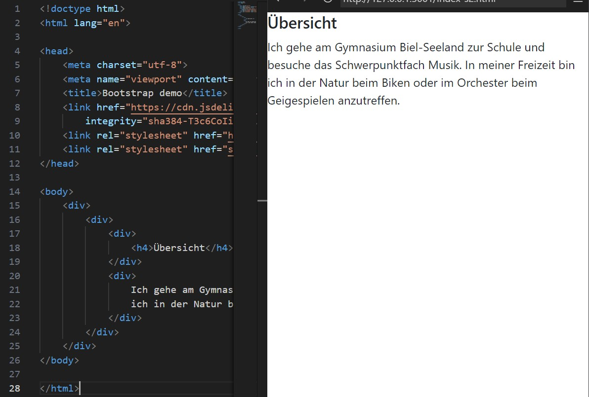
:::

    </TabItem>
    <TabItem label="S 3" value="3">
#### Bootstrap Klassen
Nun soll Übersicht hübscher dargestellt werden. Dazu werden nun einige Bootstrap-Klassen hinzugefügt. Speichern Sie nach jedem Schritt und beobachten Sie die Änderungen in der Live-Vorschau.

        <Tabs>
            <TabItem label="1. Container" value="3.1">
##### Container

```html {1}
<div class="container">
    <div>
        <div>
            <h4>Übersicht</h4>
        </div>
        <div>
            Ich gehe am Gymnasium Biel-Seeland zur Schule und besuche das Schwerpunktfach Musik. In meiner Freizeit bin
            ich in der Natur beim Biken oder im Orchester beim Geigespielen anzutreffen.
        </div>
    </div>
</div>
```
            </TabItem>
            <TabItem label="2. Zeile und Spalten" value="3.2">
##### Zeilen und Spalten

Mit der Klasse `row` wird eine Zeile definiert - in Bootstrap ist eine Zeile in __12__ gleichgrosse Spalten unterteilt. Mit der Klasse `col-4` wird dann beschrieben, dass das erste `<div>` 4 Spalten gross, das zweite `<div>` 8 Spalten gross sein soll.

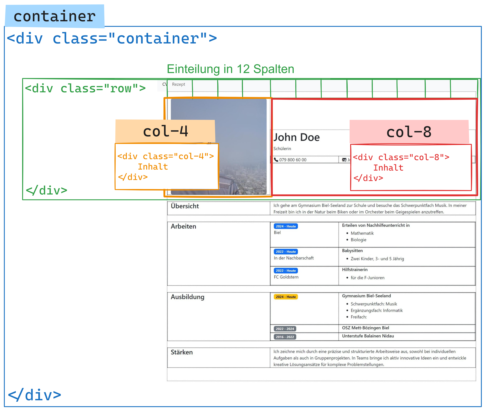


```html {2,3,6}
<div class="container">
    <div class="row">
        <div class="col-4">
            <h4>Übersicht</h4>
        </div>
        <div class="col-8">
            Ich gehe am Gymnasium Biel-Seeland zur Schule und besuche das Schwerpunktfach Musik. In meiner Freizeit bin
            ich in der Natur beim Biken oder im Orchester beim Geigespielen anzutreffen.
        </div>
    </div>
</div>
```

:::aufgabe[Spalten]
<Answer type="state" id="c144d5c5-29f3-40f8-a32a-74faa25f5255" />

Fügen Sie die Klassen `row` und `col-4` und `col-8` hinzu und überprüfen Sie die Änderungen in der Live-Vorschau.

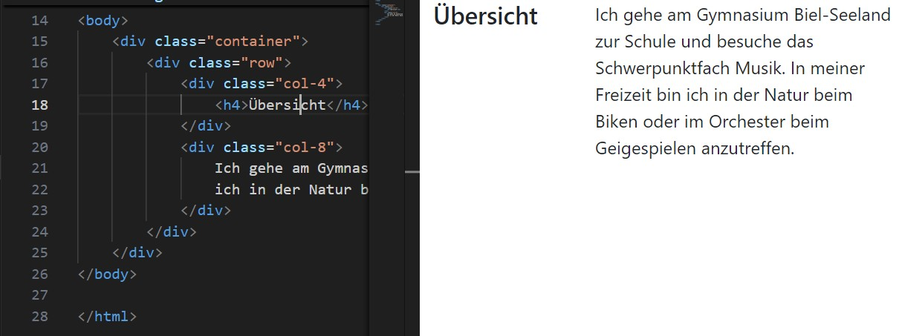
:::
            </TabItem>
        </Tabs>

    </TabItem>
    <TabItem label="S 4" value="4">
#### Ausbildung
Der Abschnitt "Ausbildung" soll nun hinzugefügt werden. Fügen Sie den folgenden HTML-Code ein:

        <Tabs>
            <TabItem label="1. Neue Zeile" value="4.1">

Schritt 1: Eine neue Zeile für die Ausbildung hinzufügen.

```html {2,5,8}
<div class="row">
    <div class="col-4">
        <h4>Ausbildung</h4>
    </div>
    <div class="col-3">
        2024 - Heute
    </div>
    <div class="col-5">
        <h6>Gymnasium Biel-Seeland</h6>
        <ul>
            <li>Schwerpunktfach: Musik</li>
            <li>Ergänzungsfach: Informatik</li>
            <li>Freifach: </li>
        </ul>
    </div>
</div>
```

:::info[Unterteilung der 12 Spalten]
**Bemerke**: Die Summe der Spaltenbreiten muss 12 ergeben. In diesem Fall sind es die Klassen `col-4`, `col-3` und `col-5` die also die ganze Spaltenbreite von $4 + 3 + 5 = 12$ ausnutzen.
:::

:::aufgabe[Ausbildung]
<Answer type="state" id="1c458711-0446-469c-a28d-cfb1301ce2b5" />

Fügen Sie den gezeigten HTML-Code ein und überprüfen Sie die Änderungen in der Live-Vorschau.
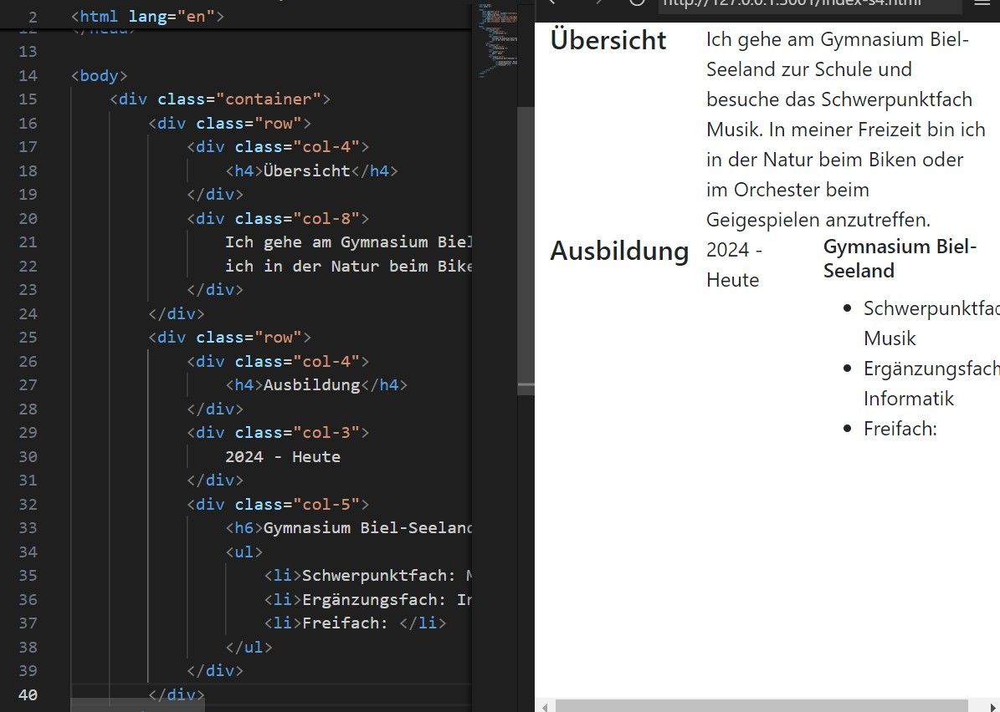

:::

            </TabItem>
            <TabItem label="2. Farbige Jahreszahl" value="4.2">

Schritt 2: Die Jahreszahl soll farbig dargestellt werden. Dazu wird ein <span className="badge badge--primary">Badge</span> verwendet. Damit dies gelingt, werden die Jahreszahlen mit einem `<span>`-Element umgeben (erzeugt im Gegensatz zum `<div>` keine neue Zeile) und die folgenden Klassen werden hinzugefügt:

```html {2}
<div class="col-3">
    <span class="badge text-bg-primary">2024 - Heute</span>
</div>
```

:::info[Abkürzungen]
Bemerke: `text-bg-primary` ist eine Abkürzung für `text background primary`: setzt also den Hintergrund auf die primäre Farbe (standardmässig blau).
:::

:::success[Weitere Farben]
Es gibt noch weitere Farben, die verwendet werden können: `secondary`, `success`, `danger`, `warning`, `info`, `light`, `dark`. [Mehr dazu](https://getbootstrap.com/docs/5.3/components/badge/#background-colors)
:::
:::aufgabe[Farbige Jahreszahl]
<Answer type="state" id="7d60e6b0-58eb-4685-b49c-36acc6381136" />
Füge die farbige Jahreszahl hinzu und überprüfe die Änderungen in der Live-Vorschau.
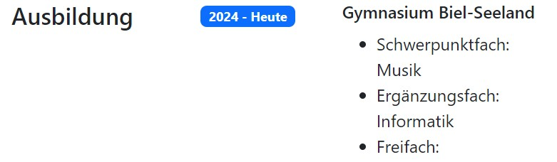
:::

            </TabItem>
            
            <TabItem label="3. Überlappungen" value="4.3">

Ändere die Grösse der Vorschau - was stellen Sie fest?

::video[./images/overlapping.mp4]{max-width=400px margin="1em auto" display=block loop autoplay}

:::success[Responsive Design]
Bootstrap ist so konzipiert, dass es auf verschiedenen Bildschirmgrössen gut aussieht. Das bedeutet, dass die Spaltenbreiten sich anpassen, wenn der Bildschirm schmaler wird. In diesem Fall werden die Spalten übereinander angezeigt.
:::

Um das Responsive-Design anzuwenden, muss jeder Spalte mitgeteilt werden, ab welcher Bildschirmgrösse das volle Spaltenlayout verwendet werden soll. Dazu muss jede `col-` Klasse durch `col-sm-` ersetzt werden. Das bedeutet, dass die Spalten ab einer Bildschirmgrösse von `sm` (small) nebeneinander angezeigt werden, alles was kleiner ist, dann aber übereinander. [Weitere Grössen](https://getbootstrap.com/docs/5.3/layout/grid/#grid-options).

```html {2,5,8}
<div class="row">
    <div class="col-sm-4">
        <h4>Ausbildung</h4>
    </div>
    <div class="col-sm-3">
        2024 - Heute
    </div>
    <div class="col-sm-5">
        <h6>Gymnasium Biel-Seeland</h6>
    </div>
</div>
```
:::aufgabe[Responsive Design]
<Answer type="state" id="839f1aa0-669d-42cf-838d-065caed4d70a" />

Ersetzen Sie alle `col-` Klassen durch `col-sm-` und überprüfen Sie die Änderungen in der Live-Vorschau. Verwenden Sie dazu Suchen/Ersetzen in VS Code: [[Ctrl + F]].

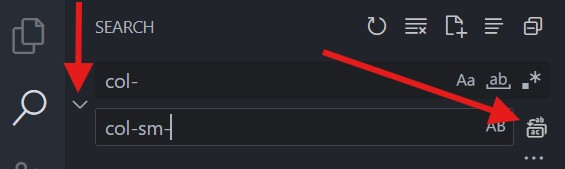
:::

            </TabItem>
        </Tabs>
    </TabItem>
    <TabItem label="S 5" value="5">

#### Weitere Zeilen und Abschnitte

Fügen Sie die weiteren Abschnitte hinzu, die `Badges` können Sie farblich selber aus den gegebenen Optionen auswählen:

- <span className="badge badge--primary" style={{['--ifm-color-primary']: 'var(--ifm-color-blue)'}}>badge text-bg-primary</span>
- <span className="badge badge--secondary">badge text-bg-secondary</span>
- <span className="badge badge--success">badge text-bg-success</span>
- <span className="badge badge--danger">badge text-bg-danger</span>
- <span className="badge badge--warning">badge text-bg-warning</span>
- <span className="badge badge--info">badge text-bg-info</span>

```html showLineNumbers
<div class="row my-4">
    <div class="col-sm-4">
        <h4>Übersicht</h4>
    </div>
    <div class="col-sm-8">
        Ich gehe am Gymnasium Biel-Seeland zur Schule und besuche das Schwerpunktfach Musik. In meiner Freizeit bin ich in der Natur beim Biken oder im Orchester beim Geigespielen anzutreffen.
    </div>
</div>
<!-- highlight-start -->
<div class="row">
    <div class="col-sm-4">
        <h4>Arbeiten</h4>
    </div>
    <div class="col-sm-3">
        <span class="badge">2024 - Heute</span>
        <p>
            Biel
        </p>
    </div>
    <div class="col-sm-5">
        <h6>Erteilen von Nachhilfeunterricht in</h6>
        <ul>
            <li>Mathematik</li>
            <li>Biologie</li>
        </ul>
    </div>
</div>
<div class="row">
    <div class="col-sm-4"></div>
    <div class="col-sm-3">
        <span class="badge">2022 - Heute</span>
        <p>
            In der Nachbarschaft
        </p>
    </div>
    <div class="col-sm-5">
        <h6>Babysitten</h6>
        <ul>
            <li>Zwei Kinder, 3- und 5 Jährig</li>
        </ul>
    </div>
</div>
<div class="row">
    <div class="col-sm-4"></div>
    <div class="col-sm-3">
        <span class="badge">2022 - Heute</span>
        <p>
            FC Goldstern
        </p>
    </div>
    <div class="col-sm-5">
        <h6>Hilfstrainerin</h6>
        <ul>
            <li>für die F-Junioren</li>
        </ul>
    </div>
</div>
<!-- highlight-end -->
<div class="row mt-4">
    <div class="col-sm-4">
        <h4>Ausbildung</h4>
    </div>
    <div class="col-sm-3">
        <span class="badge">2024 - Heute</span>
    </div>
    <div class="col-sm-5">
        <h6>Gymnasium Biel-Seeland</h6>
        <ul>
            <li>Schwerpunktfach: Musik</li>
            <li>Ergänzungsfach: Informatik</li>
            <li>Freifach: </li>
        </ul>
    </div>
</div>
<!-- highlight-start -->
<div class="row">
    <div class="col-sm-4"></div>
    <div class="col-sm-3">
        <span class="badge">2022 - 2024</span>
    </div>
    <div class="col-sm-5">
        <h6>OSZ Mett-Bözingen Biel</h6>
    </div>
</div>
<div class="row">
    <div class="col-sm-4"></div>
    <div class="col-sm-3">
        <span class="badge">2016 - 2022</span>
    </div>
    <div class="col-sm-5">
        <h6>Unterstufe Balainen Nidau</h6>
    </div>
</div>
<div class="row  mt-4">
    <div class="col-sm-4">
        <h4>Stärken</h4>
    </div>
    <div class="col-sm-8">
        Ich zeichne mich durch eine präzise und strukturierte Arbeitsweise aus, sowohl bei individuellen Aufgaben
        als auch in Gruppenprojekten. In Teams bringe ich aktiv innovative Ideen ein und entwickle kreative
        Lösungsansätze für komplexe Problemstellungen.
    </div>
</div>
<!-- highlight-end -->
```

:::warning[Z. 74]
Beachte: Auf Zeile 74 wurde ein leeres `<div class="col-sm-4"></div>` hinzugefügt (Ebenso auf den Zeilen 28,43 und 83). Sie dienen als **Platzhalter** und müssen hinzugefügt werden, auch wenn unterhalb von "Arbeiten" und "Ausbildung" keine Inhalte vorhanden sind.
:::

:::aufgabe[Weitere Abschnitte]
<Answer type="state" id="8f65b4ec-f00e-4e76-90d5-4a259367622c" />

Fügen Sie die weiteren Abschnitte hinzu, wobei Sie
- die Eckdaten für Ihre Person anpassen
- ggf. nicht verwendete Einträge (Trainerin FC Goldstern?) entfernen 
- selbst gewählte Farben für die Badges verwenden

Überprüfen Sie die Änderungen in der Live-Vorschau.

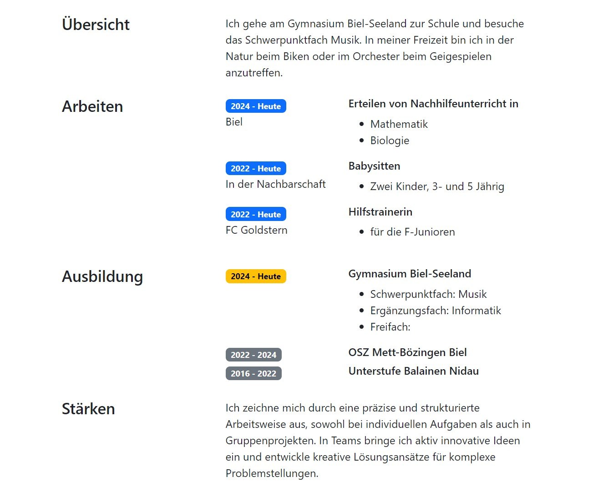
:::
    </TabItem>
    <TabItem label="S 6" value="6">
#### Überschrift mit Foto

Als letztes wird die Überschrift hinzugefügt. Dazu braucht es ein Bild von Ihnen, welches Sie im Ordner `bilder` ablegen. Betrachten Sie dann den untenstehenden Code:

```html showLineNumbers
<div class="row align-items-center">
    <div class="col-sm-4">
        
    </div>
    <div class="col-sm-8">
        <h1>John Doe</h1>
        <p>Schülerin</h4>
        <div class="row">
            <div class="col-lg-4">
                <i class="bi-telephone-fill"></i>
                079 800 60 00
            </div>
            <div class="col-lg-4">
                <i class="bi bi-envelope-at-fill"></i>
                John.Doe@gbsl.ch
            </div>
            <div class="col-lg-4">
                <i class="bi bi-globe2"></i>
                <a href="https://h0fer.netlify.app">h0fer.netlify.app</a>
            </div>
        </div>
    </div>
</div>
```

Zeile 3
: Das Bild wird hinzugefügt. Durch die Klasse `rounded` werden die Bild-Ecken abgerundet und mit `img-fluid` wird die Grösse automatisch an den zur Verfügung stehenden Platz angepasst.
Zeile 10
: Hier wird ein Icon eingefügt - weitere Icons finden Sie [hier](https://icons.getbootstrap.com/).
: Mit dem Attribut `style` können beliebige Farben verwendet werden
: 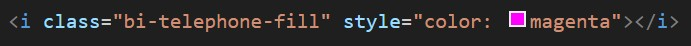
Zeile 19
: Ein Link auf die eigene Webseite wird hinzugefügt - im `href` steht der richtige Link, zwischen den Tags der angezeigte Name.

:::aufgabe[Überschrift mit Foto]
<Answer type="state" id="7a41ac4c-4853-4213-8ac8-4d5fbeb7208f" />
Fügen Sie Ihrem CV ein Bild hinzu und passen Sie die Eckdaten an. Überprüfen Sie die Änderungen in der Live-Vorschau.

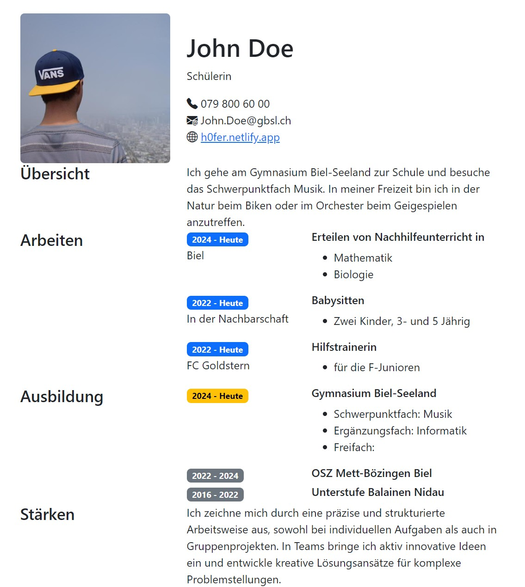
:::
    </TabItem>
    <TabItem label="S 7" value="7">
#### Abschluss

Inhaltlich sind wir fertig! Die einzelnen Abschnitte sind aber aktuell noch sehr nahe beieinander 😵‍💫. Dies kann man durch das Hinzufügen von `margin` ändern.

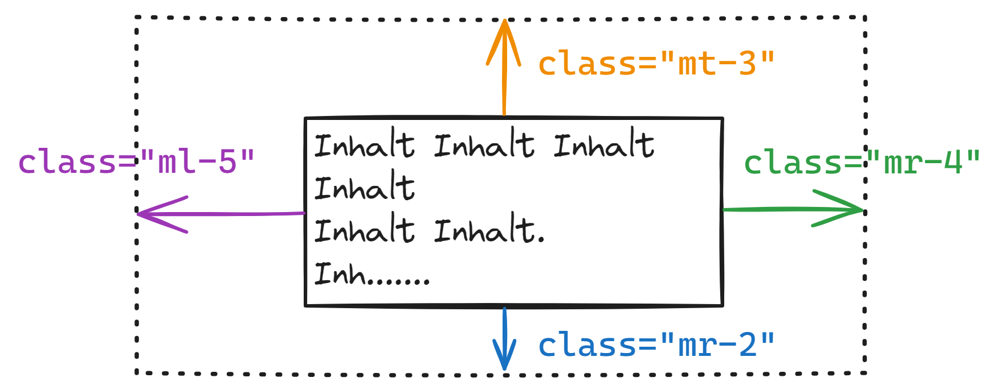

Der Abstand eines Elements kann auf jede Seite einzeln festgelegt werden. Mit `m-4` kann der Abstand mit nur einem Befehl gleichmässig auf alle Seiten festgelegt werden. Die Zahlen von 1 bis 5 geben die Stärke des Abstands an.

```html{1}
<div class="row mt-4">
    <div class="col-sm-4">
        <h4>Übersicht</h4>
    </div>
    <div class="col-sm-8">
        Ich gehe am Gymnasium Biel-Seeland zur Schule und besuche das Schwerpunktfach Musik. In meiner Freizeit
        bin
        ich in der Natur beim Biken oder im Orchester beim Geigespielen anzutreffen.
    </div>
</div>
```

:::aufgabe[Margin]
<Answer type="state" id="e5331c05-59d5-4c9f-9e72-0973f416f663" />
Fügen Sie mit der Klasse `mt-4` überall dort Abstände hinzu, wo Sie es für nötig erachten. Überprüfen Sie die Änderungen in der Live-Vorschau.

Die Vorlage-Seite finden Sie [hier](https://h0fer.netlify.app).
:::

    </TabItem>
</Tabs>
