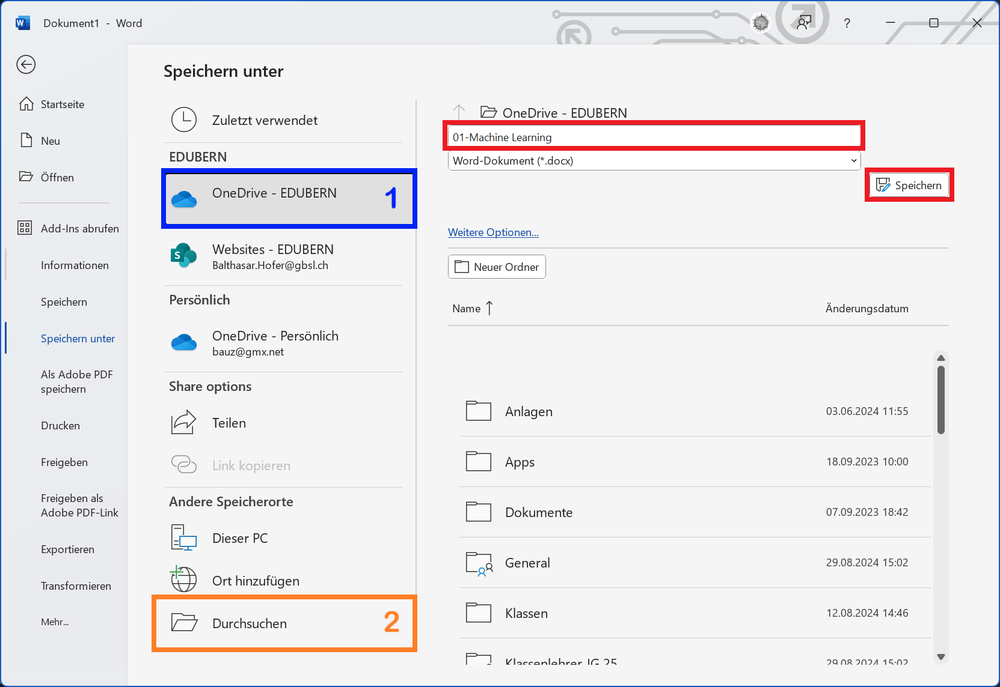
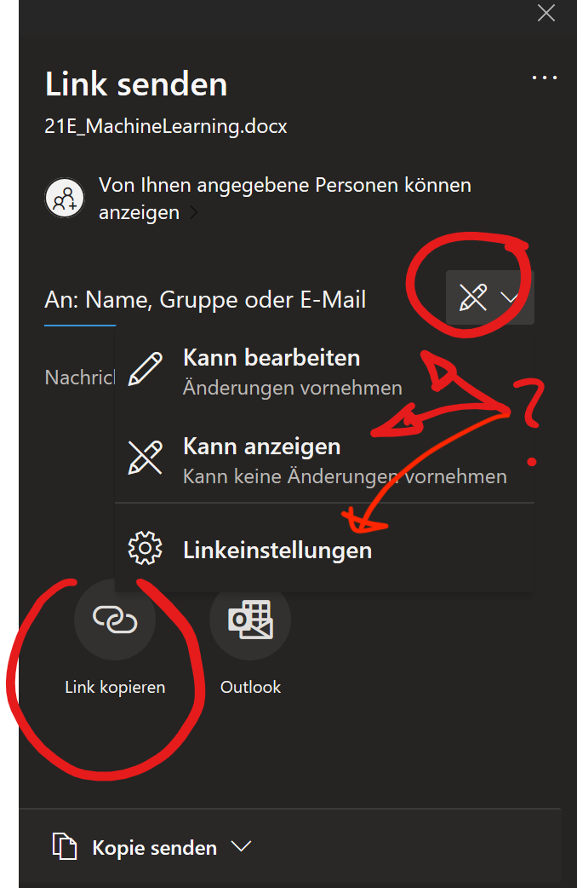
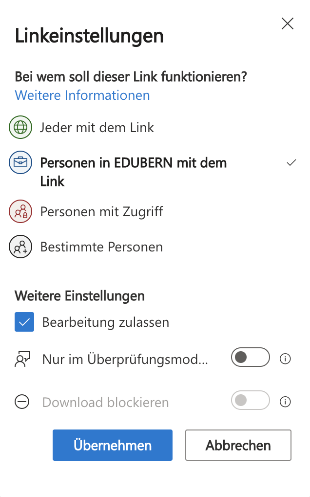

# Dateiformat

Jeder Computer hat ein Dateisystem, welches Dateien organisiert und auffindbar macht. Die Anleitung, wie eine Datei gefunden werden kann, heisst **Dateipfad**. Eine Datei besitzt einen **Namen** und ein **Dateiformat**. Die Dateiendung beschreibt das Dateiformat und gibt Auskunft über die Art von Daten, welche in einer Datei enthalten sind. So weiss Ihr Betriebssystem bspw. mit welchem Programm eine Datei geöffnet werden soll. Ein Word-Dokument hat die Dateiendung __.docx__.

```
 C:\Users\reto\OneDrive - EDUBERN\Informatik\01-Word\dokument.docx
└┬┘ └─┬───────┘└────────┬────────┘                   └─┬────┘ └─┬─┘
 ┊   Ordner         OneDrive                           ┊    Dateiformat
Laufwerk                                           Dateiname
```

Wenn Sie in Word ein Dokument abspeichern, gibt es im wesentlichen zwei Möglichkeiten, die zum selben Ziel führen:



1 OneDrive :mdi[microsoft-onedrive]{.blue}
: Den gewünschten Ordner auf OneDrive auswählen. Das Dokument wird automatisch synchronisiert.
: Die Navigation zum richtigen Ordner kann etwas träge sein, da die Ordnerstruktur übers Internet direkt von OneDrive geladen wird.
2 Durchsuchen :mdi[folder-open]{.orange}
: Das Dokument kann an einem beliebigen Ort gespeichert werden. Wird ein Ordner auf OneDrive ausgewählt, so wird das Dokument automatisch synchronisiert.

## Gemeinsames Arbeiten


Ein auf OneDrive gespeichertes Word-Dokument kann zur gemeinsamen Bearbeitung freiegegeben werden. Bei der Freigabe müssen Sie entscheiden, ob das Dokument nur betrachtet, oder auch bearbeitet werden darf:

:::flex{align-items=flex-end}

::br

:::


:::warning[Link Kopieren :mdi[link-variant]]
Erfahrungsgemäss funktioniert das Freigeben von Dokumenten am zuverlässigsten und am schnellsten, wenn der **Link** kopiert und per Teams verschickt wird. Die E-Mails bleiben manchmal etwas länger in einer Warteschleife bei Edubern hängen.

Beachten Sie, dass fürs Kopieren eines Links die Link-Einstellungen auf **Jeder mit dem Link** bzw. **Personen bei EDUBERN mit dem Link** gewählt werden muss.
:::

:::aufgabe[Gemeinsames Arbeiten an einem Dokument]
<Answer type="state" id="0f992d0a-e20e-4a32-901b-cf4da6500e2f" />

Dokument-Name
: __01-Word-Gruppenarbeit.docx__
Speicherort
: __OneDrive - EduBern/Informatik/01-Word__
Überschrift
: Arbeiten in der Gruppe

1. Erstellen Sie ein neues Word-Dokument und speichern Sie es auf OneDrive.
2. Fügen Sie eine Überschrift ein.
3. Fügen Sie ein Bild Ihrer Lieblingssportart ein.
4. Teilen Sie das Dokument mit Ihrer Gruppe und erlauben Sie die Bearbeitung.
5. Fügen Sie auf jedem erhaltenen Dokument Ihren Namen ein.
6. Exportieren Sie das Dokument als PDF und speichern Sie es auf Ihrem OneDrive.
7. Markieren Sie die Aufgabe als erledigt.


<Answer type="text" id="db20bd1a-22aa-4299-926e-b0e7dd80ca2e" placeholder="✍️ Notizen..." />
:::
