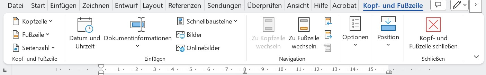

# Nummerierung und Bilder

:::info[Lernziele]
In diesem Abschnitt lernen Sie, wie In Word
- Seiten
- Überschriften
- Abbildungen
nummeriert werden und wie auf solche nummerierten Elemente verwiesen werden kann.
:::

## Seitenzahlen

Das Kopf- und Fusszeilen Menü öffnen (Doppelklick in den untersten Bereich eines Blattes, oder im Suchfeld "Fusszeile" eingeben).

::video[./images/kopfzeile.mp4]

Erste Seite anders (1)
: Soll die erste Seite (bspw. Titelblatt) keine Seitenzahl erhalten, so kann das Häckchen "Erste Seite Anders" angewählt werden:
: 
Formatieren (2)
: Über die Option "Seitenzahle formatieren..." kann bspw. das Seitenzahlformat (z.B. römische Zahlen) oder der Startwert festgelegt werden.
: Die erste Seite, auch wenn "Erste Seite Anders" ausgewählt ist, zählt bei der Nummerierung auch dazu. Die Nummerierung muss also bei `0` starten, wenn die Seite nach dem Titelblatt die Seitenzahl `1` erhalten soll.
: 

## Überschriften Nummerieren

Um Überschriften automatisiert nummerieren zu lassen, müssen die Überschriften als solche gekennzeichnet werden. Dies wird über die Zuweisung einer **Formatvorlage** erreicht ([Formatvorlagen](./02-dokumentstruktur.mdx#absatz))

Die Formatvorlage für eine Überschrift kann geändert und über __Format > Nummerierung__ eine Nummerierung hinzugefügt werden. 

### Geschachtelte Nummerierung

Soll eine **verschachtelte Nummerierung** eingefügt werden, muss
1. der Cursor im Überschriften-Text fokussiert werden
2. Über die "Liste mit mehreren Ebenen" die verschachtelte Nummerierung eingefügt werden

::video[./images/enumerate.mp4]

### Automatisches Inhaltsverzeichnis

Ein grosser Vorteil von zugewiesenen **Formatvorlagen** ist das Erzeugen von Verzeichnissen. Da Word nun "weiss", was einer Überschrift entspricht, lassen sich bspw. Inhaltsverzeichnisse autmatisch generieren und auf Knopfdruck auch aktualisieren.

:::warning[Inhaltsverzeichnis aktualisieren]
Nachdem das Inhaltsverzeichnis generiert wurde, muss es bei Änderungen im Dokument aktualisiert werden. 
1. __Inhaltsverzeichnis aktualisieren__ oder[[F9]] drücken
Nur Seitenzahlen aktualisieren (a)
: Falls sich der Inhalt, nicht aber die Überschriften geändert haben (schneller).
Gesamtes Inhaltsverzeichnis aktualisieren (b)
: Falls sich die Überschriften geändert oder neue Überschriften dazugekommen sind.

:::

## Bilder
In grösseren Arbeiten sollten Bilder nummeriert und mit einem Text versehen werden.

### Layoutoptionen

Die Positionierung von Bildern kann über die Layoutoptionen gesteuert werden. Diese können über einen Rechtsklick auf das Bild und "Layoutoptionen" eingestellt werden.

:::warning[Mit Text in Zeile]
Die Standardoption "Mit Text in Zeile" ist selten die richtige Wahl, da bei Textänderungen das gesamte Layout verändert wird.
Die Option __Quadrat__ oder __Oben und unten__ sind meistens die bessere Wahl.
:::

:::tip[Kein Einfluss auf den Textfluss]
Sollen die Bilder frei verschiebbar sein und keinen Einfluss auf den Text haben, so ist die Option __Vor den Text__ die richtige Wahl.

Hilfreich ist dies bspw. beim Erstellen einer Bild-Collage.
:::

### Bildunterschrift
Ist eine **Layoutoption** __Mit Textumbruch__ gewählt, so wird beim Beschriften eines Bildes von Word ein **Textfeld** unter dem Bild eingefügt, welches eine spezielle Nummerierung enthält (ähnlich wie bei den Überschriften).
Damit das Bild **mit der Unterschrift** verschoben werden kann, müssen das Bild und die Unterschrift **Gruppiert** werden.

1. Layoutoption __Mit Textumbruch__ wählen
2. __:mdi[mouse-right-click] Rechtsklick auf das Bild > :mdi[image-area] Beschriftung einfügen...__
3. Beschriftung hinzufügen, ggf. Nummerierung anpassen
4. Bei gedrückter [[Ctrl]]-Taste den **Rahmen der Beschriftung** und das **Bild** auswählen
5. __:mdi[mouse-right-click] Rechtsklick > :mdi[group] Gruppieren > :mdi[group] Gruppieren__

::video[./images/bildbeschriftung.mp4]

## Übung

::::aufgabe
<Answer type="state" id="213ec6ee-34bf-4726-b0b9-c0bb3bcc2ddc" />

Laden Sie das Word-Dokument [ex02-machine-learning.docx](files/ex02-machine-learning.docx) herunter.

1. Verschieben Sie die Datei auf OneDrive in Ihren Informatik-Ordner.
2. Formatieren Sie Ihr Word-Dokument so, dass es am Ende wie in der Vorlage unten aussieht:

<Answer type="text" id="138d2c09-12da-446d-9a27-ffe5a5d24816" placeholder="✍️ Notizen..." />

:::details[Schritt für Schritt im Video]
#### Alles ausser die Bilder

::video[./images/text-exercise-2-a.mp4]

 
---

#### Bilder, Bildverzeichnisse, Querverweise

::video[./images/text-exercise-2-b.mp4]
:::
::::

