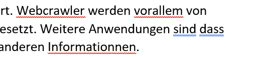
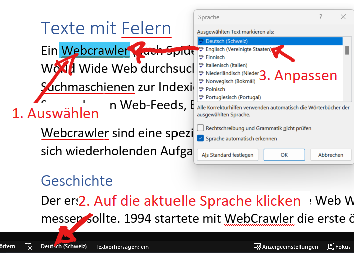

# Autokorrektur

Ein nützliches und mächtiges Feature von Word ist die Rechtschreibkorrektur.

Word unterschiedet zwei Fehlertypen:

Rechtschreibung
: Tippfehler oder falsch geschriebene Wörter werden rot mit einer gewellten Linie unterstrichen

Grammatik
: Fehler in der Grammatik (bspw. Satzstellung, fehlende Kommas etc) werden blau mit einer gewellten Linie unterstrichen.

Um einen Fehler zu korrigieren, können mit Rechtsklick die Verbesserungsvorschläge angesehen werden.

:::warning[Autokorrektur aktivieren]

Die Autokorrektur ist für die Rechtschreibefehler standardmässig aktiviert. Bei den Grammatikfehlern ist die Überprüfung aber nicht immer aktiv: Sie sollte unbedingt unter __Datei > Optionen > Dokumentprüfung__ aktiviert werden!

- __:mdi[checkbox-marked]{.blue} Rechtschreibung während der Eingabe überprüfen__
- __:mdi[checkbox-marked]{.blue} Grammatikfehler während der Eingabe markieren__

![:mdi[checkbox-marked]{.blue} Grammatikfehler während der Eingabe markieren --width=550px](./images/04-grammatik.png)
:::

## Sprache

Natürlich muss Word wissen, in welcher Sprache ein Text verfasst wird. Word versucht für jeden Abschnitt zu erraten, um was für eine Sprache es sich handelt. Dies gelingt aber nicht immer automatisch und gerade "*Deutsch (Schweiz)*" oder "*Deutsch (Deutschland)*" ist für Word schwer zu unterscheiden. Die Sprache kann unten links umgestellt werden - Absatzweise oder auch nur für aktuell markierten Text. Dies ist dann nützlich, wenn Zitate oder Wörter einer anderen Sprache verwendet werden.

:::warning[Sprache ändern in Word]

:::

:::aufgabe[Fehler finden]
<Answer type="state" id="619f5c1b-786f-451a-9b78-554403f298c6" />

Datei
: [:mdi[download] Texte mit Fehlern.docx](./files/ex04-Texte-mit-Felern.docx)

1. Ändern Sie für die verschiedenen Abschnitte und Wörter die richtige Sprache und korrigieren Sie mithilfe der Rechtschreibkorrektur alle Fehler im Dokument.
2. Zeigen Sie das Resultat Ihren Pultnachbar:innen und helfen Sie einander gegenseitig.
3. Markieren Sie die Aufgabe als erledigt.

<Answer type="text" id="e674a608-29f1-488f-8b89-a622dfa66b22" placeholder="📒 Notizen" />
:::
