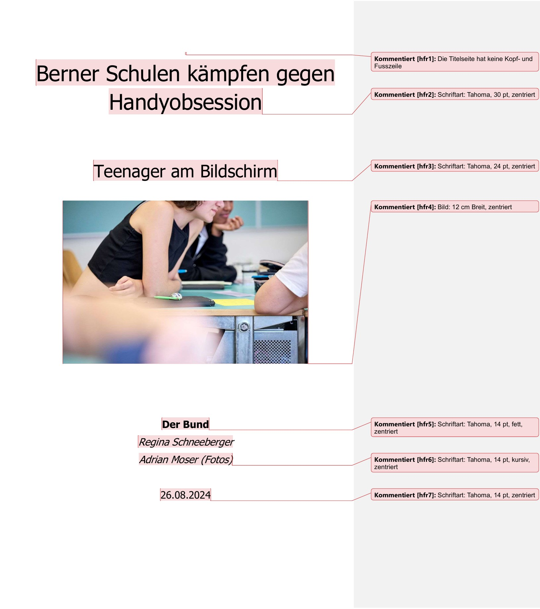
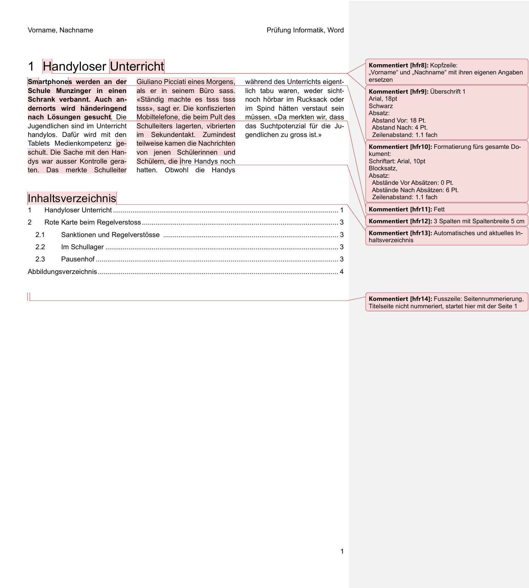
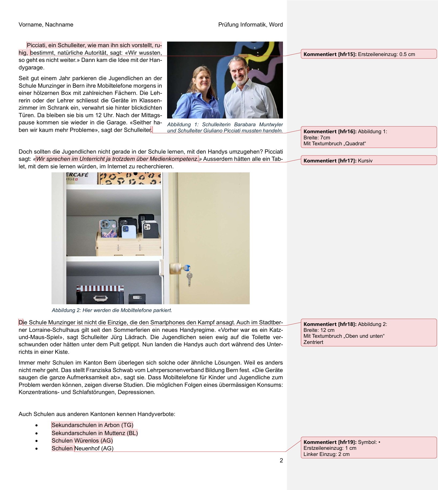
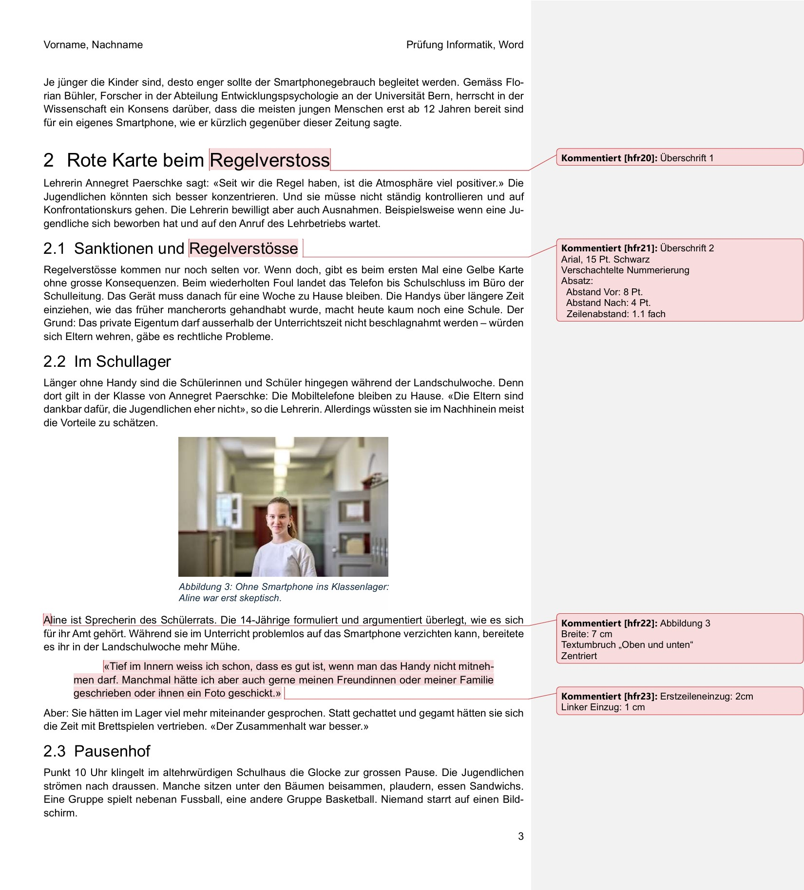
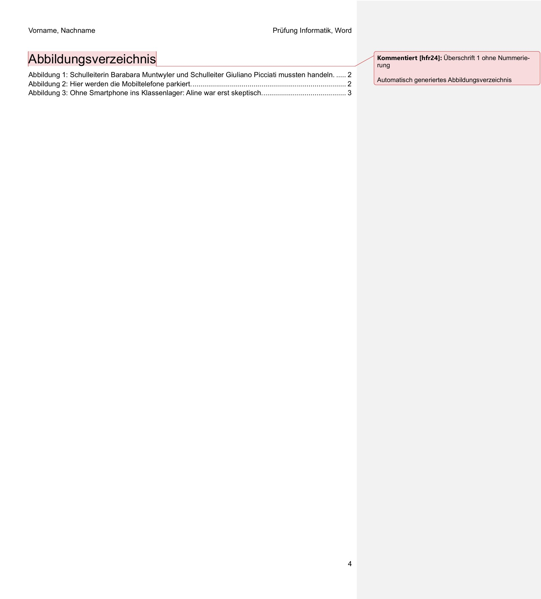

import ProbeV28 from '@tdev-components/WordDocCreator/v28';
import Restricted from '@tdev-components/documents/Restricted'; 

# Prüfung

Dauer
: 45 Minuten
Benotung
: Die Note zählt $0.5$
Hilfsmittel
: Laptop, Openbook, ohne Kommunikation untereinander

<Restricted id="8e73288f-a8c7-4ad5-9849-f895599cada9">

:::info[Hinweise]
Das Prüfungsdokument ist **individualisiert** - jedes Dokument ist einzigartig. Dies ist unter anderem am farbigen Hintergrund ersichtlich, der bei jeder Person leicht anders eingefärbt ist. Diese Merkmale sollen nicht verändert werden.
:::

Abgabe
: Hochladen auf OneDrive - Kontrollieren Sie, ob das bearbeitete Dokument abgegeben wurde!
: [:mdi[microsoft-onedrive]{.blue} Abgeben](https://erzbe-my.sharepoint.com/:f:/g/personal/balthasar_hofer_gbsl_ch/EgBIe50Mnw9Fq6DZzPN01PkBSfhRkK8BFQXD6_dgy2JI7Q)
Dokument
: Herunterladen des Prüfungsdokuments
: <ProbeV28 personalized />

## Vorlage

</Restricted>