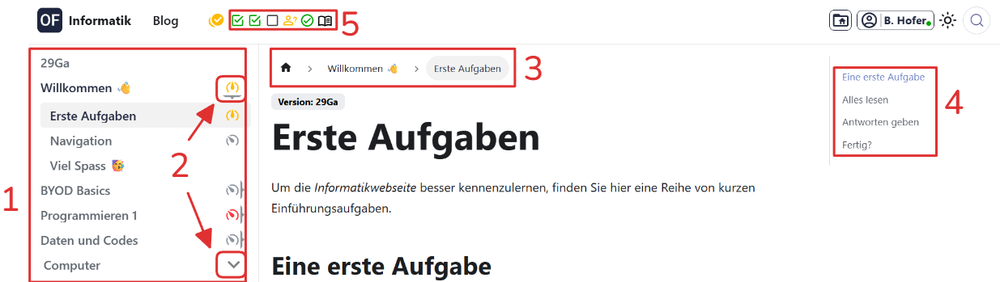
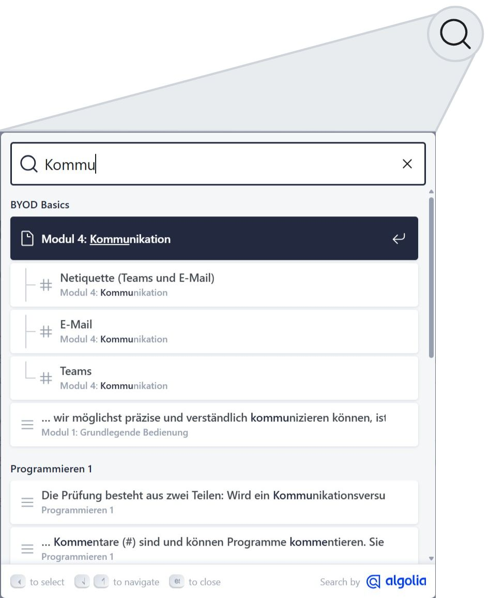
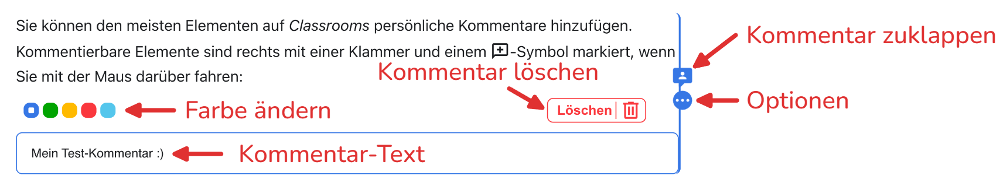

import PageReadCheck from '@tdev/page-read-check/PageReadCheck';

# Navigation
Um sich auf der _Informatikwebseite_ zu bewegen, haben Sie folgende Möglichkeiten:

**1**
: _Inhaltsbaum_
: Hier finden Sie alle Themen und Artikel für den Unterricht.
**2**
: _Thema aufklappen_
: Der Pfeil (bzw. :mdi[speedometer] mit Balken) bedeutet, dass es sich hier um ein Thema mit mehreren Artikeln handelt.
**3**
: _Breadcrumbs_
: Die Breadcrumbs (dt.: _Brotkrümel_) zeigen an, wo wir uns gerade befinden (der sogenannte _Pfad_ der aktuellen Seite). Mit diesen Knöpfen kann man auch navigieren.
: Im obigen Bild befinden wir uns im Artikel __Erste Aufgaben__ im Thema __Willkommen 👋__.
**4**
: _Inhaltsverzeichnis_
: Das Inhaltsverzeichnis der aktuellen Seite, mit allen Überschriften.
: Mit einem __Klick__ auf eine Überschrift springen Sie zum entsprechenden Kapitel.
**5**
: _Aufgabenübersicht_
: Übersicht über den Arbeitsstand in diesem Artikel.
: Mit einem __Klick__ auf das jeweilige Symbol springen Sie zur entsprechenden Aufgabe.

Zudem finden Sie ganz zuunterst jeweils zwei Knöpfe __Vorwärts__ und __Zurück__, mit denen Sie zum nächsten oder zum vorherigen Artikel wechseln können.

## Suche
Oben rechts finden Sie eine Suchfunktion, mit der Sie die ganze _Informatikwebseite_ durchsuchen können:

## Kommentare
Sie können den meisten Elementen auf der _Informatikwebseite_ persönliche Kommentare hinzufügen. Kommentierbare Elemente sind rechts mit einer Klammer und einem :mdi[message-plus-outline]-Symbol markiert, wenn Sie mit der Maus darüber fahren:

Klicken Sie auf das :mdi[message-plus-outline]-Symbol, um einen Kommentar zu erstellen.

Sie können den Kommentar wieder zuklappen, damit er nicht mehr im Weg ist. Mit einem Klick auf die drei Punkte können Sie zudem die Farbe anpassen und den Kommentar löschen:

Ihre Kommentare sind nur für Sie und Ihre Lehrperson sichtbar. Verwenden Sie Kommentare, um mit dem Unterrichtsmaterial zu arbeiten, z.B. mit folgendem Farbsystem:

:mdi[CommentAccount]{.orange}
: **Fragen** in Orange
:mdi[CommentAccount]{.green}
: **Wichtiges** in Grün
:mdi[CommentAccount]{.blue}
: **Zusätzliche Informationen** in Blau
:mdi[CommentAccount]{.red}
: **Unstimmigkeiten** in Rot
:mdi[CommentAccount]{.lightBlue}
: **Sonstiges** in Hellblau

:::aufgabe[Kommentar erstellen]
<TaskState id="268bd1a8-4b40-4b99-83e3-9bf1fa02faf9" />
Probieren Sie es gleich aus! Erstellen Sie für diesen Absatz hier min. einen Kommentar und markieren Sie die Aufgabe anschliessend als erledigt.
:::

## Alles klar?
:::aufgabe[Ich habe alles gelesen und verstanden]
Haben Sie alles auf dieser Seite gelesen und verstanden? Dann markieren Sie diese Aufgabe als erledigt.

<PageReadCheck id="7e5854d4-78d6-45e7-8d7c-276c3e1e3845" minReadTime={140} continueAfterUnlock />

:::

Klicken Sie anschliessend auf __Weiter__ und gehen Sie zum nächsten Artikel.
