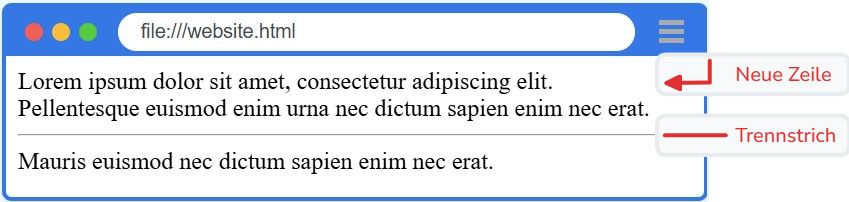
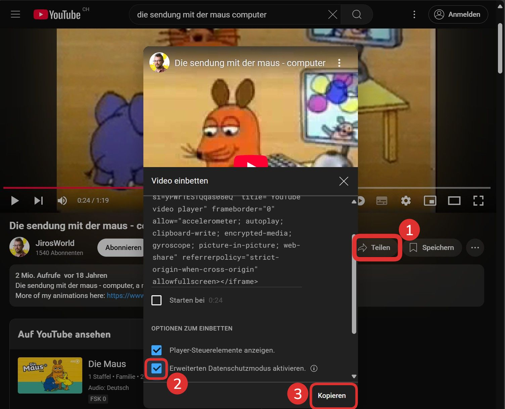

import HtmlEditor from '@tdev-components/documents/CodeEditor/HtmlEditor';
import Dir from '@tdev-components/FileSystem/Dir';
import { trim } from "@tdev-components/documents/String/sanitizers";

# Selbstschliessende Tags

In HTML gibt es einige wenige Tags, die nur ein öffnendes, aber kein schliessendes Tag erfordern. Sie werden **leere Tags** oder **self-closing Tags** genannt und für Steuerinformationen (wie eine neue Zeile) oder für die Einbdindung von Medien eingesetzt.

## Neue Zeile und Trennstrich

:::def[`<br>` Zeilenumbruch]
Ein Zeilenumbruch wird mit dem `<br>`-Tag erzeugt und steht fürs englische *line **br**eak*.
:::
:::def[`<hr>` Trennstrich]
Ein Trennstrich wird mit dem `<hr>`-Tag erzeugt und steht fürs englische ***h**orizontal **r**ule*.
:::

:::aufgabe[Neue Zeile und Trennstrich]
<Answer type="state" id="f9308b81-4126-49eb-969a-92b762fcbf49" />

Erzeugen Sie folgende Ausgabe mit Umbrüchen nach jedem Satz.



<HtmlEditor id="742734e7-5130-4ea0-83f3-90e80d5c899e">
```html
Lorem ipsum dolor sit amet, consectetur adipiscing elit.
Pellentesque euismod enim urna nec dictum sapien enim nec erat.
Mauris euismod nec dictum sapien enim nec erat.
```
</HtmlEditor>
:::

:::insight[Merke]
Mit `<br>` können in einem Paragraphen Zeilenumbrüche eingefügt werden oder zusätzliche Leerzeilen eingefügt werden.

<div className="compactDeflist">
`<p>`
: Paragraph
: Fasst inhaltlich zusammengehörende Textteile zusammen. Nach jedem Paragraph wird eine neue Zeile mit Abstand eingefügt.
`<br>`
: Neue Zeile
: Kann auch innerhalb von Paragraphen für neue Zeilen verwendet werden, ohne dass ein zusätzlicher Abstand eingefügt wird.
</div>
:::

## Medien

Mit HTML lassen sich auch Medien - Bilder, Videos, Audios aber auch ganze Webseiten - einbinden. Dazu stehen verschiedene HTML-Tags zur Verfügung - auch sie sind selbstschliessend. Damit die Quelle der Medien oder auch weitere Eigenschaften spezifiziert werden können, braucht man __Attribute__.

:::definition[HTML Attribut]
Ein HTML Attribut ist eine zusätzliche Information, die einem HTML-Element hinzugefügt wird. Attribute bestehen aus einem Namen und einem Wert und werden innerhalb des öffnenden Tags angegeben. Sie dienen dazu, das Verhalten oder das Aussehen eines Elements zu steuern.

Es wird stets `name="wert"` geschrieben, wobei der Wert in **Anführungszeichen** stehen muss.

<HtmlEditor hideWarning>
```html
Ein <span style="color:red;">roter</span> Text.
```
</HtmlEditor>

Im Beispiel wird das HTML Attribut `style` mit der Eigenschaft `color: red;` verwendet, um die Textfarbe eines Textes zu ändern.
:::

## Dateipfade

Lokale Ressourcen (daher Quellen, welche sich am gleichen Ort wie die HTML-Datei befinden), werden relativ zur HTML-Datei angegeben.
- Ordnernamen und Dateien werden mit einem Slash `/` getrennt.
- Ein `.` steht für das aktuelle Verzeichnis - ausgehend von der bearbeiteten HTML-Datei.
- Ein `..` steht für das übergeordnete Verzeichnis - ausgehend von der bearbeiteten HTML-Datei der übergeordnete Ordner.

::::info[Beispiel]
:::cards
::br{flexGrow=0 flexBasis=220px}
<Dir 
  open
  noSelect 
  dir={{
    name: 'www',
    children: [
      {
        name: 'static',
        children: [
          'logo.svg 👈'
        ]
      },
      {
        name: 'webseite',
        children: [
        'index.html 🟢',
        { 
          name: 'images',
          children: [
            'blume.png 👈',
            'sonne.jpg'
          ]
        }
      ]}
    ]
  }}
/>
::br{flexBasis=300px}
Ausgehend von `index.html` (🟢) ist der relative Pfad
- zu `sonne.jpg` (👈) `./images/sonne.jpg`
- zu `logo.svg` (👈) `../static/logo.svg`
:::
::::

::::aufgabe[Pfade auswählen]
<Answer type="state" id="1e1f49ec-6ccf-4c27-8f3b-15cd60798cf9" />

Geben Sie für folgende Pfade vom (🟢 oder 🟠) zum Ziel (👈) die korrekten relativen Pfade an:

:::cards{flexBasis=300px}
<Dir 
  open
  noSelect 
  dir={{
    name: 'webseite',
    children: [
      'index.html 🟢',
      { 
        name: 'images',
        children: [
          'blume.png',
          'sonne.jpg 👈'
        ]
      }
    ]
  }}
/>
<Answer type="string" id="cd6cf6ce-51d7-4c50-9e3a-ebba155eb69e" label="Start bei 🟢" solution="./images/sonne.jpg" sanitizer={trim} />

::br

<Dir 
  open
  noSelect 
  dir={{
    name: 'webseite',
    children: [
      'index.html 🟢',
      {
        name: 'pages',
        children: [
          'about.html 🟠',
          'cv.html',
          {
            name: 'images',
            children: [
              'me.png 👈',
            ]
          }
        ]
      }
    ]
  }}
/>
<Answer type="string" id="461aecf6-7a9b-4c48-b7d5-e188a6cb9d74" label="Start bei 🟢" solution="./pages/images/me.png" sanitizer={trim} />
<Answer type="string" id="1639b223-96f3-4063-a31f-46ca7692ff35" label="Start bei 🟠" solution="./images/me.png" sanitizer={trim} />

::br
<Dir 
  open
  noSelect 
  dir={{
    name: 'webseite',
    children: [
      'index.html',      
      { 
        name: 'images',
        children: [
          'blume.png 👈',
          'sonne.jpg'
        ]
      },
      {
        name: 'pages',
        children: [
          'about.html',
          'cv.html 🟢'
        ]
      }
    ]
  }}
/>
<Answer type="string" id="02024975-4189-4c0f-af88-8ac19ef2924b" label="Start bei 🟢" solution="../images/blume.png" sanitizer={trim} />
:::
::::

## Bilder

Bilder werden mit dem ``-Tag eingebunden. Das `src`-Attribut gibt den Pfad zur Bilddatei an. Dies kann entweder eine Bild-Datei im Internet sein, oder auch eine Datei im eigenen Projektverzeichnis.

Weitere Attribute

<div className="compactDeflist">

`alt`
: Alternativtext
: Beschreibt den Inhalt des Bildes. Wird angezeigt, wenn das Bild nicht geladen werden kann oder wenn die Webseite vorgelesen wird.
`width`
: Legt die Breite des Bildes fest.
`height`
: Legt die Höhe des Bildes fest.
: ⚠️ Nur eines der Attribute `width` oder `height` angeben, um das Seitenverhältnis des Bildes beizubehalten.

</div>

<HtmlEditor
  hideWarning
  htmlTransformer={(html) => html.replace('./images/sonne.jpg', 'https://vectorportal.com/storage/sun-vector-image-6_8244.jpg')}
>
```html


```
</HtmlEditor>

:::insight[Bemerke]
Die Reihenfolge der Attribute spielt keine Rolle! Ob zuerst `src` oder `alt` kommt, ist egal.
:::

## Videos

Videos können mit dem `<video>`-Tag eingebunden werden. Um aktuelle Videos abzuspielen, wird die Quelle hierbei mit einem `source`-Tag angegeben.

<HtmlEditor
  hideWarning
  htmlTransformer={(html) => html.replace('./videos/yogi-bear.mp4', '/img/yogi-bear.mp4')}
>
```html
<video width="320" controls>
  <source src="./videos/yogi-bear.mp4" type="video/mp4">
</video>
<video height="240" autoplay controls muted loop>
  <source src="https://videos.pexels.com/video-files/5532771/5532771-uhd_1440_2732_25fps.mp4" type="video/mp4">
</video>
```
</HtmlEditor>

:::insight[Bemerke]
- Das `controls` Attribut hat keinen Wert - dies ist die Kurzschreibweise für `controls="true"`.
- Was passiert, wenn das `controls` Attribut weggelassen wird? Können Sie das Video dann noch starten? Probieren Sie es aus...
- Mit `autoplay` startet das Video automatisch, wenn die Seite geladen wird - das funktioniert aber nur, wenn das Video stumm geschaltet ist (`muted`)!
- Da es viele verschiedene Video-Formate gibt, muss hier zusätzlich das `type`-Attribut angegeben werden.
:::


### Youtube Videos

Youtube-Videos können mit einem `<iframe>`-Tag eingebunden werden.



<HtmlEditor
  hideWarning
  allowSameOrigin
>
```html
<iframe width="400" height="215" src="https://www.youtube-nocookie.com/embed/WENSiwR6IoY?si=yPWr1ESTQqas08eQ" title="YouTube video player" frameborder="0" allow="accelerometer; autoplay; clipboard-write; encrypted-media; gyroscope; picture-in-picture; web-share" referrerpolicy="strict-origin-when-cross-origin" allowfullscreen></iframe>
```
</HtmlEditor>


:::insight[Beachte]
Iframe ist im Gegensatz zu Bildern **kein** Self-Closing Tag und braucht einen schliessenden Tag.
:::

Es können auch weitere Video-Quellen eingebunden werden, bspw. Vimeo Videos: [Embed Vimeo Video](https://help.vimeo.com/hc/en-us/articles/12426259908881-How-to-embed-my-video)

## Audio

Audiodateien werden mit dem `<audio>`-Tag eingebunden, wobei wie bei Bildern eine Quelle (`src`) angegeben werden muss.
<HtmlEditor
  hideWarning
  htmlTransformer={(html) => html.replace('./sounds/klassisch.mp3', '/sounds/music-conditional-1.mp3')}
>
```html
<audio src="./sounds/klassisch.mp3" controls></audio>
```
</HtmlEditor>

:::insight[Beachte]
Audio ist im Gegensatz zu Bildern **kein** Self-Closing Tag und braucht einen schliessenden Tag.
:::

Es können auch weitere Quellen eingebunden werden, bspw. Spotify Songs: [Embed Spotify Music](https://developer.spotify.com/documentation/embeds/tutorials/creating-an-embed)

::::aufgabe[Lokale Medien einbinden]
<Answer type="state" id="7512e408-0ba9-4b3a-8922-c0220c391975" />
import fileTree from './assets/file-tree-media.yaml';

Beim untenstehenden Blogeintrag sind leider alle Bild-Referenzen kaputt. Flicken Sie diese und überprüfen Sie, ob wirklich alle Inhalte abspielbar sind.

:::flex
::br{flexBasis=200px flexGrow=0}
<Dir 
  open
  noSelect 
  dir={fileTree}
/>
::br{flexBasis=350px}
<HtmlEditor
  title="about-ninjas.html"
  id="f39e9b9e-1306-44a0-8030-4ee215874783"
  htmlTransformer={(html) => {
    const mapping = {
      '../images/lego-ninja-star.png': 'https://cdn02.plentymarkets.com/bhgfynjpsi8e/item/images/659807/middle/659807-1721832010.jpeg.avif',
      '../images/lego-ninja-warrior.jpg': 'https://cdn02.plentymarkets.com/bhgfynjpsi8e/item/images/659851/middle/659851-1751281262.jpeg.avif',
      './images/lego-ninja-badass.png': 'https://cdn02.plentymarkets.com/bhgfynjpsi8e/item/images/659846/middle/659846-1751281278.jpeg.avif',
      '../assets/videos/lego-movie.mp4': 'https://vod-cache-1.cdnflix.de/clips/ysbJyeEw6iOfzB1c7zzyVQ/public/vod010/osmufh50nvu/video-h264-1.mp4',
      '../assets/sounds/ninja-theme.wav': 'https://cdn.freesound.org/previews/530/530451_1453392-lq.mp3'
    };
    return Object.entries(mapping).reduce((acc, [key, value]) => {
      return acc.replaceAll(`"${key}"`, value);
    }, html);
  }}
>
```html
<!DOCTYPE html>
<html lang="de">
<body>
  <h1>Lego-Ninja-Action: Lea trifft den Badass!</h1>

  <p><em>Side-note:</em> Für echte Dojo-Stimmung Sound aktivieren ⬇️</p>
  <audio src="ninja-theme.wav" controls></audio>

  <p>
    <strong>Tagebuch-Eintrag 72:</strong> Heute war der Tag. Lego-Ninja-Champion Lea (ja, <em>die</em> 
    Lea mit dem abgebrochenen Katana) traf endlich den legendären 
     Ninja Warrior...
  </p>

  <div class="center">
    
  </div>

  <p>
    Lea: &bdquo;Brauchst du Hilfe beim Öffnen der geheimen Sushi-Truhe?&ldquo;<br>
    Ninja Warrior: &bdquo;Ich kämpfe lieber gegen Drachen als gegen Kinder-Sicherungen.&ldquo;
  </p>

  <div class="center">
    
  </div>

  <p>
    Kurzerhand wurde ein Ninja-Movie-Marathon gestartet, weil Lea meinte, Filme seien die stärksten Waffen.<br>
    <video width="450" controls>
      <source src="lego-movie.mp4" type="video/mp4">
      Dein Browser kann keine Ninjas abspielen :(
    </video>
  </p>

  <p>
    Zum Schluss beschlossen beide: Das einzig wahre Ninja-Upgrade ist... mehr Popcorn.<br>
    <strong>#LegoNinjaForLife</strong>
  </p>

</body>
</html>
```
</HtmlEditor>
:::
::::

## <Answer type="state" id="00d129b1-c62f-4a93-988e-9a8fe3b3431a" inline/> Aufgabe

Erstellen Sie eine kleine Übersicht, mit den drei Abschnitten `Bilder`, `Videos` und `Audio`, in welchen Sie Ihre Lieblingsinhalte (min. 3 pro Abschnitt) einfügen.

<HtmlEditor id="bb119a34-12ad-4d3a-9fda-6793cb4f766c" allowSameOrigin>
```html
<h1>Medienübersicht</h1>

```
</HtmlEditor>
