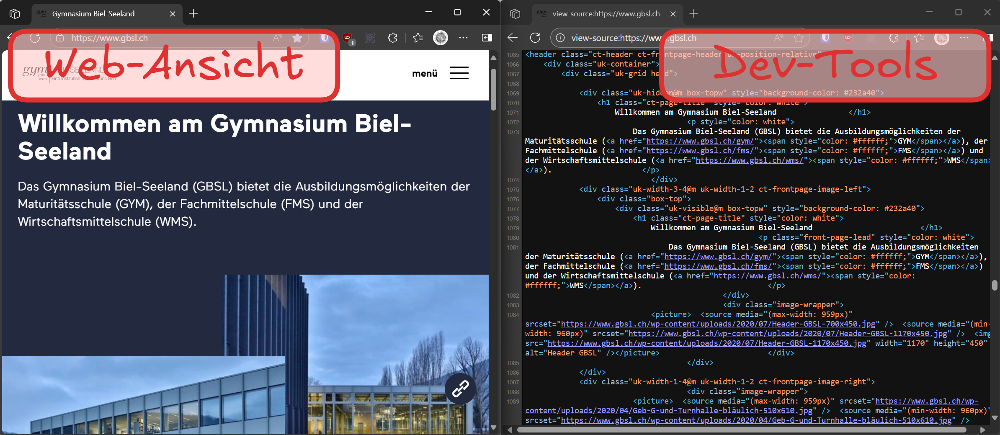

import useBaseUrl from '@docusaurus/useBaseUrl';
import Video from '@tdev-components/Video'

# Entwicklerwerzeuge
...und Entwicklerinnenwerkzeuge 😉 - leider in den modernen Browsern nicht neutral formuliert...

Dass Webseiten immer im __HTML__-Format ausgeliefert werden, zeigt sich schnell, wenn bei einer Webseite der **Quelltext** angezeigt wird.

:::details[Seitenquelltext anzeigen]
In den meisten Browsern kann der Quelltext einer Seite mit der rechten Maustaste und dem Kontextmenüpunkt __:mdi[mouse-right-click] > Seitenquelltext anzeigen__ geöffnet werden.
Alternativ geht das auch mit der Tastenkombination [[Strg+U]] (Windows) oder [[Cmd+Option+U]] (Mac).

:::

Den gesamten Seitenquelltext anzuzeigen wird schnell **unübersichtlich**, da gerade moderne Webseiten gewisse HTML-Elemente dynamisch per JavaScript nachladen. Deshalb ist es empfehlenswert, spezifische Inhalte mit den **Entwicklerwerzeugen** des Browsers zu inspizieren.

::::tip[Entwicklerwerzeuge öffnen]
In den meisten Browsern können die Entwicklerwerzeuge mit der [[F12]] (oder [[Ctrl + Shift + I]] bzw. [[Cmd+Option+I]]) geöffnet werden.
Alternativ geht das auch mit der rechten Maustaste und dem Kontextmenüpunkt __:mdi[mouse-right-click] > Untersuchen__.

::video[./images/dev-tools.mp4]
::::

Mit den Entwicklungswerkzeugen lassen sich so auch Inhalte verändern - natürlich nur lokal im Browser (Änderungen sind also nur für Sie sichtbar und verschwinden, wenn die Seite neu geladen wird).

<Video src={require('./images/change-image.mp4').default} />

:::aufgabe[HTML-Elemente Untersuchen]
<Answer type="state" id="29e69ed8-c7f1-4646-a3d8-8558c06944d9" />
:::

:::aufgabe[HTML-Elemente Ändern]
<Answer type="state" id="70acb7ad-07e9-4891-8f89-f390a2bb4c0e" />
:::