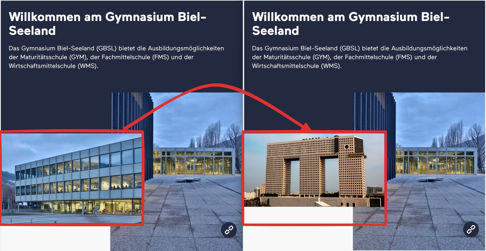

import useBaseUrl from '@docusaurus/useBaseUrl';
import Video from '@tdev-components/Video'

# Entwicklerwerzeuge
...und Entwicklerinnenwerkzeuge 😉 - leider in den modernen Browsern nicht neutral formuliert...

Dass Webseiten immer im __HTML__-Format ausgeliefert werden, zeigt sich schnell, wenn bei einer Webseite der **Quelltext** angezeigt wird.

:::details[Seitenquelltext anzeigen]
In den meisten Browsern kann der Quelltext einer Seite mit der rechten Maustaste und dem Kontextmenüpunkt __:mdi[mouse-right-click] > Seitenquelltext anzeigen__ geöffnet werden.
Alternativ geht das auch mit der Tastenkombination [[Strg+U]] (Windows) oder [[Cmd+Option+U]] (Mac).

:::

Den gesamten Seitenquelltext anzuzeigen wird schnell **unübersichtlich**, da gerade moderne Webseiten gewisse HTML-Elemente dynamisch per JavaScript nachladen. Deshalb ist es empfehlenswert, spezifische Inhalte mit den **Entwicklerwerzeugen** des Browsers zu inspizieren.

::::tip[Entwicklerwerzeuge öffnen]
In den meisten Browsern können die Entwicklerwerzeuge mit der [[F12]] (oder [[Ctrl + Shift + I]] bzw. [[Cmd+Option+I]]) geöffnet werden.
Alternativ geht das auch mit der rechten Maustaste und dem Kontextmenüpunkt __:mdi[mouse-right-click] > Untersuchen__.

::video[./images/dev-tools.mp4]
::::

Mit den Entwicklungswerkzeugen lassen sich so auch Inhalte verändern - natürlich nur lokal im Browser (Änderungen sind also nur für Sie sichtbar und verschwinden, wenn die Seite neu geladen wird).

<Video src={require('./images/change-image.mp4').default}>
*Klicken um das Video zu vergrössern.*
</Video>

:::aufgabe[Profilname ändern]
<Answer type="state" id="29e69ed8-c7f1-4646-a3d8-8558c06944d9" />

Ändern Sie den Profilnamen oben rechts auf einen lustigen Nick-Name:

Machen Sie einen Screenshot davon und halten Sie diesen hier fest:

<Answer type="text" id="346d45fa-9055-4980-ae5b-60d0747655c7" />
:::

::::aufgabe[Irrelevante Inhalte entfernen]
<Answer type="state" id="70acb7ad-07e9-4891-8f89-f390a2bb4c0e" />

Über die Entwicklerwerkzeuge ist es auch möglich, irrelevante Inhalte temporär zu entfernen. Dies kann praktisch sein, wenn Sie z.B. einen Screenshot für eine Präsentation machen wollen.

Entfernen Sie alle irrelevanten Inhalte (gemäss abgebildetem Beispiel) und erzeugen Sie im Anschluss einen Scroll-Shot (Screenshot der ganzen Seite).

:::details[Scroll-Shot erstellen]
Unter Edge kann ein Scrollshot mit der Tastenkombination [[Ctrl+Shift+S]] erstellt und gespeichert werden:

:::

Webseite
: [SRF-Artikel](https://www.srf.ch/wissen/technik/mittel-gegen-handysucht-probleme-mit-dem-smartphone-konsum-diese-tipps-helfen)

:::cards{flexBasis="300px" maxHeight="600px" overflowY="auto"}

::br

:::

Halten Sie den Scrollshot hier fest:
<Answer type="text" id="894528e7-540d-4c62-a772-1763c83bedbb" />
::::

::::aufgabe[⭐ Fake-Page erstellen]
<Answer type="state" id="ed0b2607-74cf-4589-8e32-d161f48d3796" />

Nehmen Sie eine beliebige Webseite und verändern Sie die Inhalte so, dass eine lustige Fake-Page entsteht (z.B. mit einem lustigen Titel, veränderten Bildern, etc.). Halten Sie einen Screenshot davon fest.

<Answer type="text" id="53343a77-bece-4ad7-9519-4fd8270a83d3" />

:::danger[Gesetzlicher Hinweis]
Das Verändern von Webseiteninhalten zur Täuschung Dritter ist verboten und kann strafrechtlich verfolgt werden. Diese Aufgabe dient nur zu Lernzwecken und die veränderten Inhalte sind nur lokal im Browser sichtbar.

Für die Überprüfung von Webseiteninhalten der Originalseite gibt es bspw. die [Wayback-Machine](https://archive.org/web/), auf welcher regelmässig Schnappschüsse von Webseiten gespeichert werden. So ist es möglich, auch nachträglich Manipulationen zu erkennen.
:::
::::
