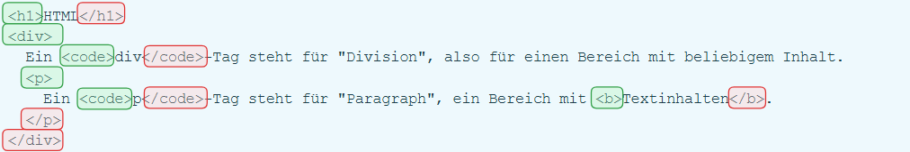
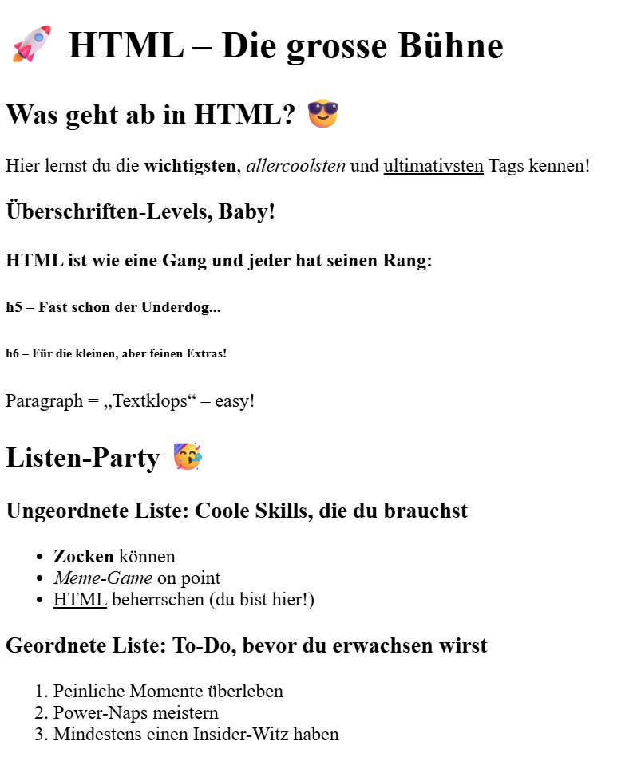
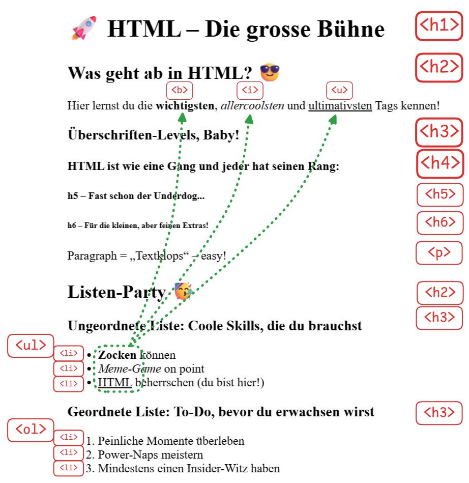

import Badge from '@tdev-components/shared/Badge';
import HtmlEditor from '@tdev-components/documents/CodeEditor/HtmlEditor';
import Steps from '@tdev-components/Steps';
import ProgressState from '@tdev-components/documents/ProgressState';

# HTML Dokumente

HTML ist eine Abkürzung und steht für **H**yper**t**ext **M**arkup **L**anguage. Es ist eine **Auszeichnungssprache**, die verwendet wird, um Inhalte im Web zu strukturieren und zu formatieren. HTML ist die Grundlage für jede Webseite im Internet.

Die Struktur eines Textes wird in HTML durch __Tags__ definiert.

:::info[Tags]
```html
<name>Inhalt</name>
```
Tags werden nie angezeigt, sondern nur der Inhalt zwischen den Tags.

name
: der Tagename zeigt dem Browser an, um welchen Inhalt es sich handelt.
: Bei `<p>` ist der Tagename `p`, für englisch **P**aragraph.
Öffnende Tags
: Sie starten einen neuen Bereich.
: z.B. `<p>`
Schliessende Tags
: Sie beenden einen Bereich.
: z.B. `</p>`
: ⚠️ Beachten Sie das `/`!
:::

:::aufgabe[Tags]
<Answer type="state" id="1678d2fe-d18c-4a70-8f79-ff05b8b18b9b" />

Markieren Sie im folgenden Dokument alle <Badge color="green">Öffnenden Tags</Badge> grün und alle <Badge color="red">Schliessenden Tags</Badge> rot.

<Answer 
    type="text"
    id="c5a80ea9-5159-4f25-9f67-909342b8dbc3"
    monospace
    default={`<h1>HTML</h1>\n<div>\n  Ein <code>div</code>-Tag steht für "Division", also für einen Bereich mit beliebigem Inhalt.\n  <p>\n    Ein <code>p</code>-Tag steht für "Paragraph", ein Bereich mit <b>Textinhalten</b>.\n  </p>\n</div>`}
    toolbar={{background: true}}
/>

<Solution id="cf259ac1-7b37-4415-bf15-cfc1d0bec1e1">
    
    Beachten Sie, dass die `<>` und `</>` jeweils auch dazugehören.
</Solution>
:::

Wird obiges HTML-Dokument von einem Browser dargestellt, werden alle Tags entfernt und die Inhalte formatiert angezeigt:

<HtmlEditor hideWarning>
    ```html
    <h1>HTML</h1>
    <div>
        Ein <code>div</code>-Tag steht für "Division", also für einen Bereich mit beliebigem Inhalt.
        <p>
            Ein <code>p</code>-Tag steht für "Paragraph", ein Bereich mit <b>Textinhalten</b>.
        </p>
    </div>
    ```
</HtmlEditor>

:::info[Webseiten sind HTML-Dokumente]
Die täglich besuchten Webseiten sind nichts anderes als HTML-Dokumente, die von einem Browser interpretiert und dargestellt werden.

Ein solches Dokument kann auch heruntergeladen werden und durch Doppelklicken im Browser geöffnet werden.
:::


::::aufgabe[HTML-Dokumente öffnen]
<Answer type="state" id="3173b13d-bfcc-478c-8302-c9d3d03a5aca" />

<Steps>
1. Laden Sie obiges HTML-Dokument herunter.
2. Öffnen Sie das Dokument durch Doppelklick im Browser.
3. Öffnen Sie das Dokument nun im Windows Editor
    :::note[Im Editor öffnen]
    Um eine Datei mit dem Windows __Editor__ zu öffnen, machen Sie einen Rechtsklick auf die Datei und klicken Sie __Öffnen mit__ → __Editor__

    

    Falls sich folgendes Fenster öffnet, wählen Sie hier __Editor__ aus und klicken Sie auf __Nur&nbsp;einmal__:

    
    :::
3. Ersetzen Sie den Text `HTML` durch Ihren Namen (⚠️ die `<h1>` Tags lassen Sie stehen, es steht dann also `<h1>Maria</h1>`).
4. Speichern Sie das Dokument ([[Ctrl]] + [[s]]) und aktualisieren Sie das Browserfenster.
5. Wenn nun Ihr Name als Überschrift erscheint, markieren Sie die Aufgabe als erledigt.
</Steps>
::::

## Verschachtelte Elemente

Da die HTML-Tags einen eindeutigen Anfang und ein eindeutiges Ende haben, können sie auch ineinander verschachtelt werden. Dies ist bspw. bei Listen ganz nützlich:

:::flex{flexBasis="250px"}
<HtmlEditor title="auflistung.html" hideWarning minLines={11}>
    ```html
    <ul>
        <li>Erstes Element</li>
        <li>Zweites Element</li>
        <li>Drittes Element</li>
    </ul>
    ```
</HtmlEditor>
::br
<HtmlEditor title="verschachtelung.html" hideWarning>
    ```html
    <ul>
        <li>Erstes Element</li>
        <li>
            Zweites Element
            <ul>
                <li>Unterpunkt 1</li>
                <li>Unterpunkt 2</li>
            </ul>
        </li>
        <li>Drittes Element</li>
    </ul>
    ```
</HtmlEditor>
:::

:::insight[Einrückung]
Beachten Sie die Einrückung der **verschachtelten Tags**. Dies ist zwar nicht zwingend notwendig, hilft aber, den Überblick zu behalten.

#### Für Abschnitte:
- Öffnende und schliessende Tags **immer auf der gleichen Einrückungsebene** stehen.
- Verschachtelte Elemente sollen immer eine Ebene weiter eingerückt werden.
:::

## Tag-Namen

Das [World Wide Web Consortium](https://www.w3.org/) (W3C) hat ab 1994 die Spezifikationen für HTML festgelegt, wobei sie auch die Tag-Namen für verschiedene Struktur-Elemente eines Dokuments festgelegt haben.

`h1`
: Überschrift 1. Die grösste Überschrift (engl. *Heading 1*).
`h2`
: Überschrift 2. Eine etwas kleinere Überschrift  (engl. *Heading 2*)
`h3`, `h4`, `h5`, `h6`
: Überschriften 3 bis 6. Immer kleiner werdende Überschriften.  (engl. *Heading 3-6*)
`p`
: Absatz oder Paragraph - wie in Word...
`ul`
: Ungeordnete Liste. Eine Liste ohne Nummerierung.
`ol`
: Geordnete Liste. Eine Liste mit Nummerierung.
`li`
: Listenelement. Ein Element in einer Liste.
`b`
: Fett. Text fett darstellen.
`i`
: Kursiv. Text kursiv darstellen.
`u`
: Unterstrichen. Text unterstrichen darstellen.

### Tags ausprobieren

Probieren Sie die verschiedenen Tags selber aus!

<ProgressState keepPreviousStepsOpen confirm labels={['Überschriften', 'Paragraphen', 'Ungeordnete Listen', 'Geordnete Listen', 'Formatierungen']} id="be56d813-c25b-48ca-ae33-f4188deb40cb">
1. Fügen Sie für jede Überschriften-Ebene ein Beispiel ein.
    <HtmlEditor id="dbe22de1-6ea7-49c7-be9c-e9b1e5f000b2">
        ```html
        <h1>Überschrift 1</h1>
        ```
    </HtmlEditor>
2. Was passiert, wenn Sie alles in einen Paragraphen schreiben?
    <HtmlEditor id="a2ddd5e7-4f62-4192-be2c-b910705de963">
        ```html
        <p>
            Lorem ipsum dolor sit amet, consectetur adipiscing elit. Sed do eiusmod tempor incididunt ut labore et dolore magna aliqua. 
        </p>
        <p>
            Lorem ipsum dolor sit amet, consectetur adipiscing elit. Vestibulum vitae orci pellentesque, fermentum augue quis, molestie tortor. Pellentesque sollicitudin, lectus quis bibendum tempor, dui orci consequat nisl, at efficitur enim magna vitae urna.
        </p>
        <p>
            Morbi fermentum ante urna, eleifend interdum nulla scelerisque at. Pellentesque nec diam ac magna eleifend viverra. Aenean sodales risus id.
        </p>
        ```
    </HtmlEditor>
    <Answer type="text" id="2ac5dc0f-be5d-4f80-92db-fcbc32d6fc1c" />
3. Fügen Sie der Liste weitere Punkte hinzu.
    <HtmlEditor id="d90cdf5f-7d80-400a-9538-63c7f236804f">
        ```html
        <ul>
            <li>Apfel 🍎</li>
            <li>Orange 🍊</li>
            <li>...</li>
        </ul>
        ```
    </HtmlEditor>
4. Die ersten 5 Einträge meiner Bucket-Liste:
    <HtmlEditor id="5989d996-e380-4a23-b10d-54df1d92e342">
        ```html
        <ol>
            <li>Weltreise 🌍</li>
            <li>... </li>
        </ol>
        ```
    </HtmlEditor>
5. Im folgenden Text sollen:
    - Namen **fett** markiert werden.
    - Tierarten *kursiv* dargestellt werden.
    - Jahreszahlen <u>unterstrichen</u> werden.
    <HtmlEditor id="4b2fcd10-1094-405f-9e38-219c475a5005">
        ```html
        <p>
            Anna wollte im Jahr 2024 unbedingt einen Waschbären adoptieren, weil sie gehört hatte, dass Waschbären besonders talentiert im Klauen von Socken sind. Ihr Nachbar Bernd war skeptisch – seit 2019 fürchtet er sich wegen eines Vorfalls mit einer Gans, die unaufhörlich seine Türklingel betätigte. Clara hingegen hatte seit 2018 nur gute Erfahrungen mit ihrem Axolotl gemacht – na gut, bis auf den Tag, als das Tier versehentlich Claras gesamten Geburtstagskuchen auffraß. Am Ende beschlossen Anna, Bernd und Clara im Sommer 2025 zusammen einen Alpaka-Wander-Ausflug zu machen. Seitdem wissen sie: Gegen das Spucken von Alpakas hilft auch kein Regenschirm aus dem Baujahr 2007.
        </p>
        ```
    </HtmlEditor>
</ProgressState>


### Übung

:::aufgabe[HTML-Tags kennenlernen]
<Answer type="state" id="a25b5df9-f4fc-4622-8f1f-3a801b699471" />

Versuchen Sie den untenstehenden Text so zu strukturieren, dass die folgende Ausgabe erzeugt wird:



<Solution id="22d4930b-9ea3-46f3-8b0f-ef371f9ac8ab" title="Hinweis">
    
</Solution>
---

<HtmlEditor id="3b1202a4-776c-4ef5-88eb-ed0d3f0ff8e5" maxHeight="700px">
```html
🚀 HTML – Die grosse Bühne
Was geht ab in HTML? 😎
Hier lernst du die wichtigsten, allercoolsten und ultimativsten Tags kennen!

Überschriften-Levels, Baby!
HTML ist wie eine Gang und jeder hat seinen Rang:
h5 – Fast schon der Underdog...
h6 – Für die kleinen, aber feinen Extras!
Paragraph = „Textklops“ – easy!

Listen-Party 🥳
Ungeordnete Liste: Coole Skills, die du brauchst
Zocken können
Meme-Game on point
HTML beherrschen (du bist hier!)
Geordnete Liste: To-Do, bevor du erwachsen wirst
Peinliche Momente überleben
Power-Naps meistern
Mindestens einen Insider-Witz haben
```
</HtmlEditor>

<Solution id="98e5a9bf-3af4-424a-bfec-a6f01c090654">
<HtmlEditor hideWarning maxHeight="700px">
    ```html
    <h1>🚀 HTML – Die grosse Bühne</h1>
    <h2>Was geht ab in HTML? 😎</h2>
    <p>
        Hier lernst du die <b>wichtigsten</b>, <i>allercoolsten</i> und <u>ultimativsten</u> Tags kennen!
    </p>

    <h3>Überschriften-Levels, Baby!</h3>
    <h4>HTML ist wie eine Gang und jeder hat seinen Rang:</h4>
    <h5>h5 – Fast schon der Underdog...</h5>
    <h6>h6 – Für die kleinen, aber feinen Extras!</h6>

    <p>Paragraph = „Textklops“ – easy!</p>

    <h2>Listen-Party 🥳</h2>
    <h3>Ungeordnete Liste: Coole Skills, die du brauchst</h3>
    <ul>
        <li><b>Zocken</b> können</li>
        <li><i>Meme-Game</i> on point</li>
        <li><u>HTML</u> beherrschen (du bist hier!)</li>
    </ul>

    <h3>Geordnete Liste: To-Do, bevor du erwachsen wirst</h3>
    <ol>
        <li>Peinliche Momente überleben</li>
        <li>Power-Naps meistern</li>
        <li>Mindestens einen Insider-Witz haben</li>
    </ol>
    ```
</HtmlEditor>
</Solution>

:::