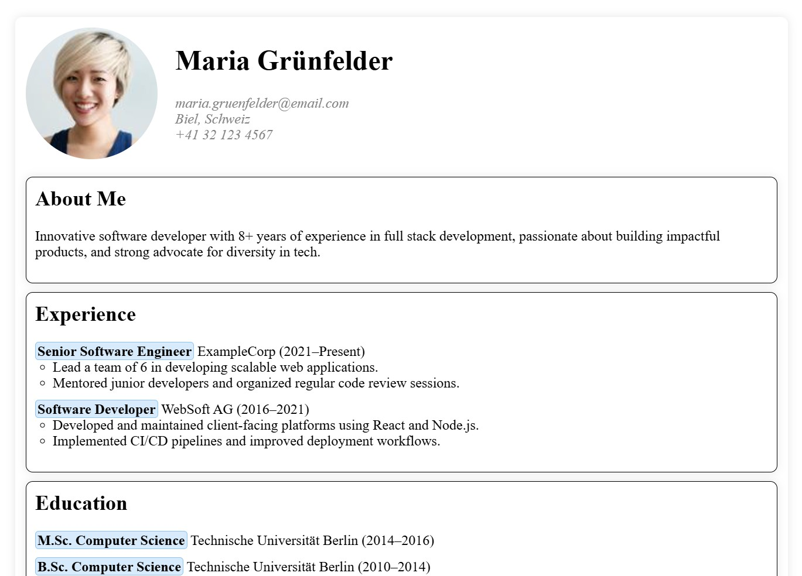

import HtmlEditor from '@tdev-components/documents/CodeEditor/HtmlEditor';
import CvHtml from '!!raw-loader!./assets/cv.html';
import CvCss from '!!raw-loader!./assets/cv.css';
import ProgressState from '@tdev-components/documents/ProgressState';

export const combinedCode = (html, css) => {
    const indentedCss = css
        .split('\n')
        .map(line => `        ${line}`)
        .join('\n');
    return html.replace(`<style>\n    </style>`, `<style>\n${indentedCss}\n</style>`);
}

# Tag-Selektoren

Mit CSS können einzelne HTML-Elemente über ihren Tag-Namen angesprochen und gestaltet werden. Diese Art von Selektoren werden als **Tag-Selektoren** bezeichnet.

export const example1 = '<p>\n    Dies ist <strong>ein</strong> <i>Absatz</i>.\n</p>\n<p>\n    Dies ist <strong>ein</strong> weiterer Absatz.\n</p>';

```html
<p>
    Dies ist <strong>ein</strong> <i>Absatz</i>.
</p>
<p>
    Dies ist <strong>ein</strong> weiterer Absatz.
</p>
```
::::cards{columns=2}
<HtmlEditor
  htmlTransformer={(css) => `<style>${css}</style><body>${example1}</body>`}
  hideWarning
  title='styles-1.css'
  lang='scss'
  minLines={8}
>
```scss
p {
    color: darkblue;
}
strong {
    color: green;
    font-size: 150%;
}
i {
    color: red;
}
```
</HtmlEditor>
:::insight[Bemerke]
- Es können für mehrere Tags Style-Regeln definiert werden.
- Regeln werden immer als `Eigenschaft: Wert;` definiert, also bspww. `color: red;`.
- Jede Regel wird mit einem Semikolon `;` abgeschlossen.
:::
::br
<HtmlEditor
  htmlTransformer={(css) => `<style>${css}</style><body>${example1}</body>`}
  hideWarning
  title='styles-1.css'
  lang='scss'
  minLines={10}
>
```scss
p {
    border-width: 2px;
    border-style: solid;
    border-color: red;
    padding: 10px;
    margin: 20px;
}
```
</HtmlEditor>

:::insight[Bemerke]
- Mit dem `padding` wird der Abstand zwischen Inhalt und Rahmen definiert.
- Mit dem `margin` wird der Abstand zwischen Rahmen und anderen Elementen definiert.
:::
:::aufgabe
<Answer type="state" id="fb166179-a7e8-4997-ab04-3542edba68f1" />
Probieren Sie die obigen Style-Regeln aus und halten Sie in eigenen Worten fest, was der Unterschied zwischen `padding` und `margin` ist.
<Answer type="text" id="42b42222-1dfb-445a-94f5-131e325ac50c" />
:::
::::

:::info[Geschweifte Klammern]
`{`
: Tastenkombination: [[Alt Gr]] + [[ä]]
`}`
: Tastenkombination: [[Alt Gr]] + [[$]]
:::

## Spezifität

Mit der __Spezifität__ wird bestimmt, welche CSS-Regel angewendet wird, wenn mehrere Regeln auf dasselbe Element zutreffen. Je spezifischer eine Regel ist (also je genauer/präziser sie das Element beschreibt), desto höher ist ihre Priorität.
```html
<ul>
    <li>Erstes Element</li>
    <li>
        Zweites Element
        <ul>
            <li>Unterelement 1</li>
            <li>Unterelement 2</li>
        </ul>
    </li>
    <li>Drittes Element</li>
</ul>
```
::::cards{columns=3}
<HtmlEditor
  htmlTransformer={(css) => `<style>${css}</style><body><ul><li>Erstes Element</li><li>Zweites Element<ul><li>Unterelement 1</li><li>Unterelement 2</li></ul></li><li>Drittes Element</li></ul>
</body>`}
  hideWarning
  title='styles-1.css'
  lang='scss'
  minLines={8}
>
```scss
ul {
    color: red;
}
```
</HtmlEditor>
:::insight[Bemerke]
Das `<ul>`-Element wird angesprochen - ab dieser Ebene werden alle Texte rot dargestellt.
:::
::br
<HtmlEditor
  htmlTransformer={(css) => `<style>${css}</style><body><ul><li>Erstes Element</li><li>Zweites Element<ul><li>Unterelement 1</li><li>Unterelement 2</li></ul></li><li>Drittes Element</li></ul>
</body>`}
  hideWarning
  title='styles-2.css'
  lang='scss'
  minLines={8}
>
```scss
ul {
    color: red;
    li {
        color: green;
    }
}
```
</HtmlEditor>

:::insight[Bemerke]
Die **spezifischere** Regel "gewinnt", nun werden alle `<li>`-Elemente grün dargestellt.
:::
::br
<HtmlEditor
  htmlTransformer={(css) => `<style>${css}</style><body><ul><li>Erstes Element</li><li>Zweites Element<ul><li>Unterelement 1</li><li>Unterelement 2</li></ul></li><li>Drittes Element</li></ul>
</body>`}
  hideWarning
  title='styles-3.css'
  lang='scss'
  minLines={8}
>
```scss
li {
    color: green;
}
li {
    li {
        color: blue;
    }
} 
```

</HtmlEditor>

:::insight[Bemerke]
Nur die Elemente der zweiten Verschachtelungs-Eben werden blau dargestellt.
:::
::::
## Tag-Selektoren und Stilregeln

::::flex
::br{flexBasis="50%"}
<HtmlEditor hideWarning minHeight={'800px'} code={CvHtml} id="0d6a39d8-21f2-48e1-a7e0-d88501a9bc7b" />
::br{flexBasis="45%" maxWidth="45%"}

<ProgressState id="b7b34f3b-7463-40fb-821a-603aac543fe5">
1. Ziel: das CV von Maria soll wie folgt gestaltet werden:
  
2. Fügen Sie eine `margin` von `20px` und ein `padding` von `12px` zum `<body>`-Tag hinzu.
3. Radius des Rahmens und Schatten 😎
   - ergänzen Sie die `body`-Regel mit folgenden zwei Eigenschaften:

     ```css
     border-radius: 8px;
     box-shadow: 0 0 10px rgba(0, 0, 0, 0.1);
     ```
   - Experimentieren Sie [hier](https://box-shadow.dev/) mit den Werten für den Schatten herum und fügen Sie einen für Sie passenden Schatten hinzu.
   <Solution id="5707dd39-37f5-4578-a20a-9a6aae81e648" standalone>
    ```css
    body {
        margin: 20px;
        padding: 12px;
        border-radius: 8px;
        box-shadow: 0 0 10px rgba(0, 0, 0, 0.1);
    }
    ```
   </Solution>
   
4. Das Bild soll rund dargestellt werden. Setzen Sie dazu den `border-radius` des Bildes auf `50%`. (Wie lautet der Tag des Bildes?)
5. **Text-Kopf**: Bild und Name/Adresse sollen nebeneinander dargestellt werden.
   - Fügen Sie der `header`-Regel die Eigenschaft `display: flex;` hinzu - sie bezweckt, dass die direkten Kindelemente nebeneinander dargestellt werden.
   - Um einen Abstand zwischen Bild und Adresse einzufügen, kann ein `gap` von `20px` definiert werden: `gap: 20px;`.
   - Um den Abstand zwischen der Überschrift und dem oberen Rand zu entfernen, kann `margin-top: 0` für die erste Überschrift (`h1`) definiert werden.
   <Solution id="b177d069-a53c-40b3-b0c3-49c35308b9fc" standalone>
    ```css
    header {
        display: flex;
        gap: 20px;
        h1 {
            margin-top: 0;
        }
    }
    ```
   </Solution>
6. Fügen Sie für alle `<div>`-Elemente im `<main>`-Bereich einen Rahmen hinzu, mit einem Radius von `8px`, einem `padding` von `10px` einem selbst gewählten `box-shadow` und einem `margin-bottom: 10px`.
    :::info[`margin-bottom` vs. `margin`]
    `margin-bottom` definiert nur den Abstand unterhalb des Elements, während `margin` den Abstand auf allen Seiten (oben, unten, links, rechts) definiert.
    :::
   <Solution id="399e0684-6b4c-4155-9720-87c3c5e290cb" standalone>
    ```css
    main {
        div {
            border-width: 1px;
            border-style: solid;
            border-color: black;
            border-radius: 8px;
            padding: 10px;
            margin-bottom: 10px;
            box-shadow: 0 0 10px rgba(0, 0, 0, 0.1);
        }
    }
    ```
   </Solution>
7. Die geordneten Listen (`<ol>`) sollen keine Einrückung mehr haben und zudem kein Aufzählungszeichen (Zahlen) anzeigen. Wählen Sie das `ol`-Tag aus, und fügen Sie folgende Eigenschaften hinzu:
    - `list-style: none;` (entfernt die Aufzählungszeichen)
    - `padding-left: 0;` (entfernt die Einrückung)
   <Solution id="96c9f7b0-5641-458a-9051-04c069e51798" standalone>
    ```css
    ol {
        list-style: none;
        padding-left: 0;
    }
    ```
    </Solution>
8. Jetzt wo die Aufzählungsliste keine Zahlen mehr hat, kann der fette Text (`<strong>`) in den Listeneinträgen als Aufzählung dienen.
    ```css
    strong {
        border: 1px solid rgb(136, 198, 252);
        padding-top: 1px;
        padding-right: 2px;
        padding-bottom: 1px;
        padding-left: 2px;
        border-radius: 4px;
        background-color: rgb(215, 235, 253);
    }
    ```
    :::insight[Bemerke]
    Die `border`-Eigenschaft wurde in der Kurzform definiert: `border: <width> <style> <color>;` - also eine `1px` breite, `solid`e Linie in der Farbe `rgb(136, 198, 252)`.
    :::
9. Optimierungen: bei den Listen (`ul` und `ol`) kann der Zusätzliche Abstand nach Links noch etwas reduziert werden:
    ```css
    ul, ol {
        margin-left: 10px;
    }
    ```
    :::insight[Bemerke]
    Mit der Komma-Separierung `ul, ol` können mehrere Tags mit derselben Regel angesprochen werden.
    :::

</ProgressState>

::::

<Solution id="a3a5eb5c-333a-4c1d-9dc3-db8188b6cc81" standalone>
    <HtmlEditor hideWarning minHeight={'800px'} code={combinedCode(CvHtml, CvCss)} />
</Solution>

